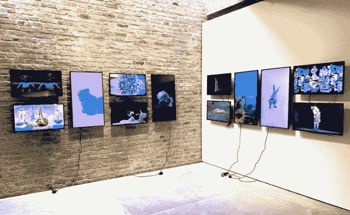
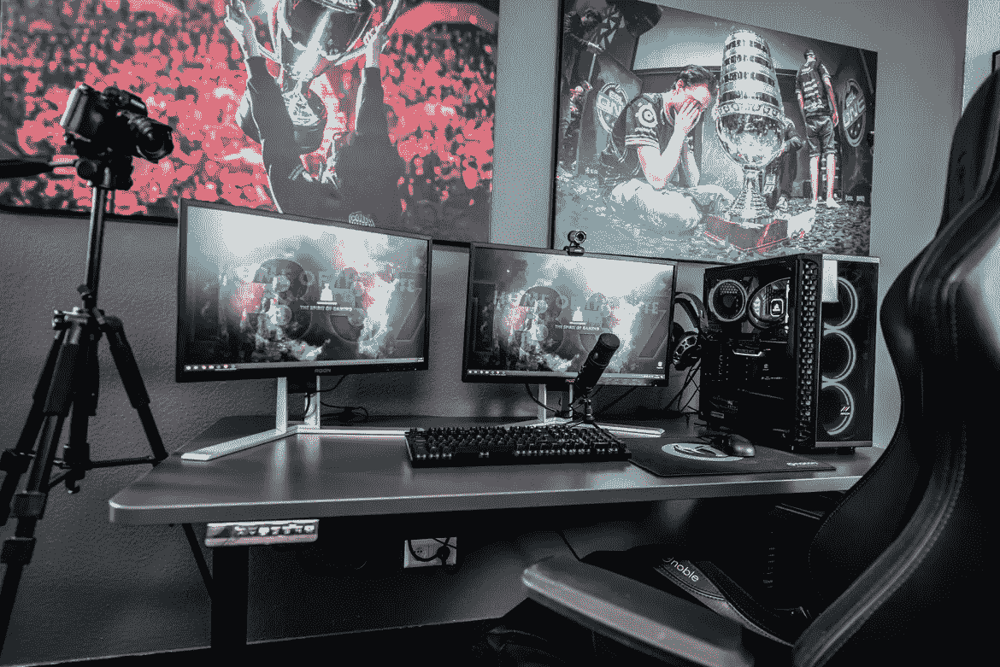
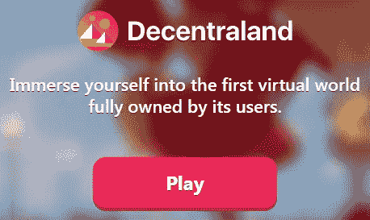

# NFT 的使用案例:深入了解 NFT 可以主导的领域

> 原文：<https://medium.com/coinmonks/the-use-cases-of-nfts-a-look-into-the-fields-nfts-can-dominate-5e66db9bf78f?source=collection_archive---------6----------------------->

NFTs exhibition in Berlin — [*Source and Licence*](https://commons.wikimedia.org/wiki/File:NFTsBerlin.jpg)

对于今天的大多数加密人员来说，这只是一项投资。也许对一些人来说是短期的，他们认为这可以轻松赚钱。也许市场投机性太强，但基础日益强大。

如今，没人能忽视加密货币。已经形成的不同分支正在将 crypto 扩展成一个相当大的产业，Crypto 理应获得两万亿美元的总市值。

DeFi、NFTs 以及 Cryptoverse 中运行的各种业务和计划在今天和前几年一样不能被忽视。

我第一次发现 NFTs 是和 CryptoKitties 在一起，我试着研究了一下，但是我意识到除了以太坊的网络被破坏的事实之外，也许 NFTs 只是一个很快就会过去的阶段。这是在 2017 年。我收集了一些，并在不同的 ETH 钱包里保存了大约 50 个 NFT。有些价格很高，可以种植很多，但像往常一样，太多后来被遗弃，失去了所有的需求。

Cryptokitties 是第一个被广泛采用的 NFT 收藏品，因为许多以太币鲸试图证明这项技术。2020 年末，NFT 再次被推到了聚光灯下。鲸鱼在它们之间大量购买和交换 NFT，并在市场上创造了人工交易量。独立密码作者注意到并报道了这一点，但最终，一些顶级艺术家如 Beeple 被说服使用 NFT 格式，然后 NFT 到达佳士得拍卖行，在那里它们以数百万的价格售出。

这也是有道理的。数字 NFTs 作为一个展览可能会也可能不会被公众广泛接受。也许 NFT 博物馆将成为现代城市的现实，并将吸引许多游客，但也许不会有太多的人对这种形式的艺术展览感兴趣。

我们从 NFT 有强大用例的领域着手。

# 赌博

[*Source*](https://unsplash.com/photos/0oqMvhc1ntw)

游戏是整合 NFT 技术的重中之重。

问问 PUBG 或 MMORPG 的玩家，在 NFT 模式下交易物品、皮肤和游戏积分会有多方便，因为这种模式会给玩家绝对的控制权。

这是游戏的未来。它是一种必然的模式，将使以前的可控设计变得过时。我们已经看到了像 Splinderlands 和 Axies 这样的纸牌游戏是如何改变游戏的。暴雪、艺电和其他顶级制作商最好在他们所有的游戏中认真整合 NFT 模式。

这将促进游戏产业的发展，增加这些行业的盈利能力。

当顶级游戏公司将游戏内资产的控制权让给用户时，游戏世界将会发生多大的变化，我怎么强调都不为过。这将是一场革命。

**去中心化**

[*Source*](https://decentraland.org/)

分散的土地是 NFTs 如何在游戏中工作的一个很好的例子，但是到目前为止它有许多缺点:

*   平台缺乏游戏化。它大多是一个 3D 行走模拟器，交互有限。
*   以太坊区块链高昂的费用阻碍了大规模的采用。我建议分散开发人员，尽快开发 SmartBCH 功能。
*   它只是一个虚拟世界，有可爱的图形，但渲染速度很慢。它需要微调，这需要增加预算。

我发现去中心化很粗糙，但也预示着我们将进入一个新的游戏时代，以用户为中心，每个平台都有去中心化的经济。

# 数字艺术

[*Source*](https://unsplash.com/photos/GI10ZiPO_3w)

近来，数字艺术已经成为收藏家们的热门需求。

艺术的价值总是受到质疑。价格随着需求的变化而变化。NFT 具有独特的能力来提供数字艺术品的可验证的所有权。这不仅仅是一个 jpeg，而是一个令牌化的升级，可以通过一个分散的、安全的区块链网络进行验证。

NFTs 展览在现实生活和博物馆中都是可能的。当然，它需要一个显示屏。然而，艺术有各种各样的形式。它不仅仅是绘画或雕塑。随着全息图的进步，绘画可以数字化，雕塑也将在未来找到数字化版本。

**音乐 NFTs**

音乐中也有巨大的用例。目前的音频文件，如 MP3，将在 NFTs 中制作和发布。摇滚乐队莱昂国王最近发布了他们最新专辑的 NFT 版本([《滚石》杂志](https://www.rollingstone.com/pro/features/music-nfts-timeline-kings-of-leon-grimes-3lau-1138437/))。

# 房地产

[*Source*](https://unsplash.com/photos/Bkp3gLygyeA)

任何房地产交易都变得困难重重。通常买卖双方都会同意，但由于法规上的困难，买卖不会通过。

政府已经成为房地产企业的负担，并创造了一个可怕的官僚机构，可以推迟任何房地产销售好几个月。

NFTs 可以整合所需的一切，减少 99%的官僚作风，并降低房地产所需的成本，使这一领域成为一个自由市场。

房地产是一项顶级投资，但对大多数人来说，是政府把它变成了一件不幸的事情。

同时，具有智能合同能力的 NFTs 将立即执行所有合同规则，无需任何参与方的干预和延迟。

使用 NFTs，房产销售只需几秒钟，而不是几个月。

有一个术语叫做部分所有权。一栋建筑、一处地产、一套公寓，甚至一块土地，常常可以由不止一个人拥有。

最终，在未来，NFTs 将帮助任何人轻松购买房产的一部分，它将成长为一个巨大的市场。

## NFT 房地产业面临的威胁

阻碍房地产非功能性交易的，还是政府。这项技术为房地产提供了一种有效的方法，但政府在这一领域根深蒂固，并从战略上推迟了所有的进步。集中化程度将会降低，但不会完全分散，因为需要满足大量要求和标准，并提升智能合同的地位。

# 最后

NFTs 将成为一项影响我们日常生活的技术。

加密货币不再仅仅关乎现金，而是关乎去中心化金融和资产的令牌化。现代经济已经开始走向完全数字化。

NFTs 还可以应用更多的用例，我在本文中没有提到。票务就是其中之一，开发者应用协议来改善这一领域。

加密货币提供了一个去中心化的愿景，而政府仍在规划一个监管、集中和可控的版本。

加密货币为降低成本和消除过度官僚主义导致的腐败提供了解决方案。

当政府讨论数字化时，他们应该探索去中心化的智能合同，而不是增加新的无用的组织，而不是增加成本和程序。正是纳税人的钱浪费在额外的和虚假的数字化上，才产生了比以前更多的官僚主义。

Dao 也将很快变得突出，因为它们提供了否则毫无意义的过程的完全自动化。这是一个未来，最终人们将决定他们是喜欢更少的官僚机构、税收、政府，还是更喜欢集中的数字化。

**Follow me on:** *●* [*ReadCash*](https://read.cash/@Pantera) *●* [*NoiseCash*](https://noise.cash/u/Pantera99) *●* [*Medium*](/@panterabch) *●* [*Hive*](https://hive.blog/@pantera1) *●* [*Steemit*](https://steemit.com/@pantera1) *●*[*Vocal*](https://vocal.media/authors/pantera) *●* [*Minds*](https://www.minds.com/pantera99/) *●* [*Twitter*](https://twitter.com/Panterabch) *●* [*LinkedIn*](https://www.linkedin.com/in/panterabch/) *●*[*Reddit*](https://www.reddit.com/user/PanteraBCH) *●* [*email*](https://read.cash/@Pantera/localcryptos-p2p-exchange-is-now-offering-bitcoin-cash-trading-06637230#bad-link)

***支持内容创作者——订阅和点赞！***

*原载于*[*https://read . cash*](https://read.cash/@Pantera/the-use-cases-of-nfts-a-look-into-the-fields-nfts-can-dominate-e0b511c5)*。*

> 加入 Coinmonks [电报频道](https://t.me/coincodecap)和 [Youtube 频道](https://www.youtube.com/c/coinmonks/videos)了解加密交易和投资

## 另外，阅读

*   [网格交易机器人](https://blog.coincodecap.com/grid-trading) | [Cryptohopper 审查](/coinmonks/cryptohopper-review-a388ff5bae88) | [Bexplus 审查](https://blog.coincodecap.com/bexplus-review)
*   [7 个最佳零费用加密交易平台](https://blog.coincodecap.com/zero-fee-crypto-exchanges)
*   [去中心化交易所](https://blog.coincodecap.com/what-are-decentralized-exchanges) | [比特恩斯 FIP](https://blog.coincodecap.com/bitbns-fip) | [Pionex 评论](https://blog.coincodecap.com/pionex-review-exchange-with-crypto-trading-bot)
*   [用信用卡购买密码的 10 个最佳地点](https://blog.coincodecap.com/buy-crypto-with-credit-card)
*   [加密复制交易平台](/coinmonks/top-10-crypto-copy-trading-platforms-for-beginners-d0c37c7d698c) | [如何在 WazirX 上购买比特币](/coinmonks/buy-bitcoin-on-wazirx-2d12b7989af1)
*   [CoinLoan 审核](https://blog.coincodecap.com/coinloan-review)|[Crypto.com 审核](/coinmonks/crypto-com-review-f143dca1f74c) | [火币保证金交易](/coinmonks/huobi-margin-trading-b3b06cdc1519)
*   [Bookmap 评论](https://blog.coincodecap.com/bookmap-review-2021-best-trading-software) | [美国 5 大最佳加密交易所](https://blog.coincodecap.com/crypto-exchange-usa)
*   最佳加密[硬件钱包](/coinmonks/hardware-wallets-dfa1211730c6) | [Bitbns 评论](/coinmonks/bitbns-review-38256a07e161)
*   [新加坡十大最佳加密交易所](https://blog.coincodecap.com/crypto-exchange-in-singapore) | [购买 AXS](https://blog.coincodecap.com/buy-axs-token)
*   [投资印度的最佳加密软件](https://blog.coincodecap.com/best-crypto-to-invest-in-india-in-2021) | [WazirX P2P](https://blog.coincodecap.com/wazirx-p2p)
*   [加拿大最佳加密交易机器人](https://blog.coincodecap.com/5-best-crypto-trading-bots-in-canada) | [库币评论](https://blog.coincodecap.com/kucoin-review)
*   [用于 Huobi 的加密交易信号](https://blog.coincodecap.com/huobi-crypto-trading-signals) | [HitBTC 审查](/coinmonks/hitbtc-review-c5143c5d53c2)
*   [如何在 FTX 交易所交易期货](https://blog.coincodecap.com/ftx-futures-trading) | [OKEx vs 币安](https://blog.coincodecap.com/okex-vs-binance)
*   [OKEx vs KuCoin](https://blog.coincodecap.com/okex-kucoin) | [摄氏替代品](https://blog.coincodecap.com/celsius-alternatives) | [如何购买 VeChain](https://blog.coincodecap.com/buy-vechain)
*   [币安期货交易](https://blog.coincodecap.com/binance-futures-trading)|[3 comas vs Mudrex vs eToro](https://blog.coincodecap.com/mudrex-3commas-etoro)
*   [如何购买 Monero](https://blog.coincodecap.com/buy-monero) | [IDEX 评论](https://blog.coincodecap.com/idex-review) | [BitKan 交易机器人](https://blog.coincodecap.com/bitkan-trading-bot)
*   [尤霍德勒 vs 考尼洛 vs 霍德诺特](/coinmonks/youhodler-vs-coinloan-vs-hodlnaut-b1050acde55a) | [Cryptohopper vs 哈斯博特](https://blog.coincodecap.com/cryptohopper-vs-haasbot)
*   [顶级付费加密货币和区块链课程](https://blog.coincodecap.com/blockchain-courses) | [币安评论](/coinmonks/binance-review-ee10d3bf3b6e)