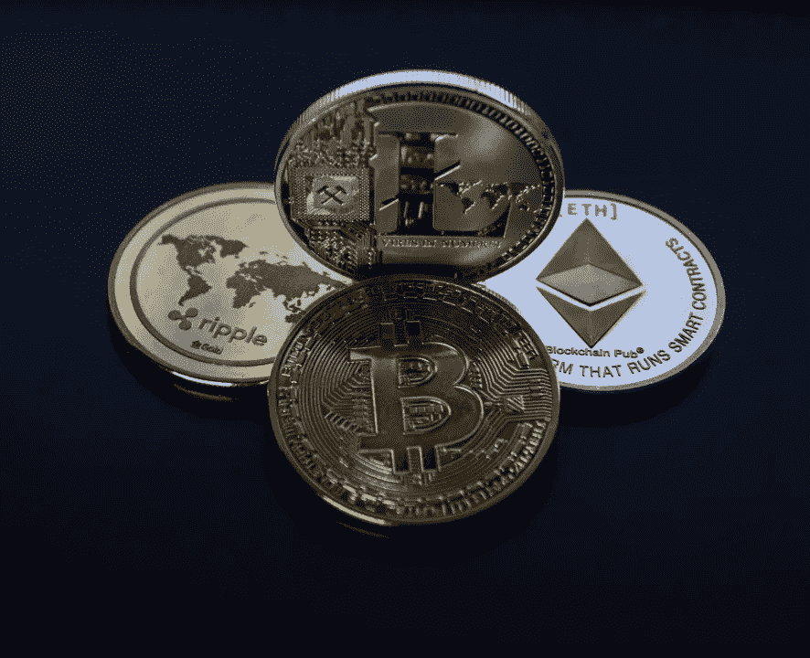

# 使用加密货币进行洗钱

> 原文：<https://medium.com/coinmonks/the-use-of-cryptocurrency-for-money-laundering-e94131748cc7?source=collection_archive---------0----------------------->

洗钱是掩饰犯罪所得并将其融入合法金融体系的过程。得益于技术，犯罪分子可以使用一种新的方法来洗钱:加密货币。加密货币是一种数字或虚拟货币，它使用加密技术来保证安全性。加密货币的一个定义特征是它的基本性质:它不是由任何中央机构发行的，这使得它在理论上不受政府干预或操纵。

为了通过[加密货币](https://www.statista.com/statistics/655492/most-valuable-virtual-currencies-globally)洗钱，犯罪分子在数字货币交易所开设在线账户，接受传统银行账户的法定货币。然后，他们开始一个“清洗”过程(混合和分层)，即通过使用[混合器](https://www.worldcryptoindex.com/what-is-a-coin-mixer)、[滚筒](https://papers.ssrn.com/sol3/papers.cfm?abstract_id=3080361)和链式跳跃(也称为交叉货币)将货币转移到加密货币系统中。货币通过数字货币交易所从一种加密货币转移到另一种加密货币——监管越少越好——以创建几乎不可能追踪的资金轨迹。他们还可以使用隐私币，这是一种旨在增强匿名性的加密货币，如 Monero 和 Zcash。在清洗期间，犯罪分子部署各种转盘来旋转地址，使调查人员越来越难以跟踪交易路径。他们通过将初始数量的加密货币与其他加密货币混合来混淆加密货币的来源和接收，然后将更小单位的加密货币发送到选定的地址，总计为原始数量减去百分之一到百分之三(被硬币混合公司视为利润)。一旦资金来源变得相当模糊，这些资金就会被纳入合法的金融体系。根据“[加密货币反洗钱报告](https://ciphertrace.com/q2-2018-cryptocurrency-anti-money-laundering-report)”显示，犯罪分子还利用盗窃和赌博来清洗加密货币。

加密货币对金融机构和反洗钱计划构成了重大挑战。虽然投资者目前在这个市场很活跃，但许多国家的正式法规仍在不断发展。加密货币去匿名化的努力导致了匿名性更低的新硬币的产生，以及分析现有硬币交易记录以确定用户行为和身份的工具的出现。2019 年，[已有 42.6 亿美元](https://ciphertrace.com/q3-2019-cryptocurrency-anti-money-laundering-report)被犯罪分子从交易所和用户处窃取。此外，2018 年通过加密货币洗钱的金额超过 7.61 亿美元，这一数字仅包括对被盗资金的洗钱，而不是对所有使用加密货币的黑市交易的完整估计。2013 年，金融犯罪执法网络(FinCEN) [发布了针对比特币的](https://www.fincen.gov/sites/default/files/shared/FIN-2013-G001.pdf)指导方针，指出尽管使用比特币购买合法商品和服务并不违法，但比特币的开采或交易以及比特币交易交易所的运营将被归入“货币服务企业”的标签下，因此将与其他金融机构一样受到相同的反洗钱(AML)和了解客户(KYC)措施的约束。2019 年 10 月，FinCEN 主任肯尼斯·布兰科(Kenneth Blanco)强调，加密公司必须遵守“[旅行规则](https://www.forbes.com/sites/yayafanusie/2019/10/30/the-travel-rule-is-not-enough-if-crypto-gets-adopted/#28da9d6621e3)”，这是美国《银行保密法》(BSA)要求资金转移者记录金融机构之间资金转移各方的身份信息。

欧盟已采取措施确保交易所符合 KYC 和反洗钱要求，欧盟委员会采纳了确保加密货币交易所和钱包提供商符合欧盟反洗钱框架的提案。第五号反洗钱指令标志着加密货币监管的一个重要发展，为加密货币业务提供了反洗钱和反恐融资(CTF)义务的透明度。许多国家都在关注交易所的[法规，这是加密货币交易商和客户与区块链互动的主要入口，从而确保他们需要在注册点或交易时对其客户适用 KYC 法规。这包括对已验证账户的要求或账户保持未验证状态的上限。](https://blockonomi.com/bitcoin-money-laundering)

对一些政府来说，对加密货币的监管将增加该行业的合法性，但对其他政府来说，监管被认为不是一个紧迫的问题，特别是考虑到监管机构在如何监管该行业方面的不确定性。大规模的监管可能会对加密货币的分散化产生负面影响，但一些监管是必要的，以使市场合法化。法规不仅可以保护国家，还可以保护交易者，可以防止市场操纵，可能包括 51%的攻击。[51%攻击](https://www.investopedia.com/terms/1/51-attack.asp)指的是一群矿工控制了超过 50%的网络挖掘散列率或计算能力，对区块链的攻击。攻击者将能够阻止新交易获得确认，从而允许他们暂停部分或所有用户之间的支付。他们还可以在控制网络时撤销已完成的交易，这意味着他们可以双倍花费硬币。

无论匿名级别如何，犯罪分子都必须在某个时候将他们的加密货币换成法定货币。在区块链国内和全国范围内对这种交易进行监测，可以消除罪犯的匿名性。DCosta [解释说](https://www.slideshare.net/floyddcosta/blockchain-for-anti-money-laundering-aml)“区块链技术，就其本质而言，有助于金融交易的综合分散监控。基于区块链的平台将为监管机构、审计机构和其他利益相关者提供一套有效而强大的工具，以监控复杂的交易，并永久记录整个系统中可疑交易的审计线索。”由于所有信息都存储在区块链中，可供每个节点使用，因此所有相关参与者都可以检测到可疑活动。

可以实施各种[解决方案](https://assets.kpmg.com/content/dam/kpmg/ch/pdf/anti-money-laundering-in-times-of-cryptocurrency.pdf)来对比涉及加密货币的洗钱:可以在金融机构加强反洗钱程序；可以加强交易监测，改善监管；第三方 ID 提供商可以置于国家监管之下；加密货币交易所可以受到监管，特别是高级数字交易所和提议购买初级加密货币的交易所；区块链可以作为一种解决方案(区块链保存在一个在线公共分类账上，可以对每笔交易的完整历史进行监督、验证和记录)。

匿名性较低的加密货币可能会解决对洗钱和犯罪活动的担忧，与匿名加密货币相比，它们可能有更好的机会进入合法市场，特别是在得到国家政府支持的情况下。针对不同的市场和交易者，也有可能出现各种各样的硬币。无论该行业如何发展，反洗钱计划必须确保其调查人员对这一新兴市场有深刻的了解，同时使用正确的技术有效调查可疑活动。

**也可阅读:**[**Upbit 黑客如何利用密码交换洗黑钱数百万？**](https://blog.bitquery.io/upbit-hack-crypto-money-laundering)

> [直接在您的收件箱中获得最佳软件交易](https://coincodecap.com/?utm_source=coinmonks)

