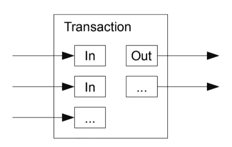

# UTXO 模型

> 原文：<https://medium.com/coinmonks/the-utxo-model-f5eb1fc9a853?source=collection_archive---------3----------------------->

## 比特币的技术基石

Visualization of a transaction. Image by Satoshi Nakamoto ([Bitcoin: A Peer-to-Peer Electronic Cash System](https://bitcoin.org/bitcoin.pdf))

itcoin 基于 UTXO(未用交易产出)模型，以确保没有人能够花掉他们没有的钱，并防止钱被花两次，即所谓的重复消费。在本文中，您将了解这是如何工作的。我们走吧！

# 背景