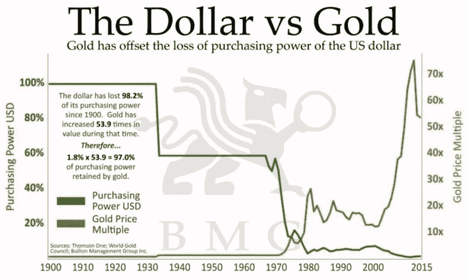
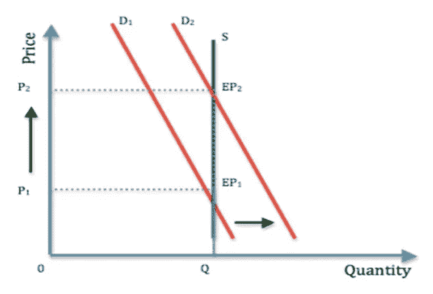
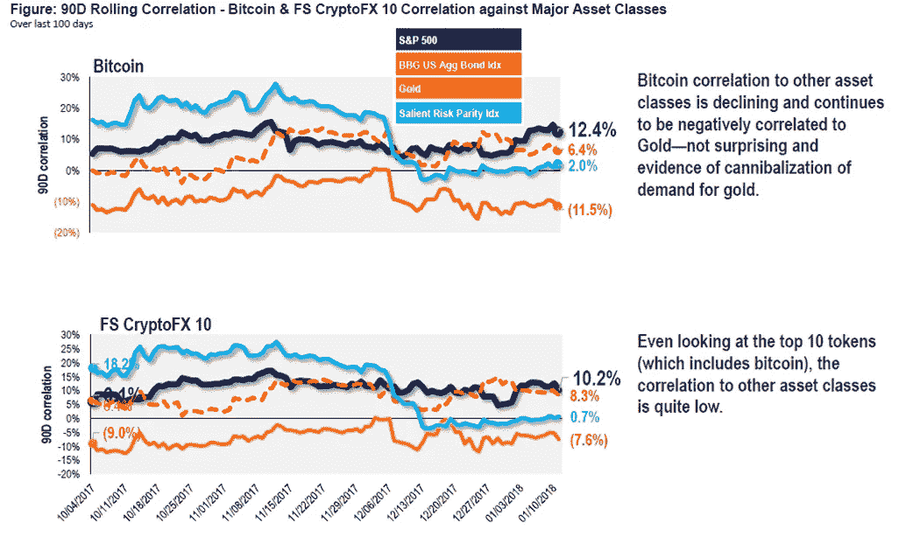
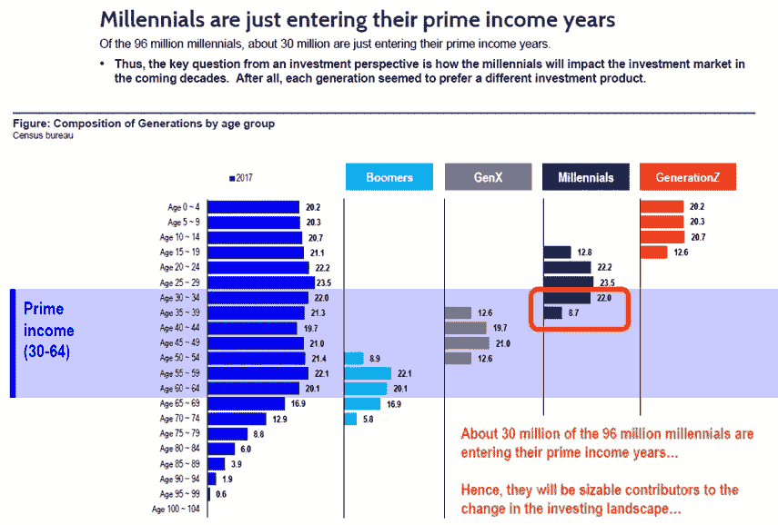
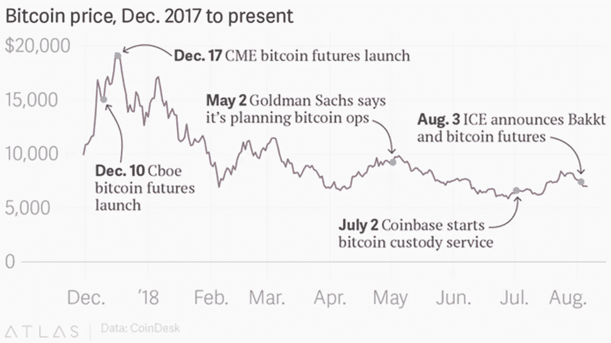

# 比特币的价值:数字黄金

> 原文：<https://medium.com/coinmonks/the-value-in-bitcoin-digital-gold-bd59e4537194?source=collection_archive---------5----------------------->

回到 2017 年，大多数秘密交易者可能会联想到鲸鱼群不停的抽水和倾倒。2017 年不仅对日交易者来说是伟大的一年，而且加密市场也让比特币成为人们关注的焦点。快进到 2018 年，比特币从 20，000 美元的历史高点下跌了近 70%。价格波动是不确定性的内在后果，围绕区块链的炒作无疑放大了不确定性。

区块链真的能取消中介吗？区块链能把跨境交易时间缩短到几秒钟吗？它能把交易费用降低到几分钱吗？区块链描绘了一个我们谁都没有想到过的近乎乌托邦的场景，也就是在 2008 年比特币出现之前。 [*比特币:中本聪的点对点电子现金系统*](https://bitcoin.org/bitcoin.pdf) 呈现了分散网络中个人之间交易的可能性。然而，在蓬勃发展的区块链行业中，比特币或加密货币的价格仍然低迷。这就回避了一个问题:比特币到底有什么好？

# **比特币:钱还是货币？**

首先，我们必须定义和对比货币和货币。货币作为交换媒介和记账单位，具有可携带性、持久性、可分割性和可替代性(可相互互换)。除了作为价值储存手段之外，货币还包含上述所有内容。价值储存指的是一项资产可以随着时间的推移保持其价值，这通常归因于其在市场上的稀缺性。黄金是货币的一个很好的例子，因为它几十年来一直保持着购买力。黄金几千年来一直如此受欢迎，是因为它的供应量有限，也是因为我们对它的外观着迷；它的实际应用相当有限。

Source: [iGold](https://igold.co.il/reasons-to-invest-in-physical-gold-and-silver-bullion-bars-and-coins-in-israel/), Bullion Management Group Inc

> “在莎士比亚、贝多芬和杰斐逊的时代，以及 20 世纪 30 年代的大萧条时期，一个人用一盎司黄金就可以买一套漂亮的衣服。”

法定货币(拉丁语意为“让它去做”)是由对政府的信任支持的货币。事实上，美元过去是由黄金支持的，也就是说，直到 1971 年 8 月美国总统理查德·尼克松宣布美元不再可以用黄金兑换。被称为尼克松冲击的美元与金本位脱钩实际上结束了布雷顿森林协定，并导致了法定货币的产生。

由于“价值储存”的定义不严谨，人们一直在争论法定货币是否可以算作货币。虽然大多数货币多年来保持了其价值，但统计数据告诉我们，所有法定货币最终都会回到其内在价值为零的水平；美元也不例外。自 1913 年美联储创立以来，美元已经丧失了 95%的购买力。委内瑞拉玻利瓦尔福尔特是一个极端的例子，我将在后面详细阐述。

那么，比特币是什么？根据经济学定义，它是一种货币。事实上，它是迄今为止最好的货币形式。以快速、廉价、匿名和不可改变的方式进行跨境交易的能力，胜过了人类发明的任何形式的货币。然而，比特币是一种非常糟糕的货币形式，因为其价格波动性使其成为一种糟糕的价值储存手段。现在，我们将不详细讨论语义。

# **比特币的概念验证:委内瑞拉**

Venezuelans turning their ‘worthless’ currency into bags which are worth more.

委内瑞拉货币体系的崩溃为加密货币提供了展示其相对于法定货币优势的黄金机会。每天，委内瑞拉人都生活在恐惧中，他们不知道自己的钱到底值多少钱。随着国际货币基金组织(IMF)预测委内瑞拉到 2018 年 12 月将达到 [1，000，000%的通货膨胀率](https://www.reuters.com/article/us-venezuela-economy/imf-projects-venezuela-inflation-will-hit-1000000-percent-in-2018-idUSKBN1KD2L9)，由于其分散性、便携性和匿名性，比特币已经成为一种流行的支付方式和投资资产。就在一年前，1 BTC 可以用 3.4 万委内瑞拉玻利瓦尔福尔特(VEF)买到。比特币在 2018 年 8 月达到 13 亿 VEF 的峰值。与此同时， [Dash 在该国迅速普及](https://www.dashforcenews.com/dash-adoption-in-venezuela-exceeds-all-other-cryptocurrencies-combined/)，超过 500 家商户采用了加密货币。Dash 被视为比特币的更好版本，增加了主节点、即时交易和去中心化治理的功能

然而，政府一直不支持加密市场，认为它直接威胁到政府政权和对极度膨胀的经济的控制。具有讽刺意味的是，为了抓住加密热潮，委内瑞拉政府推出了自己的加密货币 Petro。意在补充委内瑞拉的玻利瓦尔福尔特货币，并帮助克服美国的制裁，Petro 声称是由该国的石油和矿产储备支持。然而，Petro 因其糟糕的执行和可疑的数字受到了全世界的批评。

> ***“当法定货币的价值被政治腐蚀时，它成了一种值得信赖的选择”***——华尔街日报的约翰·麦金尼斯和凯尔·罗奇

委内瑞拉让我们先睹为快，这个国家在一定程度上接受了加密货币作为一种支付形式。虽然加密货币在委内瑞拉长期内将如何发展还有待观察，但毫无疑问，比特币已经达到了预期目的，正如比特币白皮书中概述的“*电子现金的点对点版本将允许在线支付直接从一方发送到另一方，而不经过金融机构“*。

# **百万美元比特币:供需博弈**

Given a fixed supply, any increase in demand will lead to a increase in price.

给定一个固定的供给，当需求增加时，价格就会增加。随着价格稳定和两个领域观点的转变，需求只会增加:比特币作为一种货币形式和投资资产，随着更多商家接受加密货币，我们无疑将看到消费者对比特币和其他加密货币的需求增加。另一方面，比特币被许多人称为数字黄金，被视为对抗政府和金融系统的一种很好的对冲工具。在 2018 年的 Upfront Summit 上，Fundstrat Global 的联合创始人托马斯·李(Thomas Lee)将比特币描述为投资组合配置的圣杯，理由是它与股票和债券市场的相关性下降，以及它与黄金的反比关系。然而，由于其价格波动性，许多散户和机构投资者都对其敬而远之。

Source: Fundstrat

你可能会疑惑，加密货币的供应量不是固定的吗？嗯，答案既是肯定的，也是否定的。是的，因为单个硬币的供应量是固定的。例如，比特币的总供应量上限为 2100 万，尽管据估计其中 25%已经丢失或销毁。然而，加密市场中的硬币总数实际上是无限的。因此，涌入加密市场的资本不断被不断增加的硬币稀释，侵蚀了比特币价格的任何潜在上涨。任何拥有相当数量编程知识的人都可以很容易地创造他们自己的硬币。接下来你要做的就是给那些无脑无脑的密码狂热者洗脑，告诉他们你的硬币将如何改变游戏规则，这样你就有了一个 ICO。

创造自己的硬币，变得富有，听起来很容易，对不对？不尽然，因为这将是密码市场上的又一个 50 美元的大赢家.与股票市场类似，加密货币和黄金的价值取决于有人愿意为其支付的价格。人们购买黄金是因为它有很好的储存价值，也是为了对冲全球经济可能的崩溃。然而，比特币的潜力要大得多；它拥有以廉价、快速、安全和不变的方式通过分散网络进行交易的能力。替代硬币，如以太(又名以太坊)服务于不同的需求，并被认为有一些内在价值。虽然比特币主要用于支付目的，但以太是一种实用令牌，允许用户执行建立在以太坊区块链上的程序。随着区块链技术的成熟和采用以及价格的稳定，我们可能会将比特币视为新的默认价值储存手段；新劳动力的崛起支持了这种可能性。

# 密码采用者:千禧一代

随着我们迈向新的数字时代，对加密货币的需求将不是由 X 一代驱动，而是由一个新的个人阶层驱动:千禧一代。对，千禧一代！千禧一代现在是 T2 最大的一代劳动力，预计到 2019 年将超过婴儿潮一代。

Source: Fundstrat

2018 年对全英国 2000 人的调查发现，千禧一代更信任科技巨头(如亚马逊和贝宝)，而不是银行。2016 年，[脸书发布了一份白皮书](https://www.facebook.com/iq/articles/millennials-money-the-unfiltered-journey)，详细介绍了他们对千禧一代的发现。该论文发现，44%的千禧一代认为他们的银行不理解他们，令人震惊的是，其中 92%的人不信任金融机构。CREALOGIX Group 最近的一项独立研究也显示，千禧一代正从传统银行转向加密货币。事实上，在 2008 年金融危机后，所有人口对传统银行的信任都大幅下降，区块链和加密货币已经成为这些年轻、懂技术的千禧一代传统银行的替代选择。

过去一年全球对比特币的关注增加了它在千禧一代中的受欢迎程度，许多人更喜欢比特币而不是股票和黄金。

# **交易破坏者:华尔街**

毫无疑问，华尔街将在加密货币的需求中扮演至关重要的角色。然而，华尔街在加密货币的未来问题上出现了两极分化。摩根大通首席执行官杰米·戴蒙(Jamie Dimon)多次批评比特币，理由是政府无力控制比特币。另一方面，洲际交易所(纽交所母公司)宣布推出全球数字资产平台和生态系统 [Bakkt](http://fortune.com/longform/nyse-owner-bitcoin-exchange-startup/) ，这表明机构投资者对加密货币的兴趣越来越大。Bakkt 将在华尔街的加密货币主流化中发挥巨大作用。尽管美国证券交易委员会(SEC)已将比特币和加密货币裁定为商品，但其对拟议中的比特币交易所交易基金(ETF)的延迟裁定在整个社区引发了涟漪，导致价格大幅下跌。7 天之内，加密货币市场上几乎有 500 亿美元被抹去。

Timeline of events.

尽管如此，随着区块链和加密货币受到越来越多的关注，毫无疑问，我们将看到更多的机构投资者加入加密潮流，导致对比特币、以太坊和 Ripple 等热门货币的需求激增。SEC 对比特币交易所交易基金的积极裁决是打开华尔街闸门所需要的一切。

# **前路**

几十年来，美元一直是默认货币。中央银行系统也运行良好，满足了我们的需求，但它远非完美。金融欺诈和经济崩溃是我们现有的不完善的金融体系的结果。区块链能重新定义我们的金融体系吗？比特币能取代美元吗？答案是否定的，因为这需要对我们目前的金融和政府结构进行根本性的改革。然而，加密货币将在金融系统失灵的情况下发挥出色的作用。

要将加密货币整合到当前的金融系统和政府政策中，仍有许多挑战需要解决。需要讨论资本流出/流入的控制以及交易的可追溯性等问题。还需要建立适当的国际法规和标准来监管加密货币的使用。

加密市场中另一个很少受到关注的问题是比特币鲸鱼，这是一个由大约 1600 个地址组成的团体，总共持有大约 500 万个比特币，占市场的三分之一。比特币的集中意味着市场面临价格大幅波动和操纵的风险，这是机构投资者面临的另一个障碍。在那之前，加密货币不太可能被日常使用，我们也不会很快看到百万美元的比特币。

总之，区块链已经在透明度、不变性和隐私领域设定了黄金标准，但只有时间才能证明比特币是否会成为千禧年时代的新黄金。

最后但同样重要的是，HODL！！

############################################

大家好！我是一名住在新加坡的有抱负的科技作家。我写各种行业的最新技术事件，以及对区块链和人工智能等技术的评论。

捐赠乙醚和 ERC-20 代币地址:0 xc 70 a 50348 EFA 21 CAD 9046407d 168 e 656 BD 11 a0f 0

*   *** ***做拍手，评论，分享！我也欢迎任何出现的商机*****

> [直接在您的收件箱中获得最佳软件交易](https://coincodecap.com/?utm_source=coinmonks)

