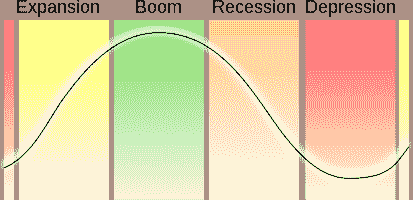
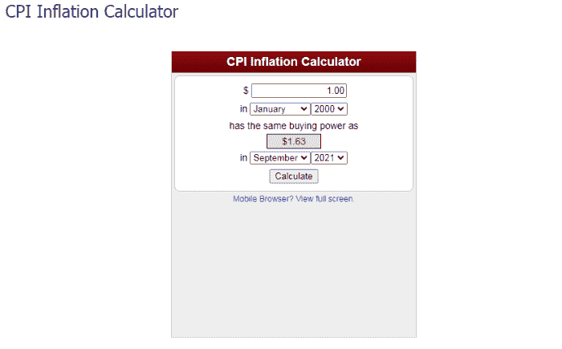
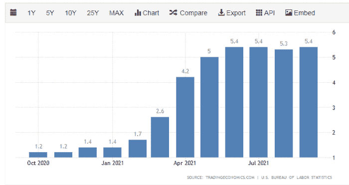
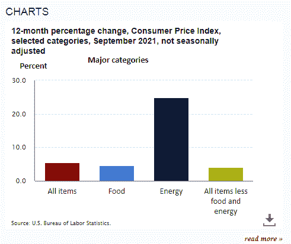
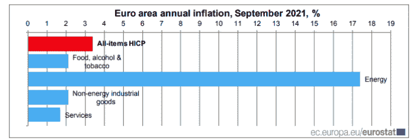
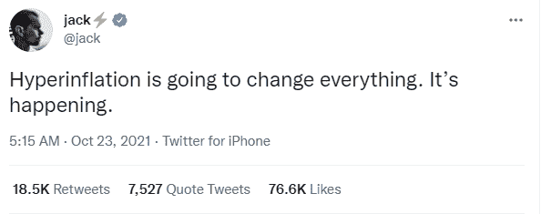
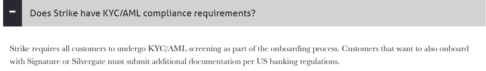

# 货币的价值:通货膨胀、恶性通货膨胀、法定货币和作为价值储存手段的比特币现金

> 原文：<https://medium.com/coinmonks/the-value-of-money-inflation-hyperinflation-fiat-and-bitcoin-cash-as-a-store-of-value-10b63705ba37?source=collection_archive---------8----------------------->

我之前写过关于巴哈马群岛的比特币现金的文章，在某一点上，我提到现金是一种价值储存手段(基本上，我写它是价值的“终极”储存手段)。我写的意思是每个单位在一个经济体中被广泛接受。每一欧元或每一美元都代表着写在上面的价格，对于参与交易的各方来说不会有任何混淆。

很可能，我没有尽可能详细地介绍这个主题。这意味着现金是价值的具体表现，在某种程度上，价值也包含在每个单位的数字中。

当我们支付 1 美元时，每个人都接受它为 1 美元。没有商人会告诉你你的 1 美元只值一半。当然，价格会受到通货膨胀的影响。我说的是一美元钞票中价值的表现。

回想起来，我使用的(终极)这个词是不正确的，尽管它意味着以一个经济体中大多数人接受的货币形式来代表价值。

今天的现金(就像整个金融历史一样)是“不兑现的”。法定货币由政府发行，几个世纪以来一直由黄金支持。“金本位制”在两个不同的日期被取消。一次是 1933 年(1931 年英国)最后是 1971 年尼克松政府彻底放弃金本位([尼克松休克](https://en.wikipedia.org/wiki/Nixon_shock))。

如今，法定货币受到对政府和经济表现的信任的支持。发行新的法定货币应该是在一个低的稳定的利率，足以引发轻微的通货膨胀(~2%)，这将鼓励适度的支出和经济活动的增加。

# 介绍

拥有央行这一金融工具的政府总是控制着现金。在美国，中央银行被称为“美联储”(或美联储)，是私人银行部门和政府之间的纽带，控制着宏观经济活动。

资本主义体系中的经济有一定的阶段或周期。

*Source:* [*Wikimedia*](https://commons.wikimedia.org/wiki/File:Economic_cycle.svg)

贷款是这些阶段的原因，总的来说，从长期来看，这些指标应该会上升，否则经济就不会取得进展。最终，这一指标也解释了几个世纪以来人类的进步，并且仍然受到人口增长的严重影响。人口减少的经济体将不得不面对各种困难。

首先，我反对现金集中控制。我写道，并主张把钱从国家分离出来，因为政府对经济的控制会带来可怕的后果。

资本主义是一个强大的进步体系，尽管它也有实现完全自由市场体系的内在困难和垄断整个部门的倾向。政府游说和对政治家的影响是大公司的优势，而不是循规蹈矩的小企业。

即使在今天，当数万亿美元/欧元流向离岸金融天堂岛屿，从而减少人民的财富时，我们仍然大大低估了腐败。

我们观察到的另一个负面指标是当经济接近衰退边缘时政府的反应。

所采取的行动通常会产生负面影响，因为计划只是为了缓解短期的经济痛苦，但最终会增加长期痛苦，减少个人财富。

前两次经济灾难(2008—2020 年)的行动都是过度支出和大规模发行流通中的新货币。

# 通货膨胀和恶性通货膨胀

## 通货膨胀

通货膨胀是一种降低我们法定储蓄、工资和生活条件的成本。

以这个指标为例:

[***Source***](https://www.bls.gov/data/inflation_calculator.htm)

使用衡量通货膨胀的消费者价格指数(CPI ),本世纪初 1 美元的购买力现在需要 1.63 美元才能与之匹配。粗略地说，我们可以记住，我们的钱放在利率非常低的银行里，在 25 年内(在西方更稳定的经济体中)会损失掉**一半的价值。**

如果我们遇到长期的通货膨胀，我们的钱会贬值得更快。

在这些条件下，现金当然不是好的价值储存手段，但经济不会在 10%的通胀下崩溃。事实上，在 20 世纪 80 年代，西方经济体享有巨大且可持续的增长水平。尽管如此，10%的官方利率仍有可能继续走高，引发一场浩劫。虽然 10%作为官方数据可能是可持续的，但 20%的通胀意味着经济过热。甚至高于 20%的通货膨胀也会导致人们对经济失去信任，并担心衰退即将来临。虽然 2008 年通胀处于相对较低的水平，但房地产泡沫足以引发衰退。

美联储、欧洲央行和其他大部分央行最近的过度印钞造成了可怕的后果，这些后果只有在长期内才能看得见。

计划是增加货币供应，并将大部分分配给企业，这样生产就不会因为柯维德·疫情而停止。股票价格与实体经济指标脱钩，形成了巨大的股市泡沫。

采取如此极端的行动会引发许多问题。这将对通胀水平产生多大影响？这些国家积累的债务又会如何？谁来为这一切买单？即使是最铁杆的凯恩斯主义经济学家也会立刻问这个问题，但没人这么做。

每个人都很高兴接受政府援助。有人必须偿还这笔钱，因为它被记为政府债务。

通胀不会达到杰克·多西所说的超通胀水平，他再次证明了自己不懂经济学。尽管通货膨胀是一个问题，对于 10%的(官方)水平来说，这将是一个有问题的经济的迹象。

就短期而言(从今天起的 2 年内)，西方经济体不存在高于 10%的通胀担忧，除非能源价格保持指数增长，但这很可能不会发生。

这是这里的问题。随着疫情的开始，能源价格下降，这是因为以下两个事件:I)需求急剧下降，以及 ii)沙特阿拉伯在与俄罗斯就能源价格行动发生冲突后，推动了市场上的供应过剩。

今天能源价格上涨，此前欧盟对俄罗斯天然气的需求高于此前，天然气供应稳定。俄罗斯没有直接要求提高价格，只是降低了现货市场的天然气供应，同时完全遵守了与欧盟国家达成的所有协议。不过，在这些协议中，天然气价格并不固定，而是跟随现货市场价格，可以通过稳定或降低供应来操纵现货市场价格。

俄罗斯已经成为欧洲能源的战略供应商。但在供应的控制下，它可以生产足够支付其合同的产量，尽管限制现货销售。

石油和天然气从来都不是自由市场。石油价格由石油输出国组织卡特尔谈判，其价格总是被操纵。某些宏观经济标准可能会在一段时间内推动油价下跌，但欧佩克内部将达成一项协议，将油价维持在较高水平。

*   **美国和欧盟**

如今，通货膨胀被认为是在增长，美国的通货膨胀率约为 5.4%(官方数据)，T4 为 3.4%，欧盟为 3.4%。这些是年度通货膨胀水平。

***Source:*** [***Trading Economics***](https://tradingeconomics.com/united-states/inflation-cpi)

在美国，从美国劳工统计局的这张图表中，我们可以看到这主要是能源价格过度上涨的影响。这增加了所有其他部门的成本，因为能源对任何商业或工业领域都至关重要。

***Source:*** [***BLS***](https://www.bls.gov/cpi/)

就欧元区而言，目前通胀状况好于美国，但请记住，欧洲的宏观经济水平通常会跟美国相差一年左右。

***Source:*** [***Eurostat***](https://ec.europa.eu/eurostat/documents/2995521/11563291/2-01102021-AP-EN.pdf)

## 恶性通货膨胀？

***Source:*** [***Twitter***](https://twitter.com/jack/status/1451733913961783299)

> ***恶性通货膨胀是迅速上升的通货膨胀，通常情况下*** ***每月都测量超过 50%。***
> 
> *来源:*[*Investopedia*](https://www.investopedia.com/terms/h/hyperinflation.asp)

我需要用大写字母写这个:**每月超过 50%，**不是每年。

杰克显然没有注意到“每月”这部分。尽管每年 50%的通胀率已经非常高了，但这是美国从未经历过的水平。

**其实:**

> *美国自 1776 年建国以来，观察到的最高年通货膨胀率****1778 年为 29.78%****。*
> 
> *来源:*[*Investopedia*](https://www.investopedia.com/ask/answers/112714/whats-highest-yearoveryear-inflation-rate-history-us.asp)

那是两个半世纪前的事了。第二高的通货膨胀水平是在 1921 年~20%，尽管通货膨胀在 80 年代再次上升到 10%的水平。

杰克不仅错了，还用这句话误导了他的追随者。恶性通货膨胀需要经济的完全解体，中央银行对金融的完全管理不善，还需要像国际货币基金组织和世界银行这样的中央集权实体的金融操纵。

经济杀手经常针对美国认为的敌人采取行动，但有时也会针对历史上的朋友采取行动，破坏经济，作为通过全球化模式获利的一部分。

欧洲仍处于无意志、无认同的状态。每个国家都关注自己的财政，如果这恰好符合他们的利益，就会损害邻近的欧盟经济。可悲的是，在德国的掌管下，欧洲如今被分成了三部分。中欧和北欧国家、前共产主义共和国(东欧)和南方国家。

布里泰因(在我看来)退出欧盟是正确的。这些理由是站得住脚的，而且它是唯一一个倾听本国人民意见的欧盟国家。

这一举动帮助了俄罗斯，因为从地缘战略的角度来看，它反对建立一个统一的欧洲，因为北约对前共产主义国家及其以外的巨大利益构成了威胁。

我们不支持任何一方，只是作为地缘战略棋盘上的一个观察者，我们可以承认这是一个事实。

部分原因是欧盟受到俄罗斯天然气的影响。为了降低能源成本，欧洲甚至补贴家庭和企业的天然气设施。然而今天，天然气价格高于石油。

这是欧盟的又一个错误，也是俄罗斯的又一次胜利。天然气价格上涨的影响不仅给欧盟，也给世界经济带来了额外的压力。

# 比特币和比特币现金在这其中的作用是什么？

我之前提到过比特币现金是比比特币更好的价值储存手段，我袖手旁观也是这样认为的。我解释说，现金也是一种价值储存手段，被经济中的每个参与者所认可。

我还提到了“终极”这个词，在这个借口下，一个经济体的绝大多数参与者接受并更喜欢使用“现金”(手头现金或银行账户中的数字形式)

比特币的特征从一开始就存在，目前由 BCH 和 BTC 共享。固有的稀缺性设计。2100 万枚硬币固定供应，每四年减半以降低新硬币的通货膨胀。

然而，我也解释说，如果只是这样，没人会买比特币。BTC 的投资者一直认为，它将被用来取代现金，取代一个每秒钟处理不超过 4 笔交易的小型区块链，第二层足以对抗 Visa/Mastercard/PayPal。

为什么有人要放弃使用“法定”并开始使用 LN，99%的 LN 将通过受监管、集中、托管和可审查的金融中心获得。完全没有区别，而且这样的决定会是一个耗时的过程。最终，人们想要公用事业，即使闪电网络也帮不上忙。

为什么有人会用信用卡购买硬币和食品杂货，而不是直接用同一张信用卡支付？

萨尔瓦多的例子已经带来了结果，这些结果对 BTC 不利。没有人愿意使用 LN，因为它在设计上有缺陷。相反，那些希望改变的人将选择使用非托管形式的比特币，在同样的标准下，人们不再信任他们的银行和政府。

# 闪电网络

[*Source*](https://strikeprotocols.com/faq/)

> 我们目前所了解的是，这两个网络(BTC 侧链)都增加了中央集权和政府干预。审查制度肯定会适用于闪电网络，因为在收费高和主链拥堵的时候，金融中心会占据主导地位。
> 
> 我之前在另一篇文章中写了这篇文章。

我[以前在另一篇文章上写过](https://read.cash/@Pantera/the-truth-about-btc-adoption-abandonment-and-rejection-e3bc96cd)这部分。

> ***区块链*** *是一个革命性的、不可变的数据库，颠覆了金融业，有可能在一个安全的环境中提供支付，* ***不受中介机构的阻碍*** *。*
> 
> *来源:*[*ResearchGate*](https://www.researchgate.net/publication/333997659_Lightning_Network_A_Comparative_Review_of_Transaction_Fees_and_Data_Analysis)
> 
> ***闪电网***
> 
> *两个实体进行支付转账需要一个支付通道，创建* ***会产生高额费用*** *。*
> 
> *然而，闪电网络也通过网络中的中介* *为* ***支付转账提供便利，此人拥有* ***支付渠道*** *与这两个实体。此功能通过* ***进行扩展，在网络* ***中并入多个中介*** *，以进行从一个实体到另一个实体的支付转移*** *，从而形成支付渠道网络。中介为提供支付渠道收取非常低的费用。***
> 
> 来源:[研究之门](https://www.researchgate.net/publication/333997659_Lightning_Network_A_Comparative_Review_of_Transaction_Fees_and_Data_Analysis)

LN 的概念是一个有缺陷的设计，并通过使用金融中心来建立中央集权，这在 BTC 区块链高度拥挤的时候是必不可少的。

> 我们需要的是一种基于密码证明而非信任的电子支付系统，允许任何两个自愿方彼此直接交易，而不需要可信任的第三方。
> 
> 来源:[比特币白皮书](https://www.bitcoin.com/bitcoin.pdf)

当主链不工作时，第 2 层也不会像预期的那样工作。为了使 LN 在高度拥挤时工作，需要:

*   i) **等待费用降低**。正如我们从历史费用图表中看到的那样，这可能需要几周时间
*   ii) **使用集中服务**，使用信用卡购买 LN-BTC，并使用政府监管的金融中心(如 Strike)进行交易。

不管怎样，LN 天生就有缺陷。

比特币现金来拯救世界。提供比特币的本来面目:

*   一)权力下放
*   ii)安全
*   iii)不可审查
*   iv)不可变
*   五)开源
*   vi)可靠
*   **vii)快速**
*   **viii)交易便宜**

后两个特性从一开始就应该是一个标准。当我们谈论一种货币时，必须有闪电般的交易速度和极低的费用。

*   **闪电网络**有这两个特点，但缺少以上大部分。
*   **BTC 网络**具有前六个特征，但不允许扩展。两个最重要的特征(速度和低费用)被排除在 BTC 之外，因为这是由块流决定的。
*   比特币现金具备上述所有特征，可以作为一种货币被普遍接受。

# 最后

出于本文提到的所有原因，我并不认为 BTC 是一个价值储存地。BTC 的使用成本很高，目前是银行家和华尔街基金经理手中的一种投机资产。

如果管理得当，现金是一种价值储存手段，就像欧盟那样，目前通胀率限制在 2%。

对于任何被称为价值储存手段的加密货币来说，开采一个区块是否需要 100 万美元的电力并不重要。BTC 升值纯粹是因为投机。99.99%的投资者从未用它来转账、付款或出于任何原因。今天没有人持有私钥，只有 0.01%。

然而，在 BCH，每个人都有一个非保管钱包，并拥有私人钥匙，这是经济自由的载体。

当然，现金不是最终的价值储存手段。它的价值不会持续几十年。尽管如此，它被用于有限的时期，对于适度的价值损失率(~ 1-10%)，可能长达 2-5 年。

比特币现金保留了比特币的所有积极特征，并提供了一种完美的数字货币，一种可以在链上扩展而不会失去基本属性的货币。这种货币比 BTC 具有更好的“价值储存”特征，因为它在商业中使用而不需要集中的金融中心，并且在第一层水平上提供了更好的大规模采用的机会。

Follow me on: ● [ReadCash](https://read.cash/@Pantera) ● [NoiseCash](https://noise.cash/u/Pantera99) ● [Medium](/@panterabch) ● [Hive](https://hive.blog/@pantera1) ● [Steemit](https://steemit.com/@pantera1) ●[Vocal](https://vocal.media/authors/pantera) ● [Minds](https://www.minds.com/pantera99/) ● [Twitter](https://twitter.com/Panterabch) ● [LinkedIn](https://www.linkedin.com/in/panterabch/) ● [email](https://read.cash/@Pantera/localcryptos-p2p-exchange-is-now-offering-bitcoin-cash-trading-06637230#bad-link)

***支持内容创作者。***

如果你喜欢这个故事，就订阅吧！

*最初发布于*[*https://read . cash*](https://read.cash/@Pantera/the-value-of-money-inflation-hyperinflation-fiat-and-bitcoin-cash-as-a-store-of-value-2555578f)*。*

> 加入 Coinmonks [电报频道](https://t.me/coincodecap)和 [Youtube 频道](https://www.youtube.com/c/coinmonks/videos)了解加密交易和投资

## 另外，阅读

*   [加密货币储蓄账户](/coinmonks/cryptocurrency-savings-accounts-be3bc0feffbf) | [加密交易机器人](https://blog.coincodecap.com/best-crypto-trading-bots)
*   [BigONE 交易所评论](/coinmonks/bigone-exchange-review-64705d85a1d4) | [CEX。IO 审查](https://blog.coincodecap.com/cex-io-review) | [交换区审查](/coinmonks/swapzone-review-crypto-exchange-data-aggregator-e0ad78e55ed7)
*   [最佳比特币保证金交易](/coinmonks/bitcoin-margin-trading-exchange-bcbfcbf7b8e3) | [比特币保证金交易](https://blog.coincodecap.com/bityard-margin-trading)
*   [加密保证金交易交易所](/coinmonks/crypto-margin-trading-exchanges-428b1f7ad108) | [赚取比特币](/coinmonks/earn-bitcoin-6e8bd3c592d9)
*   [WazirX vs coin dcx vs bit bns](/coinmonks/wazirx-vs-coindcx-vs-bitbns-149f4f19a2f1)|[block fi vs coin loan vs Nexo](/coinmonks/blockfi-vs-coinloan-vs-nexo-cb624635230d)
*   [BlockFi 信用卡](https://blog.coincodecap.com/blockfi-credit-card) | [如何在币安购买比特币](https://blog.coincodecap.com/buy-bitcoin-binance)
*   [火币交易机器人](https://blog.coincodecap.com/huobi-trading-bot) | [如何购买 ADA](https://blog.coincodecap.com/buy-ada-cardano) | [Geco？一次审查](https://blog.coincodecap.com/geco-one-review)
*   [加密副本交易平台](/coinmonks/top-10-crypto-copy-trading-platforms-for-beginners-d0c37c7d698c) | [五大 BlockFi 替代方案](https://blog.coincodecap.com/blockfi-alternatives)
*   [CoinLoan 审核](https://blog.coincodecap.com/coinloan-review)|[Crypto.com 审核](/coinmonks/crypto-com-review-f143dca1f74c) | [火币保证金交易](/coinmonks/huobi-margin-trading-b3b06cdc1519)
*   [拜比特 vs 币安](https://blog.coincodecap.com/bybit-binance-moonxbt)|[stealthexreview](/coinmonks/stealthex-review-396c67309988)|[Probit Review](https://blog.coincodecap.com/probit-review)
*   [顶级付费加密货币和区块链课程](https://blog.coincodecap.com/blockchain-courses)
*   [买 PancakeSwap(蛋糕)](https://blog.coincodecap.com/buy-pancakeswap)|[matrix export Review](https://blog.coincodecap.com/matrixport-review)
*   [最佳免费加密信号](https://blog.coincodecap.com/free-crypto-signals) | [YoBit 评论](/coinmonks/yobit-review-175464162c62) | [Bitbns 评论](/coinmonks/bitbns-review-38256a07e161)
*   [OKEx 评论](/coinmonks/okex-review-6b369304110f) | [Kucoin 交易机器人](/coinmonks/kucoin-trading-bot-automate-your-trades-8cf0ca2138e0) | [期货交易机器人](/coinmonks/futures-trading-bots-5a282ccee3f5)
*   [AscendEx Staking](https://blog.coincodecap.com/ascendex-staking)|[Bot Ocean Review](https://blog.coincodecap.com/bot-ocean-review)|[最佳比特币钱包](https://blog.coincodecap.com/bitcoin-wallets-india)
*   [霍比审核](https://blog.coincodecap.com/huobi-review) | [OKEx 保证金交易](https://blog.coincodecap.com/okex-margin-trading) | [期货交易](https://blog.coincodecap.com/futures-trading)
*   [比特币基地赌注](https://blog.coincodecap.com/coinbase-staking) | [Hotbit 评论](/coinmonks/hotbit-review-cd5bec41dafb) | [KuCoin 评论](https://blog.coincodecap.com/kucoin-review)
*   [eToro vs robin hood](https://blog.coincodecap.com/etoro-robinhood)|[MoonXBT vs by bit vs Bityard](https://blog.coincodecap.com/bybit-bityard-moonxbt)
*   [Stormgain 回顾](https://blog.coincodecap.com/stormgain-review) | [Bexplus 回顾](https://blog.coincodecap.com/bexplus-review) | [币安 vs Bittrex](https://blog.coincodecap.com/binance-vs-bittrex)
*   [Bookmap 评论](https://blog.coincodecap.com/bookmap-review-2021-best-trading-software) | [美国 5 大最佳加密交易所](https://blog.coincodecap.com/crypto-exchange-usa)
*   [如何在 FTX 交易所交易期货](https://blog.coincodecap.com/ftx-futures-trading) | [OKEx vs 币安](https://blog.coincodecap.com/okex-vs-binance)