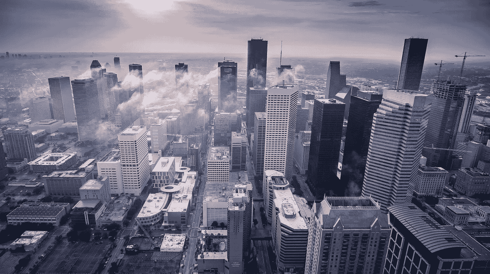
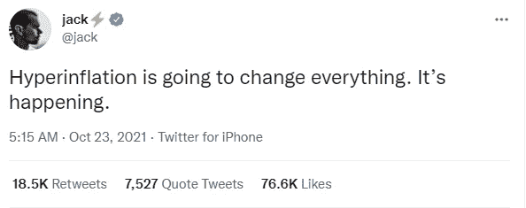

# 货币的价值:适度的通货膨胀要求——作为货币的比特币现金

> 原文：<https://medium.com/coinmonks/the-value-of-money-modest-inflation-requirement-bitcoin-cash-as-a-currency-6e1caa973333?source=collection_archive---------11----------------------->

埃隆·马斯克仍然在“密码游戏”中，但他作为 Dogecoin 的“替身”的做法经常受到批评，这也是理所当然的。

早在 5 月份，马斯克声称对环境感到担忧，并宣布特斯拉将停止接受 BTC 作为支付手段，这在市场上造成了动荡，而 BTC 则处于领先地位。

中国政府宣布禁止加密货币开采后，股市暴跌。自那以后，市场开始复苏，但变化不大。或许，今天散户投资者对加密货币的兴趣甚至更低，但大多数人都在寻找在几天内快速获利的方法，因此他们投资于当前炒作的任何东西。

这是 ATH 市场的现状，尽管我们没有像应该的那样经常讨论加密货币的主要特征。在没有第三方监管的情况下进行交易的自由，没有中央权力机构来控制我们的资金的事实，或者加密货币的分散性质允许它们不间断地运行，没有人能够关闭它们，这些几乎都不是讨论的中心。

在今天的大规模营销活动中，加密货币的货币功能并没有出现在头版。

在我的上一篇文章中:[货币的价值——通货膨胀、恶性通货膨胀、法定货币和作为价值储存手段的比特币现金](https://read.cash/@Pantera/the-value-of-money-inflation-hyperinflation-fiat-and-bitcoin-cash-as-a-store-of-value-2555578f)，我探讨了术语通货膨胀、恶性通货膨胀，并解释了经济体、政府和中央银行如何通过印刷更多的货币来应对对衰退的恐惧，这反过来又造成了对通货膨胀的恐惧。

不过，有一点我认为同样重要，应该详细讨论。在我们的经济中，一定比例的年度通货膨胀(价格上涨)是一项要求。

# 经济中需要适度的通货膨胀

货币供应不是通货膨胀的唯一原因。通常通货膨胀是用 CPI 指数来衡量的。

> *美国劳工统计局(BLS)编制的消费者价格指数(CPI)是最广泛使用的通货膨胀衡量指标。主要 CPI (CPI-U)旨在衡量占美国人口 93%的城市消费者面临的价格变化。*

低水平(2-5%)的通货膨胀有助于经济发展，并激励投资者和企业采用渐进式财富管理方法。

这常常涉及到哲学问题，但这是过去二十年的共识。高于 5%的通货膨胀引起了消费者的担忧，有时仅仅是对更高的通货膨胀的恐惧就推动了价格的上涨。

# 恶性通货膨胀

> ***恶性通货膨胀是迅速上升的通货膨胀，通常情况下*** ***每月都测量超过 50%。***
> 
> *来源:*[*Investopedia*](https://www.investopedia.com/terms/h/hyperinflation.asp)

杰克·多西在推特上宣布恶性通货膨胀正在发生。他写这条推特不是为了警告美国消费者；这是为了制造恐惧而写的信息。

恶性通货膨胀不会到来，操纵发出如此不负责任和错误的信息是可笑的。

杰克要么想帮助经济快速增加支出，要么只想推动更多 Twitter 用户购买比特币。

我倾向于后者，因为他提到了恶性通货膨胀，这是比特币人士真正认为自 2020 年 3 月以来美国经济将发生的事情，并且仍然认为通货膨胀率将达到 5%。

无论如何，这都是不明智的，马斯克试图支持这一论点，提到“高”通胀水平，这是一个更广泛的术语，更有意义。

> *美国自 1776 年建国以来，观察到的最高年通货膨胀率* ***为 29.78%****。*
> 
> *来源:*[*Investopedia*](https://www.investopedia.com/ask/answers/112714/whats-highest-yearoveryear-inflation-rate-history-us.asp)

我只想再次提到这一点，因为 29.78%的年通货膨胀率与 50%的月通货膨胀率相差太远，而且这在美国历史上只发生过一次，是在两个半世纪前。

# 通货紧缩对经济的破坏性与恶性通货膨胀一样大

相反，通货紧缩对经济来说是更糟糕的，我们在经济史上也有例子。

升值的“钱”为每个人创造了削减开支的条件和“只是 hodl”的心态，等待更好的价格。

负通货膨胀(通货紧缩)之后会出现一系列消极事件。

生产下降，失业率上升，经济进入负增长周期，社会基础崩溃(暴力、暴乱、部分人口和生产单位大规模外流、人才外流、生活条件恶化等)。

通货紧缩是经济进入破坏性衰退的结果。经济衰退始于一个过度且巨大的泡沫破裂之后。

一个国家的流动性被抽走，银行破产，贷款停止，经济发展停滞，有时长达几十年。

然而，还有一个问题可能会造成更糟糕的情况。**滞胀**。高失业率和极高通货膨胀率的经济衰退。

尽管部分投资银行变得贪婪和投机，但经济学界对 2-3%的低通胀率已经达成共识，而且这种做法也奏效了一段时间。

2008 年，我们见证了房地产泡沫的破灭。

比特币诞生于同一年，但在仔细研究了参与者(Satoshi、Hal 和其他人)的早期交流后，人们对比特币的价格潜力总是表现出过度的热情和讨论。

减半和固定供应，加上大量“丢失”的比特币，是比特币达到通缩状态的因素。

# 麝香和 Dogecoin

马斯克此前解释说，BTC 的固定供应无助于其收购菲亚特。他理解在这个问题上的普遍共识。囤积，这是 BTC“霍德勒”的方法，无助于进步。但是，这就是今天 BTC 网络的运作方式。

对马斯克来说最重要的是一枚硬币:

*   提供 5%的通货膨胀率(发行新硬币)
*   拥有数千亿单位的巨大发行量
*   被鲸鱼浓缩得很低
*   扩展能力(低费用、快速交易)

马斯克出于投资目的(赌博)购买了 BTC。特斯拉投资者不太喜欢这一点，特斯拉的股价暴跌，这一事件促使马斯克后来提到环境问题，并停止接受 BTC 作为支付方式。

在投资 BTC 之前，马斯克也曾与 Dogecoin 调情。Doge 应该收取 2 Doge 作为固定费用，尽管随着价格上涨，Dogecoin 失去了任何优势，因为目前的费用超过 0.60 美元。与比特币现金相比，无论出于何种原因，比特币都是更糟糕的微交易选择。

任何人都不太可能再使用 BTC 作为货币。比特币现金和其他提供低费用和即时交易的加密货币的情况不同。

创造接受比特币现金的自动售货机是有道理的，但没人愿意额外支付 5 美元的费用。此外，没有人愿意付费来打开和关闭 LN 频道。我已经在上一篇文章中解释了为什么 LN 天生有缺陷并且注定要失败:[货币的价值——通货膨胀、恶性通货膨胀、法定货币和作为价值储存手段的比特币现金](https://read.cash/@Pantera/the-value-of-money-inflation-hyperinflation-fiat-and-bitcoin-cash-as-a-store-of-value-2555578f)。

# 最后

这就是这个体系的运作方式，我试图总体解释为什么通货膨胀是一个必要条件，而囤积大量货币对任何经济都没有帮助。

一些低供应量和固定供应量的加密货币提供了一种替代方案，在我看来，在开始时，这两种系统将结合起来，以帮助经济体维持经济进步，同时将通胀水平和担忧降至可接受的水平。

如今，比特币现金的供应通胀(每年开采的新硬币)约为 2%，尽管随着更多减半的临近，它将继续下降。然而，这并不意味着价格将跟随同样的通货膨胀水平。

加密货币包含储值，尽管它们很容易受到价格过度波动的影响。这种高波动性阻碍了商业世界的广泛采用和接受。随着一些服务迅速清算菲亚特的加密，越来越多的商家参与进来，但这并不代表向加密经济的转变。

然而，这种波动性和频繁的下跌也给消费者的采用带来了问题。那些希望在商业中使用加密货币的人也感受到了压力，这在安排购买时成为了一个问题。我们不得不等待更好的价格，或者花费和更换。这样就变成了一个数学问题，这让零售部门很困惑。

我并不像现代 BTC 马克思主义者那样鼓吹摧毁经济，让他们的口袋鼓起来。虽然，我也反对政府和中央银行操纵我们的财富。

如今，并行支付系统是可行的，使用分散加密货币作为支付方法。这当然要由世界人口来决定，比特币现金是最好的选择。

Follow me on: ● [ReadCash](https://read.cash/@Pantera) ● [NoiseCash](https://noise.cash/u/Pantera99) ● [Medium](/@panterabch) ● [Hive](https://hive.blog/@pantera1) ● [Steemit](https://steemit.com/@pantera1) ●[Vocal](https://vocal.media/authors/pantera) ● [Minds](https://www.minds.com/pantera99/) ● [Twitter](https://twitter.com/Panterabch) ● [LinkedIn](https://www.linkedin.com/in/panterabch/) ● [email](https://read.cash/@Pantera/localcryptos-p2p-exchange-is-now-offering-bitcoin-cash-trading-06637230#bad-link)

***支持内容创作者。***

***如果你喜欢这个故事就订阅吧！***

*原发布于*[*https://read . cash*](https://read.cash/@Pantera/the-value-of-money-modest-inflation-requirement-bitcoin-cash-as-a-currency-d8e982db)*。*

> 加入 Coinmonks [电报频道](https://t.me/coincodecap)和 [Youtube 频道](https://www.youtube.com/c/coinmonks/videos)了解加密交易和投资

## 另外，阅读

*   如何在 Bitbns 上购买柴犬(SHIB)币？ | [币安](https://blog.coincodecap.com/binance-in-india)
*   [币安 vs 比特邮票](https://blog.coincodecap.com/binance-vs-bitstamp) | [比特熊猫 vs 比特币基地 vs Coinsbit](https://blog.coincodecap.com/bitpanda-coinbase-coinsbit)
*   [如何购买 Ripple (XRP)](https://blog.coincodecap.com/buy-ripple-india) | [非洲最好的加密交易所](https://blog.coincodecap.com/crypto-exchange-africa)
*   [非洲最佳密码交易所](https://blog.coincodecap.com/crypto-exchange-africa) | [胡交易所评论](https://blog.coincodecap.com/hoo-exchange-review)
*   [eToro vs robin hood](https://blog.coincodecap.com/etoro-robinhood)|[MoonXBT vs Bybit vs Bityard](https://blog.coincodecap.com/bybit-bityard-moonxbt)
*   [Stormgain 回顾](https://blog.coincodecap.com/stormgain-review) | [Bexplus 回顾](https://blog.coincodecap.com/bexplus-review) | [币安 vs Bittrex](https://blog.coincodecap.com/binance-vs-bittrex)
*   [Bookmap 评论](https://blog.coincodecap.com/bookmap-review-2021-best-trading-software) | [美国 5 大最佳加密交易所](https://blog.coincodecap.com/crypto-exchange-usa)
*   [如何在 FTX 交易所交易期货](https://blog.coincodecap.com/ftx-futures-trading) | [OKEx vs 币安](https://blog.coincodecap.com/okex-vs-binance)
*   [如何在势不可挡的域名上购买域名？](https://blog.coincodecap.com/buy-domain-on-unstoppable-domains)
*   [印度的秘密税](https://blog.coincodecap.com/crypto-tax-india) | [altFINS 审查](https://blog.coincodecap.com/altfins-review) | [Prokey 审查](/coinmonks/prokey-review-26611173c13c)
*   [布洛克菲 vs 比特币基地](https://blog.coincodecap.com/blockfi-vs-coinbase) | [比特坎评论](https://blog.coincodecap.com/bitkan-review) | [币安评论](/coinmonks/binance-review-ee10d3bf3b6e)
*   [Coldcard 评论](https://blog.coincodecap.com/coldcard-review) | [BOXtradEX 评论](https://blog.coincodecap.com/boxtradex-review)|[uni swap 指南](https://blog.coincodecap.com/uniswap)
*   [阿联酋 5 大最佳加密交易所](https://blog.coincodecap.com/best-crypto-exchanges-in-uae) | [SimpleSwap 评论](https://blog.coincodecap.com/simpleswap-review)
*   [购买 Dogecoin 的 7 种最佳方式](https://blog.coincodecap.com/ways-to-buy-dogecoin) | [ZebPay 评论](https://blog.coincodecap.com/zebpay-review)
*   [iTop VPN 审查](https://blog.coincodecap.com/itop-vpn-review) | [曼陀罗交易所审查](https://blog.coincodecap.com/mandala-exchange-review)
*   [美国最佳加密交易机器人](https://blog.coincodecap.com/crypto-trading-bots-in-the-us) | [变化回顾](https://blog.coincodecap.com/changelly-review)
*   [A-Ads 审查](https://blog.coincodecap.com/a-ads-review) | [Bingbon 审查](https://blog.coincodecap.com/bingbon-review) | [Mudrex 投资](https://blog.coincodecap.com/mudrex-invest-review-the-best-way-to-invest-in-crypto)