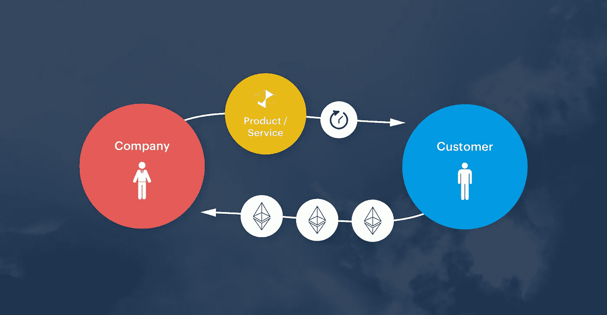

# ERC-948 协议提案的可行性

> 原文：<https://medium.com/coinmonks/the-viability-of-the-erc-948-protocol-proposal-1b33ce2bce25?source=collection_archive---------15----------------------->

已经建立了对可订阅令牌的经济激励，并且缺少当前构建这些令牌的协议，我们现在可以看看 ERC-948 协议看起来像什么。

从经济角度来看，选择退出的方法最为成功，因为它将协调消费者和供应商的激励措施。选择退出协议可能如下所示:

> 用户允许“z”公司每隔“y”个时间段从其钱包中提取“x”个代币。
> 用户可以随时删除同意。
> “z”公司的所有者可以每隔“y”个时间段从用户的钱包中移除“x”个代币。事务将抛出()，除非“x”个令牌可用，用户同意有效，并且自上次撤销以来已经过了“y”个时间段。

利用以太坊区块链上的智能合约的力量，基于 ERC-948 构建的订阅服务的退出智能合约可能看起来像:

> 服务部署了一个可以从用户处收回令牌的智能合约。
> 用户批准无限津贴和无限时间的合同。
> 用户调用合同的 createSubscription()函数，允许“z”服务每隔“y”时间段从他/她的钱包中提取“x”个令牌，直到用户取消。
> 每隔“y”个时间段，该服务调用 withdrawSubscription()，后者使用 transferFrom()来收集在该支付时间段内已被授权的“x”个令牌，这取决于可用的资金和激活的用户同意。

ERC-948 协议的可行性取决于以下因素:

1.  该协议应该被构建为支持**共享契约**或**每订阅契约**。使用共享合同，用户不需要审核每一个订阅。她/他只需要建立一个 *createSubscription()* 函数，而不是为每个新订阅部署一个合同。从客户体验的角度来看，这种模式可能更可取。在一个 35%的消费者拥有三个以上实时订阅的经济体中，单一订阅管理源将是最方便用户的，而不是分别管理所有合同。还有节约汽油的考虑，使共享合同更可取。然而，与任何类型的集中化一样，共享契约方法产生了单一的漏洞来源。使用每个订阅一个合同的模型，用户需要为她/他加入的每个新订阅部署一个新的 createSubscription()函数。展开合同减少了攻击面，但可能会降低用户体验，因为这会迫使消费者分别管理他们的所有订阅。
2.  当公司要求消费者允许在很长一段时间内每隔“y”个时间段提取“x”个代币时，代币的**价格波动**带来了挑战。比方说，一个月的费用，一个特定的代币，可以在六个月的时间里转换成非常不同的美元数额。如果资金在某一天而不是另一天被提取，这可能只是用户的运气不好或运气好。创新不会等待象征性的估值稳定下来。短期的补救办法可能是以法定货币设定订阅费用，然后向消费者收取付款时的交易费率。另一个选择是确保 948 支持稳定的硬币，如最近发布的[戴](https://dai.makerdao.com/)。
3.  对于**服务提供商**来说，为每个个人用户的钱包签发新合同是一个耗时、耗气且乏味的过程，并且考虑到订阅客户的高流失率，这在经济上是不可行的。一个解决方案可以是模仿“共享合同”的概念，即公司部署一个智能合同，可以从所有用户那里收回令牌。如果/当公司有不同的会员等级或 B2C 对 B2B 订阅模式时，这变得有点复杂。
4.  燃气费——在以太坊区块链的一份合同内运营每项业务所需的费用——是未来总部位于区块链的订阅公司将不得不面对的另一个障碍。当前的订阅模式成功地实现了价格透明。消费者被告知他们每个时间段将要支付的费用，并且通常被承诺没有额外或隐藏的费用。对于许多人来说，如果除了每月的订购费用之外，他们还需要在每次付款到期时支付执行订购功能的燃气费，尤其是在燃气费可能会发生变化的情况下，燃气费可能会感觉像是一种隐性费用。订阅公司应该将调解天然气费用的机会视为客户体验的机会。或许，如果公司能够估算出天然气费用，他们就可以将这些费用计入产品的总成本，从而符合客户的期望，即广告上的订购价格就是最终价格。

ERC-948 协议提案为开发人员提供了一个构建平台的机会，公司可以利用该平台构建一个经济模型，该模型在过去十年中已被证明在零售和软件经济中具有价值。如果为订阅建立一个共同的标准，它可以进一步吸引更多面向消费者的公司使用区块链技术。尽管区块链的许多言论都是抨击旧的，颂扬新的，但我们应该关注在当前经济中已被证明成功的激励结构。订阅经济当然是其中之一。

马尔科·维德里

[@密码](https://steemit.com/@cryptomarks)

资料来源:[理事会](https://media.consensys.net/subscription-services-on-the-blockchain-erc-948-6ef64b083a36)