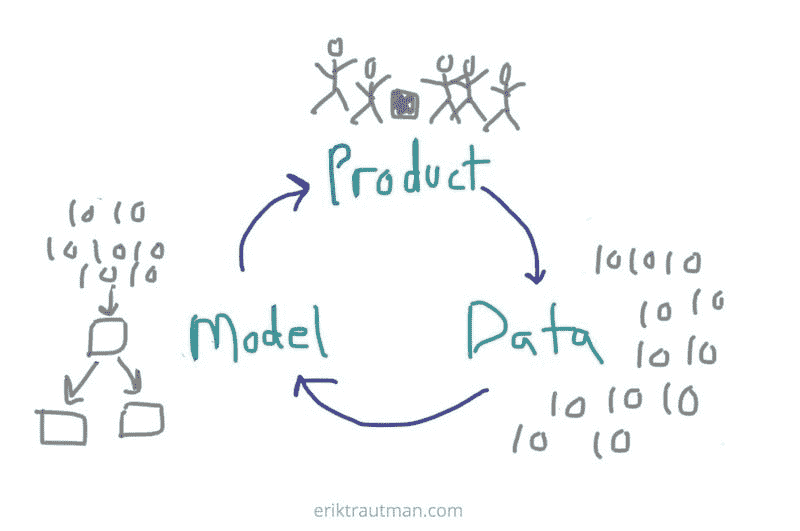
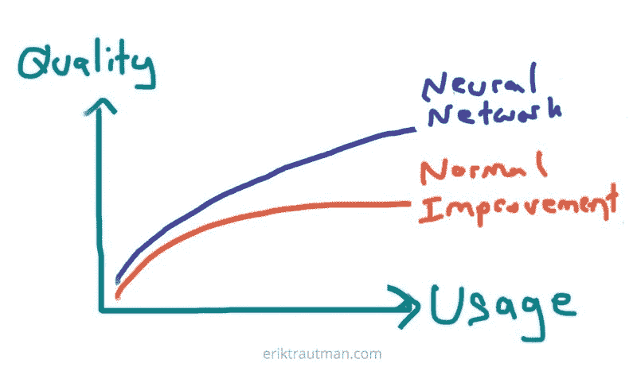

# AI 产品的良性循环

> 原文：<https://medium.com/coinmonks/the-virtuous-cycle-of-ai-products-1f9a24bc9e?source=collection_archive---------10----------------------->

人工智能产品的良性循环，也称为“人工智能飞轮效应”，是人工智能中最令人兴奋的想法之一，也非常简单。从本质上讲，当人工智能技术与产品正确集成时，它们会创建一个反馈回路，产品会随着使用而不断改进，从而产生更多的使用量和相对于其他产品更好的竞争地位。

看起来是这样的:

1.  产品被使用，产生数据
2.  来自使用的数据被输入机器学习(或类似的)模型
3.  模型改进了产品，产生了更多的使用

# 语境

*任何*产品都会随着使用而改进，不管其底层技术如何，因为一个好的团队会使用定性反馈和分析数据来使其更符合用户需求。然而，这种改进趋向于达到一个渐近线，在这个渐近线上，额外的使用和数据不再为产品提供多少边际洞察力。

然而，当一个产品的核心技术是人工智能驱动的时，它在典型的团队驱动的产品改进周期之上增加了另一层。在今天的人工智能技术(例如深度学习)下，额外的数据在很长一段时间内继续提供边际改善，允许周期比以前持续更长时间，并在很长一段时间内改善核心产品。

在下面的图表中，人工智能驱动的产品将从两条线的叠加中受益，而传统产品只能通过正常的努力来改善:

# 一个例子

也许这种良性循环最著名的例子是一家名为[蓝河科技](http://www.bluerivertechnology.com/)的公司。他们使用计算机视觉来检测农田中的杂草，并喷洒足够的农药来杀死它们，从而减少高达 90%的农药用量，并降低杂草的整体农药耐药性。

该项目始于斯坦福大学的一个实验室，在那里，研究生们带着数码相机走进田野，生成初始训练集。当他们有足够的可行模型来创建初始客户会使用的产品时，他们的循环就开始了。

随着每次在田间的实际使用，他们的训练集变得更大，他们的产品在检测和消除杂草方面变得更好。这使他们能够更深入地渗透到市场中，并在此过程中提供不断改进的产品体验。

成立 7 年后， [John Deere 以 3 . 05 亿美元](https://www.wired.com/story/why-john-deere-just-spent-dollar305-million-on-a-lettuce-farming-robot/)收购了该公司。

# 含义

正反馈回路非常强大。营销中一个像样的类比是实现病毒式增长，即每个用户带来至少一个其他用户，创造指数效应。世界上一些最大的公司([脸书](http://www.facebook.com/)、 [Dropbox](https://www.dropbox.com/) 、 [LinkedIn](https://www.linkedin.com/) )都是这样成长的。

一个已经实现病毒式增长的产品在被采用方面有明显的优势，但只有当其核心优势随着额外的使用而变得更加强大时，这种优势才会转化为防御能力。这在护城河是由于[网络效应](https://en.wikipedia.org/wiki/Network_effect)的情况下是真实的，例如脸书，而不是其他，如 Dropbox(其[没有明确的护城河](http://www.morningstar.com/videos/856632/dropbox-hasnt-built-a-moat.html))。

实现病毒式增长和实现产品改进的良性循环是有区别的。特别是，利用人工智能产品良性循环的产品不仅增加了使用量，而且在这个过程中成为一个明显更强大的产品。这使得它更能抵御竞争产品。这可能意味着更好、更快、更便宜……甚至以上所有的一切。

事实上，虽然一个良性循环的产品最直接可见的好处是通过更好的质量增加使用(和增长)，但更有影响力的好处实际上可能是在它和竞争产品之间挖掘越来越深的壕沟。由于其不断增长的数据集，该产品开始以越来越快的速度领先。只有当额外数据的边际改善开始趋于平稳时，这些动力才开始减弱。这可能发生在产品已经有效地“赢得”市场之后。

# 循环有多良性？

一个产品达到的病毒增长程度由[病毒系数](https://www.forentrepreneurs.com/lessons-learnt-viral-marketing/)来表示，或者说每个新用户会带来多少额外的用户。很少有产品实现真正的病毒式营销循环，这由病毒系数> 1 表示。但是许多产品都有一些通过强推荐来衡量病毒效应的措施。即使病毒系数低于 1，它仍然可以增加显著的价值。

同样，并不是所有的产品都能够实现强大的良性循环。这通常只有在产品的核心价值来自人工智能技术的程度上才是可行的，人工智能技术继续受益于不断增加的数据集。简单地使用机器学习来增强现有用户体验(例如通过推荐)的产品，其改进速度将低于那些核心价值主张与人工智能技术直接相关的产品(如上面例子中的蓝河技术)。

这个十亿美元的问题是，一种产品能从其良性循环中受益到什么程度，不幸的是，这个问题不如病毒增长达到什么程度(用病毒系数来衡量)那么清楚，因为这个循环远没有那么直接。我们本质上需要考虑单个用户的使用量与通过最终提高产品质量而获得的额外用户数量之间的比例。

在一个数据科学团队很难预先用美元量化其工作影响的世界里，创建一个类似于增长中病毒系数的“良性循环系数”似乎还不可行。我希望随着人工智能驱动的产品开发越来越广泛地被工具化和采用，我们能够更好地定义这一点。

不幸的是，这可能会导致对给定产品将从这些效果中获得多少好处的一点犹豫，但不应该从效果本身的核心价值中带走。我们只需要多一点批判性思维…

`Virtuous Cycle Coefficient == ???`

*想讨论？打我一下* [*上推特*](https://twitter.com/eriktrautman) *。*

# 额外资源

1.  [艾是新电(讲座)](https://www.youtube.com/watch)由吴恩达到斯坦福 GSB
2.  [AI 被新电(摘要)](/syncedreview/artificial-intelligence-is-the-new-electricity-andrew-ng-cc132ea6264)被同步