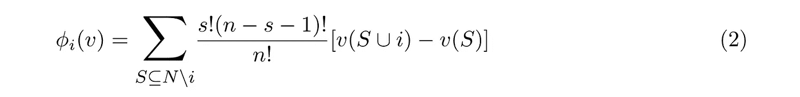

# 道斯的投票游戏

> 原文：<https://medium.com/coinmonks/the-voting-game-in-daos-7f989ff68712?source=collection_archive---------5----------------------->

投票可能是去中心化自治组织(DAO)中最不可或缺的部分。与几乎所有类型的民主投票制度都遵循的一人一票的策略相反，Dao 采用一人一票的策略。这是因为，DAO 中的一个**人**只是区块链上的一个**地址**，玩一个地址一票策略最简单的方法就是将代币分成多个地址并重复投票。

所以现在我们已经决定了一个象征性的一票策略，我们需要一个机制来决定 DAO 是投票**支持**一个法案，还是投票**反对**它。即使在区块链上，我们也无法阻止卡特尔行为，但是我们可以通过使用提交-披露方案来减轻对投票的复制或影响，这将在这里[解释](https://karl.tech/learning-solidity-part-2-voting/)。现在我们的投票机制就是一类**简单的投票游戏**。

一个投票博弈【T12(n，v)】是**简单**如果对于每个联盟 *S* ⊂ *N* ，或者 *v(S) = 0* 或者 *v(S) = 1* ，其中 *v* 是特征函数。最简单的投票游戏(其中一个地址要么投票赞成一项法案，要么弃权投票)，一个令牌一票，我们称之为**加权投票游戏**，它由以下形式的特征函数定义:


对于这类投票博弈，劳埃德·沙普利引入了**沙普利值**的概念，定义为**值函数*∅****【phi】*，或者**沙普利-舒比克幂指数**(在投票博弈的背景下)



基本上，这个函数为一个元素 *i* 计算一个元素*I*将投票结果从负到正摆动的相对次数。所以从所有没有元素 *i* 的排列中，我们加上 *i* 的投票，并且只考虑那些 I 摆动结果的集合，即 *v(S) = 0* ，但是对于 *N* 的任何子集 *S* 来说*v(S*∩*N)= 1*。因此，简而言之，Shapley 值给出了一个估计，即某个特定成员或元素在所有 *N* 元素中有多重要，或者它在投票结果中带来摇摆的相对次数(因为我们考虑摇摆的结果，所以我们考虑所有排列)。

但是我们想让投票系统变得复杂一点，允许投票反对提案。也就是说，成员现在可以投赞成票、反对票或弃权票(中立)。这些被称为**双合作投票游戏**。

在一个双合作投票博弈中，对于成对的不相交联盟 *S* 和 *T* ，特征函数 *v* 现在取值{-1，1}，其中 *v(S，T)* 是投票的结果(如果议案被接受，则 1；如果议案被否决，则 1)。当 *S* 的选民投票赞成议案时， *T* 的选民投票反对议案，其余的选民弃权。如果所有选民都弃权，我们就有 *v(* ∅ *，* ∅ *) = 0* 。

从概念上讲，Shapley-Shubik 权力指数只不过是选民改变投票的相对次数。在双向合作投票游戏中，我们会有正的和负的权力指数，


其中∈基本上是由 *i = 𝞼(j+1)* 所带来的正负波动的量度。

作为一个双边合作投票游戏的例子，考虑以下决策权重:

```
[
  { "id": 1, "weight": 8.6577 },
  { "id": 2, "weight": 7.1193 },
  { "id": 3, "weight": 5.8011 },
  { "id": 4, "weight": 5.0577 },
  { "id": 5, "weight": 4.3457 },
  { "id": 6, "weight": 3.3837 },
  { "id": 7, "weight": 3.3168 },
  { "id": 8, "weight": 27.7727 },
  { "id": 9, "weight": 7.7727 },
  { "id": 10, "weight": 26.7726 }
]
```

考虑一个有益于 DAO 福利的良好/有效提案，id 1 到 id7 是 DAO 中的前 7 名利益相关方(他们将始终投票)，id 10 是弃权的 DAO 人数的大约 26%，id 8 是投票支持该提案的剩余 DAO 成员的大约 78% (27.7727/(27.7727+7.7727))，id 9 是投票反对该提案的剩余 DAO 成员。

我们希望好的提案能够被通过，这意味着，我们希望将*∅值保持在尽可能低的水平。这意味着，我们更希望高层利益相关者没有如此大的权力，以至于他们的个人投票可以将好提案的结果从积极变为消极。*

*相反，对于一个糟糕的提案(例如，除了前 7 名利益相关方之外，至少约 51%的 DAO 成员投票反对该提案)，我们希望将*值保持为最高利益相关方的尽可能低的值。也就是说，一个糟糕的提案很容易被否决，但高层利益相关者很难单枪匹马或与一个小联盟一起将投票转向不利的方向。**

**为了计算功率指数，我在这里写了一个小的 python 代码。配额是法案通过所需票数的权重，所以对于 Q 的配额，所需条件是:
*(n _ votes _ yes**-**n _ votes _ no)≥Q *(100-n _ did _ not _ vote)***

**良好提案的 Shapley 值(***)∅-***对 q 的曲线图如下所示:**

****

**我由此可以得出的结论是，拥有较高股份的成员肯定拥有较高的相对权力来左右投票，随着提案获得通过所需配额的增加，个人的相对权力减少。但是，如果要求的配额太高，那么更高的利益相关者就有更大的权力投票反对该法案并阻止其通过。即使一项法案有利于道的福利，贿赂也可能刺激利益相关者不理性地投票。**

**类似地，人们可以找到在一个糟糕的提议的情况下积极和消极贡献的相对权力指数(例如，当大约超过 51%的 DAO 成员而不是前 7 名利益相关方投票反对时)。然后我们会有兴趣看一看由于∈+的 ***∅*** 值。**

****

**在上面的图中，我用 id 8 的权重为 13.7727，id 9 的权重为 21.7727。我们看到，当要求的配额超过 40 时，或多或少所有的功率指数都会下降到零。也就是说，最高利益相关者不可能单枪匹马地通过一项糟糕的法案(尽管他们可以通过形成更大的联盟，获得更大的作弊动机)。**

****参考文献**:
【1】l . s .沙普利和 m .舒比克。《评估委员会制度中权力分配的方法》
[2] C. Labreuche，M. Grabisch。“双合作博弈的 Shapley 值和幂指数的公理化”**