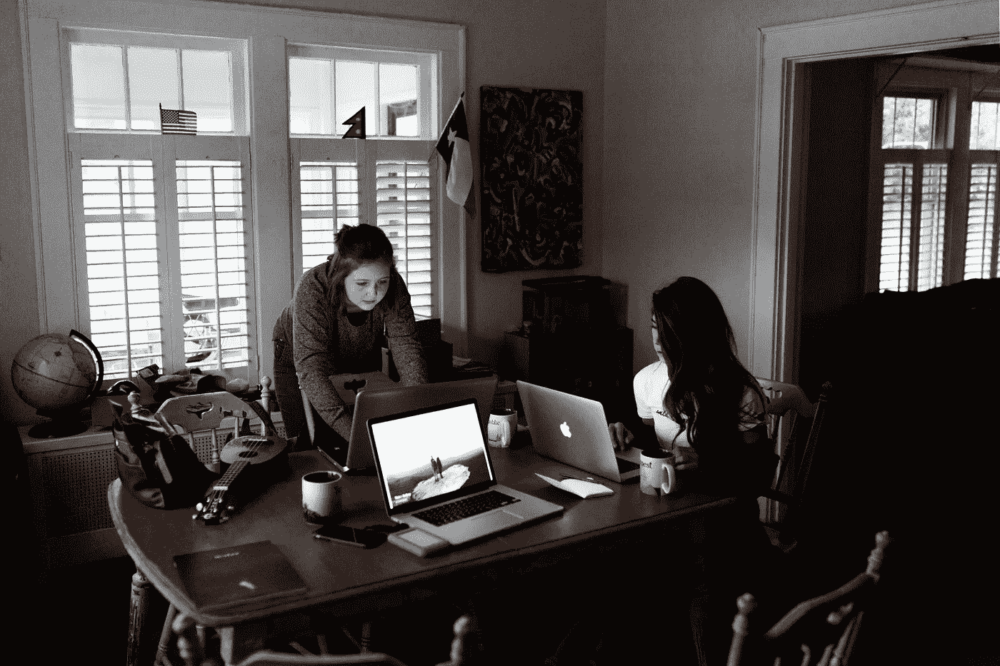
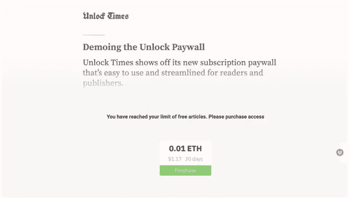

# 网络的新商业模式

> 原文：<https://medium.com/coinmonks/the-webs-new-business-model-85a900942967?source=collection_archive---------1----------------------->

Photo by [Andrew Neel](https://unsplash.com/photos/fkalryO4dUI?utm_source=unsplash&utm_medium=referral&utm_content=creditCopyText) on [Unsplash](https://unsplash.com/search/photos/blogger?utm_source=unsplash&utm_medium=referral&utm_content=creditCopyText)

## 用于货币化内容

Crypto 允许我们将互联网重新想象为一个开放的金融系统，超越了只有广告或基于订阅的模式。总有一天，内容创作者会得到回报，让他们接受自己选择的货币支付，而不会产生额外的摩擦。如果我们充分利用这一点，我们就可以消除成本高昂的中间商，创造一个没有寻租行为的更加透明的金融体系。

认为互联网的商业模式只是销售广告的想法是短视的。现在比以往任何时候都更是投资和消费媒体的黄金时代。《T2》的妮可·奎因写道:

> “媒体业务的创收方式不止一种。单靠广告收入可能不是前进的方向，但媒体创始人可以通过多种其他方式扩大客户群并从中获利。”——妮可·奎因，[光速](https://medium.com/u/3b210452e217?source=post_page-----85a900942967--------------------------------) VC

传统科技公司和市场的层级和政治结构在区块链和加密货币生态系统中并不存在。今天互联网的当前商业结构，3.0，将不得不向个人想要的工作方式弯曲，而不是相反。新一波的出版商将不会是大型的独石，也不会被控制发行的看门人所束缚。他们将是个人、有影响力的人、企业家和自由职业者。

通过加密和微交易的可编程性质，将为企业创造大量新的收入来源。特别是媒体行业——广播、出版和互联网。下面是两个使用案例，说明 crypto 如何为媒体带来新的盈利和商业模式:

**大家好**

仅仅在七个月内，一个闪电博客就实现了 20，000 次比特币小额支付。发表一篇文章大约需要 6 美分。阅读一篇 Y 'alls 的文章大约需要 1 美分，在帖子上发表评论需要 0.5 美分，用表情符号回复帖子需要 10 美分。在此期间，贡献者发布了 170 篇文章，读者为 675 个表情符号反应和 194 条评论付费。在同一时期，作家声称他们的一口大小的加密奖励至少 432 次，从读者那里收取他们的文章费用。

Y’alls article feed displaying money being rewarded to content creators.

读者可以进入 Y'all 的[闪电节点和频道系统](https://twitter.com/alexbosworth/status/929937928519761921)而不需要传统的订阅，就像大多数付费网站一样。小额支付的使用也带来了意想不到的好处。“微支付的一个好处是它让网络恢复了匿名性，”Y'alls 创始人亚历克斯·博斯沃思(Alex Bosworth)告诉 CoinDesk。“我真的很喜欢你的身份不必与用户名和密码捆绑在一起的想法。”此外，减少摩擦将导致更高的转化率。

**解锁**

另一个例子是解锁。[解锁](https://unlock-protocol.com/)自称为“网络的新商业模式”Unlock 是一个协议，它使创作者能够用几行代码以完全分散的方式将他们的内容货币化。

支付意愿可能一直都存在，但还没有简单的机制来实现微支付。Unlock 的信念是，大多数人不花钱买东西的原因与其说是因为它们的价格。这是因为实际支付创建账户、输入信用卡和安全等事情是多么复杂。“我们希望最终打开一个良性循环，减少摩擦带来更高的转化率，”来自 unlock 团队的 Julien Genestoux 说。

Unlock helps publishers monetize content with a few lines of code

这种机制最有可能有利于依赖寻租商业模式的企业家和创造性类型，如作家、音乐家和艺术家。随着越来越多的采用和人们体验加密货币的效用，这将成为可能。

以加密方式使用的技术将使企业家和自由职业者能够更加独立地运作，而不必为传统的等级商业结构工作。随着我们过渡到下一个互联网浪潮，过去的赢家将很难适应加密。然而，我认为创意企业家，如作家，可能最有可能利用互联网 3.0 的加密商业模式的转变。

> [直接在您的收件箱中获得最佳软件交易](https://coincodecap.com/?utm_source=coinmonks)

