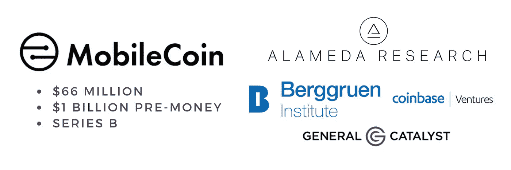
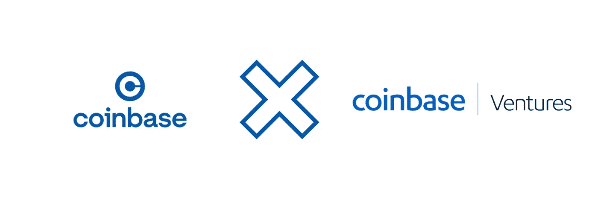
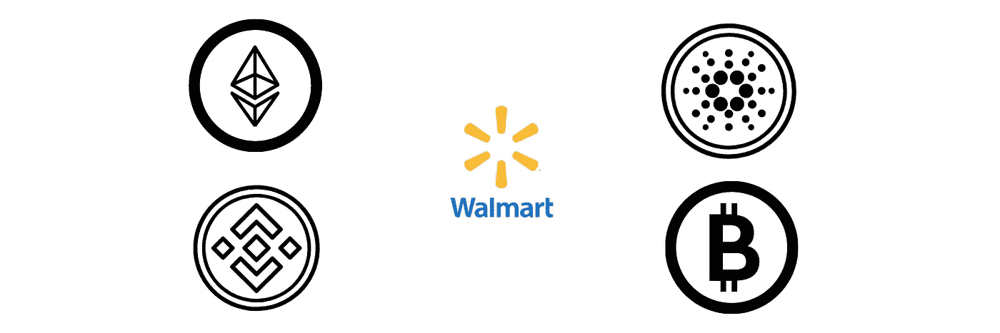

# 本周的加密启动新闻:8/15–8/22

> 原文：<https://medium.com/coinmonks/the-weeks-crypto-startup-news-8-15-8-22-ebaf5a46ea39?source=collection_archive---------7----------------------->

## 我只把一小部分内容放在媒体上。如果你想获得所有加密实用主义的新闻更新、投资公告和 altcoin 报告，请在这里 **免费注册新闻简报** [**。**](http://cryptopragmatist.com/sign-up/)

随着加密货币市场总市值自 5 月份以来首次达到 2 万亿美元的周收盘水平，数字资产创业公司的行动仍然很热。这一回报标志着乐观情绪，可能会转化为对加密初创公司的持续兴趣，可花的钱比可花的地方多。

## **MobileCoin 获得 6600 万美元**

8 月 18 日，币安支持的 MobileCoin 完成了 B 轮融资，以进一步扩大其数字支付生态系统。该公司刚刚完成 Q1 首轮 1140 万美元的融资，又增加了 6600 万美元的融资，以支持其钱包和即时交易技术，该技术旨在与 Monero 等专注于隐私和交易的加密技术竞争。

尽管硬币本身并没有获得太多的关注，排名远在 2500 强之外，但聪明的钱似乎相信对消费者更友好的移动加密钱包的愿景。10 亿美元的预投资估值和 6600 万美元的融资对于一家尚未推出旗舰产品的公司来说似乎很大(他们的可恢复数字移动钱包应用程序仍在开发中)，但由联合创始人约书亚·戈德巴德和莫邪·马林斯派克(即时通讯应用 Signal 的创始人)组成的成熟团队很有吸引力，特别是在加密领域。

这轮有 23 名投资者的投资吸引了一系列知名风投和投资者，最著名的是阿拉米达研究公司、伯格鲁恩控股公司、通用催化剂公司和比特币基地风险投资公司。与这笔交易相关的还有音乐界的知名人士:Lady Gaga 的经理人兼风险投资家 Troy Carter 和 R&B 歌手 Brent Faiyaz。

## **比特币基地 5 亿美元的加密双倍下注**

周四，比特币基地董事会批准了一项美元成本平均战略，在未来几年内购买超过 5 亿美元的 crypto。第二大加密交易所的投资组合将在其资产负债表上携带比特币以及“以太坊、股权证明资产、DeFi 令牌和许多其他加密资产”。

这一举动让一些投资者非常懊恼，他们中的许多人希望接触加密货币行业，而不体验拥有实际硬币背后的波动性。尽管如此，市场反应积极，截至发稿时，比特币基地股价周五上涨逾 4%。

在风险资本环境中，公司经常获得特定项目令牌的股份(例如，币安因其在 MobileCoin 的种子投资获得了 2.5 亿个可用令牌中的 3750 万个)，这一举动可能为比特币基地提供了一个更具竞争力地进入这些交易结构的机会，也为他们提供了一个以优惠价格获得这些新兴硬币的机会。

## **沃尔玛在 LinkedIn 上兴风作浪**

上周四晚些时候，沃尔玛在 LinkedIn 上发布了一份数字货币和加密货币产品负责人的招聘清单，这是最新一个表示有兴趣进入该领域的大公司。

这不一定是加密初创公司的新闻，但该角色的一部分与“确定(ing)加密相关的投资和合作伙伴关系”有关，这是朝着主流加密采用迈出的又一步，也许是朝着零售巨头在该领域的 M&A 行动迈出的一步。

虽然这可能还很遥远，但沃尔玛收购一家加密公司可能是传统上市公司进入加密领域的最高姿态。虽然其他上市公司(特斯拉、MicroStrategy)过去也购买过数字代币，但加密货币初创公司生态系统仍然保持孤立，没有任何大公司收购加密公司。沃尔玛过去在 M&A 相当活跃，所以如果他们是第一家也不要惊讶。

[**点击这里**](http://cryptopragmatist.com/sign-up/) **在你的收件箱里获得这样的内容，绝对免费。**

> 加入 [Coinmonks 电报频道](https://t.me/coincodecap)，了解加密交易和投资