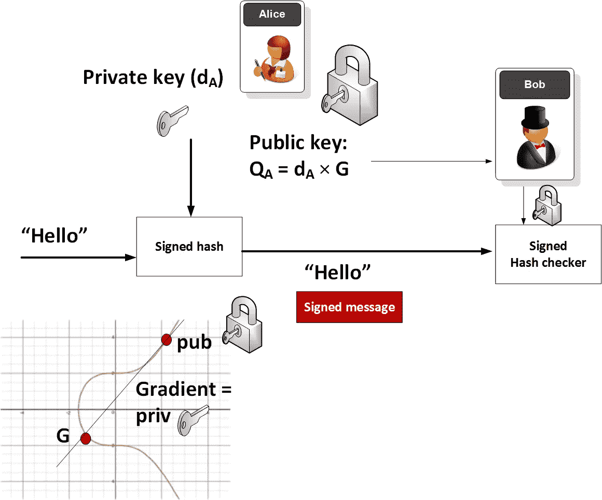

# 椭圆曲线密码的奇妙世界

> 原文：<https://medium.com/coinmonks/the-wonderful-world-of-elliptic-curve-cryptography-b7784acdef50?source=collection_archive---------0----------------------->

# 介绍

那么，在互联网上，什么可能比其他东西更能保护你的隐私和安全呢？那将是椭圆曲线，尤其是:

*y*=*x*+a*x*+b

其中 4a +27b ≠ 0(且这是避免[奇点](http://mathworld.wolfram.com/SingularPoint.html)所需要的)。最常用的曲线是 Secp256k1(或曲线 25519)，定义为 a=0，b=7: