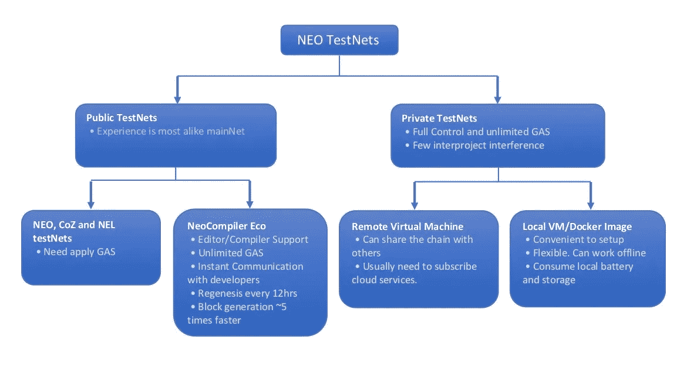
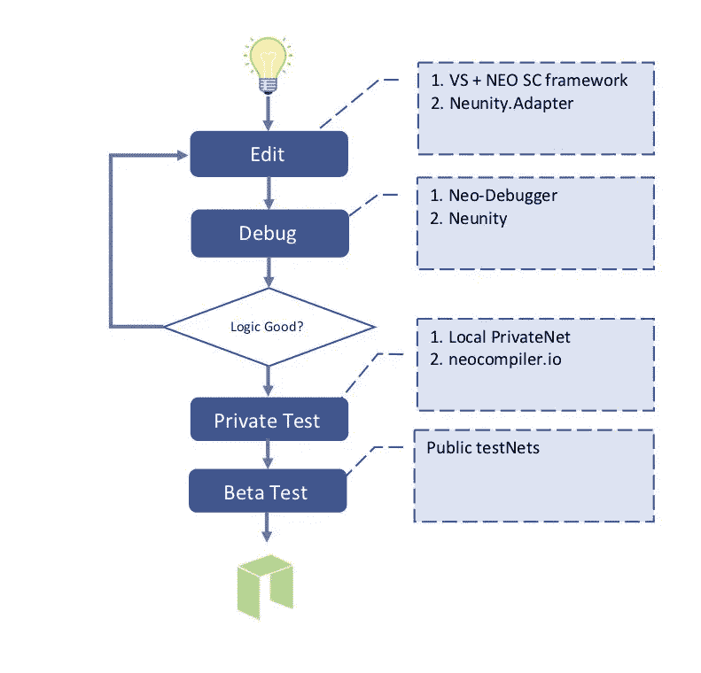
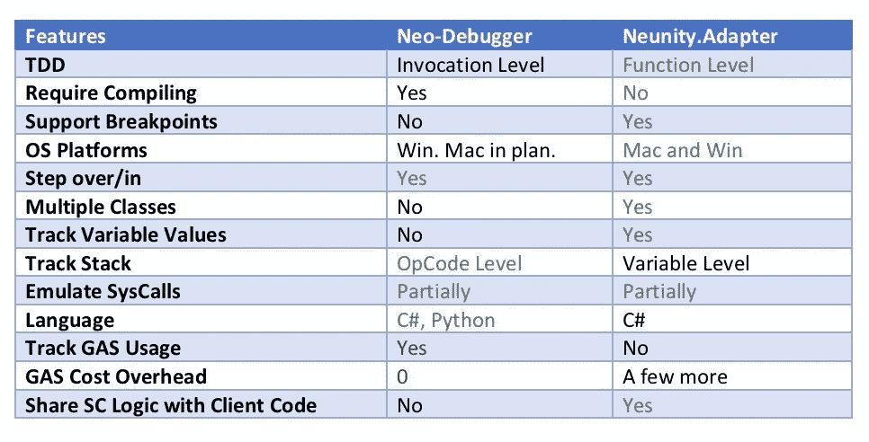

# 开发 NEO 智能合同的工作流程

> 原文：<https://medium.com/coinmonks/the-workflows-of-developing-neo-smart-contracts-c65279ac165b?source=collection_archive---------2----------------------->

**摘要**:开发 NEO 智能合约的典型开发工作流程有两个实际阶段:编码(在 IDE 中编辑和编译到。avm)和测试(在测试网上部署、调用和检查结果)。此工作流需要编译和部署来调试任何代码更改。在 NEO 社区开发的一些最新工具集的帮助下，出现了一个 4 阶段工作流，以进一步提高开发效率。

在本教程中，我们将首先简要讨论标准的两阶段工作流以及一些有用的参考资料，然后介绍四阶段工作流以及相关的新开发工具。除非另有说明，否则讨论采用 C#作为智能合约语言。

这当然有可能是我在本教程中犯了错误或错过了一些要点，非常感谢任何评论。

# 1.两阶段工作流程

按照惯例，我们在 NEO 智能合约开发中有两个实际阶段:**编码**和**测试**。这个[官方教程](http://docs.neo.org/en-us/sc/quickstart/overview.html)提供了关于这个工作流程的更多细节。

对于编码阶段，NEO 官方支持 C#(例子[此处](http://docs.neo.org/en-us/sc/tutorial/HelloWorld.html))。我们还可以用 [Java](http://docs.neo.org/en-us/sc/quickstart/getting-started-java.html) 和 [Python](https://github.com/CityOfZion/neo-python/blob/master/README.rst) 开发一个智能合约。因为我们可以很容易地在 Google 和 Youtube 上找到几页教程和示例代码来告诉我们如何编写 NEO 智能合同，所以我将在本教程中跳过这一部分。



NEO TestNet Solutions

我们依靠测试网络来完成测试阶段。如上图所示，我们有很多测试网的选择。

**公测网**

最常见的方法是使用公共测试网。有三个主要的公共测试网络分别由 NEO Smart Economy、CoZ 和 NEL 维护。 [Alex Guba 的教程](/@gubanotorious/test-networks-and-fund-requests-for-smart-contract-and-dapp-testing-on-the-neo-blockchain-583a1795412)详细阐述了如何在 NEO 和 CoZ 测试网上测试之前同步块和请求 GAS，而 [NEL 的测试网](https://scan.nel.group/#testnet)对中国开发者更友好，支持本地化。

在许多情况下，您可以通过 NEO API ( [完整引用](http://docs.neo.org/en-us/node/cli/apigen.html))为区块链交互运行 RPC 调用。某些 API 仅在您有一个正在运行的 NEO-CLI 节点并打开了 wallet 时才可用。但是，如果测试网络配备了 Neo-Scan，您可以调用类似的服务，而无需运行此类节点。例如，API [getBalance](http://docs.neo.org/en-us/node/cli/2.7.4/api/getbalance.html) 需要一个正在运行的节点，但是您可以使用 Neo-Scan 的 [get_balance](https://neoscan.io/docs/index.html#api-v1-get-3) 来获得类似的功能。我创建了一个 [Postman 集合](https://github.com/norchain/NEORPC_PostMan/tree/master)来帮助测试这些远程过程。只需更改测试网络(或新扫描)域的值即可使用它。

[NeoCompiler Eco](https://neocompiler.io/#/) 有一个新的、特殊的公共测试网络，这启发了我们转向四阶段工作流程。我们将在下一章详细讨论它。

**专用测试网**

另一个好方法是建立你自己的私人测试网。与公共测试网相比，私有测试网的优点是你可以完全控制。使用私人测试网的第一个原因是，它真的很有帮助，令人鼓舞，让人产生钱包里有数百万个 NEO 和 GAS 的错觉。同时，与公共测试网相比，我们不需要担心链再生，连接失败，或者其他开发者错误地阻塞网络。

NEO 的官方网站提供了在云服务上建立私有网络的逐步指南。但在检查了我来自 Azure 的账单后，我不会推荐它，除非你必须与其他人共享链数据。Neo-privatenet-docker 非常适合在您的本地机器上构建私有测试网络，同时从大量的配置和指令中节省您的时间。如果你在笔记本电脑上运行它，嗯…它也有助于在冬天保持体温。

**两阶段工作流程的局限性**

这种两阶段工作流已经成熟，被大多数现有项目所采用。然而，与传统的软件项目相比，它有一些局限性。最主要的一点是**调试非常昂贵**。要监视变量的运行时值，最好的选择是使用如下运行时通知:

```
byte[] ba0 = CallSomeFunction();
byte[] ba1 = CallAnotherFunction();//Print out the value of ba0 and ba1 to ApplicationhLog
Runtime.Notify(ba0, ba1);
```

即使在快乐的道路上，我们仍然需要用 neon 重新编译项目，然后确保有足够的 GAS 来进行重新部署，然后用正确的格式组成适当的参数，然后调用契约并等待 20-30 秒来生成下一个块，然后调用 API *getapplicationlog* 来获取 JSON 中的日志，然后用 pretty 格式打印响应以找到记录的值(查看下面示例响应中的**粗体**部分)。由于通常记录的值是用字节数组表示的，我们还需要将它们转换回字符串或大整数。嗯，一共 7 步。

```
[
  {
    "jsonrpc": "2.0",
    "id": 5,
    "result": {
      "txid": "0x7e3f08a8af4290693184b413ba1d58bede8462cb565baba8ffcc380bf947e317",
      "executions": [
        {
          "trigger": "Application",
          "contract": "0x32682404d4313ecf80b70e1323ccf908a80fdfc0",
          "vmstate": "HALT, BREAK",
          "gas_consumed": "0.039",
          "stack": [],
          **"notifications": [
            {
              "contract": "0xaeccdcf6d7ecf827e7e6baec3c233eca08c27ee3",
              "state": {
                "type": "Array",
                "value": [
                  {
                    "type": "ByteArray",
                    "value": "010203"
                  },
                  {
                    "type": "ByteArray",
                    "value": "04090d"
                  }
                ]
              }
            }
          ]**
        }
      ]
    }
  }
]
```

官方文档中介绍了一章[单元测试](http://docs.neo.org/en-us/sc/quickstart/test.html)，但是其中的例子仍然需要编译和/或部署。提前 avm。

当我们开发基于 NEO 的区块链游戏 [CarryBattle](https://github.com/norchain/NEOCarryBattle) 时，我的团队 [norchain.io](http://norchain.io/home/) 强烈感受到了这种局限性。在社区的帮助下，我们开始尝试 4 阶段工作流程，大大提高了开发效率。

# **2。四阶段工作流程**

这个工作流程的四个阶段是**编辑**、**调试**、**私有测试**和 **Beta 测试**。主要想法是:

1.  利用一些新工具将**编码**阶段分成**编辑**和**调试。在调试阶段，我们尽可能像常规软件项目一样，跳过或运行本地测试用例，而不与区块链交互。**
2.  将**测试**阶段分为**私有测试**和 **Beta 测试**，分别使用 privateNet/NeoCompiler Eco 进行私有测试，使用公共测试网进行 Beta 测试。使用这种方法，我们可以用最少的努力确保灵活性和兼容性。



Four-Phase NEO Smart Contract Development (C#) Workflow

对于编辑和调试阶段，我推荐两种方法: [**Neo-Debugger**](https://github.com/CityOfZion/neo-debugger-tools) 和 [**Neunity**](https://github.com/norchain/Neunity) 。

**新调试器**

[Neo-Debugger](https://github.com/CityOfZion/neo-debugger-tools/releases) 的项目由 [Relfos](https://github.com/Relfos) 开发。使用 Neon 的特殊版本和 debug json 文件，您可以编写调用级测试用例，并在 IDE 中逐步运行源代码，跟踪 GAS 使用情况和应用程序日志，而无需与区块链交互。Neo-Debugger 的另一个很好的特性是，它可以在检查堆栈时跳过操作码。Nikolaj-K 有一个新调试器的[视频教程](https://www.youtube.com/watch?v=KnPHIaEsgtA)。

[Fabio](https://github.com/FabioRick) 也用类似的想法做了一个不错的项目 [SCTracker](https://github.com/FabioRick/SCTracker) ，但是当他知道 Neo-Debugger 的存在时，他决定跳过。但还是感谢他的贡献。

**Neunity。适配器**

Neo-Debugger 在 NeoVM 级调试方面做得很好，但是它仍然有一些局限性。例如，它还不支持变量监控、断点或函数级测试用例。

Norchain.io 创建的框架 [Neunity](https://github.com/norchain/Neunity) 的[适配器层](https://github.com/norchain/Neunity/blob/master/NeunityVisualStudioIntegration.md)走的是一条不同的本地调试之路。Neunity 的概念。适配器是:

1.  **引入一个适配器层来隔离 NeoVM 和 normal 之间的差异。网络项目**。我们有两个适配器。适配器. NEO 和 *Neunity。Adapter.Unity* 具有相同的函数签名集，但名称空间和实现不同。它们用于 NEO 智能合同和 Unity 项目(实际上也适用于许多其他项目)。Net 项目)。这些函数中的大部分都是关于类型转换、操作符或系统调用模拟的。
2.  然后我们可以**在适配器层之上编写应用程序逻辑。显然，通过简单地改变名称空间，这个应用程序逻辑可以被智能合同或普通合同使用。Net 项目。**
3.  现在我们可以使用功能级测试驱动开发(TDD)，甚至可以与 C# Dapp 客户端共享逻辑。

我有一个[视频教程](https://www.youtube.com/watch?v=vTkNzx403p8)演示如何使用 Neunity。适配器来执行函数级 TDD，使用变量监视器和调用堆栈来执行单步调试。

与下表相比，我们可以看到 Neo-Debugger 和 Neunity 的优势。适配器。根据我们的经验，Neo-Debugger 更适合小规模的项目，因为它消耗的气体开销为零，而 Neunity。Adapter 更适合大规模或更复杂的项目，因为它更好地支持 TDD、多类、断点、变量跟踪等。



Comparison between Neo-Debugger and Neunity.Adapter

Neunity 的设计实践大规模软件项目方法论(我指的是系统逻辑的规模。并不意味着单次调用必须复杂或昂贵)。这就是为什么要填补？Net 开发人员和 NEO 开发人员迈出了重要的第一步。同时，Neunity 也提供了一个 *Neunity。工具*层有灵活序列化(NuSD)、类 HTTP 通信协议(NuTP)、类 URI 存储管理(NuIO)等。我们希望帮助更多近地天体区块链 Dapps 着陆的努力变得切实可行。

**私人测试**

在通过迭代编码和调试阶段完成逻辑之后，我们可以移动到私有测试阶段，并开始与区块链交互。我们建议使用 private testNet 或 [NeoCompiler Eco](https://neocompiler.io/#/) 进行私有测试，因为它们的环境简单且易于交互和管理。

NeoResearch 开发的 [NeoCompiler Eco](https://neocompiler.io/#/) 的公共测试网是新的和特殊的。它不需要应用 GAS，同时提供了一整套基于 web 的 GUI 工具，包括编译、导入操作码、部署、调用、事务、转换等。NeoResearch 最近还集成了 gitter.im 进行即时聊天，以便更好地与开发者交流。Igor 有一个很好的[教程](/neoresearch/30-seconds-to-build-and-test-an-ico-on-neo-70c00be6a32d)来介绍它的基本功能。

这个测试网的另一个好处是每 5-7 秒生成一个块，几乎比正常情况下快 5 倍。它缩短了等待时间，并且您几乎不会与同一个块中的其他开发人员的调用发生冲突，这使得测试几乎与私有测试网一样简单。这就是为什么我们建议考虑它作为一个私人测试选项。

**Beta 测试**

如果在私有测试阶段成功地测试了所有的功能，我们就可以进入 Dapp 上线前的最后一个阶段。公共测试网是 beta 测试的最佳场所，因为它离主网很近。另一个好处是，你也可以邀请你的朋友从他们那端帮助测试。对于来自并行调用和潜在的盲目或无效输入的挑战，您的智能契约应该保持不变。

# 摘要

NEO 与许多其他公共区块链项目相比有许多优势:如高交易速度、相对友好的开发语言(C#、Python)、国际化和活跃的社区氛围。

改进开发工作流程将有助于增强 NEO 的语言优势，并在不花费太多时间解决琐碎问题的情况下，将闪光的想法整合到实际项目中。

希望这篇教程能从我有限的知识中提供两分钱。感谢[法比奥](https://github.com/FabioRick)和[雷佛斯](https://github.com/Relfos)对本教程的帮助。欢迎任何建议和意见。

> [在您的收件箱中直接获得最佳软件交易](https://coincodecap.com/?utm_source=coinmonks)

[](https://coincodecap.com/?utm_source=coinmonks)