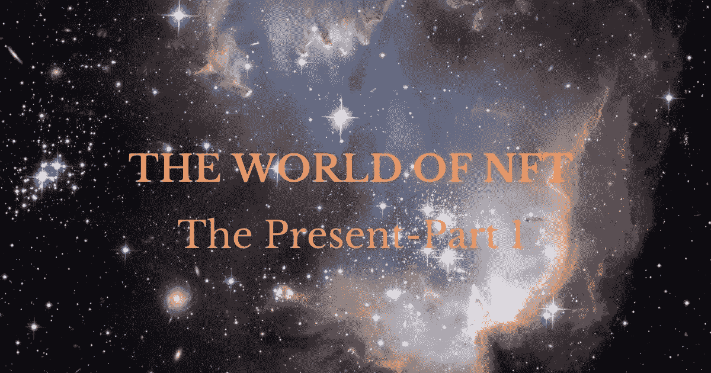
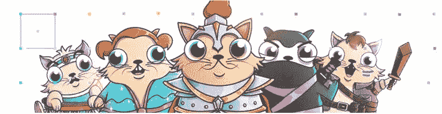
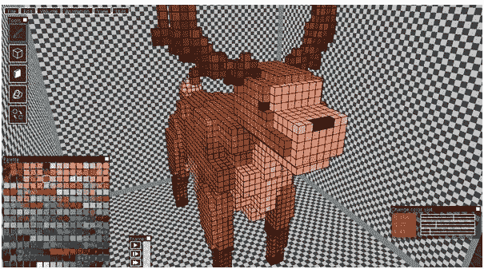
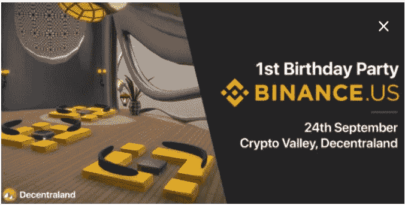
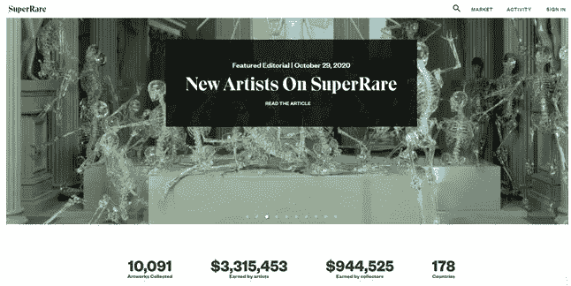

# 非功能性测试的世界:第一部分——现在

> 原文：<https://medium.com/coinmonks/the-world-of-nfts-part-1-the-present-8a2de175c2e9?source=collection_archive---------2----------------------->

在[语音](https://app.voice.com/post/@tulip/the-world-of-nfts-part-1-the-present-1604059081-1)阅读我的原创文章。

2020 年，分散金融(DeFi)将区块链的能力推向了新的极限。一系列创新产品，如自动做市商、高产农业等变得非常受欢迎。**除了这些项目，一个名为“Dontbuymeme”的项目也受到了关注。Dontbuymeme 是 NFT-DeFi 项目。是偶然吗？让我们来找出答案。**

不可替代令牌(NFT)被认为是区块链的下一个重大创新。NFT 已经在生态系统中存在了一段时间。这些是区块链上不可复制的独特令牌，具有独特的功能/特征，并有特定的用途。持有人享有个人国家森林信托基金赋予的某些特权。

***隐朋克是 NFT 最早创造的。每个朋克现在都卖了一大笔钱。***

***最早的一只 Cryptokitty 上市出售，价格高达 12 万美元。***

**流行用例:**

1.**游戏:**游戏是 NFT 迄今为止最大的用例。NFT 在游戏中有多种用途。下面通过用例提到了一些值得注意的项目

o [这样的小猫拥有巨大的稀有价值。](https://www.cryptokitties.co/)

o **交易卡牌:** [诸神被解放](https://godsunchained.com/)是交易卡牌游戏的先驱。交易卡牌游戏是一个简单而强大的 NFT 用例，在这个用例中，可以在二级市场中获得或交易拥有特定权力的独特游戏内卡。

o [**金恩**](https://enjin.io/) **、ERC 1155、元宇宙:**区块链博彩没有金恩是不完整的。金恩是 ERC-1155 标准背后的创新者，该标准现在是公认的以太坊标准。金恩是第一个成功创建游戏多元宇宙的项目。金恩 NFTs 可以在多个游戏中使用。这种 NFT 的持有者在不同的游戏中会有不同的权力。像《六条龙》、《铁锈时代》等游戏是人们期待已久的，一旦推出就能带来大规模的采用。

o**[**沙箱**](https://www.sandbox.game/en/) **地:**沙箱中的每块地都是一个 NFT。*此类土地的持有者获得土地游戏化的专有权，出租土地以赚取被动收入，或在以后以更高的价格出售。最近，沙盒中的两个 6×6 庄园以 210 以太(76931 美元)的价格[售出](https://news.bitcoin.com/an-ethereum-vr-game-featuring-atari-and-care-bears-sells-plot-of-virtual-land-for-76k/)，是原价的 28 倍。***

**注意:沙盒还没有完全发布。**

****

**[来源](/sandbox-game/user-generated-contents-meets-nfts-within-the-sandbox-4b865966c54e)**

**o [**分散游戏**](https://decentraland.org/) **虚拟会议:**分散游戏一直是游戏领域的引领者。该项目目前正在探索并成为虚拟会议的热门项目。最近，币安美国公司的第一个生日庆典在苏格兰举行。**

****

**2.**数码艺术:**NFT 艺术景观正在慢慢爆发。Knownorigin、Makersplace、Superrare、Rarible 等平台越来越受欢迎。这些平台正在催生一些有趣的趋势:**

**o **版税:** Superrare 每卖出一张唱片，就给艺人一定比例的佣金。**

**拥有狂热追随者的新一代数字艺术家诞生了。检查一下 [Osinachi](https://superrare.co/osinachi/creations) 。**

**o **数字画廊:**像[凯特·瓦斯](https://www.katevassgalerie.com/)这样的虚拟画廊正在兴起。这些画廊从区块链艺术平台策划和购买艺术品，并在他们的画廊展示，以供未来销售。**

**o **鲸鱼 NFT 持有者:**像**[Whale shark . pro](https://twitter.com/WhaleShark_Pro)**这样的著名鲸鱼已经出现，他们在许多 NFT 项目中拥有重大股份，这些项目拥有庞大的社区，可以影响决策。******

******o **艺术家的个人社区令牌**:[Roll](https://twitter.com/tryrollhq)是一个让艺术家创建他们的社区令牌的平台。这种代币可以用于将来购买艺术家的作品。******

********

******3。** **社区建设:******

****o **币安:**这也许是最重要的案例研究之一。币安与金恩合作推出多种 NFT 来庆祝重要事件，以聚集社区来推广产品。这是现在滚到了币安拥有的硬币市场资本。CoinMarketCap 发布了有史以来第一套可收藏的 NFT。****

****在本系列的第 2 部分中，我们将继续探索 NFTs 的更多用例。我们将讨论即将到来的 NFTs 用例，一些有趣的项目，以及 NFTs 的未来。如果您能在下面的部分留下您的观点以供进一步讨论，我将不胜感激。****

******阅读更多:** [构建平衡的加密组合](/coinmonks/building-a-balanced-crypto-portfolio-2a384492b1c)****

******跟我来******

****https://twitter.com/rumadas123➡推特:****

****https://www.linkedin.com/in/ruma-das-a1439320/➡领英:****

## ****另外，阅读****

*   ****[最佳加密交易机器人](/coinmonks/whats-the-best-crypto-trading-bot-in-2020-top-8-bitcoin-trading-bot-c16adeb13317)****
*   ****最好的比特币[硬件钱包](/coinmonks/the-best-cryptocurrency-hardware-wallets-of-2020-e28b1c124069?source=friends_link&sk=324dd9ff8556ab578d71e7ad7658ad7c)****
*   ****[密码本交易平台](/coinmonks/top-10-crypto-copy-trading-platforms-for-beginners-d0c37c7d698c)****
*   ****最好的[加密税务软件](/coinmonks/best-crypto-tax-tool-for-my-money-72d4b430816b)****
*   ****[最佳加密交易平台](/coinmonks/the-best-crypto-trading-platforms-in-2020-the-definitive-guide-updated-c72f8b874555)****
*   ****[unis WAP 最佳钱包](/coinmonks/best-wallets-to-use-uniswap-e91a6385d9e8)****
*   ****最佳[加密贷款平台](/coinmonks/top-5-crypto-lending-platforms-in-2020-that-you-need-to-know-a1b675cec3fa)****
*   ****[block fi vs Celsius](/coinmonks/blockfi-vs-celsius-vs-hodlnaut-8a1cc8c26630)vs Hodlnaut****
*   ****[莱杰 vs 特雷佐](/coinmonks/ledger-vs-trezor-best-hardware-wallet-to-secure-cryptocurrency-22c7a3fd391e)****
*   ****[顶级 DeFi 项目](/coinmonks/defi-future-10-promising-projects-in-the-defi-world-ff2b697ab006)****
*   ****Bitsgap 评论——一个轻松赚钱的加密交易机器人****
*   ****为专业人士设计的加密交易机器人****
*   ****[3 商业评论](https://blog.coincodecap.com/3commas-review-an-excellent-crypto-trading-bot) |一款优秀的密码交易机器人****
*   ****[3Commas vs Cryptohopper](/coinmonks/cryptohopper-vs-3commas-vs-shrimpy-a2c16095b8fe)****
*   ****Bitmex 的[保证金交易指南](/coinmonks/the-idiots-guide-to-margin-trading-on-bitmex-dbbd7742c6fc?source=friends_link&sk=7bfa99d2a181142510c8442c8ddb0786)****
*   ****[加密摇摆交易权威指南](/coinmonks/the-definitive-guide-to-crypto-swing-trading-7e4af6496d4d?source=friends_link&sk=70448050bd9323b42f63bfc0bb1e60d1)****
*   ****[Bitmex 高级保证金交易指南](/coinmonks/bitmex-advanced-margin-trading-guide-2270c195ce25?source=friends_link&sk=1d986cca731f5084b9a2db4a4bc4a7ad)****
*   ****[面向开发人员的最佳加密 API](/coinmonks/best-crypto-apis-for-developers-5efe3a597a9f)****
*   ****[加密套利](/coinmonks/crypto-arbitrage-guide-how-to-make-money-as-a-beginner-62bfe5c868f6)指南:新手如何赚钱****
*   ****顶级[比特币节点](https://blog.coincodecap.com/bitcoin-node-solutions)提供商****
*   ****最佳[加密制图工具](/coinmonks/what-are-the-best-charting-platforms-for-cryptocurrency-trading-85aade584d80)****
*   ****了解比特币的[最佳书籍有哪些？](/coinmonks/what-are-the-best-books-to-learn-bitcoin-409aeb9aff4b)****

> ****[直接在您的收件箱中获得最佳软件交易](https://coincodecap.com?utm_source=coinmonks)****

********