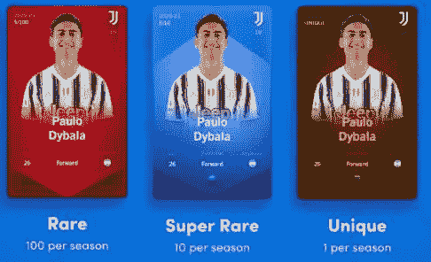
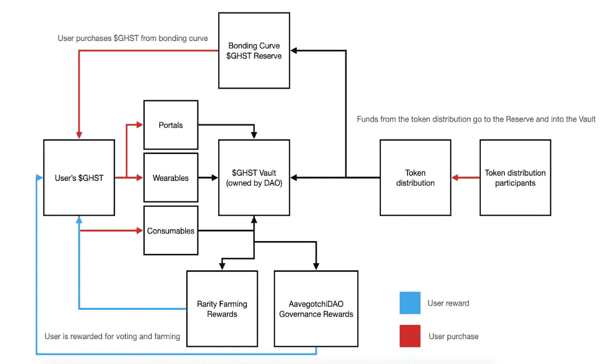
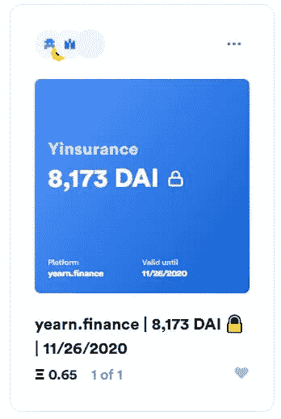

# 非功能性测试的世界:第二部分——未来

> 原文：<https://medium.com/coinmonks/the-world-of-nfts-part-2-the-future-eb0f9c965f55?source=collection_archive---------2----------------------->

在[语音](https://www.voice.com/post/@tulip/the-world-of-nfts-part-2-the-future-1604243458-1)阅读我的原创文章。

在本系列的第 1 部分([NFTs 的世界:第 1 部分——现在的](/coinmonks/the-world-of-nfts-part-1-the-present-8a2de175c2e9))，我们讨论了 NFTs 是如何在游戏、数字艺术行业变得非常流行的。我们还谈到了币安如何利用金恩 NFTs 来建立一个强大的社区。在这个系列中，我们将讨论一些更有趣的用例。我们还将讨论非功能性测试的未来。

1.**体育**:区块链正在渗透体育，在粉丝参与方面有一些独特的解决方案。

a. [**奇力兹**](https://www.chiliz.com/en/home/) **:** 奇力兹为体育实体提供区块链球迷参与代币。Chiliz 支持的 Socios 平台发行著名俱乐部的官方粉丝令牌。这些球迷代币赋予用户在俱乐部事务中投票的权利，以及访问独家内容和获得比赛日门票的权利。最近出售的 20 美元的酒吧代币大受欢迎.

b.[**Sorare**](https://sorare.com/)**:**Sorare 是一家总部位于区块链的梦幻足球平台。玩家卡作为数字收藏品出售。用户可以用这种卡参加比赛，也可以在市场上出售。

来源: [Sorare](https://sorare.com/)

2.域名:如果你关注名人的推特，大多数人都有一个。“eth”域名。这些是位于实际字母数字地址之上的加密地址。长地址一直是个问题，现在可以为你的钱包账户设置简单的地址了。

a. [**不可阻挡的域名**](https://unstoppabledomains.com/r/) **:** 不可阻挡的域名提供’。crypto '和'。zil '个域。它还让用户能够创建自己的基本网站。用户可以将他们的域名链接到这些网站。一个标准域名的价格通常在 40-80 美元之间。不需要更新

b. [**以太坊名称服务**](https://ens.domains/) **:** 以太坊名称服务提供’。“eth”域。这些域名需要注册和更新。价格与域名中的字母数量成正比。一个 3 位数的域名可能要花费 1.5-2 ETH。

3.**分散融资:**到目前为止，NFT 因其稀有性和特定的使用案例而受到重视。我们现在正进入一个结合了 NFTs 和 DeFi 的解决方案的时代。

**a. NFT 作为抵押品-**[Aavegotchi](https://aavegotchi.com/?utm_source=nonfungible)**:**Aavegotchi 是由 ERC721 标准支持的加密收藏品。Aavegotchi 的价值来源于三个因素——抵押品、特质和可穿戴设备。每个 Aavegotchi ERC721 NFT 管理一个托管合同地址，该地址持有一个 ave 支持的 ERC20 抵押品或“ATO ken”(aDAI、aUSDT、aLINK、aLEND 和 aSNX)。阿托肯通过 Aave 的 LendingPool 产生收益，这增加了钱包中持有的阿托肯数量。因此，Aavegotchi 托管地址中持有的 aTokens 数量会随着时间的推移而增长。

Source: [https://aavegotchi.com/](https://aavegotchi.com/)

The technical architecture of Aavegotchi

来源:Aavegotchi [Lite paper](https://docs.google.com/document/d/1aTijRP1Rd_Z8iu6IISWCct7TWRdzK3x-lfrucgM_7Cg/edit#)

b. **NFT 作为 LP 挖矿的奖励** - [**不要买 Meme**](https://dontbuymeme.com/)**:**Donybymeme 是一个非常受欢迎的项目，它成功地将 NFT 与 DeFi 合并。它的工作方式与 Aavegotchi 有点不同。用户需要购买 MEME 代币，并直接下注 MEME 或 ETH-MEME LP 代币。作为回报，用户将获得限量版的 NFT

**c .保险:**保险可以令牌化。象征性的 iyearnfinance 保险单目前正在以稀有品种出售。这些策略保护用户免受智能合约漏洞的影响。它们可以在二级市场上转让、买卖。

d .抵押贷款:房地产证券化的工作正在进行。一旦同样的产品进入市场，并符合有利的监管规定，DeFi 将向抵押贷款开放。

其他地区也在探索非正规森林疗法。其中包括 ***赛事票务、筹集资金、用作社交货币、发行音乐、视频 NFTs*** 等。以太坊有一个固有的问题，它导致游戏无法完全开始。然而，随着第 2 层解决方案越来越受欢迎，这个问题将很快得到解决。小心这个空间！

如果你能在下面的部分留下你的观点供进一步讨论，我将不胜感激。

**参考资料:** [SSRN](https://poseidon01.ssrn.com/delivery.php?ID=769100067111075029002088027006088101005063061035027036094120112100090095095071002078024006023047020040034098071098109089002099008086008054041105126065087127002079030068062031023105004095001103012012016068112081027028104030027089108002022065094104106112&EXT=pdf) ，Opensea [博客](https://opensea.io/blog/guides/non-fungible-tokens/#History_of_non-fungible_tokens_2017_2020)，DCL 博主[推特](https://twitter.com/DCLBlogger/status/1304420045351579648)，[Nonfungible.com](https://nonfungible.com/blog/the-troubled-marriage-between-nfts-and-defi)

**阅读更多:**[NFTs 的世界:第一部分——现在](/coinmonks/the-world-of-nfts-part-1-the-present-8a2de175c2e9)

**跟着我**

https://twitter.com/rumadas123➡推特:

https://www.linkedin.com/in/ruma-das-a1439320/➡领英:

## 另外，阅读

*   最佳加密交易机器人
*   最好的比特币[硬件钱包](/coinmonks/the-best-cryptocurrency-hardware-wallets-of-2020-e28b1c124069?source=friends_link&sk=324dd9ff8556ab578d71e7ad7658ad7c)
*   [密码本交易平台](/coinmonks/top-10-crypto-copy-trading-platforms-for-beginners-d0c37c7d698c)
*   最好的[加密税务软件](/coinmonks/best-crypto-tax-tool-for-my-money-72d4b430816b)
*   [最佳加密交易平台](/coinmonks/the-best-crypto-trading-platforms-in-2020-the-definitive-guide-updated-c72f8b874555)
*   [unis WAP 最佳钱包](/coinmonks/best-wallets-to-use-uniswap-e91a6385d9e8)
*   最佳[加密贷款平台](/coinmonks/top-5-crypto-lending-platforms-in-2020-that-you-need-to-know-a1b675cec3fa)
*   [block fi vs Celsius](/coinmonks/blockfi-vs-celsius-vs-hodlnaut-8a1cc8c26630)vs Hodlnaut
*   [莱杰 vs 特雷佐](/coinmonks/ledger-vs-trezor-best-hardware-wallet-to-secure-cryptocurrency-22c7a3fd391e)
*   [德里比特评论](/coinmonks/deribit-review-options-fees-apis-and-testnet-2ca16c4bbdb2)
*   Bitsgap 评论——一个轻松赚钱的加密交易机器人
*   [Quadency Review](/coinmonks/quadency-review-a-crypto-trading-automation-platform-3068eaa374e1) -为专业人士打造的加密交易机器人
*   [3 商业评论](https://blog.coincodecap.com/3commas-review-an-excellent-crypto-trading-bot) |一款优秀的密码交易机器人
*   [3Commas vs Cryptohopper](/coinmonks/cryptohopper-vs-3commas-vs-shrimpy-a2c16095b8fe)
*   Bitmex 上的[保证金交易指南](/coinmonks/the-idiots-guide-to-margin-trading-on-bitmex-dbbd7742c6fc?source=friends_link&sk=7bfa99d2a181142510c8442c8ddb0786)
*   [加密摇摆交易权威指南](/coinmonks/the-definitive-guide-to-crypto-swing-trading-7e4af6496d4d?source=friends_link&sk=70448050bd9323b42f63bfc0bb1e60d1)
*   [Bitmex 高级保证金交易指南](/coinmonks/bitmex-advanced-margin-trading-guide-2270c195ce25?source=friends_link&sk=1d986cca731f5084b9a2db4a4bc4a7ad)
*   [开发人员的最佳加密 API](/coinmonks/best-crypto-apis-for-developers-5efe3a597a9f)
*   [加密套利](/coinmonks/crypto-arbitrage-guide-how-to-make-money-as-a-beginner-62bfe5c868f6)指南:新手如何赚钱
*   顶级[比特币节点](https://blog.coincodecap.com/bitcoin-node-solutions)提供商
*   最佳加密制图工具
*   了解比特币的[最佳书籍有哪些？](/coinmonks/what-are-the-best-books-to-learn-bitcoin-409aeb9aff4b)

> [直接在您的收件箱中获得最佳软件交易](https://coincodecap.com?utm_source=coinmonks)

