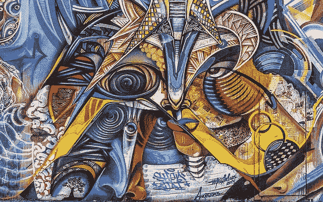
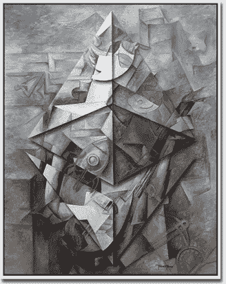
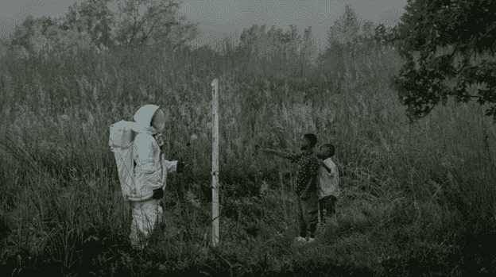
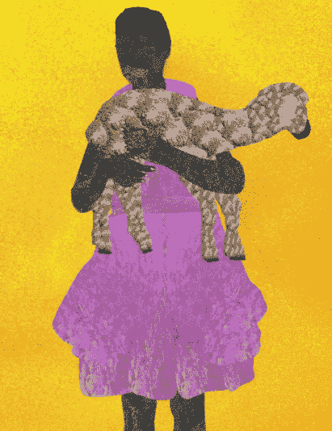
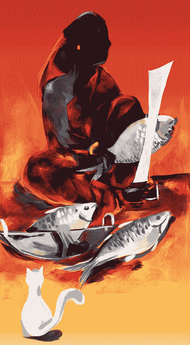

# NFTs 的世界:第五部分——最受欢迎的 NFT 艺术家

> 原文：<https://medium.com/coinmonks/the-world-of-nfts-part-5-favorite-nft-artists-ea1813b2959f?source=collection_archive---------2----------------------->

在[语音](https://www.voice.com/post/@tulip/the-world-of-nfts-part-5-favorite-nft-artists-1607697902-1)看我的原帖。

**当我第一次开始关注加密艺术领域时，我不确定什么是好的加密艺术。市场上有软件可以将图片转换为数字艺术。有那么容易吗？一些人谈到了艺术的哲学深度、艺术家的视野、创造艺术所需的努力、技术的使用、排他性等等。后来，很明显，艺术家的受欢迎程度也很重要。** ***这篇文章是为了让好奇者领略 NFT 艺术！***

我开始跟踪一些重要的艺术家，以了解艺术 NFT 是如何工作的。他们中的一些人可能没有那么出名，但他们的创作给我留下了持久的印象。

## [**崔佛·琼斯**](https://trevorjonesart.com/nfts.html)

崔佛·琼斯是一个迷人的创造者，也是一个优秀的营销者。他的创作多种多样，涵盖了广泛的艺术领域。特雷弗来自加拿大。他在医疗保健领域担任艺术总监，为残疾人提供艺术工作室。Trevor 因包含增强现实等最先进的技术而闻名。他还使用 NFC 标签、视频制作和动画。特雷弗的著名作品包括在他的数字作品中对毕加索风格的诠释。他采用了毕加索一些重要画作的构图和调色板，并用加密货币标志和其他相关的当代符号和肖像重建它们。

特雷弗的作品[在超级稀有的](https://superrare.co/trevorjonesart)中有售

**看看以 70.0ξ(10008 美元)售出的 eth girl**

## [**巨人**](https://superrare.co/giantswan)

Giantswan 的艺术是独一无二的。主要是在 3D 中，他将他的雕刻经验融入到他的数字艺术中。角色们焦虑不安，尖叫着，彩色的 3D 图层带来了更多的深度。通常，在宁静的背景下，单一结构的艺术会很突出。和崔佛·琼斯一样，Giantswan 也致力于虚拟现实。他也是一个雕塑家，经验和艺术总监。他的作品最近在墨尔本、上海和迈阿密展出。

Giantswan 的作品在超级稀有的有售

在世界上所有的声音中，我们想与你分享这场雨。重复循环。

****

## **[**弥迦逊**](https://async.art/featured/micah-johnson)**

**米卡·约翰逊最近一直在粉碎它。米卡·约翰逊的《'sä-v(ə-)rən-tē》是首批可编程艺术品之一。在艺术方面，两个男孩，雅克和雷登主张为他们的事业作出贡献。每年在男孩们各自的生日上，艺术都会换层，揭示男孩的梦想。它还将有一个比特币钱包用于捐款。当男孩们年满 18 岁时，他们将从大师作品中消失，并将获得比特币钱包的使用权。最终，收集者将只拥有左边的宇航员。是不是革命性的！**

****

**这幅画在异步艺术中以惊人的 12 万美元售出。这幅画还获得了 2020 年 NFT 奖。我必须承认，我最近才发现他，是他最新的粉丝之一。**

**阅读我的同事威廉·m·皮斯特的一篇详细文章[作者:艺术家米卡·强森用强大的新可编程艺术 NFT](https://voice.com/post/@wmp/nftwriter-artist-micah-johnson-inspires-with-powerful-new-programmable-art-nft-1603908790-1) 激发灵感**

## ****

****Osinachi 让非洲充满生机。他所有的作品都是独一无二的。他出生在尼日利亚的阿坝。他是第一位在纽约 Ethereal Summit 举办展览的尼日利亚艺术家。他用微软 Word 绘图。Word 设计调色板的局限性在拥挤的空间中创造了更多的深度。拥挤但集中的空间中的多个变量创造了他的叙事插图。****

****他是 2019 年布里奇曼工作室奖的决赛选手。****

******下面是“他们懂什么叫天真？”—”***在这个残酷残酷的世界里，纯真很容易受到伤害。谁能举起它，爱它，喂养它，直到它充分发挥潜力？”*****

****是不是很美！****

********

****[**因陀罗尼密特拉**](https://makersplace.com/mitrai)****

****Indrani Mitra 不像其他人那样受欢迎，但在封闭的网络中，她是公认的。她带来了印度的独特视角，尤其是孟加拉文化。她忠于自己的艺术和哲学。她是一个自学成才的艺术家，使用了大量的颜色。她画的是地点、记忆、互动和书籍。****

****Indra ni Mitra[出现在 Makersplace](https://makersplace.com/mitrai)****

****下面的 NFT 是“我打赌是希尔莎！”****

********

****其他值得一提的包括 Coldie、Hackatao 等。我很想听听你的选择。请把我介绍给如此出色的艺术家。****

******下面阅读我以前的 NFT 文章:******

****[NFTs 的世界:第一部分——现在](/coinmonks/the-world-of-nfts-part-1-the-present-8a2de175c2e9)****

****[NFTs 的世界:第二部分——未来](/coinmonks/the-world-of-nfts-part-2-the-future-eb0f9c965f55)****

****[非物质文化遗产的世界:第三部——每个人都应该拥有](https://tulip311bit.medium.com/the-world-of-nfts-part3-everybody-should-rarible-f33b5c30b65d)****

****非功能性测试的世界:第四部分——金恩项目仍然相关吗？****

******加入******

****[Crypto.com](https://binance.com/en/register?ref=E8PCD3AF)——[币安](https://platinum.crypto.com/r/sut3pd9bzn)****

******跟着我******

******👉** [推特](https://twitter.com/rumadas123)****

******👉** [领英](https://www.linkedin.com/in/ruma-das-a1439320/)****

## ****另外，阅读****

*   ****[密码交易机器人](/coinmonks/crypto-trading-bot-c2ffce8acb2a)****
*   ****[Uniswap API](https://bitquery.io/blog/uniswap-pool-api) —如何获取 Uniswap 数据？****
*   ****[AAX 交易所评论](/coinmonks/aax-exchange-review-2021-67c5ea09330c) |推荐代码、交易费用、利弊****
*   ****[Deribit 审查](/coinmonks/deribit-review-options-fees-apis-and-testnet-2ca16c4bbdb2) |选项、费用、API 和 Testnet****
*   ****[FTX 密码交易所评论](/coinmonks/ftx-crypto-exchange-review-53664ac1198f)****
*   ****[Bybit 交换审查](/coinmonks/bybit-exchange-review-dbd570019b71)****
*   ****最好的比特币[硬件钱包](/coinmonks/the-best-cryptocurrency-hardware-wallets-of-2020-e28b1c124069?source=friends_link&sk=324dd9ff8556ab578d71e7ad7658ad7c)****
*   ****[密码本交易平台](/coinmonks/top-10-crypto-copy-trading-platforms-for-beginners-d0c37c7d698c)****
*   ****[Bitsgap vs 3 commas vs quad ency](https://blog.coincodecap.com/bitsgap-3commas-quadency)****
*   ****最好的[加密税务软件](/coinmonks/best-crypto-tax-tool-for-my-money-72d4b430816b)****
*   ****[最佳加密交易平台](/coinmonks/the-best-crypto-trading-platforms-in-2020-the-definitive-guide-updated-c72f8b874555)****
*   ****最佳[加密贷款平台](/coinmonks/top-5-crypto-lending-platforms-in-2020-that-you-need-to-know-a1b675cec3fa)****
*   ****[莱杰纳米 S vs 特雷佐 1 vs 特雷佐 T vs 莱杰纳米 X](https://blog.coincodecap.com/ledger-nano-s-vs-trezor-one-ledger-nano-x-trezor-t)****
*   ****[block fi vs Celsius](/coinmonks/blockfi-vs-celsius-vs-hodlnaut-8a1cc8c26630)vs Hodlnaut****
*   ****Bitsgap 评论——一个轻松赚钱的加密交易机器人****
*   ****为专业人士设计的加密交易机器人****
*   ****[PrimeXBT 审查](/coinmonks/primexbt-review-88e0815be858) |杠杆交易、费用和交易****
*   ****[其他准备审核](https://blog.coincodecap.com/altrady-reivew)****
*   ****[埃利帕尔泰坦评论](/coinmonks/ellipal-titan-review-85e9071dd029)****
*   ****[赛克斯·斯通评论](https://blog.coincodecap.com/secux-stone-hardware-wallet-review)****
*   ****[BlockFi 评论](/coinmonks/blockfi-review-53096053c097) |赚取高达 8.6%的加密利息****
*   ****开发人员的最佳加密 API****
*   ****[最佳区块链分析工具](https://bitquery.io/blog/best-blockchain-analysis-tools-and-software)****
*   ****[加密套利](/coinmonks/crypto-arbitrage-guide-how-to-make-money-as-a-beginner-62bfe5c868f6)指南:新手如何赚钱****
*   ****顶级[比特币节点](https://blog.coincodecap.com/bitcoin-node-solutions)提供商****
*   ****最佳[加密制图工具](/coinmonks/what-are-the-best-charting-platforms-for-cryptocurrency-trading-85aade584d80)****
*   ****了解比特币最好的[书籍有哪些？](/coinmonks/what-are-the-best-books-to-learn-bitcoin-409aeb9aff4b)****

> ****[直接在您的收件箱中获得最佳软件交易](/coinmonks/newsletters/coinmonks)****

********