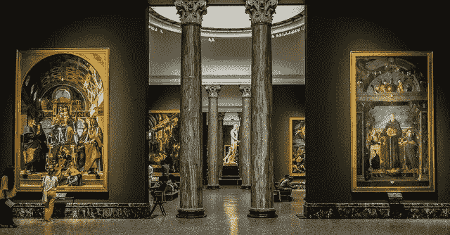
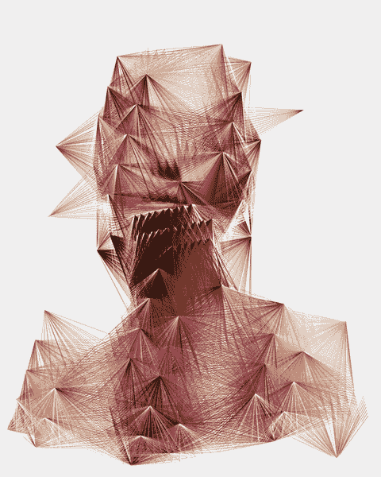

# 非艺术画廊的世界:第六部分——秘密艺术画廊——案例研究

> 原文：<https://medium.com/coinmonks/the-world-of-nfts-part-6-crypto-art-galleries-a-case-study-c6f67fb975e6?source=collection_archive---------3----------------------->

在[语音](https://www.voice.com/post/@tulip/the-world-of-nfts-part-6-crypto-art-galleries-a-case-study-1607937058-1)看我的原帖。

**我最近写了很多关于各种加密艺术平台的文章。虽然这些平台吸引了大众，但它们也有自己的问题。他们没有给严肃的收藏家提供适当的关注。权力下放带来了自身的弊端。正如现在任何人都可以创造艺术一样，真正的天才有时会迷失在人群中。进入一批新的平台，使更好的策展只对严肃的收藏家有吸引力。进入秘密美术馆。**

## **加密画廊的独特性**

秘密美术馆已经存在了一段时间，慢慢地融入分散的区块链世界。我们看到他们是超级稀有或已知产地的收藏家。他们每天评估数百件艺术品，只挑选极少数对真正的收藏家有吸引力的稀有艺术品。这种画廊介于传统艺术和加密艺术之间。它们将实物艺术和数字艺术联系在一起。它们在教育新人信任和安全的重要性以及艺术品的独特性和真实性方面发挥着重要作用。

加密画廊带来了他们自己的知名策展人和领先的艺术评论家团队，以识别和选择数字艺术领域的大师。他们试图突破传统，打破界限。

## **展览**

让我们以 Osinachi 为例。Kate Vass Galerie 于 2020 年 3 月 10 日至 7 月 10 日举办了这位非洲艺术家的个展。凯特·瓦斯·盖里在《超级稀有》中密切关注着这位艺术家，并实际上购买了他的一些艺术作品。现在他们已经开始与他合作，为物理世界建立一个画廊。这幅画以“在纸上打印，无边框尺寸:30x40 厘米”或“在光滑的丙烯酸玻璃下的超高清照片:50x65cm 厘米独特”的形式出售。价格从 950 瑞士法郎到 5000 瑞士法郎不等。

加密艺术画廊(G○C△) 是一个虚拟的顶级艺术画廊。G○C△展览完全在虚拟现实中展示。索姆空间的秘密艺术博物馆(1047 号地块)成功结束了埃斯彭·克鲁格的艺术作品展。虚拟现实让画廊策划所有的方面:建筑，作品的构成，颜色以及音频效果。从二维世界到三维元宇宙的突破是顺理成章的下一步。最近的展览名为“私人观点”,从 9 月 10 日持续到 2021 年 2 月 1 日

超级罕见也有一个虚拟现实画廊在隐体素。

## **基于镜头的艺术**

Kate Vass Galerie 也专注于摄影。为了将摄影师带到区块链，画廊现在与 NFT 的一个平台 Ephimera 合作，该平台纯粹专注于基于镜头的艺术。基于区块链以太坊，Ephimera 为摄影师提供空间，用于标记、展示和向收藏家出售他们的作品。Kate Vass Galerie 将这些收藏家带到了他们身边。

## **出版物**:

画廊也参与艺术出版物。主要评论家在这样的论坛上讨论各种艺术风格，也展示顶级艺术家。凯特·瓦斯·盖瑞的季刊名为《收藏艺术》。它有一个数字版本以及一个新的 A4 格式。

新平台 Ephimera 也推出了出版物。此处给出了[的链接。](https://magazine.ephimera.com/)

## **结论:**

基于区块链的艺术可以在一个筒仓中获得。对于平台来说，在这个生态系统中引入外部世界的人非常重要。主要的艺术影响者，收藏家们仍未被发掘。画廊为竞拍者/收藏家带来了美学价值和安全感。艺术形式在任何媒体中的可用性(NFT，印刷，实体原件等)。)使过渡平滑。随着每一天的到来，我们将看到更多的这种整合，这样的画廊将塑造我们看待艺术的方式。还需要提到的是，Sominum 空间、分散土地、沙盒或隐体素中的包裹将在整合中发挥巨大作用。这些都是一个正在慢慢成形的大拼图的一部分。我们很幸运能成为其中的一部分。

**阅读下面我以前的 NFT 文章:**

[NFTs 的世界:第一部分——现在](/coinmonks/the-world-of-nfts-part-1-the-present-8a2de175c2e9)

[NFTs 的世界:第二部分——未来](/coinmonks/the-world-of-nfts-part-2-the-future-eb0f9c965f55)

[NFTs 的世界:第三部分——每个人都应该拥有](https://tulip311bit.medium.com/the-world-of-nfts-part3-everybody-should-rarible-f33b5c30b65d)

[非功能性测试的世界:第四部分——金恩项目仍然相关吗？](https://tulip311bit.medium.com/the-world-of-nfts-part4-is-the-enjin-project-still-relevant-aacb55a8f9a8)

非传统艺术的世界:第五部分——最受欢迎的 NFT 艺术家

**加入**

[Crypto.com](https://binance.com/en/register?ref=E8PCD3AF)——[币安](https://platinum.crypto.com/r/sut3pd9bzn)

**跟我来**

**👉** [推特](https://twitter.com/rumadas123)

**👉**[**Linkedin**](https://www.linkedin.com/in/ruma-das-a1439320/)

## **另外，阅读**

*   **[密码交易机器人](/coinmonks/crypto-trading-bot-c2ffce8acb2a)**
*   **[Uniswap API](https://bitquery.io/blog/uniswap-pool-api) —如何获取 Uniswap 数据？**
*   **[AAX 交易所评论](/coinmonks/aax-exchange-review-2021-67c5ea09330c) |推荐代码、交易费用、利弊**
*   **[Deribit 审查](/coinmonks/deribit-review-options-fees-apis-and-testnet-2ca16c4bbdb2) |选项、费用、API 和 Testnet**
*   **[FTX 密码交易所评论](/coinmonks/ftx-crypto-exchange-review-53664ac1198f)**
*   **[Bybit 交换评论](/coinmonks/bybit-exchange-review-dbd570019b71)**
*   **最好的比特币[硬件钱包](/coinmonks/the-best-cryptocurrency-hardware-wallets-of-2020-e28b1c124069?source=friends_link&sk=324dd9ff8556ab578d71e7ad7658ad7c)**
*   **[密码本交易平台](/coinmonks/top-10-crypto-copy-trading-platforms-for-beginners-d0c37c7d698c)**
*   **[bits gap vs 3 commas vs quad ency](https://blog.coincodecap.com/bitsgap-3commas-quadency)**
*   **最好的[加密税务软件](/coinmonks/best-crypto-tax-tool-for-my-money-72d4b430816b)**
*   **[最佳加密交易平台](/coinmonks/the-best-crypto-trading-platforms-in-2020-the-definitive-guide-updated-c72f8b874555)**
*   **最佳[密码借贷平台](/coinmonks/top-5-crypto-lending-platforms-in-2020-that-you-need-to-know-a1b675cec3fa)**
*   **[莱杰 Nano S vs Trezor one vs Trezor T vs 莱杰 Nano X](https://blog.coincodecap.com/ledger-nano-s-vs-trezor-one-ledger-nano-x-trezor-t)**
*   **[block fi vs Celsius](/coinmonks/blockfi-vs-celsius-vs-hodlnaut-8a1cc8c26630)vs Hodlnaut**
*   **[Bitsgap 评论](/coinmonks/bitsgap-review-a-crypto-trading-bot-that-makes-easy-money-a5d88a336df2)——一个轻松赚钱的加密交易机器人**
*   **为专业人士设计的加密交易机器人**
*   **[PrimeXBT 审查](/coinmonks/primexbt-review-88e0815be858) |杠杆交易、费用和交易**
*   **[Altrady 评论](https://blog.coincodecap.com/altrady-reivew)**
*   **[埃利帕尔泰坦评论](/coinmonks/ellipal-titan-review-85e9071dd029)**
*   **[SecuX Stone 评论](https://blog.coincodecap.com/secux-stone-hardware-wallet-review)**
*   **[BlockFi 评论](/coinmonks/blockfi-review-53096053c097) |从您的密码中赚取高达 8.6%的利息**
*   **[面向开发人员的最佳加密 API](/coinmonks/best-crypto-apis-for-developers-5efe3a597a9f)**
*   **[最佳区块链分析工具](https://bitquery.io/blog/best-blockchain-analysis-tools-and-software)**
*   **[加密套利](/coinmonks/crypto-arbitrage-guide-how-to-make-money-as-a-beginner-62bfe5c868f6)指南:新手如何赚钱**
*   **顶级[比特币节点](https://blog.coincodecap.com/bitcoin-node-solutions)提供商**
*   **最佳加密制图工具**
*   **了解比特币的[最佳书籍有哪些？](/coinmonks/what-are-the-best-books-to-learn-bitcoin-409aeb9aff4b)**

> **[直接在您的收件箱中获得最佳软件交易](/coinmonks/newsletters/coinmonks)**

****