# NFTs 的世界:第 9 部分——Terra Virtua 用户指南

> 原文：<https://medium.com/coinmonks/the-world-of-nfts-part-9-terra-virtua-user-guide-89a87606a83?source=collection_archive---------2----------------------->

在[语音](https://www.voice.com/post/@tulip/the-world-of-nfts-part-9-terra-virtua-user-guide-1610785453-919063277)阅读我的原创文章。

在我之前的文章中，我谈到了 NFT 项目 Terra Virtua。该项目通过使用基于虚拟现实的动画收藏品和来自著名工作室(即派拉蒙、传奇等)的授权产品，将 NFT 空间引领至下一代。在本文中，我们将先睹为快，看看它的各种特性，并讨论如何使用它们。

进入 [Terra Virtua 网站](https://terravirtua.io/)。点击登录/注册。

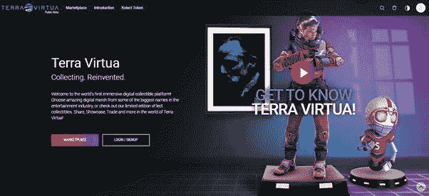

您可以通过输入您的详细信息来创建一个新帐户。你也可以使用脸书或 Instagram 账户登录。

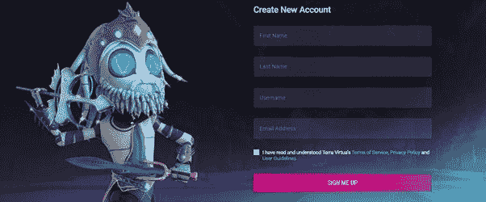

拥有登录凭据后，登录您的帐户。请注意，帐户本身，现在，是集中的，但是，当你购买收藏品，你将能够链接你的钱包。

一旦您登录，您将被直接带到市场。但是，最好先浏览一下各种可用的选项，然后我们再回到市场。

在你的右上方，你会看到一个 v 形图标，它有一个下拉菜单。下拉列表包含多个部分:

1.轮廓

2.库存

3.活动

4.拍卖

5.物理 Merch

6.意愿清单

7.处理

8.Terra 钱包

9.设置

**1。轮廓**

个人资料页面将允许您保护用户名。它还将与您的电子邮件 ID 和以太坊钱包集成。目前，电子邮件 ID 对于登录非常重要。以太坊地址用于购买收藏品。不强制输入您的其他个人信息，如姓名、出生日期、联系电话和国家。

**2。库存**

清单是你所有收藏品的清单。您可以通过从市场购买或从赠品代码中兑换来获得这些收藏品。请注意，您仍然不能赠送或提取代币。还可以通过收藏品或艺术品、收藏品类型、价格范围等来过滤库存。您也可以直接从库存创建拍卖。

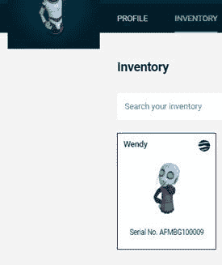

**3。活动**

活动列表列出了您的活动，包括出价、收藏品的出价、待付款等。

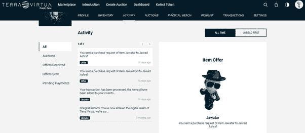

**4。拍卖:**

你可以在 Terra Virtua 生态系统中拍卖你的收藏品。请注意，这还没有集成到其他平台，如 Opensea 等。点击创建拍卖。

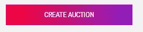

从库存中选择项目。输入立即购买价格，底价拍卖从价格开始。请注意，在拍卖过程中，如果有人在最后 3 分钟出价，拍卖将延长 3 分钟。拍卖以法定货币进行(目前如此)。Terra 钱包也是同样的用途。

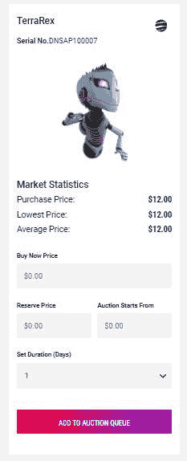

**5。实体默克**

想象一下，你购买了一些实物，并得到了一个代码，以赎回 NFT。NFT 也会验证你的身体状况。Merch sections 持有此类 NFT 并帮助赎回此类代码。

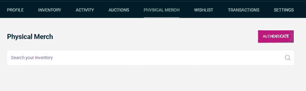

**6 .愿望清单和交易**

Wishlist 和 Transactions 实际上并不需要单独的标签，但可以作为子部分。你所有的交易记录都可以在区块链通过交易部分进入。

**7 .Terra Wallet**

Terra Wallet 对核心区块链用户不是必需的，因为他们可以使用他们的区块链 Wallet 进行购买。然而，重要的是充当与现实世界的桥梁。你可以载入你的钱包使用信用卡。请注意，要投标的项目，你需要至少 1 美元在你的钱包。信用卡交易手续费为 2.9% + 30 美分。缺点是存款金额不能退还。

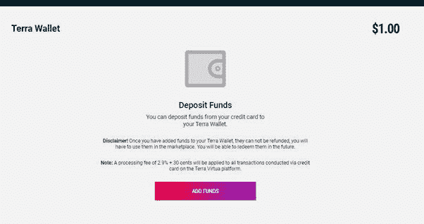

**8。设置**

通过设置，您可以控制是否要向其他人显示您的清单、在亮模式和暗模式之间切换以及启用双因素身份验证

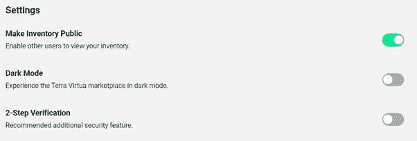

**9 .市场:**

市场是最有趣的。你会有一个列表的所有收藏品目前出售默认情况下。

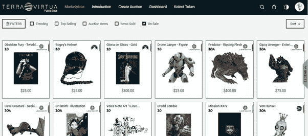

你可以根据你的预算按低价到高价对它们进行排序

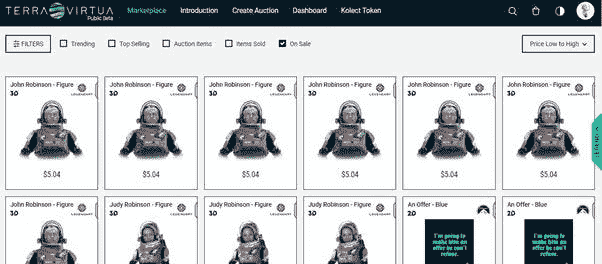

现在，如果你正在寻找一个特殊的收藏品，例如，派拉蒙，传奇或 v-屈，你可以这样做，选择的过滤器。

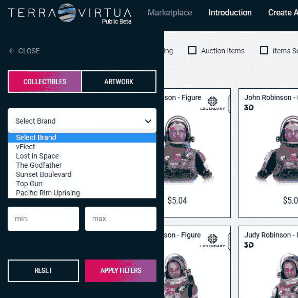

你也可以选择稀有。稀有程度越高，需求就越高，价格也就越高。

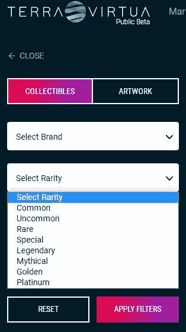

根据稀缺性，v 曲线分类如下

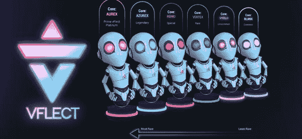

你可以选择任何收藏品，观看他们的 3D，也可以购买他们。

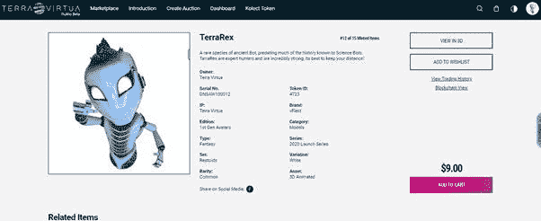

希望大家喜欢这个平台。

阅读我之前的 NFT 文章如下:

[NFTs 的世界:第 1 部分——现在](/coinmonks/the-world-of-nfts-part-1-the-present-8a2de175c2e9)

[NFTs 世界:第 2 部分——未来](/coinmonks/the-world-of-nfts-part-2-the-future-eb0f9c965f55)

[NFTs 的世界:第 3 部分——每个人都应该成为稀世珍宝](/coinmonks/the-world-of-nfts-part3-everybody-should-rarible-f33b5c30b65d)

[NFTs 的世界:第 4 部分—金恩项目是否仍然适用？](/coinmonks/the-world-of-nfts-part4-is-the-enjin-project-still-relevant-aacb55a8f9a8)

[NFTs 世界:第 5 部分——最受欢迎的 NFT 艺术家](/coinmonks/the-world-of-nfts-part-5-favorite-nft-artists-ea1813b2959f)

[NFTs 世界:第 6 部分——加密艺术画廊——案例研究](/coinmonks/the-world-of-nfts-part-6-crypto-art-galleries-a-case-study-c6f67fb975e6)

[NFTs 世界:第 7 部分—Opensea-要点](/coinmonks/the-world-of-nfts-part-7-opensea-key-points-b41e11857c05)

[NFTs 的世界:第八部分——Terra Virtua 概述](https://tulip311bit.medium.com/the-world-of-nfts-part-8-terra-virtua-overview-5063a8c0ddb3)

**通过我的推荐加入**

Crypto.com—

**跟着我**

**👉** [推特](https://twitter.com/rumadas123)

**👉**[**Linkedin**](https://www.linkedin.com/in/ruma-das-a1439320/)

*   **包括附属链接**

> **加入 T21 电报集团，学习加密交易和投资**

## **另外，阅读**

*   **[学习以太坊和 Web3 开发](http://blog.coincodecap.com/go/learn)**
*   **最好的[密码交易机器人](/coinmonks/crypto-trading-bot-c2ffce8acb2a)**
*   **[3 商业评论](/coinmonks/3commas-review-an-excellent-crypto-trading-bot-2020-1313a58bec92) | [Pionex 评论](/coinmonks/pionex-review-exchange-with-crypto-trading-bot-1e459d0191ea) | [Coinrule 评论](https://blog.coincodecap.com/coinrule-review-a-perfect-trading-bot)**
*   **[AAX 交易所评论](/coinmonks/aax-exchange-review-2021-67c5ea09330c) | [德里比特评论](/coinmonks/deribit-review-options-fees-apis-and-testnet-2ca16c4bbdb2) | [FTX 密码交易所评论](/coinmonks/ftx-crypto-exchange-review-53664ac1198f)**
*   **[n 零审核](/coinmonks/ngrave-zero-review-c465cf8307fc)**
*   **[Bybit Exchange 审查](/coinmonks/bybit-exchange-review-dbd570019b71) | [Bityard 审查](https://blog.coincodecap.com/bityard-reivew)**
*   **[3Commas vs Cryptohopper](/coinmonks/3commas-vs-pionex-vs-cryptohopper-best-crypto-bot-6a98d2baa203)**
*   **最好的比特币[硬件钱包](/coinmonks/the-best-cryptocurrency-hardware-wallets-of-2020-e28b1c124069?source=friends_link&sk=324dd9ff8556ab578d71e7ad7658ad7c)**
*   **[密码本交易平台](/coinmonks/top-10-crypto-copy-trading-platforms-for-beginners-d0c37c7d698c)**
*   **[莱杰 nano s vs x](https://blog.coincodecap.com/ledger-nano-s-vs-x)**
*   **[沃德评论](https://blog.coincodecap.com/vauld-review) | [尤霍德勒评论](/coinmonks/youhodler-4-easy-ways-to-make-money-98969b9689f2)**
*   **最好的[加密税务软件](/coinmonks/best-crypto-tax-tool-for-my-money-72d4b430816b) | [硬币追踪评论](/coinmonks/cointracking-review-a-reliable-cryptocurrency-tax-software-5114e3eb5737)**
*   **最佳[加密借贷平台](/coinmonks/top-5-crypto-lending-platforms-in-2020-that-you-need-to-know-a1b675cec3fa)**
*   **[莱杰纳米 S vs 特雷佐 one vs 特雷佐 T vs 莱杰纳米 X](https://blog.coincodecap.com/ledger-nano-s-vs-trezor-one-ledger-nano-x-trezor-t)**
*   **[block fi vs Celsius](/coinmonks/blockfi-vs-celsius-vs-hodlnaut-8a1cc8c26630)vs Hodlnaut**
*   **[Bitsgap 审查](/coinmonks/bitsgap-review-a-crypto-trading-bot-that-makes-easy-money-a5d88a336df2) | [Quadency 审查](/coinmonks/quadency-review-a-crypto-trading-automation-platform-3068eaa374e1)**
*   **[埃利帕尔泰坦评论](/coinmonks/ellipal-titan-review-85e9071dd029) | [赛克斯斯通评论](https://blog.coincodecap.com/secux-stone-hardware-wallet-review)**
*   **[BlockFi 评论](/coinmonks/blockfi-review-53096053c097) |在您的密码中赚取高达 8.6%的利息**
*   **[DEX Explorer](https://explorer.bitquery.io/ethereum/dex) 和[区块链 API](https://explorer.bitquery.io/graphql)**
*   **[加密套利](/coinmonks/crypto-arbitrage-guide-how-to-make-money-as-a-beginner-62bfe5c868f6)指南:新手如何赚钱**
*   **最佳[加密制图工具](/coinmonks/what-are-the-best-charting-platforms-for-cryptocurrency-trading-85aade584d80)**
*   **了解比特币最好的[书籍有哪些？](/coinmonks/what-are-the-best-books-to-learn-bitcoin-409aeb9aff4b)**

> **[直接在您的收件箱中获得最佳软件交易](/coinmonks/newsletters/coinmonks)**

****