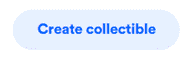
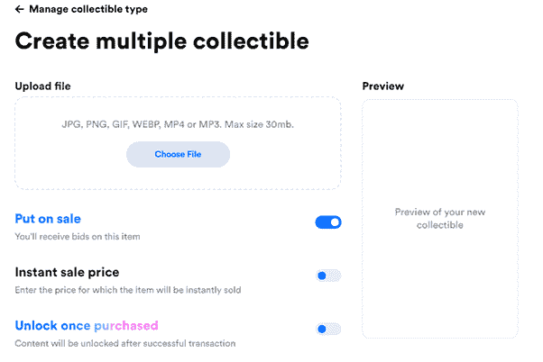
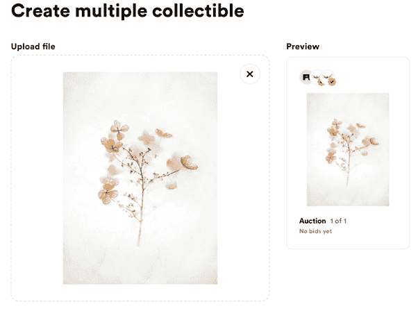
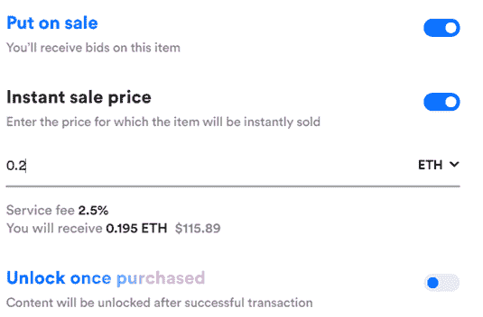
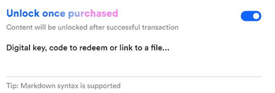
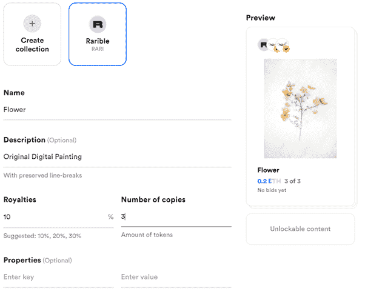
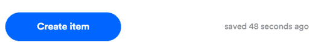
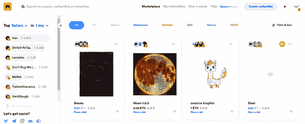
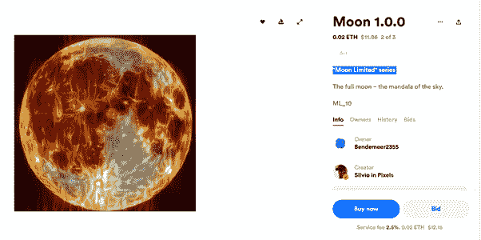
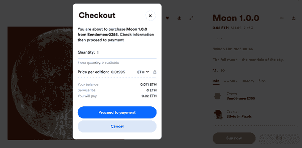

# NFTs 的世界:第三部分——每个人都应该变得可爱

> 原文：<https://medium.com/coinmonks/the-world-of-nfts-part3-everybody-should-rarible-f33b5c30b65d?source=collection_archive---------0----------------------->

在[语音](https://www.voice.com/post/@tulip/the-world-of-nfts-part3-everybody-should-rarible-1607286290-1)看我的原帖。

**欢迎阅读我关于 NFT 系列文章的第 3 部分。前两部分的重点是取缔整个 NFT 生态系统。NFT 世界日益强大。我们现在将关注对生态系统重要的单个项目。**

今天我们来看看[的稀有品种](https://rarible.com/)。随着 RARI 代币的推出，Rarible 在 NFT 引起了轩然大波。这是第一个社区拥有的 NFT 市场。这是对一些知名门户网站的直接竞争，比如 Superrare 和 Known Origin。

Rarible 在两个主要领域脱颖而出。任何人都可以创造一个 NFT(这类似于金恩)。所以，你可以用一点汽油费来铸造你的代币，从中获得乐趣。Rarible 中的活跃用户还可以获得 RARI 治理令牌。

**竞争优势:**

任何人都可以创造和销售 NFT

面向买卖双方的 RARI 令牌空投

与 Opensea 集成

更好地控制天然气费用

解锁选项支持将非功能性食物作为礼物

**缺点:**

内容未经策划，因此它不是一个专属的数字艺术平台。购买者需要滚动浏览一长串清单，以获得高质量的材料。

**连接:**

使用最右边的“连接”按钮连接到 Web 3 钱包。我更喜欢 Metamask，因为它与许多其他平台兼容。

**创建收藏品:**

一旦连接，你会得到一个标签称为创建收藏品。

您可以选择创建单个 NFT 或多个版本。单身是最罕见的。

然后，您需要上传您的文件，该文件将被放入区块链并创建为 NFT。注意，Rarible 也接受音频格式(MP3)作为 NFTs。

您可以看到该项目的预览。如果你放一个视频，你将不得不上传一个额外的预览 JPG。

此外，您可以在铸造过程完成后立即自动将其出售。

解锁是 Rarible 最重要的功能之一。你可以送你的 NFT 作为礼物，并发送一些说明(也许是优惠券代码)，只有 NFT 的第二个所有者(创造者之后的一个)。这增加了 NFTs 的潜力，它现在可以作为礼品以及稀有性和所有权的证明。

输入你希望收取的费用金额。注意，Rarible 抽取销售额的 2.5%作为服务费。您还可以选择每笔后续购买的佣金金额。

作为最佳实践，对于新手，建议保持较低的价格和较高的稀有度。抓住买家的注意力很重要。做第一笔生意很难。巧妙做好你的营销。

如前所述，你可以放一个秘密信息，买家可以在购买时解锁。

请注意，根据下面的截图，如果您使用 Rarible (RARI)作为服务来创建您的 NFT，您将需要支付比您自己创建收藏低得多的费用。

此外，选择您想要销售的份数。

点击“创建项目”。这将是一个 3 步的过程，你将不得不使用你的 Metamask 签名，并支付煤气费。

你会发现你的项目，列在你的个人资料在收藏品和出售标签。

NFT 也将在市场中上市。

**市场**

市场被分为不同的部分。

你可以通过点击来查看一个项目。可以展开图片，也可以播放视频。

仔细检查描述，谨防假冒的复制粘贴。检查历史和出价。它会让你了解价格变动的情况。

你可以以更低的价格出价。您也可以点击“立即购买”,以给定的价格直接购买。在 metamask 中签署交易并支付金额后，NFT 将成为您的。

即使你不是艺术家，你也应该尝试一下 Rarible。它让任何人都能感受到 NFT 的风情(需要一些油费)。

快乐稀有！

**看我以前的 NFT 文章**

[非物质文化遗产的世界:第一部分——现在](/coinmonks/the-world-of-nfts-part-1-the-present-8a2de175c2e9)

[NFTs 的世界:第二部分——未来](/coinmonks/the-world-of-nfts-part-2-the-future-eb0f9c965f55)

**跟着我**

**👉** [推特](https://twitter.com/rumadas123)

**👉**[**Linkedin**](https://www.linkedin.com/in/ruma-das-a1439320/)

## **另外，阅读**

*   **密码交易机器人**
*   **[Uniswap API](https://bitquery.io/blog/uniswap-pool-api) —如何获取 Uniswap 数据？**
*   **[AAX 交易所评论](/coinmonks/aax-exchange-review-2021-67c5ea09330c) |推荐代码、交易费用、利弊**
*   **[Deribit 审查](/coinmonks/deribit-review-options-fees-apis-and-testnet-2ca16c4bbdb2) |选项、费用、API 和 Testnet**
*   **[FTX 密码交易所评论](/coinmonks/ftx-crypto-exchange-review-53664ac1198f)**
*   **[逐位交换审查](/coinmonks/bybit-exchange-review-dbd570019b71)**
*   **最好的比特币[硬件钱包](/coinmonks/the-best-cryptocurrency-hardware-wallets-of-2020-e28b1c124069?source=friends_link&sk=324dd9ff8556ab578d71e7ad7658ad7c)**
*   **[密码本交易平台](/coinmonks/top-10-crypto-copy-trading-platforms-for-beginners-d0c37c7d698c)**
*   **[Bitsgap vs 3 commas vs quad ency](https://blog.coincodecap.com/bitsgap-3commas-quadency)**
*   **最好的[加密税务软件](/coinmonks/best-crypto-tax-tool-for-my-money-72d4b430816b)**
*   **[最佳加密交易平台](/coinmonks/the-best-crypto-trading-platforms-in-2020-the-definitive-guide-updated-c72f8b874555)**
*   **最佳[加密贷款平台](/coinmonks/top-5-crypto-lending-platforms-in-2020-that-you-need-to-know-a1b675cec3fa)**
*   **[莱杰纳米 S vs 特雷佐 one vs 特雷佐 T vs 莱杰纳米 X](https://blog.coincodecap.com/ledger-nano-s-vs-trezor-one-ledger-nano-x-trezor-t)**
*   **[block fi vs Celsius](/coinmonks/blockfi-vs-celsius-vs-hodlnaut-8a1cc8c26630)vs Hodlnaut**
*   **[bits gap review](/coinmonks/bitsgap-review-a-crypto-trading-bot-that-makes-easy-money-a5d88a336df2)——一个轻松赚钱的加密交易机器人**
*   **为专业人士设计的加密交易机器人**
*   **[PrimeXBT 审查](/coinmonks/primexbt-review-88e0815be858) |杠杆交易、费用和交易**
*   **[alt ready 审查](https://blog.coincodecap.com/altrady-reivew)**
*   **[埃利帕尔泰坦评论](/coinmonks/ellipal-titan-review-85e9071dd029)**
*   **[赛克斯石评论](https://blog.coincodecap.com/secux-stone-hardware-wallet-review)**
*   **[BlockFi 评论](/coinmonks/blockfi-review-53096053c097) |赚取高达 8.6%的加密利息**
*   **[面向开发人员的最佳加密 API](/coinmonks/best-crypto-apis-for-developers-5efe3a597a9f)**
*   **[最佳区块链分析工具](https://bitquery.io/blog/best-blockchain-analysis-tools-and-software)**
*   **[加密套利](/coinmonks/crypto-arbitrage-guide-how-to-make-money-as-a-beginner-62bfe5c868f6)指南:新手如何赚钱**
*   **顶级[比特币节点](https://blog.coincodecap.com/bitcoin-node-solutions)提供商**
*   **最佳[加密制图工具](/coinmonks/what-are-the-best-charting-platforms-for-cryptocurrency-trading-85aade584d80)**
*   **了解比特币的[最佳书籍有哪些？](/coinmonks/what-are-the-best-books-to-learn-bitcoin-409aeb9aff4b)**

> **[直接在您的收件箱中获得最佳软件交易](/coinmonks/newsletters/coinmonks)**

****