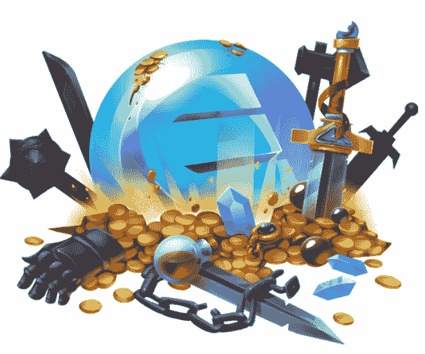

# 非功能性测试的世界:第四部分——金恩项目仍然相关吗？

> 原文：<https://medium.com/coinmonks/the-world-of-nfts-part4-is-the-enjin-project-still-relevant-aacb55a8f9a8?source=collection_archive---------3----------------------->

在[语音](https://www.voice.com/post/@tulip/the-world-of-nfts-part4-is-enjin-project-still-relevant-1607549940-1)看原帖。

**金恩进入区块链游戏生态系统已经有一段时间了。它是为数不多的经受住时间考验的早期游戏协议平台之一(分散式平台是我想到的另一个平台)。**

## **以前的金恩**

在启动期间，金恩被认为是一个尖端项目。它为游戏引入了 ERC-1155 令牌标准。这个标准后来被以太坊认定为官方标准。随着一些主要游戏进入生态系统，金恩的受欢迎程度大幅上升(九命竞技场、铁锈时代等)。

金恩钱包被认为是区块链最高级的钱包之一。它引入了 NFT 资产页面，并提供了将应用程序与 NFTs 链接的功能

金恩推出了一个平台，提供了铸造自己的代币的能力

金恩也是首批引入 NFT 市场的国家之一(远在 Opensea 推出之前)

引进了恩金克拉夫特，这是金恩版的《我的世界》。

## 接下来发生了什么？

计划是创造一个完整的游戏生态系统，在金恩多元宇宙中相互连接。NFTs 可以在多个游戏中使用，并在结束时获得大奖。有很多关于各种项目的创始人令牌的效用和 NFT 的价值升值的宣传。

然而，在过去的一年半时间里，金恩人的兴趣有所下降。金恩团队偶尔会进行空投，开设一家商品商店，甚至启动一个特使项目来保持精神状态。然而，社区中的焦虑与日俱增。没有明显的发展进步。解散之类的大合作伙伴都不在了。

## **金恩为什么放慢了速度？**

如果你进一步探究，这是不可避免的，但这不应被视为一种低迷。金恩没有放慢脚步，而是回到了发展模式。

1.**好的游戏需要时间来推出**——大多数重要的金恩项目，如《铁锈时代》、《六条龙》、《九命竞技场》等，都有很长的开发周期，即使宣布了合作伙伴关系并创建了一些演示，用户也尚未看到 ERC-1155 的全部力量。像比特币霍德勒和蚱蜢农场这样的小游戏并没有真正展示金恩的能力

2.**高额汽油费用** —一个游戏需要多次交易，以太坊的高额汽油费用使得游戏开发者无法使用金恩的许多功能。人们担心用户在享受游戏的同时不会愿意支付这么多的油费。

3.假定缺乏方向——金恩曾大声疾呼他们不会搬出以太坊。但是，他们没有采用速度更快的第 2 层解决方案，而是决定构建自己的 L2。Efinity。这很费时间，社区变得焦虑不安。铺开店铺看起来没有方向，分散了注意力。然而，我们必须明白，在这个行业中，像创建一个 L2 并使平台更加用户友好这样的发展需要时间。

值得注意的是，在所有这些因素的影响下，金恩硬币的价格在 2020 年上涨了近 3-4 倍。

## **未来会怎样？**

金恩太早了。然而，这么早也意味着他们有时间建立一个强大的基础。金恩所从事的许多重要工作正在逐步到位。

**Efinity:** Efinity 是金恩即将推出的扩展解决方案。用户无需为 ERC-20 和 ERC-1155 交易支付任何交易费用。它将拥有数百毫秒或更短时间的安全交易速度。

钱包升级:金恩正在彻底改造钱包，使其更加人性化。mint asset 功能现在将出现在移动应用程序中。

**微软合作关系:**在与微软成功完成概念验证后，现在，一名微软高级营销主管加入金恩，担任企业主管

**NFT 奖:**为了赢得执政席位，金恩发起了一年一度的 NFT 奖。一审的[结果被披露](https://nftawards.org/winners)。

**新市场:**全新的高级金恩市场也已推出。

金恩做得很好，只是在发展隐形模式。在接下来的几个月里，会有一些大事发生。盯紧了！

**下面阅读我以前的 NFT 文章:**

[NFTs 的世界:第一部分——现在](/coinmonks/the-world-of-nfts-part-1-the-present-8a2de175c2e9)

[非功能性测试的世界:第二部分——未来](/coinmonks/the-world-of-nfts-part-2-the-future-eb0f9c965f55)

[非功能性思维的世界:第三部分——每个人都应该有](https://tulip311bit.medium.com/the-world-of-nfts-part3-everybody-should-rarible-f33b5c30b65d)

跟我来

**👉** [推特](https://twitter.com/rumadas123)

**👉** [领英](https://www.linkedin.com/in/ruma-das-a1439320/)

## 另外，阅读

*   [密码交易机器人](/coinmonks/crypto-trading-bot-c2ffce8acb2a)
*   [Uniswap API](https://bitquery.io/blog/uniswap-pool-api) —如何获取 Uniswap 数据？
*   [AAX 交易所审核](/coinmonks/aax-exchange-review-2021-67c5ea09330c) |推荐代码、交易费用、利弊
*   [德里比特评论](/coinmonks/deribit-review-options-fees-apis-and-testnet-2ca16c4bbdb2) |选项、费用、API 和 Testnet
*   [FTX 密码交易所评论](/coinmonks/ftx-crypto-exchange-review-53664ac1198f)
*   [Bybit 交换审查](/coinmonks/bybit-exchange-review-dbd570019b71)
*   最好的比特币[硬件钱包](/coinmonks/the-best-cryptocurrency-hardware-wallets-of-2020-e28b1c124069?source=friends_link&sk=324dd9ff8556ab578d71e7ad7658ad7c)
*   [密码本交易平台](/coinmonks/top-10-crypto-copy-trading-platforms-for-beginners-d0c37c7d698c)
*   [bits gap vs 3 commas vs quad ency](https://blog.coincodecap.com/bitsgap-3commas-quadency)
*   最好的[加密税务软件](/coinmonks/best-crypto-tax-tool-for-my-money-72d4b430816b)
*   [最佳加密交易平台](/coinmonks/the-best-crypto-trading-platforms-in-2020-the-definitive-guide-updated-c72f8b874555)
*   最佳加密贷款平台
*   [莱杰纳米 S vs 特雷佐 one vs 特雷佐 T vs 莱杰纳米 X](https://blog.coincodecap.com/ledger-nano-s-vs-trezor-one-ledger-nano-x-trezor-t)
*   [block fi vs Celsius](/coinmonks/blockfi-vs-celsius-vs-hodlnaut-8a1cc8c26630)vs Hodlnaut
*   Bitsgap 评论——一个轻松赚钱的加密交易机器人
*   为专业人士设计的加密交易机器人
*   [PrimeXBT 审查](/coinmonks/primexbt-review-88e0815be858) |杠杆交易、费用和交易
*   [alt ready 审查](https://blog.coincodecap.com/altrady-reivew)
*   [埃利帕尔泰坦评论](/coinmonks/ellipal-titan-review-85e9071dd029)
*   [赛克斯·斯通评论](https://blog.coincodecap.com/secux-stone-hardware-wallet-review)
*   [BlockFi 审查](/coinmonks/blockfi-review-53096053c097) |赚取高达 8.6%的加密利息
*   [开发人员的最佳加密 API](/coinmonks/best-crypto-apis-for-developers-5efe3a597a9f)
*   [最佳区块链分析工具](https://bitquery.io/blog/best-blockchain-analysis-tools-and-software)
*   [加密套利](/coinmonks/crypto-arbitrage-guide-how-to-make-money-as-a-beginner-62bfe5c868f6)指南:新手如何赚钱
*   顶级[比特币节点](https://blog.coincodecap.com/bitcoin-node-solutions)提供商
*   最佳[加密制图工具](/coinmonks/what-are-the-best-charting-platforms-for-cryptocurrency-trading-85aade584d80)
*   了解比特币的[最佳书籍有哪些？](/coinmonks/what-are-the-best-books-to-learn-bitcoin-409aeb9aff4b)

> [直接在您的收件箱中获得最佳软件交易](/coinmonks/newsletters/coinmonks)

