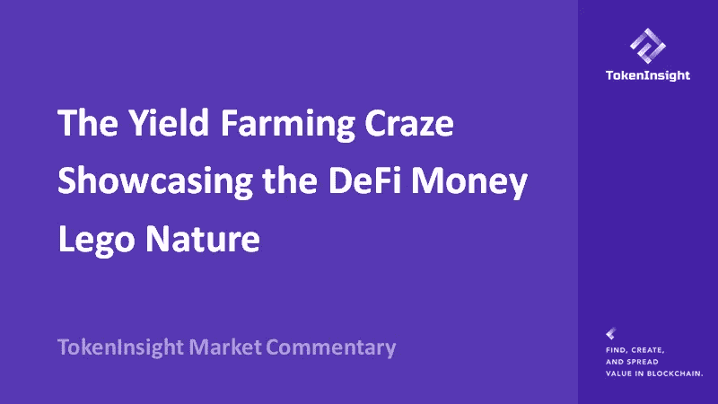
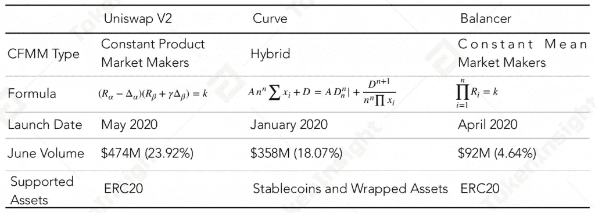
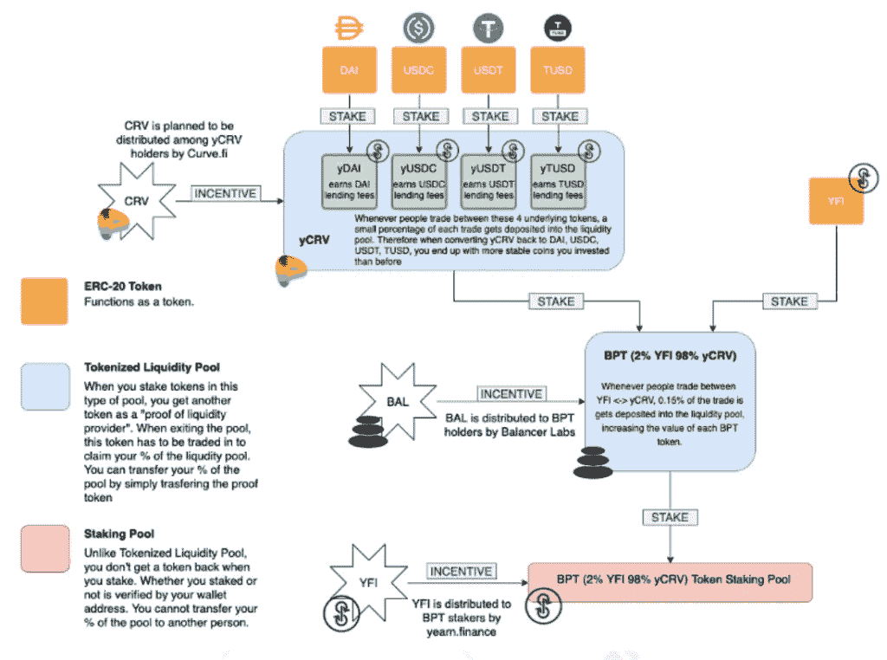
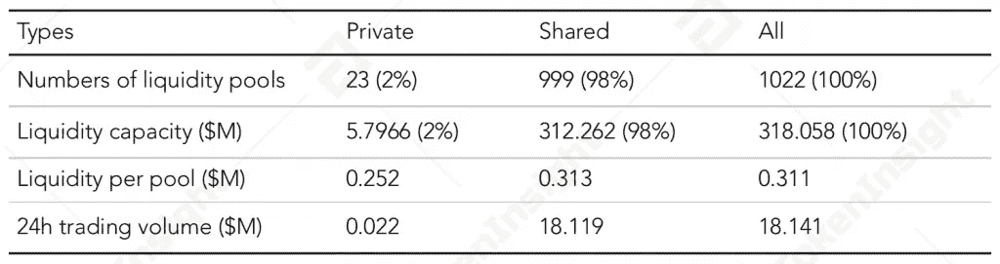
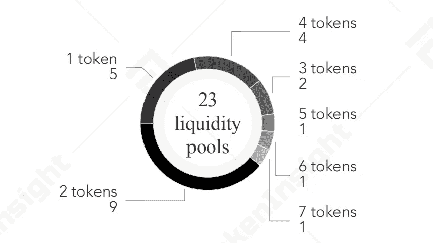
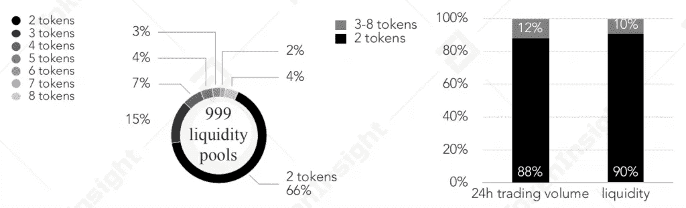
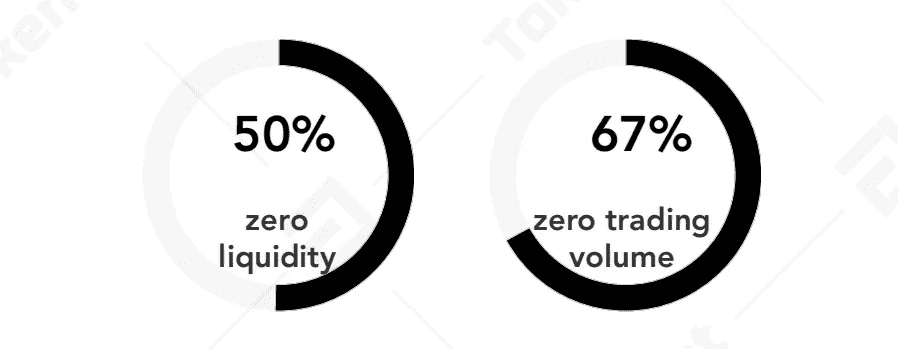
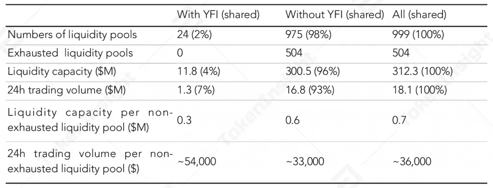
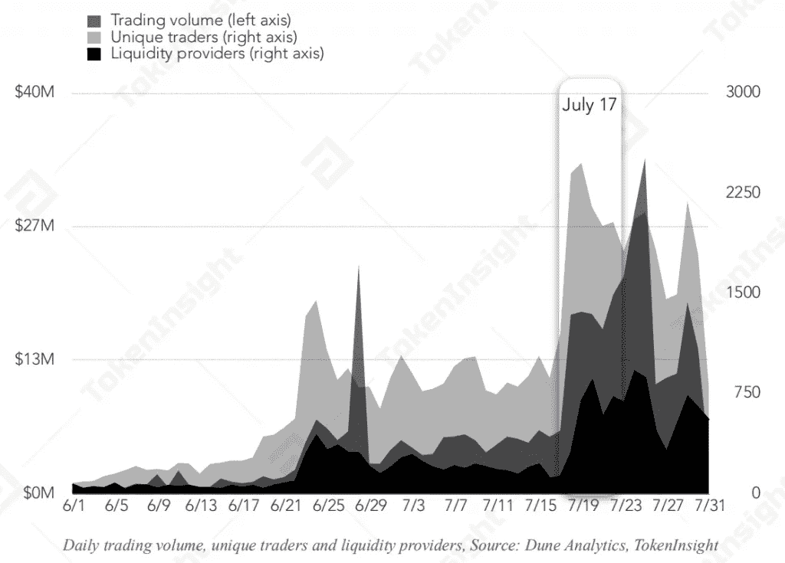

# 展示 DeFi 钱乐高性质的产量农业热潮

> 原文：<https://medium.com/coinmonks/the-yield-farming-craze-showcasing-the-defi-money-lego-nature-34578332f839?source=collection_archive---------0----------------------->

**—2020 年 8 月 11 日由**[**token insight Research**](https://tokeninsight.com/?utm_source=article&utm_medium=medium&utm_campaign=TI)

**电子邮件:research@tokeninsight.com**

# 概观

随着围绕激励性流动性开采(又名收益农业)的热潮，我们在 7 月 30 日分析了平衡器协议流动性池，发现 YFI 收益农业和其他类似的利用平衡器协议作为基础流动性池的举措真正代表了行业中的 DeFi money lego 功能。

# 由于其自动化做市商结构，平衡器协议在 YFI 流动性农场中发挥了重要作用

平衡器协议属于 DeFi 生态系统中的分散式交易所(dex ),并利用名为常数均值做市商的自动做市商(AMM)结构作为其基础 AMM 系统。在 DeFi 生态系统中有不同种类的 AMMs。下表是恒定功能做市商(cfmm)AMM 不同子类型的典型代表。平衡器协议和 Uniswap 之间的最大区别是，在 Uniswap 上，每个流动性池都被限制为只有 2 项资产具有相等的权重，而平衡器协议允许在一个流动性池中有超过 2 项资产具有不相等的权重。目前，平衡器协议中的流动性池可以包含多达 8 种不同的资产。

*Different types of CFMMs, Source:* [TokenInsight](https://tokeninsight.com/?utm_source=article&utm_medium=medium&utm_campaign=TI)

YFI 的受欢迎程度在于其高产量，以及用户能够通过与其他 DeFi 项目(如 Curve Finance 和 Balancer)互动来选择不同的产量农业策略。

YFI 农场本质上是“衍生品平方”，用户可以在 Curve Finance 上存款 stablecoins 以获得 yCRV 令牌，在 Balancer 协议上存款 yCRV 和 YFI 令牌以获得 BPT，在 earn finance 上存款 BPT 以获得 YFI 令牌，最后存款 YFI 令牌并满足最低要求以获得 yCRV，这种结构在 earn finance 系统中形成了闭环。

*Yield farming strategy, Source: ChainLinkGod*

以上产量耕作策略依靠 DEXs 和向往. fnance 协议来实现。向往. fnance 的主要作用是收益率聚合器，而 DEX 在为这些参与者提供进出流动性方面发挥着重要作用。由于不同的 AMM 结构和协议规则，渴望金融的创建者决定利用平衡器协议来创建 98–2 流动性池，以最大限度地减少流动性提供商的非永久性损失。

# 共享与私有流动性池

我们分析了 2020 年 7 月 30 日的整体平衡器流动性池。流动资金池的数量已超过 1000 个，合并流动资金已超过 3 亿美元。平衡器流动性池由私有和共享流动性池组成。共享流动性池允许任何用户提供流动性和交易相应的代币。就流动性池数量和总流动性而言，共享池远超私募。

*Balancer Liquidity Pools, Source: Balancer,* [TokenInsight](https://tokeninsight.com/?utm_source=article&utm_medium=medium&utm_campaign=TI)

# 1.私人流动性池

7 月 30 日只有 23 个私人流动性池，每个流动性池由不同类型和各种代币组成。23 个私人资金池中有 5 个仅包含一种类型的代币，一个流动性资金池包含多达 7 种类型的代币资产。大多数流动性池仅由两种类型的代币组成，这表明尽管平衡器的设计允许用户创建由两种以上代币组成的流动性池，但显然大多数用户仍然偏好具有两种类型代币的流动性池，因为多个代币的潜在更大风险暴露导致更大的非永久性损失。

*Private Liquidity Pools, Source: Balancer,* [TokenInsight](https://tokeninsight.com/?utm_source=article&utm_medium=medium&utm_campaign=TI)

私人流动性池的 24 小时总交易量非常小，主要由 3 个流动性池贡献。私人流动性池的分布极不平衡。由于平衡器协议社区的白名单提案，许多私有流动性池没有被列入白名单，在 23 个私有流动性池中，17 个流动性池的流动性低于 500 美元，2 个流动性在 450，000 美元到 650，000 美元之间，4 个流动性超过 100 万美元。

# 2.共享流动性池

*Shared liquidity pools, Source: Balancer,* [TokenInsight](https://tokeninsight.com/?utm_source=article&utm_medium=medium&utm_campaign=TI)

平衡器有大量的共享流动性池，共有 999 个。每个流动性池目前由 2 至 8 个代币组成，近 70%的流动性池由两个代币组成。与私人流动性池不同，不存在仅由一种代币组成的共享流动性池。

由两类代币组成的流动性池数量仅占 66%，贡献了 88%的 24 小时交易量和 90%的流动性池容量。我们还发现，50%的共享流动性池的流动性为零，其中 67%的交易量为零。

*Balancer’s liquidity pools stats, Source: Balancer,* [TokenInsight](https://tokeninsight.com/?utm_source=article&utm_medium=medium&utm_campaign=TI)

# YFI 高产农业热潮促使平衡器生态系统中的交易量、交易商和流动性提供者的数量大幅增加

*Comparison of shared liquidity pools with and without YFI token, Source: Balancer,* [TokenInsight](https://tokeninsight.com/?utm_source=article&utm_medium=medium&utm_campaign=TI)

7 月 30 日，共有 24 个个人流动性池提供 YFI 代币作为流动性，所有这些池都是共享流动性池。这 24 个流动性池的总流动性达到近 1200 万美元，24 小时交易量超过 120 万美元。有无 YFI 代币的流动性池数据对比如下所示。

平衡器协议见证了交易量、独立交易商数量和流动性提供商在 YFI 流动性挖掘计划启动后(7 月 17 日)的迅速增长。随着 7 月下旬持续的 YFI 收益率养殖热潮，包含 YFI 令牌的流动性池数量占总共享池的 4%，交易量在 7 月 30 日已达到总平衡器交易量的 7%。当日使用 YFI 代币的流动性池日均交易量(约 54000 美元)是未使用 YFI 代币的流动性池日均交易量(约 33000 美元)的 1.6 倍。YFI 产量农业热潮给平衡器协议生态系统带来了积极的影响。

*Daily trading volume, unique traders and liquidity providers, Source: Dune Analytics,* [TokenInsight](https://tokeninsight.com/?utm_source=article&utm_medium=medium&utm_campaign=TI)

# 最后的想法

我们相信，到目前为止,“渴望”是 DeFi 领域最成功的项目之一。DeFi 实验证明了 DeFi 钱乐高的可组合性。虽然不可否认 Balancer、Curve、向往三大平台的良性互动促进了 DeFi 的发展，但其超高的收益吸引了大量投机者涌入，进一步推高了 DeFi 空间的投机活动。与此同时,《渴望融资协议》的成功为如何通过正确提供激励来刺激流动性和不同利益相关者的利益树立了榜样。

# 关于 TokenInsight

**成立于 2017 年的**[**token insight**](https://tokeninsight.com/?utm_source=article&utm_medium=medium&utm_campaign=TI)**是一家领先的数据&技术驱动的区块链金融机构。** TokenInsight 首创了完整的区块链行业分类体系，覆盖了超过**1600 个项目，**发布了超过 **300 份评级报告，**并对 **10 个主要行业进行了深入研究。**

TokenInsight 的数据、评级和研究报告可以访问全球 70 多个数据平台，包括 **Messari、Delta、币安信息、AICoin、火币信息、**等。，月 PV 超过 3000 万。TokenInsight 已正式加入由加密货币排名网站 CoinMarketCap 发起的数据问责与透明联盟(Data)。

# 如果您喜欢我们的评论，请关注我们:

💡官方网站:[https://www.tokeninsight.com](https://tokeninsight.com/?utm_source=article&utm_medium=medium&utm_campaign=TI)

📌领英官方页面:[https://www.linkedin.com/company/tokeninsight/](https://www.linkedin.com/company/tokeninsight/)

🔎电报:[https://t.me/TokenInsightOfficial](https://t.me/TokenInsightOfficial)

🗺推特:【https://www.twitter.com/tokenInsight 

📕https://www.reddit.com/r/TokenInsight/[Reddit](https://www.reddit.com/r/TokenInsight/)

## 另外，阅读

*   最好的[密码交易机器人](/coinmonks/crypto-trading-bot-c2ffce8acb2a)
*   [加密复制交易平台](/coinmonks/top-10-crypto-copy-trading-platforms-for-beginners-d0c37c7d698c)
*   最好的[加密税务软件](/coinmonks/best-crypto-tax-tool-for-my-money-72d4b430816b)
*   [最佳加密交易平台](/coinmonks/the-best-crypto-trading-platforms-in-2020-the-definitive-guide-updated-c72f8b874555)
*   最佳[加密贷款平台](/coinmonks/top-5-crypto-lending-platforms-in-2020-that-you-need-to-know-a1b675cec3fa)
*   [最佳区块链分析工具](https://bitquery.io/blog/best-blockchain-analysis-tools-and-software)
*   [加密套利](/coinmonks/crypto-arbitrage-guide-how-to-make-money-as-a-beginner-62bfe5c868f6)指南:新手如何赚钱
*   最佳加密制图工具
*   [莱杰 vs 特雷佐](/coinmonks/ledger-vs-trezor-best-hardware-wallet-to-secure-cryptocurrency-22c7a3fd391e)
*   了解比特币的[最佳书籍有哪些？](/coinmonks/what-are-the-best-books-to-learn-bitcoin-409aeb9aff4b)
*   [3 商业评论](/coinmonks/3commas-review-an-excellent-crypto-trading-bot-2020-1313a58bec92)
*   [AAX 交易所评论](/coinmonks/aax-exchange-review-2021-67c5ea09330c) |推荐代码、交易费用、利弊
*   [Deribit 审查](/coinmonks/deribit-review-options-fees-apis-and-testnet-2ca16c4bbdb2) |选项、费用、API 和 Testnet
*   [FTX 密码交易所评论](/coinmonks/ftx-crypto-exchange-review-53664ac1198f)
*   [n 零审核](/coinmonks/ngrave-zero-review-c465cf8307fc)
*   [Bybit 交换审查](/coinmonks/bybit-exchange-review-dbd570019b71)
*   [3Commas vs Cryptohopper](/coinmonks/cryptohopper-vs-3commas-vs-shrimpy-a2c16095b8fe)
*   最好的比特币[硬件钱包](/coinmonks/the-best-cryptocurrency-hardware-wallets-of-2020-e28b1c124069?source=friends_link&sk=324dd9ff8556ab578d71e7ad7658ad7c)
*   最佳 [monero 钱包](https://blog.coincodecap.com/best-monero-wallets)
*   [莱杰 nano s vs x](https://blog.coincodecap.com/ledger-nano-s-vs-x)
*   [Bitsgap vs 3 commas vs quad ency](https://blog.coincodecap.com/bitsgap-3commas-quadency)
*   [莱杰 Nano S vs 特雷佐 one vs 特雷佐 T vs 莱杰 Nano X](https://blog.coincodecap.com/ledger-nano-s-vs-trezor-one-ledger-nano-x-trezor-t)
*   [block fi vs Celsius](/coinmonks/blockfi-vs-celsius-vs-hodlnaut-8a1cc8c26630)vs Hodlnaut
*   [bits gap review](/coinmonks/bitsgap-review-a-crypto-trading-bot-that-makes-easy-money-a5d88a336df2)——一个轻松赚钱的加密交易机器人
*   为专业人士设计的加密交易机器人
*   [PrimeXBT 审查](/coinmonks/primexbt-review-88e0815be858) |杠杆交易、费用和交易
*   [埃利帕尔泰坦评论](/coinmonks/ellipal-titan-review-85e9071dd029)
*   [赛克斯·斯通评论](https://blog.coincodecap.com/secux-stone-hardware-wallet-review)
*   [BlockFi 评论](/coinmonks/blockfi-review-53096053c097) |赚取高达 8.6%的加密利息