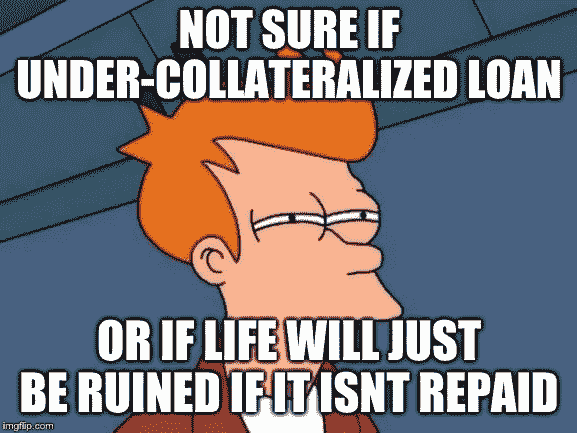

# 没有抵押不足的贷款

> 原文：<https://medium.com/coinmonks/there-aint-no-under-collateralized-loans-2b51ccb3b79?source=collection_archive---------1----------------------->

以太坊(由借贷平台主导)上“成功的”分散融资应用的一个常见批评是，贷款都是过度抵押的。在制造商阿呆，贷款必须保持超过 150%的抵押率，复利 bZx 也需要类似的比率。这是必要的，这样，如果抵押品价值开始下降到没有偿还贷款的动机(低于贷款金额+应计利息)，抵押品可以自动出售，使借款人完整并提供预期回报。这一切都是在以太坊区块链上使用智能合约自动完成的，并且它只使用区块链本地的资产这一事实允许这一点非常无缝地工作。我认为这仍然是合理的资本效率，因为对抵押品价值有信心的借款人可以获得一些流动性来经营企业或进行购买，而无需出售资产和触发应税事件(至少在美国)。

> [发现并回顾最佳加密软件](https://coincodecap.com)

但是，当人们想到贷款时，他们会想到抵押贷款，没有人会在某个账户中保留其未偿还抵押贷款价值的 150%，以便银行在必要时可以清算。这些贷款通常被称为低抵押贷款，现在我们已经看到了过度抵押贷款的足够吸引力，低抵押贷款的概念已经获得了一些关注。我想提供一些关于这个话题的背景，希望能引导一些围绕这个话题的能量进入富有成效的途径。

## 抵押贷款被过度抵押

当被审查抵押贷款时，发行银行审查你的工资历史(这大部分可以通过在你的银行交易中寻找模式来自动完成)，确保你是有收入的就业者(W2s)，并审查任何其他未偿债务。他们试图确定你继续偿还贷款的能力。一旦你通过了这个测试，那么唯一的另一个测试就是你是否愿意偿还贷款。在这一点上，银行有政府和监管机构站在他们一边，他们知道，如果你不付款，他们可能会追查你可能拥有的其他资产，或者迫使你破产。这些事情对你未来潜在的财务状况有非常明显的负面影响(降低你的信用评分，从根本上降低你的财务等级，社会耻辱，等等。).虽然没有明确的公式，但这是银行的考虑因素。最重要的是，除非价格大幅下跌，否则房子本身就是抵押品，随时可以收回。抵押贷款被过度抵押。

## 贷款=超额抵押，其他一切都是礼物或赠款

家庭成员和朋友总是互相借钱，但这仍然是贷款或礼物。贷方可能不知道他们实际上提前发行的是什么，也不一定都是这个或那个。

1.  贷款——如果不偿还，会产生负面后果(被社会群体排斥)
2.  礼物——如果不偿还，不会产生负面后果

## 风险和规模很重要

像所有金融交易一样，重要的是风险调整后的回报。所有的输入都被采用，贷方为所有可能的结果创建概率。如果他们认为回报值得冒险(或者从长远来看接受它是一份礼物)，那么他们可能会选择前进。贷款越大(从贷款人的角度来看)，他们愿意承担的风险可能越小(例如，社会压力不足以担保贷款的全部价值)。我很难看到真正抵押不足的贷款(没有经济上的，只有社会上的还款动机)获得多大的吸引力，原因与 P2P 贷款(如达摩 v1 中引入的)没有流行一样——几乎不可能将风险和需求评估非常不同的双方配对。将每个人都放在一个协议之下(比如 compound)或者围绕一个特定的用例(比如 MakerDAO)进行构建似乎是显而易见的选择。“数字信用评分”的话题自密码行业出现以来就一直存在，但对我来说，这听起来一直像是黑镜剧集(或基本上是中国的社会信用评分)的概念。这仍然需要将某种社会或法律压力带回现实世界。如果你认为这可以匿名或伪匿名完成，我会说你在某种程度上是对的。每个数字身份都有一个价格，所以总会有一些人会烧掉他们的身份，如果这样做有经济意义的话。

## 在哪里建造

不过，这并不完全是暗淡的，我认为，围绕用于抵押品的新数字抵押品类型，有很大的创新机会。这种新的符号化和开放数字市场的构建所做的是允许资产货币化，这在以前没有估值模型。几个例子是

*   $MAGIC，$ALEX 等。—代表某人时间的令牌，可用于应令牌持有者的请求，由令牌发放者预定会议或将来要完成的特定任务
*   $PEW —令牌持有者可以用它来交换令牌发放者的转发
*   道成员资格——如果贷款没有偿还，就把某人踢出道
*   DAO 股份 Meta Cartel Ventures 是一个以营利为目的的 DAO，其成员将拥有代表对基金持有的资产的索赔权的股份。

## 但是我不想要任何长凳

围绕将这些资产用作抵押品的担忧将归结为估值问题。虽然 uniswap 上的代币通常有开放市场，但流动性非常低，这限制了它们的部署规模。尽管有一些可能的解决方案

*   从受信任的范围内借款——如果 X 组中的每个人都重视你在 Y 单位的时间，并且有信心你会坚持到底(或者有支持该资产的法律合同),那么你可以直接从该组借款。如果加入 dao 成为普遍做法，成员从 Dao 借用静态资产，并使用个人资产+被踢出的风险作为抵押品，可能会奏效，因为所有行动都保持在较小的规模。
*   最后的买家——对这些代币进行估值的交易对手可以发布公开声明，声称他们将以 Y 的价值购买 X 的资产。该证明(需要在某处的交易所中可操作)然后可以用作抵押品。

这些解决方案的目标都是将资产评估保持在本地级别，但将评估扩展到全球级别，以便通过具有流动性的协议来利用。这些新的资产类型和创新的融资机制具有巨大的潜力，可以释放以前完全无法获得的价值和流动性。如果你想知道更多关于上面讨论的任何事情的信息(这是在与许多不同的人讨论过这个会议的版本后，大声说出来的),不要犹豫。

推特:[@汤普金斯 _ 乔恩](https://twitter.com/Tompkins_Jon)

电报: [@jontom](https://t.me/jontom)

> [在您的收件箱中直接获得最佳软件交易](https://coincodecap.com/?utm_source=coinmonks)

