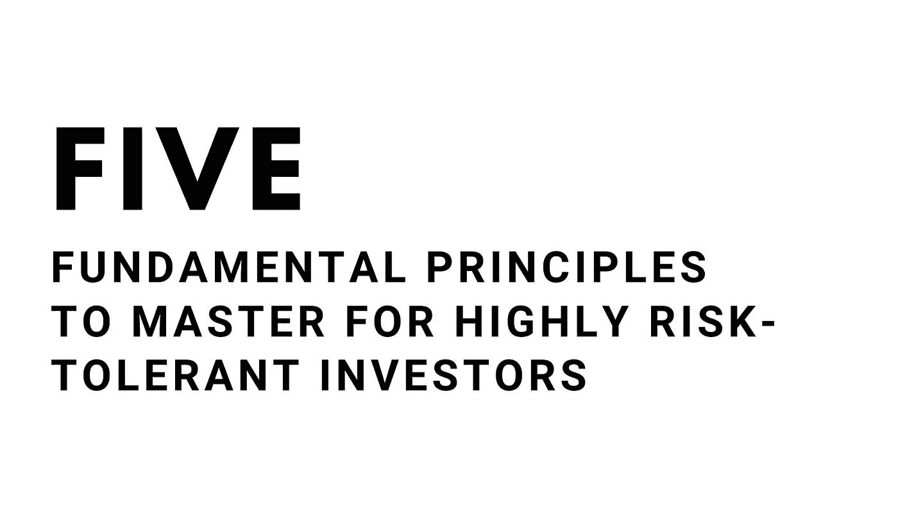
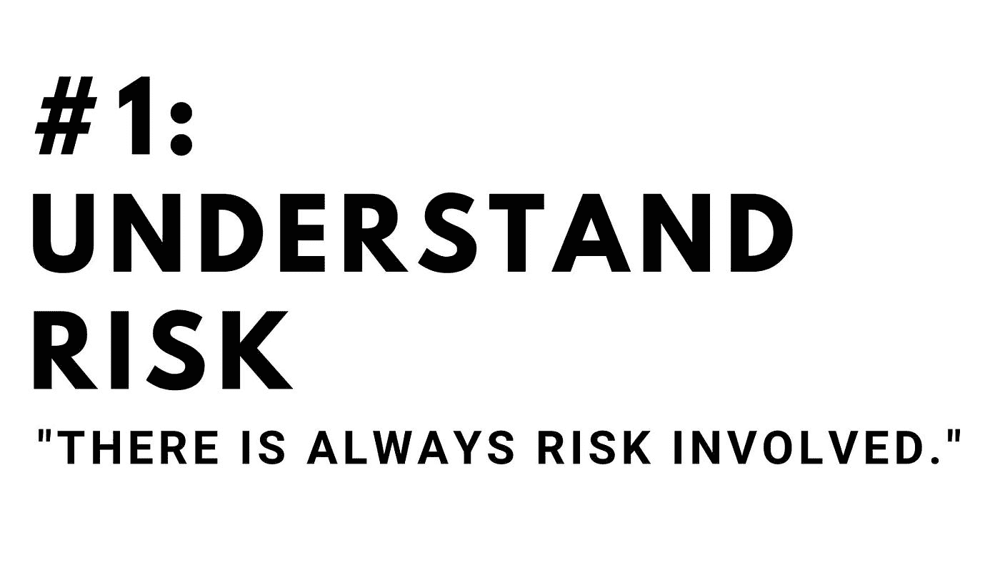
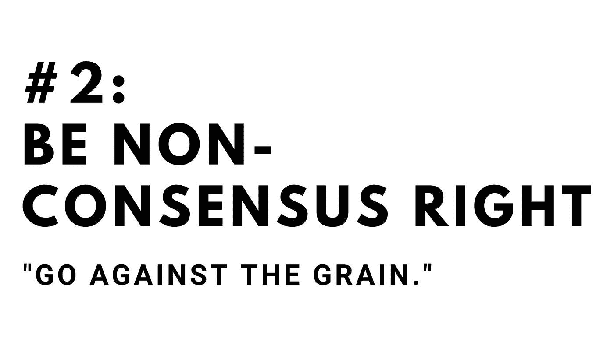
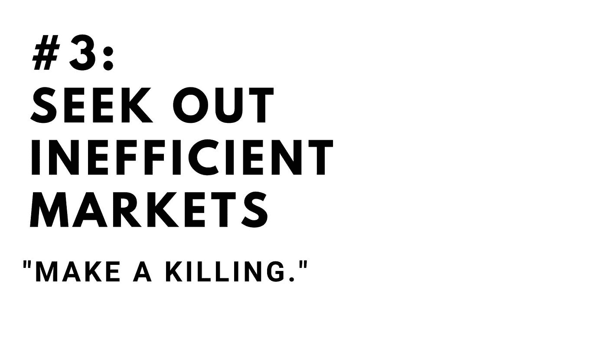
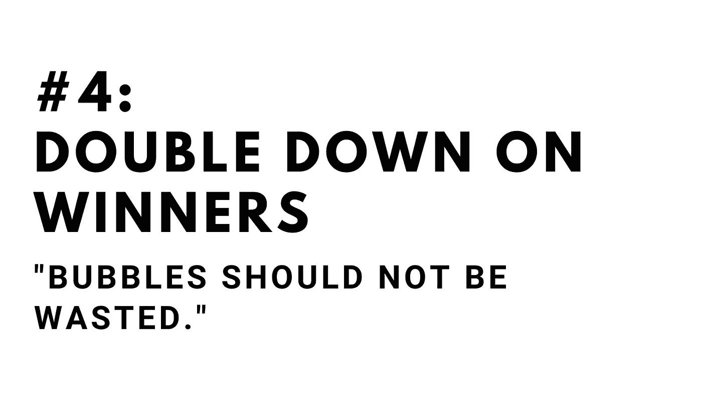
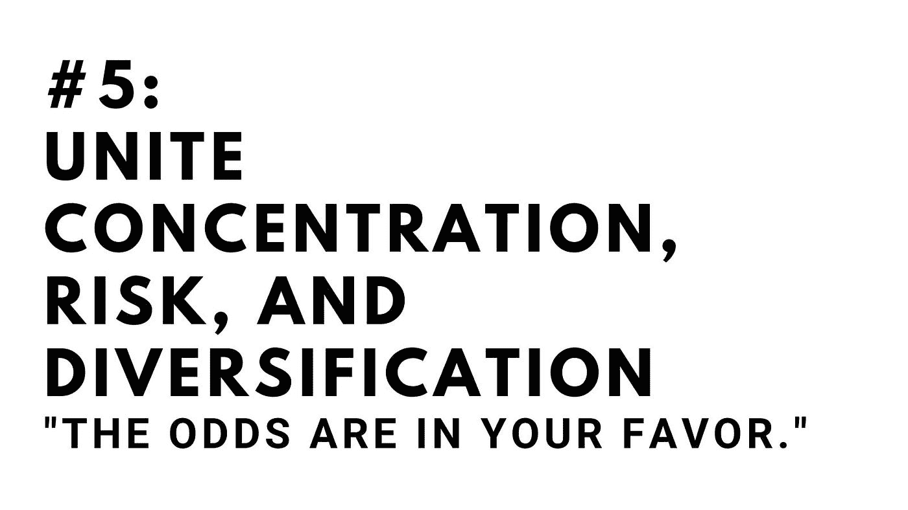

# 加密投资者必须掌握 5 个框架…

> 原文：<https://medium.com/coinmonks/there-are-5-frameworks-crypto-investors-must-master-679e86aa0352?source=collection_archive---------5----------------------->

我只把一小部分内容放在媒体上。如果你想获得所有加密实用主义新闻更新、投资公告和 altcoin 报告的全部信息，请在此免费注册简讯。

投资与赌博在很大程度上是由投资者永远可以依赖的一套基本真理区分开来的:

*   **分散不相关资产的投资组合可以降低风险。**
*   **暴露于风险会增加回报的可能性。**
*   过去的表现不能保证未来的结果。

在我们的后口袋里有这些普遍的公理是有价值的——在红色的日子和绿色的日子，泵或转储，我们可以看看它们，并应用一个清白的观点到我们的投资组合。

虽然以上几点在投资中是正确的，但每种不同的投资都有一套只适用于特定资产类别的原则。

今天，我想解决一些范围稍微窄一点的普遍真理:**投资加密货币的具体和普遍的建议、公理和原则。**

****

大多数坚信比特币会涨到 50 万美元的人在评估风险时可能会犯错误，因为他们没有看到所有的风险。
当然，加密投资者明白购买比特币时最明显的风险:

*   **波动风险**，资产价格可能大幅波动的风险
*   **市场风险**，市场涨跌时所有资产面临的风险(部分是比特币归零的风险)

但是还必须了解其他风险:

*   **机会成本**，投资比特币的成本高于投资另一种资产的成本。部分原因与波动性有关，波动性是指可能存在一个较低的进入点，在那里你可以赚更多的钱。
*   **监管风险，**比特币或任何其他加密货币可能被监管得不复存在的风险
*   **运营风险，**加密货币可能被攻击、被黑，或者互联网可能瘫痪，你无法使用你的钱的风险
*   **通货膨胀风险，**相对于特定货币的购买力而言，良好回报将化为乌有的风险

还有另一种风险很少被提及，但确实存在:

*   一种**流动性风险**，如果一项投资下跌或者你不得不偿还一些债务，你有信心持有该项投资的可能性。也许比特币涨到了 50 万美元，但由于某种个人清算事件，你被迫亏本卖出。

所有这些都导致了一个普遍的事实:**即使你知道比特币会涨到 50 万美元，**你仍然必须考虑这些其他风险。你能承受 99%的跌落吗？你应该等一滴吗？你有义务支付吗？达到你的目标价格需要多长时间？

在牛市环境中，我们更关注价格预测而不是风险预测，考虑这些其他因素至关重要。一个好的高风险投资者会对如何管理这些风险有一个解释。

​

正确的必要性是非常明显的:如果一个资产是无效的，没有被采用，没有用例，它将变为零。

非共识权是一个不同的故事:美国国债被认为是风险最低的资产。你假设他们会定期支付收益可能是对的，但赚钱的机会是有限的，因为这是假设支付是安全的。

因此，获得高回报的机会是当我们违背约定的规范时:如果我们做空美国国债，然后政府破产，我们将获得大量资金。

对于加密货币，我们必须寻求这些非共识的机会。寻找社区中的分歧和不一致，或者更好的是，普遍的意见。你相信低市值的密码吗？这是获得高回报的大好机会。

你认为比特币会走向零吗？这是另一个违背共识的机会(尽管请记住，有时共识是正确的)。

优秀的高风险投资者寻求逆势而为的机会。

​

在交易量低、极度看跌、极度看涨的时期，或者在存在的早期阶段，市场也可能是低效的。

如果基础资产正在创造财富，你的境况会更好。虽然艺术市场效率低下，但由于难以接近，它并没有创造出大量新财富。NFT 市场的可及性以及它允许许多人释放他们创作的价值这一事实意味着这是一个巨大的机会。

Altcoins 也是一个很好的应用这种哲学的空间。低流动性可能是一把双刃剑，让你受益或让你无法退出头寸。信息效率也适用于此。

风险投资中按比例投资的流行体现了 T2 在成功投资上加倍下注的能力的重要性，这种合同规定已经投资的投资者对该公司未来的投资机会也有优先权。

风险投资家和天使们明白，我们应该赌赢家，而不是输家。价格合理的优质资产往往比价格合理的劣质资产表现更好。泡沫不应该被浪费。

投资就是执行和综合判断。两个投资者以相同的资本开始，其中一个人的判断只有 10%的优势，从长期来看，他们会有截然不同的结果。

我总是很难在思想上融合这些在实践中往往相互矛盾的概念。以下面的引文为例:

> “多样化是对无知的保护。如果你知道自己在做什么，那就没什么意义了。”
> ——沃伦·巴菲特

并且:

> “如果你进行 100 项投资，其中只有一项产生了 1000 倍的回报，那么其他 99 项投资可能会变为零，你的投资组合仍将获得 10 倍的回报。”
> 
> 海军拉维坎特

这两位投资者无论如何都不是截然相反的，事实上，我认为他们更多的是相似而不是不同:长期投资者，每个人都有许多复合的中等规模的成功。

这两种对立的观点可以用一种叫做凯利标准的东西来统一。

如果你在一个硬币上下一个平均分的赌注(1 美元的赌注支付 1 美元)，这个硬币有 60%的机会是正面朝上的，有 100 次机会，你得到 100 美元，你每次会下多少？

嗯，赔率对你有利——所以也许你应该下全部赌注？

不。如果你输了第一局，你就什么都没有了，你的优势也就完全消失了。你必须赌一小部分(这个等式有一个数学答案，我就不细说了)来最大化你的收益。

这如何适用于加密？好吧，无论如何，对高回报结果的近乎确定的押注并不是一件确定的事情。高风险投资的保本是游戏的名字。分散高风险赌注。要明白，风险越低或回报越大，你的最佳赌注就越大。​

**一个成功的加密货币投资者**

为了取得成功，加密货币投资者必须创建一个系统，在这个系统中，他们可以遵守纪律、数学驱动、反思和冷静。风险越高，出错的余地就越小。

原则将保持不变，投资者、资产、回报和市场条件将永远变化。但加密市场远非有效，高回报时期也远未结束。

遵循自己的规则，了解自己的风险承受能力。做得好，就能赚很多钱。

[**点击这里**](http://cryptopragmatist.com/sign-up/) **获取内容最好的 altcoin 投资内容在你的收件箱里，每周两次，绝对免费。**

> 加入 [Coinmonks 电报频道](https://t.me/coincodecap)，了解加密交易和投资。

**同样，阅读**

*   [尤霍德勒 vs 考尼洛 vs 霍德诺特](/coinmonks/youhodler-vs-coinloan-vs-hodlnaut-b1050acde55a) | [Cryptohopper vs 哈斯博特](https://blog.coincodecap.com/cryptohopper-vs-haasbot)
*   [币安 vs 北海巨妖](https://blog.coincodecap.com/binance-vs-kraken) | [美元成本平均交易机器人](https://blog.coincodecap.com/pionex-dca-bot)
*   [如何在印度购买比特币？](/coinmonks/buy-bitcoin-in-india-feb50ddfef94) | [WazirX 评论](/coinmonks/wazirx-review-5c811b074f5b) | [BitMEX 评论](https://blog.coincodecap.com/bitmex-review)
*   [比特币主根](https://blog.coincodecap.com/bitcoin-taproot) | [Bitso 点评](https://blog.coincodecap.com/bitso-review) | [排名前 6 的比特币信用卡](/coinmonks/bitcoin-credit-card-bc8ab6f377c6)
*   [双子座 vs 比特币基地](https://blog.coincodecap.com/gemini-vs-coinbase) | [比特币基地 vs 北海巨妖](https://blog.coincodecap.com/kraken-vs-coinbase) | [硬币罐 vs 硬币点](https://blog.coincodecap.com/coinspot-vs-coinjar)
*   [印度密码交易所](/coinmonks/bitcoin-exchange-in-india-7f1fe79715c9) | [比特币储蓄账户](/coinmonks/bitcoin-savings-account-e65b13f92451) | [Paxful 审核](/coinmonks/paxful-review-4daf2354ab70)
*   [杠杆令牌](/coinmonks/leveraged-token-3f5257808b22) | [最佳加密交易所](/coinmonks/crypto-exchange-dd2f9d6f3769) | [AscendEX 评论](/coinmonks/ascendex-review-53e829cf75fa)
*   [Godex.io 审核](/coinmonks/godex-io-review-7366086519fb) | [邀请审核](/coinmonks/invity-review-70f3030c0502) | [BitForex 审核](https://blog.coincodecap.com/bitforex-review) | [HitBTC 审核](/coinmonks/hitbtc-review-c5143c5d53c2)
*   [Crypto.com 费用](/coinmonks/binance-fees-8588ec17965) | [Botcrypto 审查](/coinmonks/botcrypto-review-2021-build-your-own-trading-bot-coincodecap-6b8332d736c7) | [替代方案](https://blog.coincodecap.com/crypto-com-alternatives)
*   [有哪些交易信号？](https://blog.coincodecap.com/trading-signal) | [Bitstamp vs 比特币基地](https://blog.coincodecap.com/bitstamp-coinbase)
*   [ProfitFarmers 回顾](https://blog.coincodecap.com/profitfarmers-review) | [如何使用 Cornix Trading Bot](https://blog.coincodecap.com/cornix-trading-bot)
*   [MXC 交易所评论](/coinmonks/mxc-exchange-review-3af0ec1cba8c) | [Pionex vs 币安](https://blog.coincodecap.com/pionex-vs-binance) | [Pionex 套利机器人](https://blog.coincodecap.com/pionex-arbitrage-bot)
*   [我的密码交易经验](/coinmonks/my-experience-with-crypto-copy-trading-d6feb2ce3ac5) | [比特币基地评论](/coinmonks/coinbase-review-6ef4e0f56064)