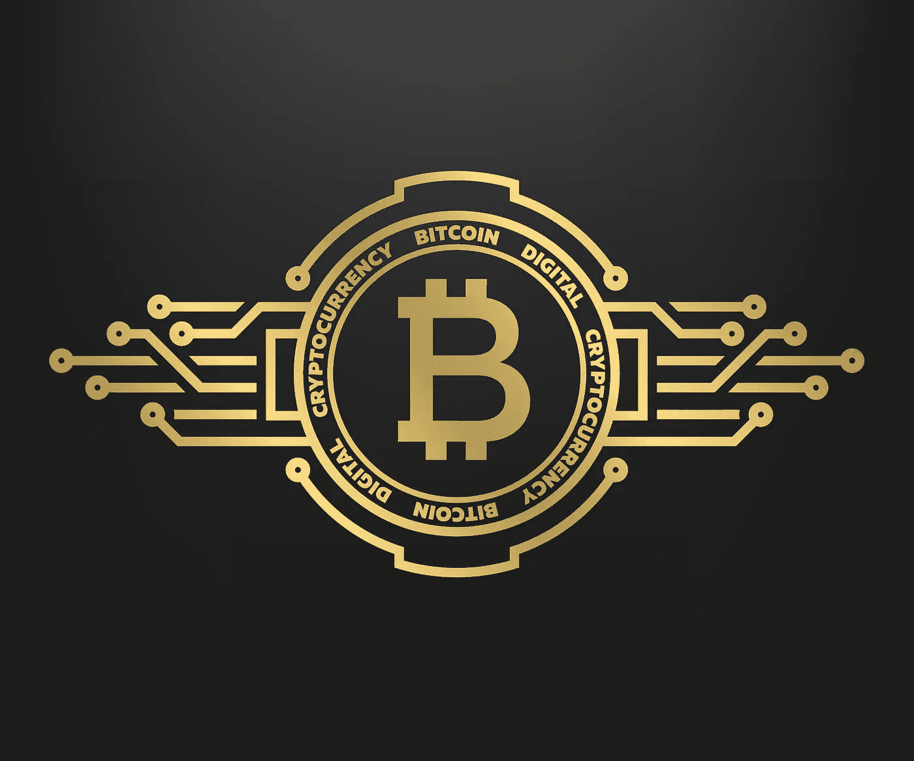

# 亚洲只能有一只隐形老虎——印度是如何浪费千载难逢的机会的

> 原文：<https://medium.com/coinmonks/there-can-be-only-one-asian-crypto-tiger-how-india-is-squandering-a-once-in-a-lifetime-5b15a2dcdc59?source=collection_archive---------4----------------------->

几天后，印度议会将讨论一项禁止加密货币的法案，同时对区块链相关创新保持开放的立场。

这篇文章质疑印度对加密的立场是完全错误的(这是一个人可以使用的最礼貌的术语)，从长远来看，这将伤害印度公民。

虽然不能指望普通印度公民精通密码(这需要长达 1000 小时的学习，包括强大的金融和某种程度上强大的技术背景)，但人们肯定希望决策者理解颠覆性金融的力量。

唉，这种情况下的主要决策者(印度财政部长和印度总理)似乎都缺乏必要的背景(基于最近的公开评论)。

幸运的是，包括印度前财政部长在内的几位顾问已经看到了曙光——并强烈要求全面禁止加密货币无异于自杀。

# 加密自由(又名个人拥有和管理的财富)是印度宪法的核心

印度宪法于 1949 年 11 月 26 日获得批准，是一些主要宪法文件的融合体，包括美国宪法以及英国、爱尔兰、澳大利亚、加拿大、法国和南非等国的宪法。值得注意的是，一些世界上最有活力的民主国家的宪法！

印度宪法的关键是提供个人自由(与美国宪法的关键相同):

保护生命和个人自由。

> 第 21 条规定，"除非依照法律规定的程序，否则不得剥夺任何人的生命或人身自由"。

对于那些投入时间和精力了解比特币的人来说，没有比比特币所有权更清晰的金融自由表达了。

最接近的类比是黄金的所有权，但正如[本帖](/bitcoin-adoption/bitcoin-in-2019-q-and-a-what-is-bitcoins-true-valuation-6e2a0f42091)(和其他几个人)将会指出的，比特币只是黄金的一种高级形式(黄金最终将被认为是一种低级形式的加密——比特币的模拟版本)。

# 印度财政部长可能需要更换顾问

[*没有提议承认比特币为印度货币*](https://www.thehindu.com/business/no-proposal-to-recognise-bitcoin-as-a-currency-fm-nirmala-sitharaman/article37747156.ece)*——印度财政部长 Nirmala Sitharaman——2021 年 11 月 29 日*

完全理解一件事需要一千个小时(据说是这样)。

有了加密，那就 2000 小时吧，因为它代表了财务突破(1000 小时)和技术突破(另外 1000 小时)。理解金融结算是如何被构建到协议中的(这在概念上对银行交易来说是不可能的)，理解挖掘难度调整是如何确保货币的公平分配以及防止欺诈的——这些都是理解比特币的重要组成部分。

事实上，成为这两个学科(技术或金融)中任何一个领域的奇才，都不一定会揭示加密货币的真正颠覆性潜力。

我举出两位美国顶级金融奇才作为证据——沃伦·巴菲特(Warren Buffet，他在颠覆性技术上一直是错的，比特币只是这份不光彩名单中的最新一个)和杰米·戴蒙(Jamie Dimon，JP Morgan Chase 的首席执行官，他个人也错过了比特币的机会(而他自己的公司却在努力为加密技术树立正确的基调)。

> 仅仅成为金融奇才是不够的。我们只需要投入必要的时间和精力来理解比特币的颠覆潜力。

谈到加密货币，印度总理，一个有远见的人，比他的顾问们落后了 1000 个小时。

他仍在思考黑暗演员滥用密码的问题，似乎陷入了十年前的时间扭曲。

这些黑暗的行动，虽然肯定是加密领域的一部分，但在很大程度上已经成为过去。一些变通方法和解决方案使得加密更难用于非法目的，甚至更难被跟踪(见[最近 FBI 追回被盗加密资产](https://www.justice.gov/opa/pr/department-justice-seizes-23-million-cryptocurrency-paid-ransomware-extortionists-darkside))。一个简单的 KYC 流程(银行系统使用的那种)可以确保税收合规性和可追溯性。没有必要禁止比特币——只需在这种资产的交易周围设置适当的护栏——以确保合规。

仅仅因为一项技术可能被用于犯罪而拒绝接受它，会让我们试图在没有电、汽车甚至电脑的情况下生存。

谈到加密，莫迪总理似乎正在犯这个菜鸟错误。

为了记录在案，这位作者没有区分潜在技术(区块链)和分散分类账可能产生的货币。这就好比说‘我们相信医学，但不相信医生’。

区块链科技的典型代表是比特币。

如果你理解并相信区块链技术的[力量(包括消除中间人和直接点对点交易，每笔交易完全透明，没有伪造的可能性)，那么你也应该明白为什么比特币不仅合法——甚至可能比政府年复一年努力印刷的纸张(或银行凭空产生的纸张)更合法。](/blockchain-novel-use-cases-and-adoption/blockchainable-industries-790a223248e6)

那些说他们都支持区块链但不支持加密货币的国家实际上是在声明他们不懂加密货币。

花旗集团和其他几家私人和公共机构(几十年来)一直在努力开发一种数字货币，但在 Satoshi 成功的地方失败了。

电子现金或[数字现金有着悠久的历史](https://www.investopedia.com/tech/were-there-cryptocurrencies-bitcoin/)前比特币。比特币只是第一种真正成功的数字货币，它严重依赖于基于公私密钥对的加密(因此有了术语 *crypto* )。

# 比特币不是凭空创造出来的吗？

是的。今天流通的所有货币也是如此。当你去银行贷款时，他们凭空创造出贷款额。他们是唯一获得许可的机构——因此，获得银行执照被认为既有利可图又困难重重。

不管怎样，比特币挖矿需要能量(等同于货币投资)。

一旦开采出来，这是一种可以交易实际硬通货(美元、欧元、人民币……)的资产。那和黄金一样。

尽管黄金可能不会完全过时，但它只会被视为比特币的一种次等形式(一种数字黄金的模拟形式)。

# 中国的重大失误和印度的机遇

今年早些时候(2021 年)，中国关闭了所有的采矿作业。慢慢变得明显的是，中国政府开始后悔并质疑自己的草率决定。

最近，他们试图重新审视他们的决定，声称这符合人民的利益(共产党不能做或声称做任何不符合‘人民利益’的事情)。

想象一下，拥有世界上最大的黄金开采企业，然后关闭它(中国控制了 40%的比特币开采)。看着这种运作转移到海外的另一个国家(或一组国家)。

中国领导层认为他们的禁令会影响比特币。

比特币并不在意。

比特币真的不在乎谁或什么禁止它——它不可能真正关闭一个去中心化的网络。

挖掘节点是如此，验证节点也是如此(需要保持网络稳定)。运行一个验证器节点已经变得如此简单，以至于人们可以在一个附加了 500 GB SSD 的 raspberry pi 上运行它！(总成本——每月参与保护比特币网络的成本不到 5 美元——与确保当今银行系统中所有货币交易的安全性和安全性的成本相比)。

关闭全中国的验证器，在第二天太阳升起之前，就会有替换节点冒出来。

这同样适用于挖掘节点——尽管整体移动挖掘操作会花费更多的时间和金钱。就其对比特币的稳定性或价格的影响而言，关闭中国的采矿节点并不重要(这些中国采矿公司中的一些已经开始将业务转移到德克萨斯州和美国南部的其他州)。

回到中国。

这是中国每天都要面对的。他们有能力拥有世界上最有价值资产的 40%的采矿业务，但他们浪费了它。

这就是印度可以介入的地方。

亚洲只能有一只占统治地位的隐形老虎。

为什么不是印度？

# 莫迪的妙笔和一个简短的总结

莫迪总理以高明之举而闻名，包括金融去货币化的高明之举，这让印度人大吃一惊，但也解决了无数印度的金融困境。

通过将比特币合法化为法定货币，并进一步允许印度硬件公司专门从事采矿业务，印度可以成为这种数字黄金的最大积累者。

印度对黄金并不陌生，据估计，印度家庭持有的黄金总量超过了诺克斯堡。

我相信，一旦印度人明白这两者没什么区别，他们就会像对待黄金一样对待比特币。

与实物黄金不同，比特币可以很容易地转移和遗留给后代。数字黄金还有其他几个独特的优势。相反，实物黄金提供了比特币无法提供的东西。你不能戴比特币手镯或项链——正如我妻子反复指出的那样。

# 摘要

人们只能希望财政部长西塔拉马尼(和总理莫迪)听取那些投入必要精力理解加密货币所带来的个人自由潜力的顾问们的意见。印度不缺这个人才库(就像印度不缺任何一种人才库一样)。

这些货币不是对本国货币或本国政府的威胁，而是一种资产。

正如个人教育提高了一个国家的地位和经济实力，个人的经济自由也是如此。

印度会做出明智的选择吗？莫迪总理有合适的顾问团队吗？不到一周我们就会知道了。

> 加入 Coinmonks [电报频道](https://t.me/coincodecap)和 [Youtube 频道](https://www.youtube.com/c/coinmonks/videos)了解加密交易和投资

## 也阅读

 [## 杠杆代币[多头代币]终极指南

### 杠杆化令牌是具有杠杆化风险敞口的 ERC20 令牌，不考虑保证金、要求、管理…

medium.com](/coinmonks/leveraged-token-3f5257808b22)  [## 最佳加密交易所| 2021 年十大加密货币交易所

### 加密货币交易所的加密交易需要了解市场，这可以帮助你获得利润。之前…

blog.coincodecap.com](https://blog.coincodecap.com/crypto-exchange)  [## 2021 年最佳加密交换平台| CoinCodeCap

### 如果我们看看今天的场景，许多加密货币交换平台提供了广泛的功能和深度…

blog.coincodecap.com](https://blog.coincodecap.com/best-swap-platforms)  [## 2021 年最佳加密借贷平台| 6 大比特币借贷平台

### 获得比特币和其他加密货币的最佳贷款利率

medium.com](/coinmonks/top-5-crypto-lending-platforms-in-2020-that-you-need-to-know-a1b675cec3fa)  [## 2021 年最佳免费加密交易机器人

### 2021 年币安、比特币基地、库币和其他密码交易所的最佳密码交易机器人。四进制，位间隙…

medium.com](/coinmonks/crypto-trading-bot-c2ffce8acb2a)  [## 最佳 4 个加密交易信号电报通道

### 这是乏味的找到正确的加密交易信号提供商。因此，在本文中，我们将讨论最好的…

medium.com](/coinmonks/best-crypto-signals-telegram-5785cdbc4b2b)  [## 获取信号、交易机器人和套利

### 在本文中，我们将回顾 Bitsgap，这是一个满足您所有交易需求的一站式加密交易平台。它…

blog.coincodecap.com](https://blog.coincodecap.com/bitsgap-review)  [## 5 个最佳社交交易平台[2021] | CoinCodeCap

### 困惑于社交交易和副本交易哪个平台最好？本文将带您了解各种…

blog.coincodecap.com](https://blog.coincodecap.com/best-social-trading-platforms)  [## 如何在印度购买比特币？2021 年购买比特币的 7 款最佳应用[手机版]

### 如何使用移动应用程序购买比特币印度

medium.com](/coinmonks/buy-bitcoin-in-india-feb50ddfef94)  [## 加密税务软件——五大最佳比特币税务计算器[2021]

### 不管你是刚接触加密还是已经在这个领域呆了一段时间，你都需要交税。

medium.com](/coinmonks/best-crypto-tax-tool-for-my-money-72d4b430816b)  [## 存储比特币的最佳加密硬件钱包[2021] | CoinCodeCap

### 保管您的数字资产很容易，但找到正确的存储方式却是一项繁琐的任务。在线钱包有一个风险…

blog.coincodecap.com](https://blog.coincodecap.com/best-hardware-wallet-bitcoin)  [## Pionex 评论 2021 |免费加密交易机器人和交换

### Pionex 是为交易自动化提供工具的后起之秀。Pionex 上提供了 9 个加密交易机器人…

medium.com](/coinmonks/pionex-review-exchange-with-crypto-trading-bot-1e459d0191ea)