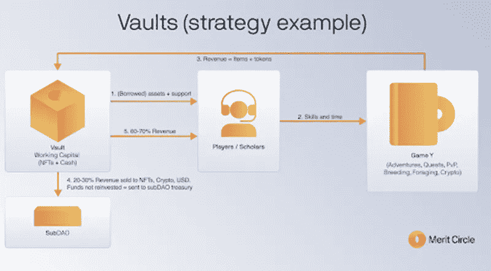

# DAO 收入共享模式有其优点——优点圈基本分析

> 原文：<https://medium.com/coinmonks/there-is-merit-to-a-dao-revenue-sharing-model-merit-circle-fundamental-analysis-ab37d08f76c7?source=collection_archive---------0----------------------->

这份基本面分析是 Crypto Consulting Institute 的付费时事通讯的一部分，提供市场洞察、可行的交易信号和基本面分析。更多信息请访问:【https://www.cryptoconsultinginstitute.com/newsletter 

假设你拥有财产，想从你的土地上清除一英亩的树木。如果你用斧头砍它，你要花相当长的时间才能清理干净。如果你带着一台装有最新树木栽培工具的挖掘机，你可以在一天内清理土地，而用斧头一周就可以完成。

这个假设很好地说明了如何在 P2E 行业实现利润。

功绩圈是 P2E 和分散自治组织(Dao)收入共享模式的一个令人兴奋的十字路口。

这些新概念引起了 CCI 客户的极大兴趣。在这篇文章中，我们将花时间探索 P2E 游戏是如何运作的，它为什么会存在，以及传统的商业模式是如何经历一场大变革的。由于产品正处于生命周期的开始阶段，我们不会对价值圈目前所处的位置进行过多的细化。币安发表了一份优秀的项目总结，并在参考资料中提供了链接。

对于这样一个新概念，讨论价值作为概念证明以展示 DAO 利益相关方通过创收的盈利能力是恰当的。如果成功，功德圈的道国库和 P2E 的收入模式可以成为标准的企业和组织在每一个可能的水平。

# 奖励圈关键摘要

你的 TLDR 总结，D.I.S.R.U.P.T .要点。27/35

# 付费游戏已经过时了。P2E 风靡一时。

如果你在过去六个月的任何时候打开市场雷达，你肯定会注意到 Axie Infinity 的崛起。当理解价值如何在 P2E 环境中体现时，反思该领域的先行者是有益的。在 Axie 飙升至 164.90 美元的历史高点之前，其最初的估值低于 1c，目前为 104.10 美元。

Axie infinity 要求玩家至少购买三个 NFT，或 Axie。收入的主要来源来自玩家对玩家(PVP)、玩家对环境(PVE)和繁殖活动。后者通过血统实验，标榜看似无限的组合，为繁殖后代创造不可替代的价值。玩家可以在整个游戏中通过升级技能和获得更高等级的 NFT 来逐渐增加他们的收入能力。

我们将进一步探讨这一想法，但重要的是要反思席卷低社会经济地位和恶性通货膨胀国家的“游戏赚钱”概念的含义。

在委内瑞拉和菲律宾这样的国家，玩家可以从一周的游戏中获得 1 个月的工资。

但是 Axie Infinity 是如何变得如此受欢迎并保持如此增长的呢？

这让我们对 NFT 空间的价值捕捉产生了一个有趣的思考。对于许多 P2E 游戏，任何人都可以从头开始(尽管你必须有至少 3 个怪物才能玩 Axie Infinity)。

然而，从零开始的后果往往意味着你的 P2E 潜力有限。你可以做一些人所说的“研磨”，或者换句话说，通过逐渐获得游戏内的 NFT，投入大量的时间来增加收入潜力。

但是，如果你很富裕，有能力购买这些 NFT，你可以立即从市场上购买 Axies，与零资本投入或游戏内资产的玩家相比，这给了你更高的 P2E 潜力。那些买得起的人的这种“出人头地”的需求促进了二级市场 NFT 的销售。

设法创造 P2E 收入的玩家可能会追求两个简单的二元选择。

要么兑现游戏中赢得的$AXS/$SLP，要么将这些收入再投资于获得更高级别的 NFT。从最基本的意义上来说，是套现还是复利的选择。当我们开始用这些术语来思考时，我们可以很快开始看到与 DeFi 中的博弈论的相似之处。

选择复合增加了令牌和更广泛的生态系统的底价。

为什么？

NFT 只能用 10 美元的 AXS 代币购买，这是一种经济的设计，新兴的 P2E 游戏很快就接受了这种代币。随着价格的上涨，NFTs 的底价也随着基础抵押品一起上涨。然而，我们可以开始看到，在这种模式下，它会很快变得令人望而却步。

这给我们带来了圆满的功德。为什么这是个好主意？

多重原因。

首先，早期采用者的非功能性测试比他们用棍子戳出来的要多。对于许多人来说，很难找到时间来充分利用它们，以最大限度地发挥它们的创收潜力，那么出租这些 NFT 会是什么样子呢？

Merit Circle 首席执行官兼联合创始人 Marco van den Heuvel 通过 Axie 420 奖学金计划探索了这一概念。通过从一开始就把他的 Axie NFTs 借给玩家，与他们决定单干相比，他可以增加他们的收入潜力。通过最初向球员提供从租借的 NFTs 中产生的收入的 60%,并保留剩余的 40%作为利润。这个想法很快演变成玩家获得 70%的利润，30%分配给功德圈道金库。

第二个原因是通过这种资产借贷和收入模式让人们脱贫的机会。我强烈推荐观看参考文献中链接的简短的 P2E 纪录片，看看 Axie Infinity 奖学金如何改变菲律宾低社会经济参与者的生活。但是，将具有高 P2E 潜力的非金融交易借给贫困线以下的人，让“机会均等”的理念复活了。价值圈打破了低社会经济参与者的进入成本壁垒，给了他们一个公平的机会，并继续让$MC 利益相关者获利。

第三，你可能已经读完了所有的东西，但是没有一点是有意义的。你也可能对玩游戏零兴趣，这没什么。但通过投资于 Merit Circle，您就拥有了从学者所得利润的 30%中积累的道国债的股份，并决定了国债投资对现有或新兴 P2E 机会的效用，以及追求其他金融工具的收益率。实际上，你是在投资一只指数基金。新兴 P2E 的成功直接有利于国库的增长，从而有利于$MC 的利益相关者。

最后，这是一个社区主导的道。你可能已经注意到团队中没有太多的信息，这是因为团队以分散的方式呈指数增长。随着学者们获得新的 P2E 机会，更多团队成员的加入将是一个持续的过程。该团队将不断吸纳经理和游戏玩家，与一些重要的合作伙伴一起追求这些新兴的 P2E 机会。

# 竞争促进创新，协作推动分权。

正在形成的伙伴关系绩优圈值得关注，也是本组织在其形成阶段的主要重点。

当然，我们有无限的空间来繁殖和战胜那些已经显示出成功的怪物。Cyball 是一个基于技能的游戏，其中人物性格随着时间的推移而发展，并有一个有趣的 NFT 借贷功能，Merit Circle 可以利用。Nyan 英雄将允许在元宇宙内定制带有 P2E 机械师的子游戏。Vulcan Forged 是一个游戏孵化器，目前有四款游戏处于测试阶段。Sipher 将在他们的游戏中实现一个借贷模型。此外，NFTs 的使用是基于耐力的，每天只能使用十次。对于拥有多个未被充分利用的非功能性金融工具的投资者来说，学者们有可能进入这个游戏。UFO Gaming 试图将传统游戏连接到区块链，并整合 P2E 机制，有效地将这些数字世界中的资产转换为可以购买的 NFT。《花式鸟》是 P2E 改编自 2013 年流行手机游戏应用《愤怒的小鸟》的游戏。大时代正在创造一个三 A RPG 游戏。Genopets 希望通过增强元宇宙中 NFTs 性能的 XP 来奖励您的真实世界运动或身体活动。Syn City 是一个以黑手党为主题的元宇宙，充满了 P2E 的机会。MixMob 是一款交易卡策略游戏。Sidus 英雄将是一个 3a P2E MMORPG，元宇宙的每一个项目都是一个可获得的 NFT。小精灵王国是一个受口袋妖怪启发的元宇宙，集成了 GameFi 和 DeFi 机制。当然，Merit Circle 最令人期待的合作伙伴可能是 Illuvium，一家分散式游戏工作室。他们的第一个版本是一个开放世界的自我命名的幻想 RPG。

BlockchainSpace 和 Dept Agency 将协助建立基础设施，使学者能够从通过合作关系巩固的不断增长的 P2E 机会列表中获利和借用数字资产。PathDAO、Rainmaker 和 Yield Guild Games 也以类似的 DAO 收入模式运营，它们都同意与 Merit Circle 共享 NFT 资产，并为其各种共享奖学金项目开发基础设施。

# 优点来自聪明的工作，而不是努力的工作。

从高层次来说，功德圈是如何运作的？

“有三个角色:玩家、管理者、DAO 贡献者。奖励圈的功能相当于游戏赚钱产业的指数基金。我们目前的资产负债表由分布在多个游戏中的大量高价值资产组成。我们采取的每一个策略，无论是奖学金模式，土地游戏或金融投资，我们的目标是盈利，以扩大我们道的金库。我们允许每个人通过购买 MC 代币成为功德圈道贡献者，从而获得您的道股份。每一个贡献者都将直接或间接地从我们的 DAO 的财富增长中受益，从而导致 MC 令牌的底价增长。任何对我们道有贡献的人都可以在元宇宙插上他们的旗帜，被动地分享整个行业的发展。功绩圈完成了这项工作。你赚钱。”—功绩圈

自从获得种子投资并在$MC 上市前在 Copperlaunch 反向拍卖中筹集了超过 1 亿美元以来，一些筹集的资金已经为即将到来的游戏收购了高质量的 NFT，并为其中一些项目提供了种子投资者资金。

NFT 贷款给学者，他们在任何时候都不拥有国库资产，但可以通过奖学金系统利用它。当学者们代表绩优圈游戏时，他们借用 NFT，并实施知识渊博的经理教给他们的 P2E 策略。他们的角色是向游戏学者传授有利可图的策略。任何人都可以申请成为学者或经理。如果你对建立你的 NFT 投资组合有特别的兴趣，你的 70%的利润份额将比试图从头建立一个头寸更有意义。作为一名经理，你可能会在促进采用、开发保险库策略和将更多用户带入生态系统中找到成就感。

到目前为止，DAO 的表现如何？

“DAO 拥有广泛的投资授权，以使我们可观的现金头寸尽可能地为 DAO 的利益服务”——99.98%的认可

“让 MPT 入股 Maple Finance，以便有资格获得 MPL 治理令牌奖励”——95.23%的支持率

“开发一个总体平台，容纳扩展和维持 Merit Circle 当前所有游戏活动所需的所有功能。”— 99.93%的赞同率

“Gro protocol 提议帮助 Merit Cicle DAO 通过他们在 PWRD 的风险转移稳定资产管理 250 万美元的国债法定头寸，这在产生收益的同时提供存款保护。”— 80.31%的支持率

“一个在早期代币和 NFT 投资变得具有流动性时消除其风险的场所”——99.8%的支持率

# 象征经济学兜了一圈

# $MC 令牌组学

价格:5.5 美元

市值:234，776，438 美元

最大**供应量:**10 亿

流通供应量:4259.2 万

社区激励——29.44%

团队和顾问— 20%

道国库— 18.40%(整个道国库中的头寸将由 MC 代币组成)

早期投资者——14.06%

流动性奖励— 10%

公共分配— 4.10%

追溯奖励(Axie420 期间)— 4%

# $MC 授权时间表:

“社区激励——无悬崖期，36 个月授权——令牌只能根据批准的治理提案进行分配

团队和顾问——12 个月的悬崖期，然后是 42 个月的归属期

DAO Treasury —无悬崖期，36 个月归属期—令牌只能根据批准的治理提案进行分配

早期投资者——6 个月的悬崖期，然后是 36 个月的归属期

流动性奖励—申请后 12 个月的悬崖期。

公开分配——无授权

追溯性奖励——在 TGE 会议后分配 10%,剩余部分在 18 个月内授予”

# “熊市证明”——这个概念有什么价值吗？

一个超越 P2E 能力的巨大兴趣话题是企业的象征化，以及它们如何通过象征性升值实现利润。

如果你认为你做的咖啡是镇上最好的，想象一下开一家咖啡馆。

你有朋友和家人想成为你的一部分，让你的商业冒险变成现实。他们购买你的$咖啡馆代币。你也可以扩大你的人脉，推销你的创业公司来吸引外部投资者。融资所得形成了 DAO 国库(企业的启动资金)和代币的初始流动性。

随着时间的推移，运营成本会从 DAO 国库中扣除。然而，咖啡馆产生的净利润又回到了 Café DAO 的国库。如果你的生意成功，进入国库的收入将超过运营成本。

你的朋友和家人可以投票决定如何使用国库。他们可能希望扩大业务，开第二家咖啡馆。他们可能希望利用国债投资于金融工具，以产生持续的收益。或者，作为代币持有者，他们可能希望看到国库用来购买代币，然后烧掉它。

这有什么好处？

您的$CAFE token 可能以$1 启动。任何感兴趣的投资者，如果想在财政部拥有股份，并对投资收益有发言权，可能会有兴趣持有你的代币。随着时间的推移，随着企业的现金收入购买你的$CAFE 代币，代币的价值就会增加。从企业的利润来看，代币现在可能值 1.20 美元。投资者现在已经实现了 20%的收益，不是来自任何投机性的市场活动，而是来自购买代币并将其永远从供应中移除的企业所产生的收入。企业主将理所当然地拥有总代币供应量的%既得份额，并将通过这种方式实现利润。如果创始人股票的分配被认为不公平，投资者会用脚投票。

对于那些希望实现利润的人，他们可以套现。那些认为这只是一个开始的人可能会持有他们的代币，并参与决策，以将更多的收入纳入代币。

这也具有高度包容性的深远影响。如果你喜欢咖啡，希望看到老板做得更好，你可能会通过在他们的企业中建立一个职位来投票支持你的投资。如果客户服务一直缺乏，或者你对员工没有“热情”,你可以像当初投资一样迅速退出。

在我们出生之前，股票价格就已经是消费者信心的指标了。但这一指标从未扩展到未在证券交易所公开上市的小企业和实体。正如我们所知，业务符号化和随后的去符号化颠覆了系统。

这给我们带来了一个相关的考虑，这是一个有弹性的市场模型吗？

【2021 年 12 月绩效圈财务报告

简而言之，是的。但是总有一个警告。

由于$ETH 或$BTC 作为流动性池中的主要抵押品，我们可以预计与这些资产挂钩的企业的象征性价格会有一定程度的弹性。请记住，标准的恒定产品做市商模型涉及到在每一边用匹配的输入值来标记两个令牌。一项资产的价格变动会影响相应资产的价格。稳定币(、、、、)等。)实际上可以隔离商业代币的价格，只要美元的通货膨胀不猖獗，这无疑是在这些不确定时期值得考虑的风险。

如果投资者继续看到积极入股企业金库的价值，并且象征性价格没有被风险资本家或投机者过度夸大，那么象征性价格将在很大程度上不受熊市的影响。如果出现熊市，DAO 可以决定是否将美国国债隔离为稳定资产，牺牲短期收益率。

如果我们回到这是如何与功绩圈相关，我们可以仔细看看他们的国库。

“Merit Circle 的非本地资金比 MakerDAO、Aave、Sushiswap 和 Uniswap 的总和还要多。”—优点圆中等。

拥有一个非本土的财政部的意义是显而易见的。如果你有一个装满本地代币的金库，你最终需要卖掉它来资助你的活动。对于本机令牌，将不可避免地存在不受欢迎的出售压力，这远非理想，并且对于 DAO 的长期操作来说是不可持续的。以非本地代币产生收入，无论是以对 P2E 游戏的种子级投资的形式，积累稳定的积分或高流动性资产，如 ETH 或 BTC，利用金融工具的闲置资产产生非本地收益——所有这些都对国库的增长有积极的影响，并隔离了美元 MC 的价格。

会有很多人关注着功德圈。如果他们证明他们的代币收入模式在未来是可持续的，这将很好地扩展到任何创收业务。

# 道德化，真正的精英管理——讨论

在现实世界中，我们努力应对重大的存在主义理念，这些理念塑造了我们一起走向更美好世界的旅程。

问题在于，解决方案通常基于带有程序化偏见和假设的意识形态。“权力腐败，绝对权力绝对腐败”。尽管通过互联网的联系比以往任何时候都更加紧密，但在一个日益集中化的世界里，确定真正的共识变得更具挑战性。

这个系统是坏了，但不是无法修复。分散和未经许可的区块链基础设施是我们如何解决的。人民需要一种不变的方式来达成共识，而不是依靠中央集权的实体来发号施令或告诉人民事情应该如何发展。

建立在道德基础上的共识应该由道来决定。如果 ConstitutionDAO 的旅程和他们的$PEOPLE token 有什么可借鉴的，那就是对自决和去中心化数字主权的渴望。

让我们的思维朝着尊重道的权威的方向发展，将会导致我们认为不公正的现有结构被实现真正共识的机制所取代。出于恶意做出的决定在道中很少见。他们从来不会故意投票反对他们的利益，如果他们这样做，就会影响他们投资的价值。DAO 需要成熟，这涉及到 DAO 参与者试验想法和提炼提案以优化结果。围绕好的想法达成共识。

当通过他们的国库产生真实世界的利润时，一个道成为一个可持续的运动。

功勋圈已经开始致力于使游戏民主化，并为新进入市场的人创造公平的竞争环境。

借出未被充分利用的数字资产，让生活在社会经济水平较低地区的人们能够在从“道”中获利的同时谋生，这是一个改变游戏规则的概念。其社会和经济影响不可低估。我们已经开始看到网络效应，仅 Axie 就有大约 300 万活跃用户。

道斯和 NFT 启用的 P2E 力学使这成为可能。

然而，对于那些不能将 NFTs 视为数字艺术的人来说，理解 P2E 力学如何可持续发展自然会有阻力。

为了简化元宇宙新兴数字经济的复杂性，我想举一个明显的例子，那就是对 Gala Games 旗舰产品 MMORPG 米兰多斯(Mirandus)的反思。

这款游戏尚未发布，但土地很快以令人瞠目结舌的价格售出，但让我们假设你在地牢前面购买了一块土地。

你花时间提高游戏中角色的铁匠技能。要完成一个奖励 1000 金币的地牢，玩家需要最低质量的武器；否则，仅凭技巧几乎不可能获奖。这就产生了对服务的需求。作为一个铁匠，你可以花大约 100 个硬币来购买或玩游戏来收集材料。不是每个人都可以创造武器 NFT，除非他们专注于他们的角色建造并花时间发展必要的技能，但在锻造 NFT 剑时，你可以以 500 硬币的价格卖给玩家。参与这项交易符合玩家的利益。如果一切顺利的话，最终结果是你从你的交易中获得了 400 个硬币，而顾客在清理地牢后获得了 500 个硬币的净利润。这种固有的博弈理论通过 P2E 以怪异而奇妙的方式表现出来，与现实世界的经济有着惊人的相似之处。

现在我们进一步考虑不可替代性。如果你在地牢前面拥有一块土地，你可以理所当然地认为你会为你的商店带来大量的顾客流量，从而增加销售额。能够为其他玩家提供经济实惠的服务会让你的土地增值。如果你想一想，如果你的土地位于沙漠中，附近完全没有地牢或 P2E 的机会，它的价值会是多少。你卖 NFT 风滚草会赚更多钱。你的商店缺乏流量限制了你的虚拟土地潜在的不可替代的价值。原则上，在悉尼中央商务区拥有一公顷房产和在澳大利亚中部拥有一公顷土地没有区别。从获得资源和经济机会的角度来看，前者被认为比后者更有价值。

这种不可替代性以迷人的方式表现出来。Snoop Dogg 多年来一直是一个知名的文化人物。过去一年，他在 NFT 领域变得非常活跃，进行了大量收购。其中之一是元宇宙沙盒中的虚拟土地。Snoop 隔壁的那块地卖了 45 万美元。仅凭窥探的存在，相应的虚拟土地就具有了不可替代的价值。这是一个投机的价格标签，但表明了不可替代的价值如何在 P2E 经济机会之外的情感层面上体现出来。

在数字世界中，价值大规模显现的可能性是无限的，就像你的想象力所能带给你的一样。

这让我们想到了$MC 的未来。

游戏市场逐年增长。仅在中国，就有超过 6 . 65 亿的用户在玩游戏，这也许可以解释为什么政府最近要求限制公民每天玩游戏的时间。

在周边的东南亚国家，通过移动设备玩游戏的趋势正呈指数级增长。越南是全球移动设备采用速度最快的国家，这使得越南能够利用区块链技术建设未来，而不是用过时的系统重建过去。

保留知识最有效的方法是与他人分享。奖学金项目创造了一个积极的反馈循环，在这个循环中，学者可能希望承担起管理者的责任。然后，他们有一个显著的机会成长为专家，同时测试他们的战略，以最大限度地提高与未来的学者的回报。

要确定 Merit Circle 是否是一个有利可图的长期职位，取决于你如何回答以下问题。

你认为移动设备和游戏的采用趋势会持续下去吗？

你认为低社会经济水平的社区会在基层接受 P2E 教吗？

你没有时间或意愿自己去追求 P2E 的机会吗？

最后，也是最重要的一点，你相信 P2E 会留在这里，并在未来保持活力吗？

如果你对这四个问题的答案都是肯定的，那么对你来说，价值圈是一个理想的长期持有对象。

有风险吗？

一直都是。

虽然该团队的信息仅限于 Linked-In 和 Twitter，但他们的热情是毋庸置疑的，因为他们与 Axie 420 奖学金的传统工作充分说明了他们的动机。鉴于它们是一种"一体行动"结构，随着时间的推移，它们将形成更加一致的使命陈述。

在一个 P2E 游戏中的成功不会自动转化为他们的学者正在进行的所有其他冒险的成功。在任何给定的时间，一个游戏可能比另一个更有利可图。资源将不断地被重新平衡，也就是说，学者们可能被鼓励去玩一个比另一个更有利可图的游戏。

熊市是有弹性的，但在清算产生收益的资产之前，美国财政部能用来保护其象征性价格的能力有限。

早期投资者或利益相关者倾销价格的风险极小。从收获之时起，奖励进入为期一年的托管期，锁定时间的赌注者将不得不等待两年才能获得所有奖励。12 个月后，团队令牌解锁。

对于一个没有财政部支持的代币来说，这可能是一个警告，但这对于功绩圈来说并不重要。12 个月是一个方便的锁定期，因为 DAO treasury 进行的种子投资的授权悬崖将在大约同一时间赎回。DAO 可能会投票重新平衡未锁定的持股，以保护价格免受退出流动性的影响，或激励长期持有人。或者，他们可能根本不担心价格在短期内受到影响，而是满足于继续扩大国库。

此外，Merit Circle 接近其最大利润潜力还需要时间。区块链的采用仍在进行中，奖学金在促进 P2E 方面发挥了重要作用。许多与 Merit Circle 合作的游戏仍在开发中。鉴于这是一个快速发展的领域，加入新的合作伙伴关系看不到尽头。

由于投资者和道国库投资的授权解锁，短期价格行为难以预测。最坏的情况是$MC 将保持价格中立，直到几年后既得代币被清算，最好的情况是奖学金机会呈指数增长，收入超过退出流动性。

$MC 对你来说是否是正确的投资完全取决于你的投资视野，但如果你相信 P2E 市场只会从这里开始增长，那么$MC 是一个可靠的长期持有。

但如果你不想投资，可以看看 Merit Circle，看看它能不能接触到已经过彻底审查的 P2E 早期项目。这是一个你应该关注的项目，作为 P2Es 和创收型 Dao 领域的概念证明。

# 参考

[https://research.binance.com/en/projects/merit-circle](https://research.binance.com/en/projects/merit-circle)币安研究

Coindesk，“Axie Infinity 在极度通货膨胀的委内瑞拉找到现成的玩家”，[https://www . coin desk . com/markets/2021/11/23/Axie-Infinity-Finds-Ready-Players-in-hyper inflation-Racked-Venezuela/](https://www.coindesk.com/markets/2021/11/23/axie-infinity-finds-ready-players-in-hyperinflation-racked-venezuela/)

解密，'有人支付 45 万美元成为史努比狗狗的元宇宙邻居'，[https://decrypt . co/87524/Someone-payed-45 万美元-史努比狗狗-元宇宙-邻居](https://decrypt.co/87524/someone-paid-450k-snoop-dogg-metaverse-neighbor)

功德圆道，
[https://gov.meritcircle.io/](https://gov.meritcircle.io/)
[https://vote.meritcircle.io/#/](https://vote.meritcircle.io/#/)
[https://medium . com/@ merit Circle/introducing-merit-Circle-DAO-governance-54fd 70 df 071 f](/@meritcircle/introducing-merit-circle-dao-governance-54fd70df071f)

功勋圈中等，[https://medium.com/@meritcircle](/@meritcircle)

功勋圈子栈，[https://meritcircle.substack.com/](https://meritcircle.substack.com/)

功绩圈子栈，“2021 年 12 月财政报告”，[https://merit Circle . Substack . com/p/2-Treasury-Report-2021 年 12 月](https://meritcircle.substack.com/p/2-treasury-report-december-2021)

功德圈核心团队花名册，[https://merit Circle . git book . io/merit-Circle/future-operations/structure/Dao-contributors](https://meritcircle.gitbook.io/merit-circle/future-operations/structure/dao-contributors)

功德圈'财资力学'，[https://medium . com/@ merit Circle/merit-Circle-Treasury-Mechanics-f 742656 ce 7 e 0](/@meritcircle/merit-circle-treasury-mechanics-f742656ce7e0)

功德圈网站，[https://www.meritcircle.io/](https://www.meritcircle.io/)

功绩圈，'将团队和顾问悬崖延长 6 个月'，[https://medium . com/@ merit Circle/Extending-Team-Advisory-Cliff-by-6 个月-a729ca7dc407](/@meritcircle/extending-team-advisory-cliff-by-6-months-a729ca7dc407)

Mordor Intelligence，“游戏市场——增长、趋势、新冠肺炎影响和预测(2021–2026 年)”，[https://www . mordor Intelligence . com/industry-reports/global-GAMING-MARKET](https://www.mordorintelligence.com/industry-reports/global-gaming-market)

Similarweb，Axie Infinity 网站流量，【https://www.similarweb.com/website/axieinfinity.com/ 

Youtube，“玩赚|菲律宾的 NFT 博彩|英语”，【https://www.youtube.com/watch?v=Yo-BrASMHU4 

> *加入 Coinmonks* [*电报频道*](https://t.me/coincodecap) *和* [*Youtube 频道*](https://www.youtube.com/c/coinmonks/videos) *了解加密交易和投资*

# 另外，阅读

*   [Bookmap 点评](https://coincodecap.com/bookmap-review-2021-best-trading-software) | [美国 5 大最佳加密交易所](https://coincodecap.com/crypto-exchange-usa)
*   最佳加密[硬件钱包](/coinmonks/hardware-wallets-dfa1211730c6) | [Bitbns 评论](/coinmonks/bitbns-review-38256a07e161)
*   [新加坡十大最佳加密交易所](https://coincodecap.com/crypto-exchange-in-singapore) | [购买 AXS](https://coincodecap.com/buy-axs-token)
*   [红狗赌场评论](https://coincodecap.com/red-dog-casino-review) | [Swyftx 评论](https://coincodecap.com/swyftx-review) | [CoinGate 评论](https://coincodecap.com/coingate-review)
*   [投资印度的最佳密码](https://coincodecap.com/best-crypto-to-invest-in-india-in-2021)|[WazirX P2P](https://coincodecap.com/wazirx-p2p)|[Hi Dollar Review](https://coincodecap.com/hi-dollar-review)
*   [加拿大最好的加密交易机器人](https://coincodecap.com/5-best-crypto-trading-bots-in-canada) | [库币评论](https://coincodecap.com/kucoin-review)
*   [用于 Huobi 的加密交易信号](https://coincodecap.com/huobi-crypto-trading-signals) | [HitBTC 审核](/coinmonks/hitbtc-review-c5143c5d53c2)