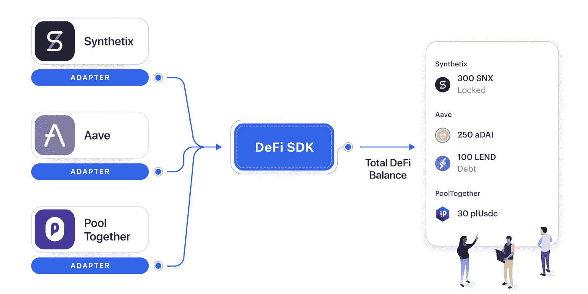

# 有太多的代币需要跟踪

> 原文：<https://medium.com/coinmonks/theres-too-many-tokens-to-keep-track-of-327ce2b72f11?source=collection_archive---------3----------------------->

## 如何解决没有一个单一的用户界面来查看您的所有资产的问题


# 你遇到过这种情况吗？

你在玩一个全新的 dapp，它承诺给你 1000%+ APY ( [希望不是铁，虽然](https://twitter.com/IronFinance))，你像德根一样投入其中。

你把辛苦赚来的 ETH 存入智能合同，然后收到一些奇怪的东西作为你存入 dapp 的“收据”。这个令牌被称为 yacrenwETH 或类似的莫名其妙的东西。

你兴奋地进入你的 [MetaMask 钱包](https://metamask.io/)(或另一个非保管钱包)查看你的整体投资组合，你存入的资金没有显示出来。

你的胃下降。

“等等……我的钱呢？”你问过了。

“它还在那里对吗？不是没了吗？”

你疯狂地重新打开 dapp 网站，查看他们的 UI。

钱还在。

你松了一口气，但当你意识到在谁说的是真话上存在差异时，你很快又开始焦虑发作。

要么这个由 4 人团队创建的垃圾网站在欺骗你，要么 MetaMask 是一个拥有数千用户和数十亿美元的老牌钱包在欺骗你…

令人惊讶的是，是 Metamask 在对你“撒谎”。

这款应用并没有撒谎，只是没有集成到这个新的 dapp /协议中，所以你以 yacrenwETH 命名的资金不会被 wallet UI 识别。

因此，看起来你就像把钱扔进了下水道——再也收不回来了🙃实际上，它仍然存在！

幸运的是，有像 [Zerion](http://zerion.io/) 、 [Zapper](http://zapper.fi) 、 [Instadapp](https://instadapp.io/) 和 [DeFiSaver](https://defisaver.com/) 这样的应用程序，它们投入了大量的人力来为你所有的退化 DeFi 头寸创建一站式投资组合跟踪体验。

可悲的是，我们仍然依赖人类来完成繁重的工作——费力地集成到每一个协议中。

因为 DeFi 作为一项技术是非常新的，所以在开发人员的体验中有突出的痛点:集成是复杂和时间密集型的，并且集成的可伸缩性有限。

换句话说，**目前没有产品化的抽象层来集成所有不同的 DeFi 协议。**

> “Zerion 一直在努力跟上 DeFi 领域的创新。这意味着集成尽可能多的协议，允许用户从一个地方跟踪和管理他们的整个 DeFi 产品组合。然而，添加新协议远非高效之举。”Zerion 首席执行官叶夫根尼·尤尔塔耶夫

对于开发人员来说，DeFi 使开发人员能够快速扩展他们的产品。在贷款的情况下，开发商可以通过连接到贷款协议(例如，Aave、Compound)在不到 1 周的时间内提供贷款，而不是通过建立贷款资产负债表和内部承销能力在 3 个月内提供贷款。

双击这个现有的 DeFi 痛点，我看到它体现在两个开发人员角色中:扩展器 Elaine 和猎人 Howard。

## **延长者伊莲**

Elaine 是一家知名加密公司的项目经理，她试图通过推出新产品来扩大公司的价值。她知道她的用户想做的不仅仅是 HODL 他们的硬币，也知道越来越多的交易者转向 DeFi 寻求收益。

然而，Elaine 的工程团队不具备直接集成到低级 DeFi 协议中的可靠性专业知识。考虑到这一点，她担心如果她的团队运送这一产品，可能会破坏安全性。

一个完整的 DeFi API 可以在两个方面帮助 Elaine:(1)一组可以很容易地添加到他们的 JavaScript 代码库中的 DeFi API，(2)一个有经验的团队已经构建了正确的工具，这让他们放心。

现有的反油酸例子:

*   [比特币基地钱包](https://blog.coinbase.com/coinbase-wallet-makes-it-easier-to-earn-interest-through-defi-apps-65fe4524aef2)允许其用户从其持有的钱包中赚取利息
*   OKCoin 有一款[盈利产品](https://www.okcoin.com/earn)，允许用户将硬币投入 DeFi 协议
*   BRD 可以直接在钱包里提供高收益产品
*   OpenSea 可以提供 NFT 抵押贷款，使用 DeFi 应用程序，如 [NFTfi](https://nftfi.com/) 或 [Rocket](/@AlexMasmej/introducing-rocket-get-a-loan-against-your-nfts-f67b1b5738f0)

## **猎人霍华德**

Howard 是一名软件工程师，也是一名热情的 DeFi 爱好者。他看到了 DeFi 市场中没有人解决的缺口，所以他辞去了工作，创办了一家新的 DeFi 公司。

不幸的是，Howard 很快意识到他的想法需要很多基础产品:钱包、入口和交易签名。

此外，很难逐个手动集成到每个 DeFi 协议中。他希望快速上市，但他只有一个人，无法轻松连接到他的产品成功所需的所有 DeFi 协议。

一个完整的 DeFi API 可以在两个方面帮助 Howard:(1)一个一对多的 API，通过一个集成连接到多个 DeFi 协议，(2)一个端到端的 API 解决方案，允许 Howard 自己轻松地构建一个强大的加密应用程序(例如，wallet、fiat on-ramp)。

霍华德庄园的例子:

*   [DeFi Saver](https://defisaver.com/) 是一款跨协议的自动 DeFi 再平衡器
*   [扎珀。Fi](https://zapper.fi/dashboard) 和 [Zerion](https://zerion.io/) 是 DeFi 控股公司的一站式仪表盘
*   [earning](http://yearn.finance)是一只与其他 DeFi 流动性池整合的货币市场基金
*   达摩[是一个 DeFi 入口](https://www.dharma.io/)

# 拟议解决方案

在高层次上，DeFi API 产品为开发人员提供了对 DeFi 协议的简化访问:一个一对多的抽象层，它与智能合约进行交互，签署交易，并向合约发送令牌/从合约接收令牌。

“DeFi APIs”的集合可以基于开发人员的用例来构建。例如，一个 DeFi Lending API 带有一个开发人员点击的 CompareYield 端点，它返回所有流行借贷协议中所有指定令牌的利率。

GET CompareYield("USDC ")调用的结果格式示例:

```
{
 “COMPOUND” : 0.03998,
 “AAVE” : 0.04112,
 “ALPHA” : 0.04026,
 //And many more…
}
```

战术后续步骤:

1.  用户研究:验证 DeFi 集成复杂且繁琐的假设，以及开发人员会为简化的 API 解决方案付费的假设
2.  产品需求和优先级:确定交付完整的 DeFi API 原型所需的最小功能集(例如，支持最大化开发人员体验的 DeFi 协议的优先级列表)
3.  技术设计:设计和开发原型所需的 API、服务器、DeFi 协议集成、devops
4.  概念验证:将原型发送给目标用户并征求他们的反馈

Zerion 拥有自己的 [DeFI SDK](https://blog.zerion.io/defi-sdk-making-money-lego-work-1dc08b8982cf) 来标准化 DeFI 会计——既包括连接应用程序用户的协议，也包括能够查看来自协议的模糊令牌衍生物的应用程序。

这一想法将是对协议的只读功能的增强，使应用程序能够与各种 defi 协议进行实际交互并移动价值。



Image via [Zerion](https://blog.zerion.io/defi-sdk-making-money-lego-work-1dc08b8982cf)

*感谢阅读！如果你喜欢这篇文章，请关注我的*[*Twitter*](http://twitter.com/0xjim)*，了解更多关于加密的实时想法。*

如果你认为这篇博文值得你花 5 分钟来阅读，请帮我在下面鼓掌(最多 50 次)并分享给一个会从这篇内容中受益的朋友。非常感谢！

> 加入 [Coinmonks 电报频道](https://t.me/coincodecap)，了解加密交易和投资

## 另外，阅读

*   [什么是保证金交易](https://blog.coincodecap.com/margin-trading) | [美元成本平均法](https://blog.coincodecap.com/dca)
*   [3 商业评论](/coinmonks/3commas-review-an-excellent-crypto-trading-bot-2020-1313a58bec92) | [Pionex 评论](/coinmonks/pionex-review-exchange-with-crypto-trading-bot-1e459d0191ea) | [Coinrule 评论](/coinmonks/coinrule-review-2021-a-beginner-friendly-crypto-trading-bot-daf0504848ba)
*   [莱杰 vs n rave](/coinmonks/ledger-vs-ngrave-zero-7e40f0c1d694)|[莱杰 nano s vs x](/coinmonks/ledger-nano-s-vs-x-battery-hardware-price-storage-59a6663fe3b0) | [币安评论](/coinmonks/binance-review-ee10d3bf3b6e)
*   [Bybit 交易所评论](/coinmonks/bybit-exchange-review-dbd570019b71) | [Bityard 评论](/coinmonks/bityard-review-7d104239be35) | [CoinSpot 评论](https://blog.coincodecap.com/coinspot-review)
*   [3 commas vs Cryptohopper](/coinmonks/3commas-vs-pionex-vs-cryptohopper-best-crypto-bot-6a98d2baa203)|[赚取加密利息](/coinmonks/earn-crypto-interest-b10b810fdda3) | [网格交易机器人](https://blog.coincodecap.com/grid-trading)
*   最好的比特币[硬件钱包](/coinmonks/the-best-cryptocurrency-hardware-wallets-of-2020-e28b1c124069?source=friends_link&sk=324dd9ff8556ab578d71e7ad7658ad7c) | [BitBox02 回顾](/coinmonks/bitbox02-review-your-swiss-bitcoin-hardware-wallet-c36c88fff29)
*   [BlockFi vs 摄氏度](/coinmonks/blockfi-vs-celsius-vs-hodlnaut-8a1cc8c26630) | [Hodlnaut 审核](/coinmonks/hodlnaut-review-best-way-to-hodl-is-to-earn-interest-on-your-bitcoin-6658a8c19edf) | [KuCoin 审核](https://blog.coincodecap.com/kucoin-review)
*   [Bitsgap 评审](/coinmonks/bitsgap-review-a-crypto-trading-bot-that-makes-easy-money-a5d88a336df2) | [Quadency 评审](/coinmonks/quadency-review-a-crypto-trading-automation-platform-3068eaa374e1) | [Bitbns 评审](/coinmonks/bitbns-review-38256a07e161)
*   [加密复制交易平台](/coinmonks/top-10-crypto-copy-trading-platforms-for-beginners-d0c37c7d698c) | [Coinmama 审核](/coinmonks/coinmama-review-ace5641bde6e)
*   [印度比特币交易所](/coinmonks/bitcoin-exchange-in-india-7f1fe79715c9) | [比特币储蓄账户](/coinmonks/bitcoin-savings-account-e65b13f92451)
*   [CoinDCX 评论](/coinmonks/coindcx-review-8444db3621a2) | [加密保证金交易交易所](https://blog.coincodecap.com/crypto-margin-trading-exchanges)
*   [CoinLoan 评论](/coinmonks/coinloan-review-18128b9badc4) | [YouHodler 评论](/coinmonks/youhodler-4-easy-ways-to-make-money-98969b9689f2) | [BlockFi 评论](/coinmonks/blockfi-review-53096053c097)