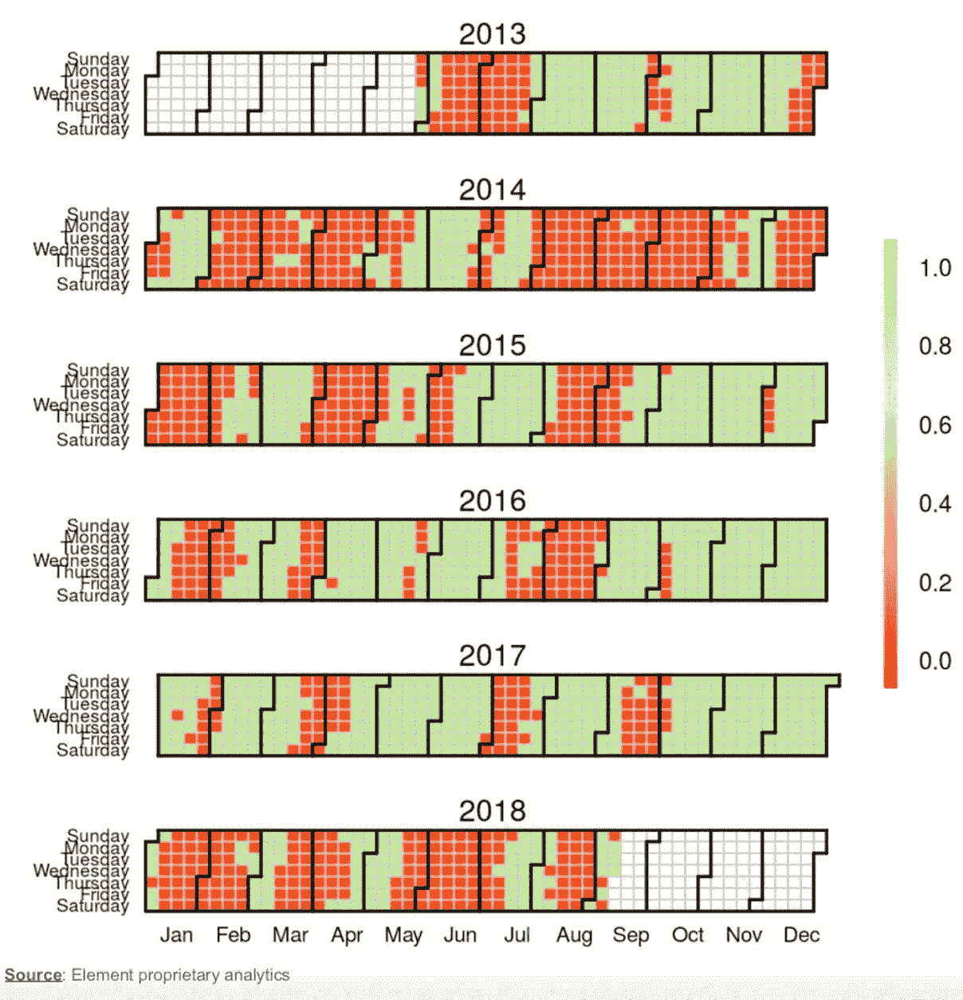

# 为什么密码市场的季节性很重要

> 原文：<https://medium.com/coinmonks/theres-value-in-paying-attention-to-seasonality-in-the-crypto-market-8836657956e3?source=collection_archive---------1----------------------->

*跟踪市场价格&季节性叙述，观察它们如何帮助解释数字资产市场运动——由* [*元素数字资产管理*](https://elementgroup.com/market-research/) *团队*

*(* [*这些观察最早出现在资产管理的《每周随想》*](https://elementgroup.com/market-research/) *)*

# 观察 crypto 的价格为什么要看季节性？

对于交易者来说，主流市场定价的季节性经常是一个活跃的调查领域。原因是时间序列反复表现出季节性，这种季节性由定期出现的数据中的可计算模式组成。

**使用季节性来预测资产价格的原因是这样的:**

1.  价格是由人们的决定和他们买卖资产时的互动决定的
2.  人类的行为一般取决于历法(即。假期、工作周或政府设立的其他法定假日)。

尽管在寻找季节性模式时数据挖掘有危险，但它可能存在于资产价格中的原因是有理性基础的。事实上，大多数宏观经济指标都有很强的季节性因素，政府投入大量精力开发模型，使数据报告可以进行季节性调整。

例如，在股票市场，研究人员已经发现了与日历相关的 T21 在月与年交替时的不一致性。当我们考虑到数字资产市场非常依赖于人们的情绪，并且很少锚定在任何特定的基本面价值上时，进一步探究是否存在某种季节性是合理的。

# 我们如何评估与日历相关的异常？

我们的团队编制了一个图表，显示了过去五年比特币四周回报的日历[热图](https://www.techopedia.com/definition/32150/heat-map)(每个方块代表一天，绿色表示过去四周经历了正回报，红色表示相反)。

我们选择了一个四周的回归来平滑数据。更容易看出价格的走向。选择积极和消极指标是为了处理比特币随着时间的推移如何变化，因为它已经成熟为一种合法的资产类别。

*可靠的比特币价格数据只有几年，但一些有趣的观察结果立即浮现:*

# **过年**

2018 年 1 月，人们普遍认为[农历新年](/@economymonitor/bitcoin-and-the-chinese-new-year-94ec8987aee1)导致了整体市场抛售，随后价格将会回升。故事是这样的，中国投资者从加密市场撤出资金，用于节日开销和礼品。

我们想知道这是否真的是导致市场抛售的一系列事件(例如，为什么它在圣诞节前夕不存在？)，但在过去四年中，主要的市场疲软出现在 1 月和 2 月，大致与中国春节假期一致。

当然，另一种说法是，投资者可能会推迟出售他们的数字资产，直到 1 月 1 日之后，因此出售的资本收益要到下一年才能应用。

# 年度资本收益支出

去年 3 月，有人提出了另一种说法来解释市场抛售:与税收相关的 crypto 抛售，但这一次是为了覆盖美国的资本利得税。人们的预期是，市场将在 4 月 15 日(强制征税的最后期限)之后复苏。

在过去五年中，比特币的年平均回报率为 110%，每年为投资者带来可观的资本收益。替代硬币的涨幅甚至更大。每年 3 月末/4 月初都会出现市场低迷，因为一些投资者从加密市场清算资本以支付税款。

这种抛售不仅仅出现在加密市场——2000 年 4 月，在互联网泡沫达到顶峰后，纳斯达克综合指数在一周内下跌了 9%，直到减税。

# 秋季交易季节

从历史上看，一年的最后三个月是加密技术价格更有可能上涨的时候。比特币价格的泡沫峰值和 2013 年的前一个峰值都发生在 12 月份。然而，我们掌握的比特币价格历史是有限的，我们还没有找到一个令人信服的说法来解释为什么第四季度更有可能上涨。

在秋季和冬季，互联网的使用量更大。而且，如上所述，投资者可能会推迟到 1 月份出售，以推迟纳税。但这两种解释似乎都不太令人信服，这可能只是一种非经常性的巧合。

# 自我实现的预言

不管事件的顺序是真是假，如果有足够多的投资者接受一种叙事，并允许它改变他们的交易决策，季节性叙事就有自我实现的能力。今年，纳税截止日期的说法被广泛分享，足够多的人采取了行动，以至于在纳税截止日期之后，比特币从 7000 美元短暂上涨到 10000 美元。

这些见解首次出现在《每周思考》中，Element 数字资产管理团队深入研究了加密市场的现状，提供了独特的最新见解和观察。

在我们的网站上订阅**就可以直接收到你的邮件。**

## ***同样，阅读***

*   *[最佳加密交易机器人](/coinmonks/whats-the-best-crypto-trading-bot-in-2020-top-8-bitcoin-trading-bot-c16adeb13317)*
*   *最好的比特币[硬件钱包](/coinmonks/the-best-cryptocurrency-hardware-wallets-of-2020-e28b1c124069?source=friends_link&sk=324dd9ff8556ab578d71e7ad7658ad7c)*
*   *最好的[加密税务软件](/coinmonks/best-crypto-tax-tool-for-my-money-72d4b430816b)*
*   *[最佳加密交易平台](/coinmonks/the-best-crypto-trading-platforms-in-2020-the-definitive-guide-updated-c72f8b874555)*
*   *[unis WAP 最佳钱包](/coinmonks/best-wallets-to-use-uniswap-e91a6385d9e8)*
*   *最佳加密贷款平台*
*   *Bitsgap 评论——一个轻松赚钱的加密交易机器人*
*   *为专业人士设计的加密交易机器人*
*   *[3commas Review](https://blog.coincodecap.com/3commas-review-an-excellent-crypto-trading-bot) |一款优秀的密码交易机器人*
*   *[3Commas vs Cryptohopper](/coinmonks/cryptohopper-vs-3commas-vs-shrimpy-a2c16095b8fe)*
*   *Bitmex 的[保证金交易的白痴指南](/coinmonks/the-idiots-guide-to-margin-trading-on-bitmex-dbbd7742c6fc?source=friends_link&sk=7bfa99d2a181142510c8442c8ddb0786)*
*   *[加密摇摆交易的权威指南](/coinmonks/the-definitive-guide-to-crypto-swing-trading-7e4af6496d4d?source=friends_link&sk=70448050bd9323b42f63bfc0bb1e60d1)*
*   *[Bitmex 高级保证金交易指南](/coinmonks/bitmex-advanced-margin-trading-guide-2270c195ce25?source=friends_link&sk=1d986cca731f5084b9a2db4a4bc4a7ad)*
*   *[开发人员的最佳加密 API](/coinmonks/best-crypto-apis-for-developers-5efe3a597a9f)*
*   *[加密套利](/coinmonks/crypto-arbitrage-guide-how-to-make-money-as-a-beginner-62bfe5c868f6)指南:新手如何赚钱*
*   *顶级[比特币节点](https://blog.coincodecap.com/bitcoin-node-solutions)提供商*
*   *最佳[加密制图工具](/coinmonks/what-are-the-best-charting-platforms-for-cryptocurrency-trading-85aade584d80)*

> *[直接在您的收件箱中获得最佳软件交易](https://coincodecap.com?utm_source=coinmonks)*

**