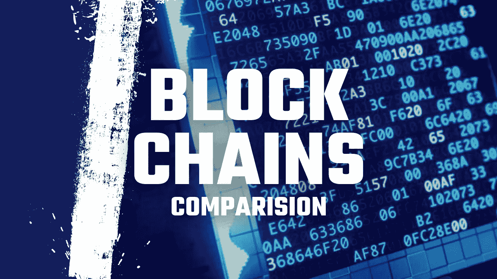

# 除了以太坊和索拉纳，这是五个有前途的区块链

> 原文：<https://medium.com/coinmonks/these-are-five-promising-blockchains-besides-ethereum-and-solana-9c5306e64390?source=collection_archive---------3----------------------->

## 所有这 5 个都有可能把以太坊从它的宝座上拉下来。他们能做到吗？

Thumbnail from [Günter Ederegger](https://medium.com/u/4f0c50d16421?source=post_page-----9c5306e64390--------------------------------)

thereum 和 Solana 似乎正在将自己与其他智能合约平台区分开来。那么，哪个区块链能与智能合约中最有价值的两种加密货币竞争呢…