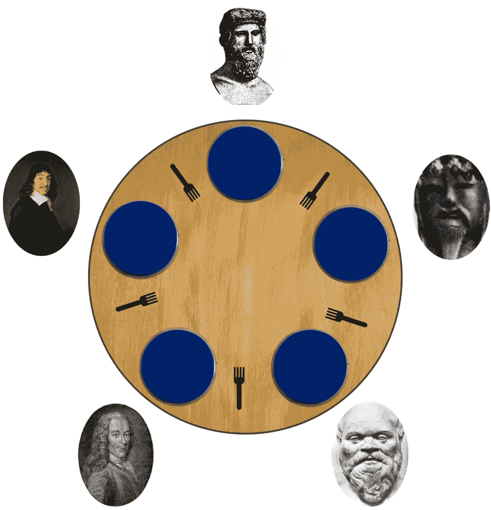
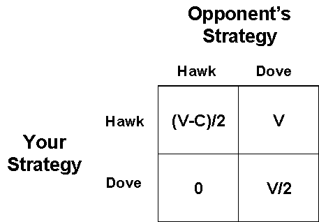

# 博弈论中的这三个新趋势可能是下一个大区块链的一部分

> 原文：<https://medium.com/coinmonks/these-three-new-trends-in-game-theory-could-be-part-of-the-next-big-blockchain-6fe961bd81db?source=collection_archive---------9----------------------->

从第一天起，博弈论就是区块链科技的关键部分。从共识协议到最著名的攻击形式，博弈论是现代区块链架构不可或缺的一部分。所有形式的共识协议，从基本的工作证明(PoW)到超级复杂的模型，如 EOS 委托的利害关系证明或 Tendermint 的拜占庭容错，都包含了经典博弈论的许多方面。有趣的是，区块链架构中许多最常见的挑战也可以追溯到博弈论场景，如公地悲剧或 T2 囚徒困境。随着区块链技术的发展，他们很可能会将新的和更复杂的博弈论动态结合到他们的协议中。

# 可扩展性因素

争夺主流可扩展区块链协议的竞赛已经开始。基于以太坊的一些限制，出现了许多技术，声称能够处理成千上万的并发事务，并扩展到数百万节点的网络。这些级别的可扩展性将需要共识、投票和治理协议等领域的新协议，并有可能为恶意行为者打开更复杂的攻击媒介。

从博弈论的角度来看，可伸缩性是一个可以线性增加下一代区块链运行时中游戏动态复杂性的因素。因此，现代区块链协议将开始爆发更先进的博弈论场景，以便在规模上有效运行。具体来说，我相信有三种形式的博弈论已经在新形式的区块链协议中找到了自己的路。

# 平均场游戏

[平均场游戏(MFG)](https://en.wikipedia.org/wiki/Mean_field_game_theory) 在博弈论领域是一个相对较新的领域。制造理论是在 2006 年作为一系列独立论文的一部分发展起来的，这些论文分别由蒙特利尔的黄敏仪、罗兰·马尔哈梅和彼得·凯恩，以及巴黎的让-米歇尔·拉斯利和菲尔兹奖获得者皮埃尔·路易斯·莱昂斯发表。从概念上来说，MFG 包括研究具有大量理性玩家的微分游戏的方法和技术。这些代理不仅对他们的状态(例如，财富、资本)有偏好，而且对群体中剩余个体的分布也有偏好。MFG 理论研究这些系统的广义纳什均衡。

MFG 的一个经典例子是鱼群如何以协调的方式向同一个方向游动。从理论上讲，这种现象很难解释，但它的根源在于这样一个事实，即鱼会对最接近的群体的行为做出反应。更具体地说，每条鱼并不单独关心其他每条鱼，而是关心附近的鱼作为一个整体如何整体移动。如果我们将其转化为数学术语，鱼对质量的反应就可以用汉密尔顿-雅可比-贝尔曼方程来描述。另一方面，决定质量运动的鱼的动作的集合符合 Fokker-Planck-Kolmogorov 方程。平均场博弈论是这两个方程的结合。

MFG 如何与区块链应用相关是显而易见的。你可以想象共识协议，其中特定节点根据相似节点的行为进行投票，以使一个群体受益。

# 随机博弈

随机游戏可以追溯到 20 世纪 50 年代，由诺贝尔经济学奖得主劳埃德·沙普利引入。从概念上讲，随机游戏是由有限个玩家在有限个状态空间上进行的，在每个状态下，每个玩家选择有限个行动中的一个；所产生的动作轮廓确定了每个玩家的奖励和后继状态的概率分布。

随机游戏的一个经典形式是哲学家进餐问题，其中有 n + 1 个哲学家(n ≥ 1)坐在圆桌旁，中间放一碗米饭。任何两个相邻而坐的哲学家之间都有一根筷子，他们两个人都可以拿到。既然桌子是圆的，哲学家有多少筷子就有多少筷子；。为了从碗里吃饭，哲学家需要获得他可以使用的两把筷子。因此，如果一个哲学家吃饭，那么他的两个邻居不能同时吃饭。哲学家的生活相当简单，包括思考和吃饭；为了生存，哲学家需要一次又一次地思考和进食。任务是设计一个允许所有哲学家生存的协议。

哲学家进餐问题有许多解决方案，但我们将把它们留到以后的文章中😉。在区块链运行时环境中，随机游戏对于开发新的多阶段共识协议可能是至关重要的，在该协议中，事务仅在解决不同级别的数学难题之后提交，并且每个难题在前一个难题解决之后被随机选择。

# 进化游戏

进化博弈论(EGT)从达尔文的进化论中汲取灵感。EGT 的起源可以追溯到 1973 年，John Maynard Smith 和 George R. Price 将竞赛形式化，分析为策略，以及可用于预测竞争策略结果的数学标准。从概念上讲，EGT 是将博弈论的概念应用于具有不同策略的群体通过选择和复制的进化过程，随着时间的推移相互作用以创建稳定的解决方案的情况。EGT 背后的主要思想是，许多行为涉及群体中多个主体的相互作用，这些主体中任何一个的成功都取决于其策略如何与其他主体的策略相互作用。虽然经典博弈论关注的是静态策略，也就是说，不随时间变化的策略，但进化博弈论与经典博弈论的不同之处在于，它关注的是策略如何随时间演变，以及哪种动态策略在这一演变过程中最成功。

EGT 的一个经典例子是鹰鸽游戏，它模拟了一只鹰和一只鸽争夺可共享资源的竞赛。在游戏中，每个参赛者都遵循下面描述的两种策略中的一种:

**鹰**:发起攻击行为，直到受伤或对手让步才停止。

鸽子:如果对手发起攻击行为，立即撤退。

如果我们假设(1)每当两个个体都发起攻击行为时，冲突最终会发生，并且两个个体受伤的可能性相等，(2)冲突的成本以某个常数值 *C* 降低个体适应度，(3)当一只鹰遇到一只鸽子时，鸽子立即撤退，鹰获得资源，以及(4)当两只鸽子相遇时，资源在它们之间平均分配，鹰鸽博弈的适应度收益可以根据下面的矩阵来总结:

在区块链应用的背景下，EGT [已经被勘探](https://arxiv.org/abs/1712.02027)以开发更有效的 PoW 区块链矿池选择。

博弈论将继续在区块链科技中发挥核心作用。随着区块链扩展到数百万个节点，博弈论学科，如平均场博弈、随机博弈和进化博弈，为共识、投票、治理、安全等领域的新协议提供了许多可能性。