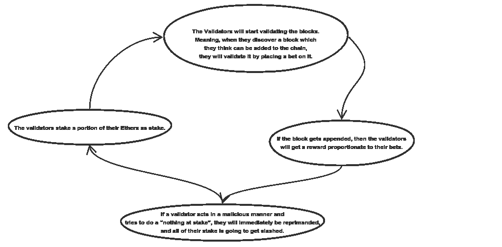

# 这三个项目正在塑造以太坊的未来

> 原文：<https://medium.com/coinmonks/these-three-projects-are-shaping-the-future-of-ethereum-778ab41b34b5?source=collection_archive---------6----------------------->

在过去的几年里，以太坊已经成为加密货币领域最重要的项目。作为市场上大多数令牌的底层，以太坊网络的健康对加密生态系统的其余部分至关重要。然而，以太坊一直在努力跟上增长的步伐。可扩展性挑战一直困扰着以太坊网络，以至于许多专家已经启动了辅助项目来创建替代区块链，从根本上解决一些限制。然而，以太坊团队并没有闲着，作为以太坊基金会的一部分，有几个项目正在孵化，专注于解决当前版本以太坊的一些基本限制。

以太坊的第 2 层扩展解决方案改进了以太坊网络的一些基本方面，如共识协议或其安全模型。考虑到以太坊公共区块链的规模和活动，您可以想象在不中断的情况下实现这些增强是一项艰巨的任务。虽然以太坊网络有几个第 2 层扩展项目，但有三个项目接近全面上市，我相信它们将是以太坊未来的关键。

# 鬼马小灵精

可以说是最著名和最受广泛期待的以太坊项目，Casper 提出了以太坊传统工作证明(PoW)算法的替代方案，采用了现代利益证明(PoS)模型，可以大大加快网络中的事务提交时间。关于 Casper 已经写了很多，所以我不打算用细节来烦你，但有几件事值得重述。首先，让我们从高层次了解 Casper 是如何工作的。PoS 协议基于传统拜占庭容错(BFT)模型，可以总结为以下简单步骤。

理解 Casper 不是一个单独的项目是很重要的。相反，Casper 可以看作是一个项目的集合。友好终结小工具(FFG)是一种混合 POW/POS 共识机制。这是将要首先实现的 Casper 版本。这在很大程度上是为了简化向股权证明的过渡。它的设计方式是在正常的 ethash 工作证明协议之上覆盖一个利益证明协议。因此，尽管块仍将通过 POW 进行挖掘，但每 50 个块将成为一个 POS 检查点，由验证器网络评估终结性。

另一个 Casper 项目被称为 Casper CBC，因为它使用了构造正确(CBC)协议。Casper CBC 在方法上不同于传统的协议设计:

(1)协议在开始时被部分指定

(2)协议的其余部分是以被证明满足期望的/必要的属性的方式导出的(典型地，协议被完全定义，然后被测试以满足所述属性)。

# 血浆

以太坊等离子体是另一个即将发布的项目，可能会对以太坊的未来产生非常大的影响。等离子的起源可以追溯到 2017 年 8 月 11 日，当时 Vitalik Buterin 和 Joseph Poon 发布了一篇题为[等离子:自主智能合同](http://plasma.io/plasma.pdf)的论文。Plasma 背后的主要思想是提供一种模型，该模型能够执行离线交易，同时依靠底层以太坊区块链来为其安全性提供基础。等离子的设计借用了闪电网络的一些想法，但是它扩展了这个概念，允许创造附属于以太坊区块链的“孩子”区块链。

在等离子体模型中，复杂的事务可以在子区块链中执行，与成千上万的用户一起运行整个应用程序，与以太坊主链的交互很少。等离子子链可以移动得更快，收取更低的交易费用，因为它的操作不需要在整个以太坊区块链复制。

# 分片

我第三喜欢的以太坊第二层扩展解决方案是分片。顾名思义，以太坊共享从现代 NoSQL 数据库的扩展架构中借鉴了一些概念。本质上，以太坊共享将网络的整个状态分割成一堆称为碎片的分区，这些分区包含它们自己独立的状态和事务历史。在这个系统中，某些节点将只处理某些分片的事务，这使得跨所有分片处理的事务的总吞吐量比主链现在让单个分片完成所有工作要高得多。

# 更好的以太坊

现在你知道了，虽然以太坊的可伸缩性问题确实很严重，但你可以说以太坊基金会开发的第 2 层解决方案是加密领域最先进的可伸缩性解决方案之一。当然，Casper、Plasma 和 Sharding 三者承诺解决以太坊的基本可扩展性挑战，并为更具创新性和可扩展性的协议铺平道路。