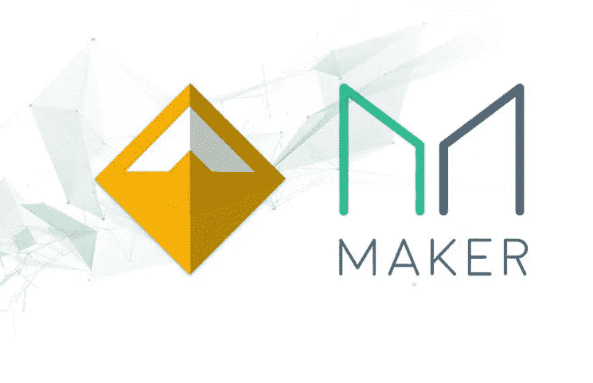
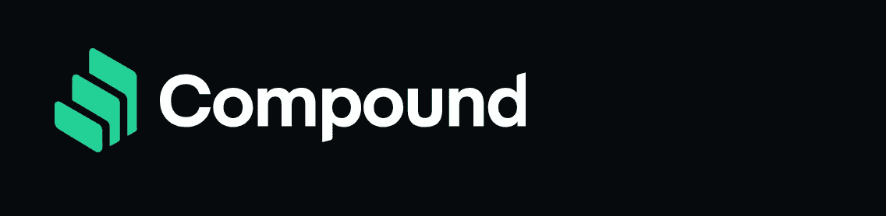
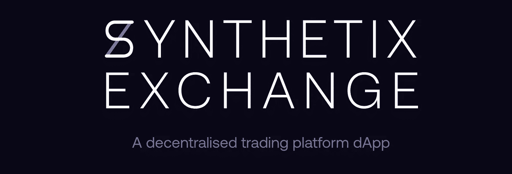
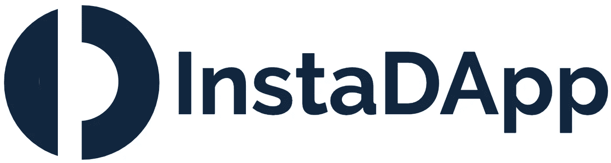
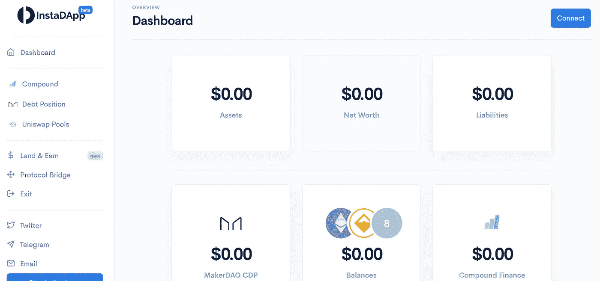
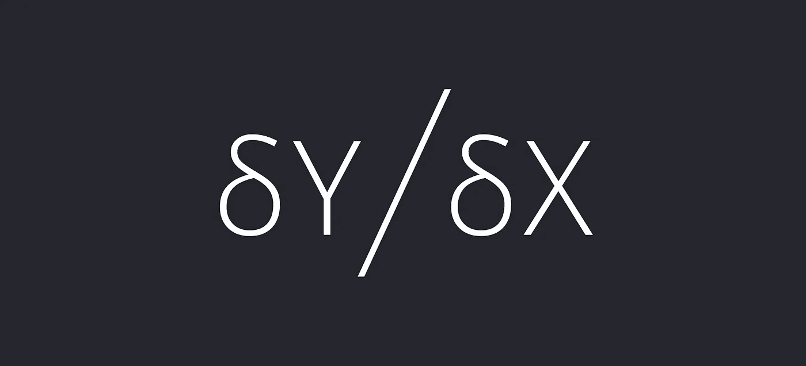
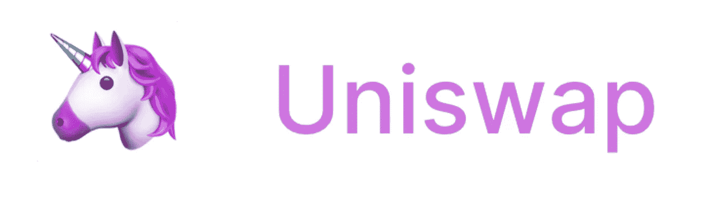
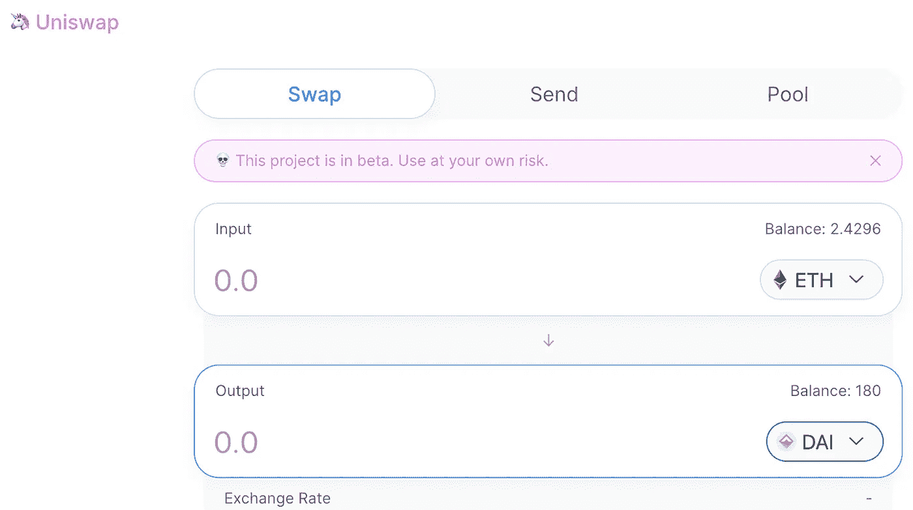

# 这些顶级的 DeFi 应用程序将我们从银行中解放出来

> 原文：<https://medium.com/coinmonks/these-top-defi-apps-are-freeing-us-from-banks-83f724bc543e?source=collection_archive---------1----------------------->

比特币承诺将我们从银行中解放出来，但以太坊可能是最终真正做到这一点的技术，通过 DeFi。

去中心化金融，或简称为 [DeFi](https://blog.coincodecap.com/tag/defi/) ，是加密社区中的一场运动，旨在创造去中心化和不受审查的金融产品。这里没有门卫。你所需要的只是你的元掩码钱包和一些密码

虽然比特币给了我们分散的金钱，但[以太坊](https://blog.coincodecap.com/tag/ethereum/)上的 [DeFi](https://blog.coincodecap.com/tag/defi/) 应用程序给了我们新的、更好的存钱、借钱和借钱的方式。这些去中心化的应用程序取代了银行今天赋予我们的许多功能，但与银行不同的是，它们不会要求我们放弃敏感的私人信息，向我们收取超额费用，甚至不会要求我们将资金委托给它们。

虽然还处于早期阶段，但这些应用已经拥有巨大的价值。根据 [DeFiPulse](https://defipulse.com/) 的数据，前 17 [DeFi](https://blog.coincodecap.com/tag/defi/) 应用的价值接近 5 亿美元。

让我们来看看顶级的[dapp](https://blog.coincodecap.com/tag/dapps/)，它们做什么以及如何工作。

# 1.马克道

*分散稳定控制*

迄今为止最成功的应用程序是 MakerDAO，一种加密抵押的稳定币。使用 Eth 作为抵押品，用户可以生成 DAI，一种与美元挂钩的稳定货币。

与传统贷款不同，用户不需要信用记录，甚至不需要银行账户。任何拥有兼容钱包和以太网的人都可以使用以太网作为抵押品生成 DAI。这种贷款可以用于杠杆交易、支付企业费用或传统贷款的其他用途。

与其他 stablecoins(如 Tether、USDC、GUSD、TUSD)不同，MakerDAO 的 DAI 是分散的，所有交易都可以在区块链上跟踪。这就避免了困扰稳定币行业的许多问题，比如难以获得银行账户和不透明。

虽然除了 Bitfinex 自己没有人知道他们的银行账户里有什么，但任何使用 MakerDAO 的人都可以检查区块链，看看被锁定的 ETH 是否足以作为流通中的 DAI 的抵押品。

关于马克尔道的一切，其实都是相当透明的。戴的用户可以查看当前的价格和利率，管理决策，如果他们购买一些令牌，甚至可以自己参与管理。

# 2.复合金融

*分散的货币市场*

如今第二大使用的 [DeFi](https://blog.coincodecap.com/tag/defi/) 应用是[复合金融](http://compound.finance)，一个加密借贷市场。与 Bitfinex 或 OKEx 等交易所以前的贷款市场不同，复合金融不托管资金。相反，平台上的加密货币由智能合约——区块链上的软件——持有。

Compound 上的每项资产都有一个基于智能合约的货币市场。用户的贷款被汇集到这些市场。这种汇集流动性的方法允许 Compound 在其支持的每个硬币上提供良好的流动性。

尽管 P2P 借贷市场会要求用户为每笔贷款协商条款和期限(任何使用 Bitfinex lending 的人都很清楚)，但复合货币市场中的密码是完全可替代的。用户可以很容易地贷款任何金额，而不用担心贷款的细节。此外，用户可以随时提取资金。

与传统储蓄账户可能支付高达 2.3%的利息([截至 2019 年](https://www.nerdwallet.com/blog/banking/best-savings-rates/))相比，复利目前提供的利率要高得多(目前戴的利率为 11%，为 7%)。与传统的货币市场账户不同，提款没有限制。简而言之，复利几乎在各个方面都是比传统货币市场账户更好的储蓄方式。

# 3.合成

*合成资产交易所*

Synthetix 使用合成资产，允许用户使用加密货币来投机加密货币生态系统之外的资产。以前你只能买卖加密货币，而现在你可以交易黄金、白银，甚至股票，而无需离开加密货币生态系统。

目前，Synthetix 上的可交易资产包括常见的加密货币，如 BTC 和 ETH，以及黄金和白银，但可以预见的是，股票或债券等其他资产也可以在该交易所创建和交易。

Synthetix 通过标记 Synthetix 的本地 SNX 令牌，以类似于 MakerDAO CDPs 的流程铸造这些合成资产。该抵押品用于提供可替代的流动性池。交易所的所有合成资产都与 SNX 池进行交易。作为回报，SNX 的赌注者可以获得交易费。

# 4.InstaDapp

*不止一个仪表板用于定义*

[InstaDapp](https://instadapp.io/) 是最好的[DeFi](https://blog.coincodecap.com/tag/defi/)dapp—maker Dao、Compound 和 UniSwap 的一站式仪表板。除了提供对顶级 DeFi Dapps 的轻松访问，它还包括交叉 Dapp 集成，使使用 [DeFi](https://blog.coincodecap.com/tag/defi/) 比单独使用那些[Dapp](https://blog.coincodecap.com/tag/dapps/)更容易、更好。

What InstaDapp’s first page looks like

InstaDapp 目前集成了 Compound、Maker 和 Uniswap。用户无需访问多个网站并多次登录，只需访问 InstaDapp 即可一次访问所有内容。

除了容易访问[Dapp](https://blog.coincodecap.com/tag/dapps/)之外，跨 Dapp 集成让一切都变得更好。对于 MakerDAO，InstaDapp 允许轻松创建和偿还 CDP。它促进了联邦储蓄银行与 MKR 的互换，简化了稳定费的支付。

由于借用 DAI 有时在 MakerDAO 上更便宜，有时通过 Compound InstaDapp 更便宜，因此它有一个“协议桥”功能，用户可以将他们的 ETH/DAI 头寸从 MakerDAO 交换到 Compound，反之亦然，以利用更低的利率。

# 5.dydx

dydx 将加密借贷平台带到了他们的自然结论，即整合借贷与 DEX，以创建一个具有杠杆作用的去中心化交易所。虽然 Compound 让你赚取加密的利息，而像 forkdelta 这样的 dexes 让你进行无信任的加密交易，但 dydx 做到了这一切。

结果甚至比各部分的总和还要好。dydx 提供了一个值得集中交换的光滑接口。用户可以很容易地存入资金，这些资金会自动开始赚取利息，然后使用这些资金进行交易，无论是否有保证金。订单簿、图表和订单界面和你用过的任何交易所一样好。

Dydx 不仅仅是一个分散的交易所。正是信任最小化了保证金交易，有了生息余额。它也是一个变相的贷款平台，利率与复利相比具有竞争力(戴目前在 dydx 上获得 12%的利息，而复利融资的利率约为 10%)。它不仅仅是一个分散的、更垃圾的集中式交易所，在很多方面都比我们以前拥有的要好。

6.Uniswap

*分散变形*

加密货币领域的老前辈都知道 ShapeShift——一个你可以轻松地将一种加密货币兑换成另一种加密货币的网站。如果你关注新闻，你可能也听说过 ShapeShift 面临的众多问题，比如[黑客攻击](http://hackingdistributed.com/2016/04/25/shapeshift-hack-simply-incredible/)，或者[关闭纽约居民的访问](https://www.quora.com/Why-Is-ShapeShift-io-blocked-in-New-York-and-Washington-State)

Uniswap 是更好的变形。专注于简单用户体验的分散式交换。这不是一个集中的公司，而是一个分散的应用程序。用户登录网站，直接通过他们的 metamask 或兼容的加密货币钱包进行交易。

Uniswap has a very clean and simple UI

Uniswap 除了它的分散性质之外，最好的部分是它的简单和干净的用户界面。只需进入 [uniswap.exchange](http://uniswap.exchange) ，连接您的 MetaMask 钱包并进行交易。与传统的 DEXes 不同，用户体验非常简单—您不必笨拙地键入或查找深奥的令牌合同地址。

有了更好的 UX，更好的汇率，没有取款费(除了汽油费)，不需要注册，这在任何方面都比集中交易要好。

DeFi =更好的财务。

顶级 DeFi 应用程序的关键之处不仅在于它们是分散的，还在于它们优于现有的解决方案。

MakerDAO 提供了一个完全透明的加密本地稳定币，允许用户保留他们的 ETH，同时仍然释放资金用于其他用途。不需要信用检查。

[Compound 的](http://compound.finance)利率比货币市场账户好几倍，有一个非常容易使用的界面，并且能够随时提取。

[Synthetix](http://synthetix.io) 允许难以获得外汇交易账户或无法进入特定股票市场的用户轻松推测价格。

dydx 提供了一个灵活的保证金交易界面，并集成了贷款功能。利息收入余额使这种交易所比许多现有的交易所更有利可图。

[Uniswap](http://uniswap.io) 让您可以快速轻松地在[以太坊](https://blog.coincodecap.com/tag/ethereum/)生态系统中的任何代币之间切换，而无需在中央交易所注册、登录和等待提款。

这不仅仅是**去中心化的金融**，这绝对比现在的情况要好——**DeFi 是金融的未来。**

> [直接在您的收件箱中获得最佳软件交易](https://coincodecap.com/?utm_source=coinmonks)

