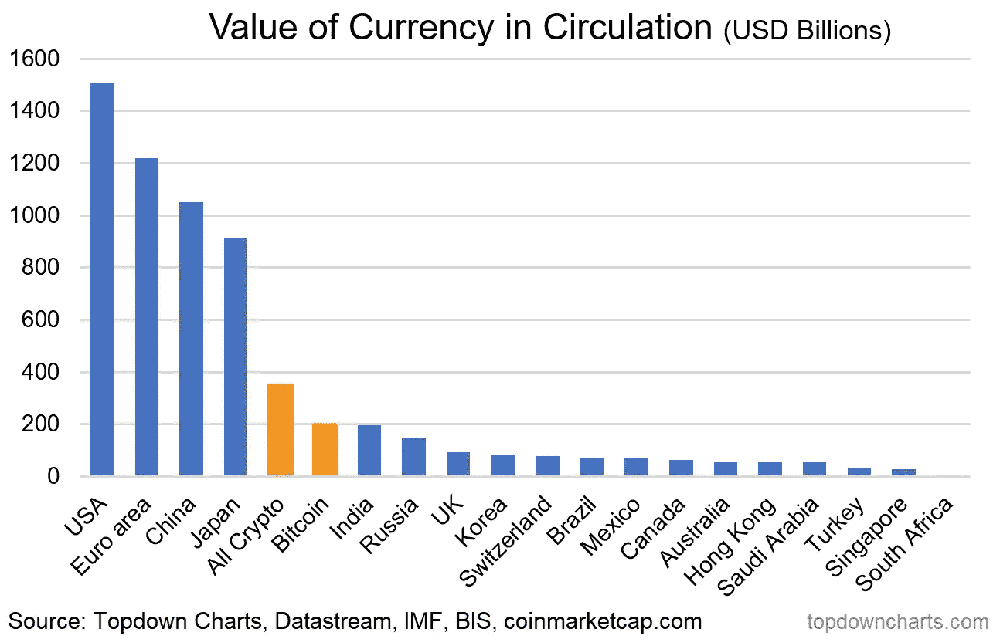
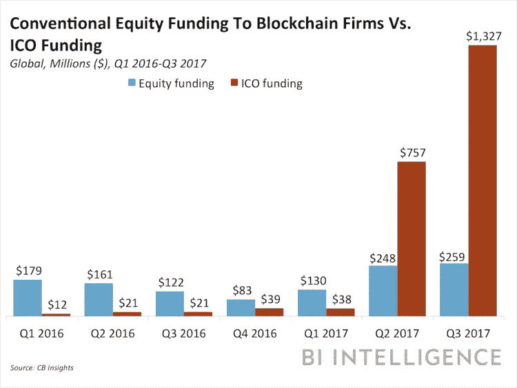
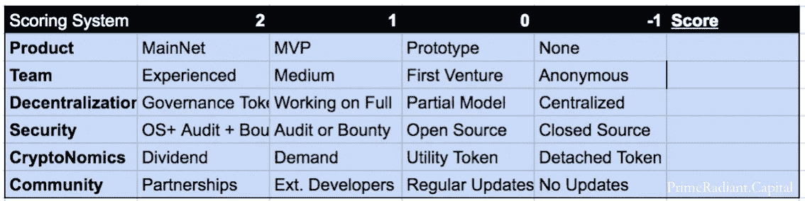

# 论文:投资科技泡沫

> 原文：<https://medium.com/coinmonks/thesis-investing-in-a-technology-bubble-b97736e3ce30?source=collection_archive---------6----------------------->

*注:我最初写这篇投资论文是在 2017 年 11 月，当时我正在探索“加密基金”的可行性。虽然我最终创办的公司 Prime Radiant 有点不同。既然泡沫已经破裂，我想分享这一点，因为它在这次“崩溃”中为我提供了很好的服务，而且由于这种方法最好在非理性熊市期间实施，也许它会有用。这不是投资建议，这个行业的每个人都在不断地编造。请你自己做出明智的决定。尽情享受吧！*

加密货币是一种数字货币，其中加密技术用于监管货币单位的生成和验证资金转移，独立于中央银行运行。迄今为止最成功的加密货币，比特币，现在价值 1500 亿美元，超过该国流通的大多数货币。

加密货币已经从简单的价值储存演变为数字代币，可以用来表示资产、股票、会员证明，或者最令人印象深刻的是，图灵完全可编程货币。这些新的令牌及其相应的加密网络是令人兴奋的新的去中心化世界(Web 3.0)的基础。

这些加密网络是通过公开和私下销售被称为初始硬币发行(ICO)的代币来启动的。在 ICO 事件之后，代币的价格通过全球许多法定货币和加密货币交易所的公开交易来确定。因此，代币的价格随着感知价值或使用而增加(和减少)。

2017 年，基于 ICO 的募资超过传统基于股权的募资 5 倍。然而，进入 2018 年仅两个月，2017 年 59%的比特币支持的 ICO 已经失败或半失败，这个数字只会增加。

考虑到这种极端的损失风险，以及简单地持有比特币会在 2017 年产生更大回报的事实，很明显，大多数代币的价格上涨主要不是来自实现的价值，而是围绕这一令人兴奋的新加密资产类别的投机活动增加。许多人现在有理由认为，我们正处在一个类似于上世纪 90 年代互联网泡沫的秘密泡沫中。

不像大多数人，我们认为泡沫是伟大的！因为正是在泡沫的狂热中，令人兴奋的新技术和基础设施得以建立。这种早期技术发展的循环，继之以导致泡沫的过度投资，继之以崩溃，然后随着技术的成熟而被采用，可以在美国对电报、铁路的采用以及最近 90 年代互联网的繁荣和萧条中看到。

看着 1999 年泡沫顶峰时期 100 美元买入的 AMZN 股票跌至 5 美元，客观上很难接受。如果你坚持到今天，你会实现 72%的年回报率(1400 美元)，因为对新技术的需求超过了早期采用者。这种技术采用的成熟是因为泡沫破裂的动力，以及泡沫破裂后供应的增加。

在 Prime Radiant，我们的核心信念是，投资泡沫的关键在于避免那些将会失败的业务，也在于知道哪些业务不仅会继续存在，而且会在低迷时期蓬勃发展。

# 机会:我们看到价值的地方

Prime Radiant 如何挑选那些将在这个新的去中心化世界中坚持下来的人？简而言之，我们投资于那些为真正的用户提供真正价值的人。猜测哪种加密货币的价格会在一天内上涨几个数量级，会产生巨大的财富和损失。这对我们来说是赌博。

相反，我们的重点是投资那些商业模式能够让其他人加入这个新生态系统的公司。正如我们的名字所示，我们坚信自我实现的预言。预测未来的最好方法是创造未来。

在旧金山淘金热期间，大部分利润不是由淘金者获得的，而是由那些为他们提供镐、铲和利瓦伊的人获得的。当淘金热破灭时，这些公司依然存在，因为它们可以将业务转向不同的客户和产品。

我们在这场数字淘金热中看到了同样的事情。虽然一些早期采用者在早期进入加密货币时赚了大钱。如今，大部分利润是由比特币基地(交易/支付)或比特大陆(供应采矿硬件)等服务公司实现的。这些公司的收入并不依赖于价格变动，并且能够迅速调整以适应技术的变化。

如果你最近才发现或投资了这个新市场，那么从最初对加密货币的狂热中获得指数回报可能为时已晚。但是，在这些新网络上启用和构建应用程序和工具仍处于早期阶段。

# 市场基本面

许多基金都在努力评估这种新的资产类别。你如何确定一个非现金流产生实体的价格倍数？加密货币应该作为货币、股票、商品还是某种混合体来估值？

虽然在加密网络经济学领域有许多令人兴奋的研究，但在其当前的婴儿状态下，不应该过于依赖它来做出投资决策。幸运的是，我们的大部分经验都是关于早期风险投资，在这种情况下，你通常只有几个人和一个想法。

在他们的基础上，每个网络、组织或企业都是人。根据我们的经验，团队是企业未来成功的最强有力的指标。即时价格流动性的一个很大的不利方面是落入根据股权/象征性价格做出短期决策的陷阱。投资于强大的团队，他们不会成为追逐短期价格收益的牺牲品，这是可以创造长期价值的地方。

# 评分标准

第二个强有力的指标是企业本身的基本面。代替定量工具，我们必须使用定性测量。为了客观地进行这项工作，我们开发了一个评分系统(如下)。

## 产品:

我们投资于热爱建设的团队。虽然建立一个可持续发展的企业通常需要大量的资金，但在测试网上实现原型只需要决心和几个周末。我们倾向于在开发的早期阶段识别产品，在这一阶段价值通常不会在价格中体现出来。

## 团队:

我们给之前一起构建过东西的团队最高分，给匿名团队最低分。我们知道比特币的创造者是匿名的，在这个领域有一些应用需要匿名。但在这个市场上，绝大多数匿名团队都是骗局。

## 权力下放:

分散共识机制的价值主张是拥有无信任的应用程序。我们将内置治理的令牌评为最高，但也为那些有计划在未来实施的令牌打分，因为这是一个复杂的问题，值得花时间来做好。然而，如果应用程序或协议的核心要求用户信任服务提供商，它与传统的 web 应用程序或协议没有什么不同，只是增加了额外的成本。

## 安全性:

密码终究是密码。我们最重视开源项目，运行漏洞奖励计划，并由经验丰富的安全研究人员进行定期审计。我们不会投资任何开发自己加密技术的公司。如果加密货币在密码学上不可证明是安全的，它就没有价值。这也是我们不重视闭源的原因。如果我们不能验证用来保护的方法，我们就认为它是不安全的。

## 密码经济学:

大多数 ICO 令牌都不是其基础网络正常运行所必需的。在泡沫中很难看到这一点，在泡沫中，价格纯粹是投机性的，但这为那些能够用基本令牌识别加密网络的人创造了机会。我们最看重那些返回软件定义的股息(2)且其资产由令牌持有者控制的 ICO。我们中性看待公用事业代币，因为它们可以创造价值，而不会导致价格上涨。

## 社区:

对于任何公共资助的项目来说，与用户和利益相关者的定期交流是最起码的。无线电静默或关注价格的更新被评为负面。除了简单的交流，我们非常重视为外部开发者开发工具和 api 的团队。这可能是增加网络价值的一种经济有效的方式。我们最看重能够以增值方式与“秘密世界”之外的企业合作的团队。

在 coinmarketcap 上列出的 1541 项资产中，我们已经确定了 20 项得分为正的资产。

## 定价令牌

一旦我们确定了一个机会，最后也是最困难的一步就是进行量化评估。在 Prime Radiant，我们通过专注于特定的令牌资产类别来最小化加密货币估值所需的假设:提供 dao 股权、软件定义的股息(或 burn)、息票或用作加密网络股份的令牌。有了这些阶级限制，我们就可以利用传统的评估框架来调整发展阶段。

根据我们的经验，这种方法往往会给出非常保守的估值，但不会限制我们的投资能力。事实上，以如此保守的估值建仓成功地降低了我们在熊市中的风险敞口。由于加密世界与现实世界没有什么不同，如果项目很完美，但价格太高，你不买。

巧合的是，所有 20 种评级为正的公开交易资产都属于上述资产类别之一。其中 7 家交易量低于其运营余额。我们相信，这种方法将比简单地持有所有加密资产的指数，以低得多的风险实现巨大的回报。

1.  卡伦·克莱和兰德尔·琼斯，《向财富迁移？加州淘金热的证据，《经济史杂志》，2008 年 12 月，第 68 卷第 4 期，第 997-1027 页
2.  随着转向回购/燃烧以规避 sec 监管，我对红利代币的看法有所改变，但那是另一篇文章。

> [在您的收件箱中直接获得最佳软件交易](https://coincodecap.com/?utm_source=coinmonks)

