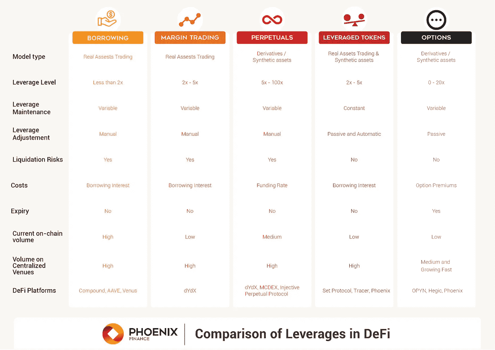
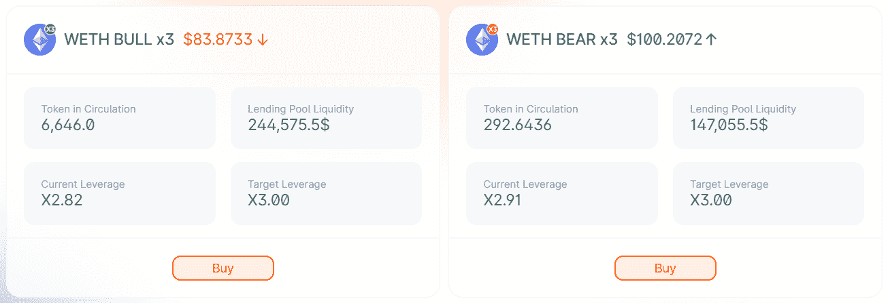
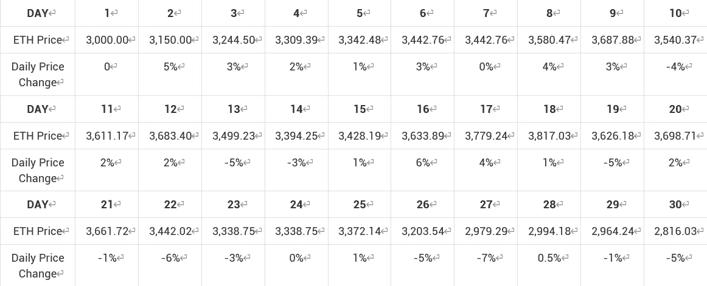
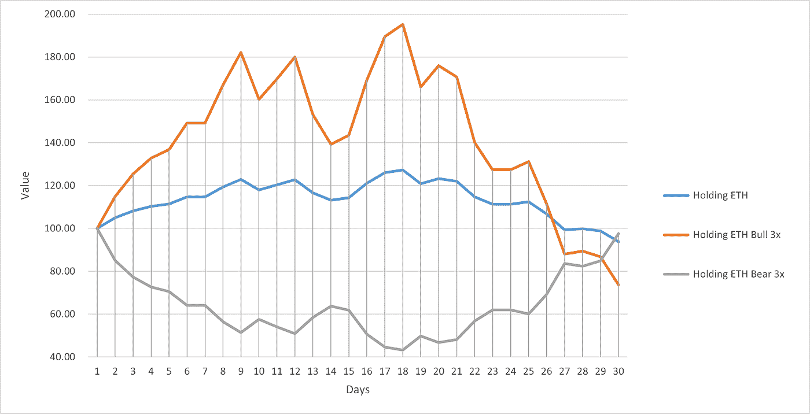
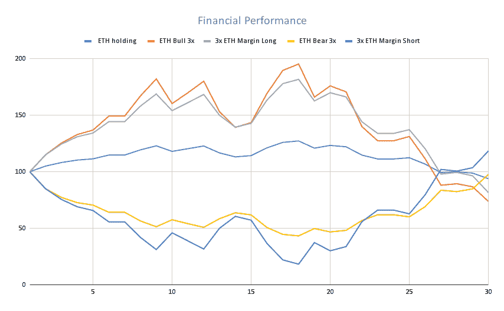

# 关于分散杠杆代币需要知道的事情

> 原文：<https://medium.com/coinmonks/things-one-needs-to-know-about-decentralized-leveraged-tokens-7703b344044f?source=collection_archive---------2----------------------->

市场上有几种去中心化杠杆代币的模型，包括 [Set 协议](https://www.tokensets.com/)、 [Tracer](https://tracer.finance/) 和[凤凰金融](http://phx.finance)。他们中的每一个都采用了非常不同的方法来表征杠杆头寸。

几个月前，我在去中心化杠杆代币上发布了我的去中心化解决方案的想法，凤凰财经在几周前将这些理论付诸实践。该协议现在在 Polygon、BSC 和 Wanchain 上运行，并有一个统一的接口。想进一步了解这款车型的朋友，请查看详情[这里](https://docs.phx.finance/about/productpaper/)。

# 什么是杠杆代币？

[杠杆代币](/coinmonks/leveraged-token-3f5257808b22)是为持有者提供稳定的加密资产杠杆敞口的衍生品。代币持有者无需担心积极管理杠杆头寸、借款或清算。

固定杠杆或杠杆范围由再平衡机制维持。

例如，Phoenix Finance 的 ETHBULL 3x 杠杆代币(也称为 3x Long ETH 代币)是一种 ERC-20 代币，其风险敞口相当于 ETH 回报的三倍。对于一天内上涨 1%的 ETH，ETHBULL 3x 杠杆代币将上涨 3%。

# 杠杆代币和其他杠杆工具的区别

杠杆代币和保证金交易/永续交易之间的最大区别在于，杠杆代币在达到某个阈值时会定期重新平衡，以保持特定的杠杆比率。

尽管有所不同，但保证金交易和永久资产等产品会根据价格波动不断改变杠杆，即使交易员在建立头寸时设定了预定的杠杆。

你可以查看[这篇文章](https://coinmarketcap.com/alexandria/article/a-deep-dive-into-leverages-in-defi-borrowing-margin-trading-leveraged-tokens-and-options-finnexus#toc-leverages-in-defi)了解更多关于不同 DeFi 产品中杠杆作用的细节。

# 交易凤凰杠杆代币前要知道的事情

## 一个非常容易使用的杠杆产品

菲尼克斯将分散的杠杆产品标记为 ERC-20 形式。这些代币可以互换。

用户只需购买并持有代币，就可以获得某项基础资产的固定 3 倍杠杆敞口。杠杆化风险敞口是自动授予的。积极管理杠杆头寸并不令人担忧。如果有人想关闭它，他们需要做的就是出售代币。

此外，杠杆化的令牌**将重新平衡自身，以稳定的方式进行杠杆化。**用户无需处理保证金、清算、抵押品或融资利率。它们都嵌入在代币的契约中。这为打算持续稳定地利用某种加密资产的用户提供了一种极其友好的方式。

目前，通过支持多区块链的联合接口可以访问 Phoenix 协议。

## 一种用来交易而不是持有的产品

**被 FTX 交易所创造出来后，虽然持仓不变，但通常被认为是一种可以交易的产品，而不是长期持有**。它们为交易者提供了额外的选择，以在短期内获得更多的敞口和利润。

主要论点在于再平衡机制，使杠杆保持稳定状态。正如这里的[所介绍的](https://docs.phx.finance/leveragedtokens/basics/)，如果没有重新平衡杠杆，就像在保证金交易中一样，实际的杠杆水平将随着基础资产的价格变动而变化。为了保持杠杆率的稳定，在每次再平衡的时候，每个杠杆化的代币都会进行利润再投资(如果有利润的话)，如果亏损的话，会将部分头寸出售给去杠杆化以降低风险。它不同于保证金交易或永久交易。当财务表现与他们的预期不同时，杠杆代币持有者可能会感到困惑。

对于长期杠杆代币持有者来说，实际上是在对抗杠杆再平衡可能带来的不利影响。与保证金交易相比，当你获得利润时，再平衡将通过再投资“膨胀”实际杠杆，尽管真正的意图是稳定杠杆。如果之后市场走势不利，你会因为“膨胀”的风险而遭受更大的财务损失。当然，在市场行情有利的时候，你可能会赚得更多。

简而言之，杠杆代币是短期交易的简单而强大的工具，但在长期持有时，请更加注意再平衡的干扰。由于多重再平衡的干扰，一个人持有代币的时间越长，它看起来就越不可预测。

请查看下面的“财务表现”部分，了解有关该主题的更多信息。

## 100%担保的产品

与合成资产不同，合成资产的表现反映了持有这些基础资产的人，凤凰分散杠杆代币通过实际持有这些头寸，确保这些代币是 100%抵押的。换句话说，凤凰分散杠杆代币是资产支持代币。

这意味着，当凤凰分散杠杆代币被创建时，包括借贷和交易在内的一系列交易被执行。借贷池的建立为代币的杠杆作用提供了动力，分散的交易所在购买、出售和再平衡交易时进行合作。这些机制确保菲尼克斯杠杆代币的净值总是由真实的资产和债务支持。

反过来，这确保了在进行交易和跟踪杠杆业绩的金融保险时，交易对手的风险最小。

## 杠杆代币依赖于基础代币在指数上的流动性

尽管杠杆代币被令牌化为 ERC20 形式，但 Phoenix 协议并未有意在代币上建立流动性池。换句话说，交易不依赖于杠杆代币的流动性。

当购买凤凰杠杆代币并取得杠杆时，铸造相同数量的杠杆代币，并且当凤凰杠杆代币被出售时，它们被兑换为指定的资产。在这两种情况下，将根据基础代币的流动性触发一系列交易。

例如，假设没有交易成本或价格滑移，亚历克斯向 USDC 购买 1 单位的 ETHBULL (3x)令牌，其净值为 100 美元。

在收到 100 美元 USDC 后，合同被触发从池中借入 200 USDC。然后，300 USDC 将从分散的交易所交易为 ETH。同时，该合同将创建 1 个单位的 ETHBULL (3x)令牌。因此，杠杆代币的流动性取决于指定分散交易所的基础代币池(在这种情况下为 ETH/USDC)。

这种机制充分利用了 DEXes 上的现有流动性，而不需要创建其他杠杆化的 token 对。

## 财政状况

由于在重新平衡时需要恢复杠杆，更高的波动性可能会给交易者带来意想不到的困难。特别是在多重再平衡的情况下，再杠杆化和去杠杆化的影响是复合的。数学结果可能出乎人们的意料。

在波动性较低的有利趋势市场中，长期表现更有可能超过保证金交易的回报，因为收益在再平衡中复合。然而，在动荡的市场中，同样的机制可能会损害代币的长期表现。

让我们用例子来仔细看看杠杆代币的财务表现。(假设每天重新平衡到 3 倍的利用率)

假设 3 个用户在第 1 天分别在 ETH、ETH Bull 3x 和 ETH Bear 3x 投资 100 美元。未来 30 天内，ETH 价格变化如下。

这三个投资组合有不同的财务表现。计算结果可以在第一页的中看到。

我们可能会注意到:

*   杠杆代币放大了 ETH 的波动性。
*   如果我们仔细观察每日表现，杠杆代币的表现或多或少与 3 倍杠杆预期相同。
*   在前 9 天，当 ETH 价格稳步上升时，ETH 牛市令牌有 82%的涨幅，超过+23%的 ETH 价格涨幅 3 倍以上。与此同时，ETH Bear 3x 遭受了 49%的损失，不到 ETH 上涨的 3 倍。这是由于去杠杆化机制——收益被复利放大，损失被去杠杆化保护。
*   在第 9 天和第 20 天之间的波动时期，ETH 的价格从 3688 涨到 3699。然而，ETH 牛市和熊市令牌都在贬值，这证明了波动性是杠杆令牌的敌人这一观点。
*   在过去的 10 天里，当 ETH 价格稳步下降时，ETH 空头令牌的价值随着杠杆作用而上升，而 ETH 多头令牌的价值急剧下降。
*   如果我们把 30 天的业绩作为一个整体来看，ETH 价格下降了 5%。但 ETH 牛令牌下降 26%，ETH 熊令牌下降 2%。

换句话说，由于再平衡机制，杠杆代币的长期表现可能更不可预测。

因此，鼓励长期杠杆代币投资者积极监控其投资，并考虑减轻再平衡影响的策略。

**让我们再看一看，把 3 倍保证金交易也包括在比较中。**

如第二页所示:

*   杠杆代币和保证金交易都有明显的放大波动性的效果，杠杆是 3 倍。
*   在趋势市场的前 9 天，杠杆牛市令牌在保证金交易中的表现优于渴望期权。
*   在趋势市场的前 9 天，杠杆熊市的损失小于在保证金交易中做空。
*   从第 20 天到第 30 天，杠杆牛市令牌的下跌幅度比 3 倍的 ETH 多头保证金更大，因为杠杆比之前的收益更高。
*   从第 20 天到第 30 天，杠杆化的空头令牌恢复的速度低于 3 倍的 ETH 空头保证金，因为在之前的再平衡中通过去杠杆化获得的杠杆较少。
*   在第 18 天，拥有 3 倍 ETH 空头保证金的交易者遭受了 82%的价值下跌。如果价格继续上涨，他们将面临被清算的巨大风险。相反，杠杆化熊证持有者的净值损失了 57%，即使 ETH 继续上涨，他们也不会被清算。
*   保证金交易更容易预测，因为它总是持有第一天的 3 倍杠杆头寸。杠杆代币更难预测，因为它们总是持有前一天的 3 倍杠杆头寸。换句话说，实时杠杆是定期调整的(在我们的例子中是每天)。

为了减轻再平衡中不可预测性的风险，Phoenix 协议应用一个范围来触发预定的再平衡。如果实际杠杆率在 2.5 至 3.5 之间，则不会启动再平衡，以降低自动复利的效果。

# 其他风险

杠杆令牌协议中可能还涉及其他风险。强烈建议在进行任何交易之前检查这些文件中的[潜在风险。](https://docs.phx.finance/leveragedtokens/risks/)

# 结论

本文介绍了凤凰财经平台上的杠杆代币模型设计的几个主要特点，其中一些可能不同于传统的杠杆工具。使用凤凰杠杆代币进行任何交易或投资前，请 DYOR。

> 加入 Coinmonks [电报频道](https://t.me/coincodecap)和 [Youtube 频道](https://www.youtube.com/c/coinmonks/videos)了解加密交易和投资

## 另外，阅读

*   [网格交易机器人](https://blog.coincodecap.com/grid-trading) | [Cryptohopper 审查](/coinmonks/cryptohopper-review-a388ff5bae88) | [Bexplus 审查](https://blog.coincodecap.com/bexplus-review)
*   [Godex.io 审核](/coinmonks/godex-io-review-7366086519fb) | [邀请审核](/coinmonks/invity-review-70f3030c0502) | [BitForex 审核](https://blog.coincodecap.com/bitforex-review)
*   [最佳比特币保证金交易](/coinmonks/bitcoin-margin-trading-exchange-bcbfcbf7b8e3) | [萝莉点评](/coinmonks/lolli-review-e6ddc7895ad8) | [比特币保证金交易](https://blog.coincodecap.com/bityard-margin-trading)
*   [创造并出售你的第一个 NFT](https://blog.coincodecap.com/create-nft) | [密码交易机器人](https://blog.coincodecap.com/best-crypto-trading-bots)
*   [折叠 App 回顾](https://blog.coincodecap.com/fold-app-review) | [本地比特币回顾](/coinmonks/localbitcoins-review-6cc001c6ed56) | [Bybit vs 币安](https://blog.coincodecap.com/bybit-binance-moonxbt)
*   [加密保证金交易交易所](/coinmonks/crypto-margin-trading-exchanges-428b1f7ad108) | [赚取比特币](/coinmonks/earn-bitcoin-6e8bd3c592d9) | [Mudrex 投资](https://blog.coincodecap.com/mudrex-invest-review-the-best-way-to-invest-in-crypto)
*   [WazirX vs CoinDCX vs bit bns](/coinmonks/wazirx-vs-coindcx-vs-bitbns-149f4f19a2f1)|[block fi vs coin loan vs Nexo](/coinmonks/blockfi-vs-coinloan-vs-nexo-cb624635230d)
*   [杠杆代币](/coinmonks/leveraged-token-3f5257808b22) | [最佳密码交易所](/coinmonks/crypto-exchange-dd2f9d6f3769) | [Paxful 点评](/coinmonks/paxful-review-4daf2354ab70)
*   [支持卡审核](https://blog.coincodecap.com/uphold-card-review) | [信任钱包 vs 元掩码](https://blog.coincodecap.com/trust-wallet-vs-metamask)
*   [Exness 评测](https://blog.coincodecap.com/exness-review)|[moon xbt Vs bit get Vs Bingbon](https://blog.coincodecap.com/bingbon-vs-bitget-vs-moonxbt)
*   [如何开始通过加密贷款赚取被动收入](https://blog.coincodecap.com/passive-income-crypto-lending)
*   [Coldcard 评论](https://blog.coincodecap.com/coldcard-review) | [BOXtradEX 评论](https://blog.coincodecap.com/boxtradex-review)|[unis WAP 指南](https://blog.coincodecap.com/uniswap)
*   [阿联酋 5 大最佳加密交易所](https://blog.coincodecap.com/best-crypto-exchanges-in-uae) | [SimpleSwap 评论](https://blog.coincodecap.com/simpleswap-review)
*   [购买 Dogecoin 的 7 种最佳方式](https://blog.coincodecap.com/ways-to-buy-dogecoin) | [ZebPay 评论](https://blog.coincodecap.com/zebpay-review)