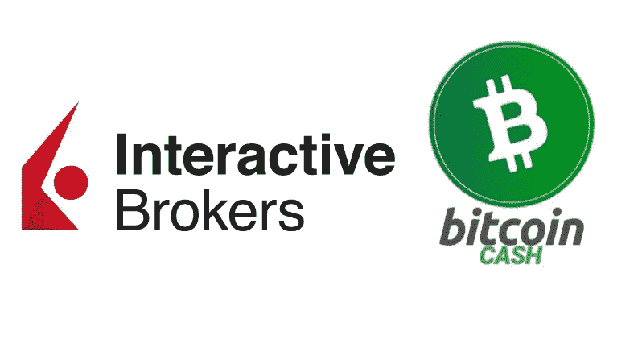
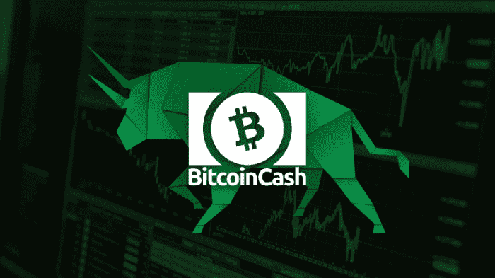
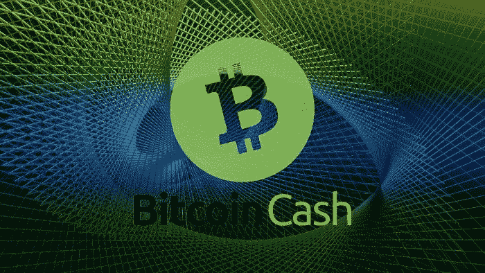

# 这个 3500 亿美元的基金现在提供比特币现金交易

> 原文：<https://medium.com/coinmonks/this-350-billion-fund-is-now-offering-bitcoin-cash-trading-eca62ef83a40?source=collection_archive---------7----------------------->

**Interactive Brokers LLC** 是全球顶级投资平台之一。

它一直是交易股票、外汇和商品以及其他资产类别的首选，现在为其美国客户提供比特币现金交易。总共 IB 服务 **1.4** **百万**客户持有**3750 亿**美元资产。

Interactive Brokers LLC (IB)比 Robinhood 和 CashApp 加起来还重要。

又一次，一个领先的金融平台选择了比特币现金作为顶级加密货币。

Interactive Brokers 只为其加密交易平台选择了四种加密货币:

**BCH、BTC、瑞士联邦理工学院和 LTC** 。

# 比特币现金总是在机构的显微镜下

[*Source*](https://coincodex.com/en/resources/images//admin/news/bch-price-analysis/bitcoin-cash-price-analysis-bullish.jpg:resizeboxcropjpg?1580x888)

由于几乎每个提供加密货币投资的金融机构都将比特币现金作为优先选择，因此可以肯定的是，比特币也被视为一种潜力巨大的资产。机构投资者和合格投资者主要通过这些平台进行投资(PayPal 除外)，与 Robinhood、CashApp 和其他面向小额投资者的应用不同，这些是真正的交易。

让我们回顾一下领先的金融组织和支付网络将比特币现金视为首选的加密货币:

**i) PayPal: (BCH — BTC —瑞士联邦理工学院—瑞士联邦理工学院)**

自 2020 年以来，它为美国客户提供**比特币现金(BCH)** 、比特币(BTC)、以太坊(ETH)和莱特币(LTC)的交易，最近还扩大了其在英国的“加密”业务。

**ii)灰度:(BCHG — GBTC —埃塞— LTCN — ETCG)**

灰度比特币现金信托(BCHG)现已与 ETC 和 LTC 基金一起被批准为 SEC 报告公司。它为未来的比特币现金 ETF 开辟了道路。这一举措是 2020 年以太坊机构采用的催化剂(ETH 的价格现在高出 30 倍)。

*也读作:* [**灰度的比特币现金信托成为 SEC 报告公司**](https://read.cash/@Pantera/grayscales-bitcoin-cash-trust-to-become-sec-reporting-company-84ac9c2c)

目前，gray 的信托中只有五家是 SEC 报告的:比特币(GBTC)、以太坊(Ethereum)、比特币现金(BCHG)、莱特币(LTCN)、以太坊经典(ETCG)。

**三)摩根大通&公司:(BCH — BTC —瑞士联邦理工学院等)**

多年来一直带头反对比特币和加密货币的银行最近来了个 180 度大转弯，现在只提供四种选定加密货币的投资敞口:比特币现金、BTC、以太坊和以太坊经典。

*亦读:* [**摩根大通允许散户投资者获得比特币现金**](https://read.cash/@Pantera/jpmorgan-allows-access-to-retail-investing-in-bitcoin-cash-c82844b4)

**四)SBI 控股公司:(XRP — BCH — BTC —瑞士联邦理工学院— LTC)**

日本金融巨头 SBI 银行现在向零售客户提供比特币现金投资服务。它总共只提供五种加密货币:Ripple、比特币现金、BTC、以太坊和莱特币。

*又念:* [**比特币现金被 SBI 银行选为日本首只加密基金**](https://read.cash/@Pantera/bitcoin-cash-was-selected-by-sbi-bank-for-the-first-crypto-fund-in-japan-049ea9b7)

**v) 21 股** : ( **BCH — BTC — ETH)**

21 Shares 使用 Xetra 平台(法兰克福证券交易所 DAX)提供第一个**欧洲比特币现金 ETP** 。

它还为欧洲机构投资者和合格投资者提供比特币 BTC 和以太坊 etp。

*又读:* [**欧洲比特币现金 ETP—【ABCH】**](https://read.cash/@Pantera/bitcoin-cash-etp-in-europe-abch-01effa54)

# 最后

*Source:* [*Pixabay*](https://pixabay.com/illustrations/fractal-background-mathematics-1800242/) *(modified)*

有一个问题困扰着密码领域的许多投资者:

**为什么比特币现金目前在加密市值指数中处于历史低点，低于许多新的甚至未经测试的加密货币？**

比特币现金是首选，并且总是被所有金融机构作为投资选项，以及少量其他加密货币。最新的一个例子是交互式经纪人，他们将比特币现金从市值列表中的任何其他现金中优先考虑。

比特币现金已经巩固了其作为四大加密货币之一的地位，这也体现在市值指数中只是时间问题。

人们只能假设，由于这种接受、发展、大规模采用水平和用户群的巨大增长，BCH 的价格仍然受到抑制，并将有一个爆炸性上涨的时刻。

**跟我上:***●*[***read cash***](https://read.cash/@Pantera)*】●*[***noise cash***](https://noise.cash/u/Pantera99)*●*[***Medium***](/@panterabch)*●*[*蜂巢*](https://hive.blog/@pantera1) *●* **●*[***推特***](https://twitter.com/Panterabch)*●*[***领英***](https://www.linkedin.com/in/panterabch/)****●*****

******如果你喜欢这篇文章，别忘了订阅并点赞！******

***原发布于*[*https://read . cash*](https://read.cash/@Pantera/this-350-billion-fund-is-now-offering-bitcoin-cash-trading-f70f44e1)*。***

> **加入 Coinmonks [电报频道](https://t.me/coincodecap)和 [Youtube 频道](https://www.youtube.com/channel/UCbyDhTbOiKh2iUMKBi4-4Zg)了解加密交易和投资**

## **另外，阅读**

*   **[尤霍德勒 vs 科恩洛安 vs 霍德诺特](/coinmonks/youhodler-vs-coinloan-vs-hodlnaut-b1050acde55a) | [Cryptohopper vs 哈斯博特](https://blog.coincodecap.com/cryptohopper-vs-haasbot)**
*   **[币安 vs 北海巨妖](https://blog.coincodecap.com/binance-vs-kraken) | [美元成本平均交易机器人](https://blog.coincodecap.com/pionex-dca-bot)**
*   **[如何在印度购买比特币？](/coinmonks/buy-bitcoin-in-india-feb50ddfef94) | [WazirX 审核](/coinmonks/wazirx-review-5c811b074f5b) | [BitMEX 审核](https://blog.coincodecap.com/bitmex-review)**
*   **[加密货币储蓄账户](/coinmonks/cryptocurrency-savings-accounts-be3bc0feffbf) | [赌注加密](https://blog.coincodecap.com/staking-crypto) | [加密交易机器人](https://blog.coincodecap.com/best-crypto-trading-bots)**
*   **[BigONE 交易所评论](/coinmonks/bigone-exchange-review-64705d85a1d4) | [CEX。IO 审查](https://blog.coincodecap.com/cex-io-review) | [交换区审查](/coinmonks/swapzone-review-crypto-exchange-data-aggregator-e0ad78e55ed7)**
*   **[最佳比特币保证金交易](/coinmonks/bitcoin-margin-trading-exchange-bcbfcbf7b8e3) | [比特币保证金交易](https://blog.coincodecap.com/bityard-margin-trading)**
*   **[加密保证金交易交易所](/coinmonks/crypto-margin-trading-exchanges-428b1f7ad108) | [赚取比特币](/coinmonks/earn-bitcoin-6e8bd3c592d9) | [Mudrex 投资](https://blog.coincodecap.com/mudrex-invest-review-the-best-way-to-invest-in-crypto)**
*   **[WazirX vs coin dcx vs bit bns](/coinmonks/wazirx-vs-coindcx-vs-bitbns-149f4f19a2f1)|[block fi vs coin loan vs Nexo](/coinmonks/blockfi-vs-coinloan-vs-nexo-cb624635230d)**
*   **[BlockFi 信用卡](https://blog.coincodecap.com/blockfi-credit-card) | [如何在币安购买比特币](https://blog.coincodecap.com/buy-bitcoin-binance)**
*   **[美国最佳加密交易机器人](https://blog.coincodecap.com/crypto-trading-bots-in-the-us) | [经常性评论](https://blog.coincodecap.com/changelly-review)**
*   **[在印度利用加密套利赚取被动收入](https://blog.coincodecap.com/crypto-arbitrage-in-india)**
*   **[德国最佳加密交易所](https://blog.coincodecap.com/crypto-exchanges-in-germany)**