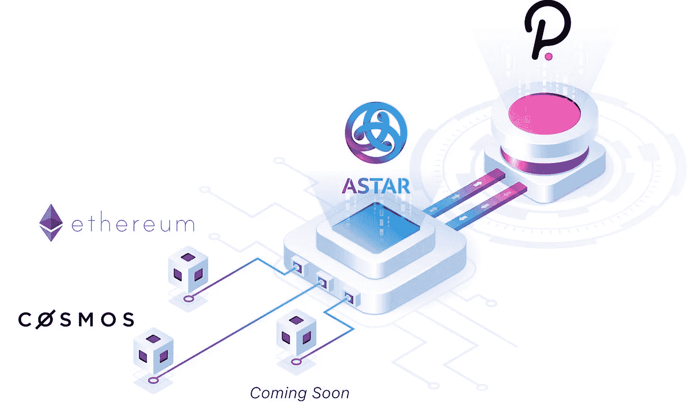

# 这个项目可能是 Polkadot 中最好的——第 1 部分

> 原文：<https://medium.com/coinmonks/this-project-might-be-the-best-in-polkadot-part-1-2a546739d70e?source=collection_archive---------0----------------------->

波尔卡多特是作为一个中继链建造的。这意味着它在架构上做了权衡，它本身并不是一个完整的区块链。Polkadot 没有智能合约功能。它只为将与之链接的副链提供安全性和治理。这些副链将成为第一层区块链。

考虑到这样的架构，必须有一个区块链/s 来提供智能合约，可以被各种应用利用，从而使 Polkadot 真正具有互操作性。Astar 网络(以前叫 Plasm)就是这样一个解决方案。

# 关于

Astar 是一个可扩展的智能合同平台，建立在 Polkadot 背后的基础技术 Substrate 之上。它的目标是成为 Polkadot 的 dapp 中心，支持以太坊、WebAssembly、dApp、Staking 和 Layer2 解决方案。

甚至在完全成为波尔卡多特的副链之前，Astar 已经建立了一个包含 40 多个项目的生态系统。

# Astar 解决什么问题

由于 Polkadot 没有自己的智能合约，因此需要一个平台来为 dapps 提供所需的智能合约基础架构。开发人员可以安心地专注于他们的产品。Astar 网络因此提供了可扩展性和互操作性，并增加了 Polkadot 的安全性和治理。

# Astar 的产品

**dApps 赌注:** Astar Network 创建了一种机制，通过这种机制，网络赌注奖励的 50%将流向智能合同的开发者或管理员。

**多虚拟机:** Astar 原生支持以太坊虚拟机和 WebAssembly。Gavin Wood 之前说过，尽管 Webassembly 是未来的趋势，但支持以太坊虚拟机(EVM)这样的遗留基础设施也很重要。Astar 正在开发一款产品，该产品将允许智能合约执行调用，并从同一区块链内的不同虚拟机和语言中读取存储数据。

**运营商交易:** Astar 网络可以对智能合约进行令牌化，转让合约所有权。它提供了一种买卖 Astar 应用程序的方式。

**多重锁落:**使用 Astar 的锁落，参与者可以在一定时间内锁定其他区块链(ETH、DOT 或 KSM)的令牌，并获得本地令牌。这给 Astar 带来了 DeFi 元素。

# 令牌实用程序

Astar token(波尔卡多特)和 Shiden(草间弥生)用于运行网络和支付费用

为连锁交易付款

参与投票和公投等治理活动

下注并赢取更多 ASTAR / SHIDEN 代币

# 提供资金

Astar 在波尔卡多特生态系统中广受欢迎。它被认为是草间弥生/波尔卡多特中技术最先进的团队之一。Astar 由顶级风投资助。主要的风投包括:

币安实验室

分布施资本

霍比创投

DFG

Okex Blockdream ventures

# 同意

Web 3 资助经常被认为是 Polkadot 项目成就的最重要的衡量标准，Astar 是其中最高的。迄今为止，它已收到 7 笔赠款，其中 4 笔已经交付，3 笔正在进行中。他们为 Web 3 Foundation 所做工作包括:

用于衬底的等离子体模块

墨水！操场

血浆链+ OVM 实施

波尔卡多特 JS 的 ECDSA

Polkadot JS 的硬件 ECDSA

ZK 辊式托盘

ZK Plonk 托盘

# 成就

在这么短的时间内，Astar 取得了相当多的成就:

1.金丝雀网络，世登赢得第三届草间弥生 Parachain 拍卖

2.它已经获得了 7 次 Web3 资助

3.通过 Lockdrop 计划，大约 150，000+ETH 被锁定在 Astar 智能合同中。

4.目前，Astar 正在与近 40+个项目合作，包括 DeFi、Dao、等。

5.Astar 在 Polkadot Testnet 上部署了首个智能 WASM 合同。他们还用 Acala 的 testnet parachain 完成了第一个跨链消息在 Polkadot Testnet 上的传递。

6.支持洛可可上 Astar 网络 testnet parachain 中的以太坊虚拟机。

在文章的第二部分，我们将继续讨论 Astar 的一些其他参数(合作关系、施登——金丝雀网络、竞争对手和价格牵引力)。我们将通过这种 360 度的项目分析，看看我们能否挖掘出 Astar 的真正价值。

**阅读更多:** [什么是 Web 3 经济](https://ruma-das.medium.com/what-is-web-3-economy-116eb2b73cf)

***注:*** *本帖最初发表于* [*此处*](https://crypto.writer.io/p/this-project-might-be-the-best-in) *与* [*上的子帖同*](https://crypto.writer.io/) *。*

**通过我的推荐加入**

[Crypto.com](https://binance.com/en/register?ref=E8PCD3AF)——[币安](https://platinum.crypto.com/r/sut3pd9bzn)

跟我来

**👉** [推特](https://twitter.com/rumadas123)

**👉**[**Linkedin**](https://www.linkedin.com/in/ruma-das-a1439320/)

****附属链接包括****

> **加入 Coinmonks [电报频道](https://t.me/coincodecap)和 [Youtube 频道](https://www.youtube.com/c/coinmonks/videos)了解加密交易和投资**

## **另外，阅读**

*   **[电网交易机器人](https://blog.coincodecap.com/grid-trading) | [Cryptohopper 审查](/coinmonks/cryptohopper-review-a388ff5bae88) | [Bexplus 审查](https://blog.coincodecap.com/bexplus-review)**
*   **[7 个最佳零费用加密交易平台](https://blog.coincodecap.com/zero-fee-crypto-exchanges)**
*   **[分散交易所](https://blog.coincodecap.com/what-are-decentralized-exchanges) | [比特 FIP](https://blog.coincodecap.com/bitbns-fip) | [Pionex 审查](https://blog.coincodecap.com/pionex-review-exchange-with-crypto-trading-bot)**
*   **[非洲最佳加密交易所](https://blog.coincodecap.com/crypto-exchange-africa) | [胡交易所评论](https://blog.coincodecap.com/hoo-exchange-review)**
*   **[eToro vs robin hood](https://blog.coincodecap.com/etoro-robinhood)|[MoonXBT vs by bit vs Bityard](https://blog.coincodecap.com/bybit-bityard-moonxbt)**
*   **[Stormgain 评论](https://blog.coincodecap.com/stormgain-review) | [Probit 评论](https://blog.coincodecap.com/probit-review) | [北海巨妖评论](/coinmonks/kraken-review-6165fc1056ac)**
*   **[如何在势不可挡的域名上购买域名？](https://blog.coincodecap.com/buy-domain-on-unstoppable-domains)**
*   **[印度的加密税](https://blog.coincodecap.com/crypto-tax-india) | [altFINS 审核](https://blog.coincodecap.com/altfins-review) | [Prokey 审核](/coinmonks/prokey-review-26611173c13c)**
*   **[Blockfi vs 比特币基地](https://blog.coincodecap.com/blockfi-vs-coinbase) | [BitKan 点评](https://blog.coincodecap.com/bitkan-review) | [期货交易机器人](/coinmonks/futures-trading-bots-5a282ccee3f5)**
*   **[南非的加密交易所](https://blog.coincodecap.com/crypto-exchanges-in-south-africa) | [BitMEX 加密信号](https://blog.coincodecap.com/bitmex-crypto-signals)**
*   **[MoonXBT 副本交易](https://blog.coincodecap.com/moonxbt-copy-trading) | [阿联酋的加密钱包](https://blog.coincodecap.com/crypto-wallets-in-uae)**
*   **[MoonXBT vs Bybit vs 币安](https://blog.coincodecap.com/bybit-binance-moonxbt)**
*   **[雷米塔诺审查](https://blog.coincodecap.com/remitano-review)|[1 英寸协议指南](https://blog.coincodecap.com/1inch)**
*   **[买 PancakeSwap(蛋糕)](https://blog.coincodecap.com/buy-pancakeswap)|[matrix export Review](https://blog.coincodecap.com/matrixport-review)**