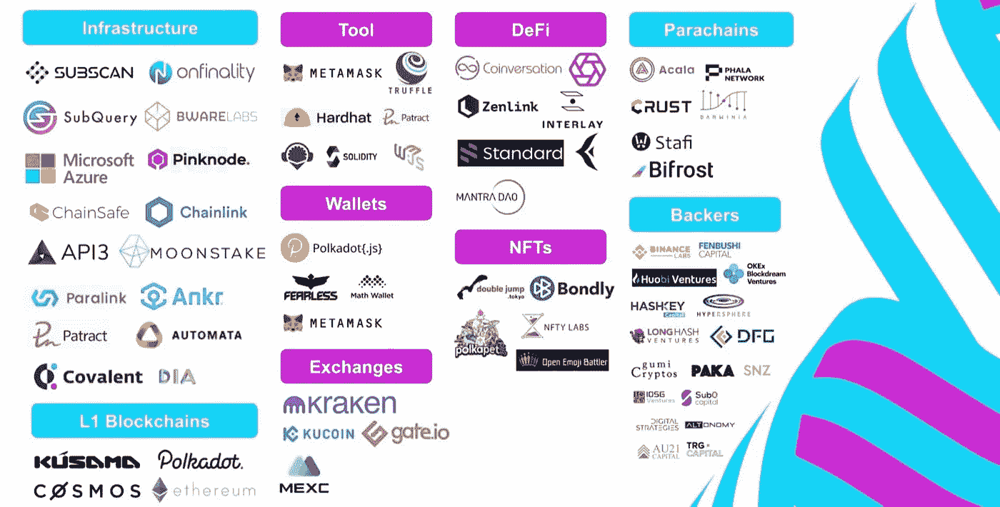
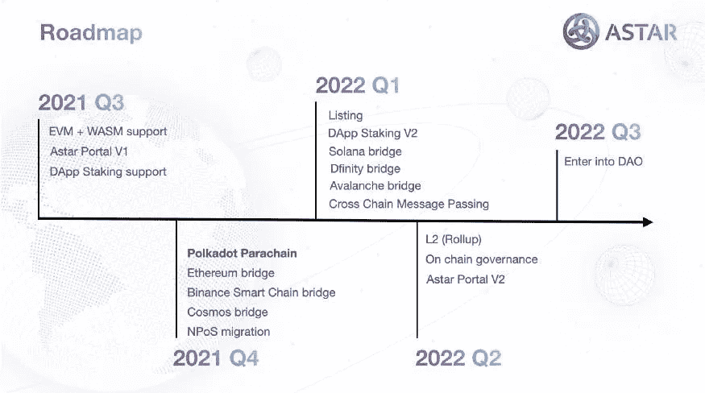

# 这个项目可能是 Polkadot 中最好的——第 2 部分

> 原文：<https://medium.com/coinmonks/this-project-might-be-the-best-in-polkadot-part-2-2a0da1b60f78?source=collection_archive---------1----------------------->

在本文的第 1 部分中，我们谈到了 Astar 网络，以及为什么它是 Polkadot 生态系统不可或缺的一部分。Polkadot 本身没有智能合同能力，Astar 网络为 Polkadot 带来了这种能力。这也意味着项目将有 3 个选择，要么成为一个带有 Polkadot 的副链(只有对于较大的项目，因为这是昂贵的)，成为一个副线程或像 Astar 一样在副链上建立 dapps。

# 合作伙伴社区

Astar 最近宣布了 3000 万美元的 Astar 和 Shiden 生态系统增长基金。Astar 的母公司 Stake Technologies 正与微软日本公司在“微软创业计划”下合作。通过这种合作关系，微软日本公司将为基于 Astar / Shiden 网络的项目提供营销和基础设施方面的支持。

Astar 已经建立了良好的开发伙伴关系。一些值得注意的例子包括

共同交易所:一个分散的合约交易交易所

PolkaEx:一个跨链的分散式交易所

标准协议:创建合成资产和稳定硬币的 Defi 平台。

# 施登

石登是阿斯塔的金丝雀网络，建在草间弥生上。价值主张类似于 Astar，一个基于 Kusama 构建的可互操作的智能合约平台。

石登以 138，457 草间弥生的收藏赢得了第三届草间弥生帕拉链拍卖。它最近向参与者分发了大众贷款令牌，虽然用户现在可以转移令牌。施登应用程序仍处于萌芽阶段，需要全面部署以供进一步使用。请注意，同一个应用程序将用于一个简单的网络切换 Astar。

石登是草间弥生第一期拍卖中较好的空投之一(在月亮河之后)

# 竞争对手

Polkadot 智能合约领域存在激烈的竞争。像 Moonbeam，Parastate 这样的项目正在取得重大进展。然而，Astar 的优势在于产品背后的强大技术。多年来与草间弥生/波尔卡多特核心团队的合作和捐赠项目的实施巩固了 Astar 的基础。Astar 在波尔卡多特生态系统中建立了无人可比的高声誉。

# 价格

有些人可能会说，canary networks(Astar 的 Shiden 和 Moonbeam 的 Moonriver)的性价比展示了一幅不同的画面。Moonriver 的估值比石登还高。

施登的价格目前约为 5.35 美元。流通供应量约为 7000 万股，完全稀释后的估值为 3.75 亿股

与其最接近的竞争对手 Moonriver 相比。月亮河的价格约为 320 美元，供应量为 1000 万只。这使得 Moonriver 完全稀释后的市值为 30 亿英镑。这比史登多了 10 倍。

施登在技术上不相上下，有些人甚至会说更胜一筹。加密中的价格是投机性的，并不是价值的真实指标。这意味着世登还有很大的发展空间。随着施登上新的 dapps 和改进的营销，施登的价格应该会上升(但不是财务建议)

# 路标

Astar 有一个大的路线图，有一些有趣的里程碑要实现。最近，他们启动了一项计划，开发 Astar / Shiden 至 Cosmos 桥。索拉纳，不确定，雪崩桥是可能的。在 2022 年 Q2 奥运会上，Astar 将转向线上治理，引入 L2 (Roll-ups)，然后在第三季度，它将进入 DAO。

# 结论

波尔卡多特需要一颗星。尽管它是 Moonriver 的有力竞争对手，但两者可以和谐相处。Polkadot 基于互操作性的基础，Astar 引入了多维互操作性、跨链连接和跨区块链连接。有了技术、资金和方法，一切都水到渠成了。这是最强的波尔卡多特项目之一，值得警惕。

***注:*** *本帖首次发表* [*此处*](https://crypto.writer.io/p/this-project-might-be-the-best-in-ff4) *上有* [*的子帖，密文发表*](https://crypto.writer.io/) *。*

**通过我的推荐加入**

[Crypto.com](https://binance.com/en/register?ref=E8PCD3AF)——[币安](https://platinum.crypto.com/r/sut3pd9bzn)

跟我来

**👉** [推特](https://twitter.com/rumadas123)

**👉**[**Linkedin**](https://www.linkedin.com/in/ruma-das-a1439320/)

****附属链接包括****

> **加入 Coinmonks [电报频道](https://t.me/coincodecap)和 [Youtube 频道](https://www.youtube.com/c/coinmonks/videos)了解加密交易和投资**

## **另外，阅读**

*   **[网格交易机器人](https://blog.coincodecap.com/grid-trading) | [Cryptohopper 审查](/coinmonks/cryptohopper-review-a388ff5bae88) | [Bexplus 审查](https://blog.coincodecap.com/bexplus-review)**
*   **[7 个最佳零费用加密交换平台](https://blog.coincodecap.com/zero-fee-crypto-exchanges)**
*   **[去中心化交易所](https://blog.coincodecap.com/what-are-decentralized-exchanges) | [比特恩斯 FIP](https://blog.coincodecap.com/bitbns-fip) | [Pionex 审核](https://blog.coincodecap.com/pionex-review-exchange-with-crypto-trading-bot)**
*   **[用信用卡购买密码的 10 个最佳地点](https://blog.coincodecap.com/buy-crypto-with-credit-card)**
*   **[加拿大最佳加密交易机器人](https://blog.coincodecap.com/5-best-crypto-trading-bots-in-canada) | [库币评论](https://blog.coincodecap.com/kucoin-review)**
*   **[火币加密交易信号](https://blog.coincodecap.com/huobi-crypto-trading-signals) | [HitBTC 审核](/coinmonks/hitbtc-review-c5143c5d53c2)**
*   **[如何在 FTX 交易所交易期货](https://blog.coincodecap.com/ftx-futures-trading) | [OKEx vs 币安](https://blog.coincodecap.com/okex-vs-binance)**
*   **[OKEx vs KuCoin](https://blog.coincodecap.com/okex-kucoin) | [摄氏替代品](https://blog.coincodecap.com/celsius-alternatives) | [如何购买 VeChain](https://blog.coincodecap.com/buy-vechain)**
*   **[币安期货交易](https://blog.coincodecap.com/binance-futures-trading)|[3 commas vs Mudrex vs eToro](https://blog.coincodecap.com/mudrex-3commas-etoro)**
*   **[如何购买 Monero](https://blog.coincodecap.com/buy-monero) | [IDEX 评论](https://blog.coincodecap.com/idex-review) | [BitKan 交易机器人](https://blog.coincodecap.com/bitkan-trading-bot)**
*   **[尤霍德勒 vs 考尼洛 vs 霍德诺特](/coinmonks/youhodler-vs-coinloan-vs-hodlnaut-b1050acde55a) | [Cryptohopper vs 哈斯博特](https://blog.coincodecap.com/cryptohopper-vs-haasbot)**
*   **[顶级付费加密货币和区块链课程](https://blog.coincodecap.com/blockchain-courses) | [币安评论](/coinmonks/binance-review-ee10d3bf3b6e)**
*   **[MXC 交易所评论](/coinmonks/mxc-exchange-review-3af0ec1cba8c) | [Pionex vs 币安](https://blog.coincodecap.com/pionex-vs-binance) | [Pionex 套利机器人](https://blog.coincodecap.com/pionex-arbitrage-bot)**
*   **[如何在印度购买比特币？](/coinmonks/buy-bitcoin-in-india-feb50ddfef94) | [WazirX 审核](/coinmonks/wazirx-review-5c811b074f5b) | [BitMEX 审核](https://blog.coincodecap.com/bitmex-review)**
*   **[印度的加密交易所](/coinmonks/bitcoin-exchange-in-india-7f1fe79715c9) | [比特币储蓄账户](/coinmonks/bitcoin-savings-account-e65b13f92451)**
*   **[币安收费](/coinmonks/binance-fees-8588ec17965) | [僵尸加密审查](/coinmonks/botcrypto-review-2021-build-your-own-trading-bot-coincodecap-6b8332d736c7) | [热点审查](/coinmonks/hotbit-review-cd5bec41dafb)**
*   **[我的加密副本交易经历](/coinmonks/my-experience-with-crypto-copy-trading-d6feb2ce3ac5) | [AAX 交易所评论](/coinmonks/aax-exchange-review-2021-67c5ea09330c)**
*   **[逐位融资融券交易](/coinmonks/bybit-margin-trading-e5071676244e) | [币安融资融券交易](/coinmonks/binance-margin-trading-c9eb5e9d2116) | [超位审核](/coinmonks/overbit-review-9446ed4f2188)**
*   **[有哪些交易信号？](https://blog.coincodecap.com/trading-signal) | [Bitstamp vs 比特币基地](https://blog.coincodecap.com/bitstamp-coinbase)**
*   **[ProfitFarmers 回顾](https://blog.coincodecap.com/profitfarmers-review) | [如何使用 Cornix 交易机器人](https://blog.coincodecap.com/cornix-trading-bot)**
*   **[加密货币储蓄账户](/coinmonks/cryptocurrency-savings-accounts-be3bc0feffbf) | [YoBit 审核](/coinmonks/yobit-review-175464162c62)**
*   **[Botsfolio vs nap bots vs Mudrex](/coinmonks/botsfolio-vs-napbots-vs-mudrex-c81344970c02)|[gate . io 交流回顾](/coinmonks/gate-io-exchange-review-61bf87b7078f)**