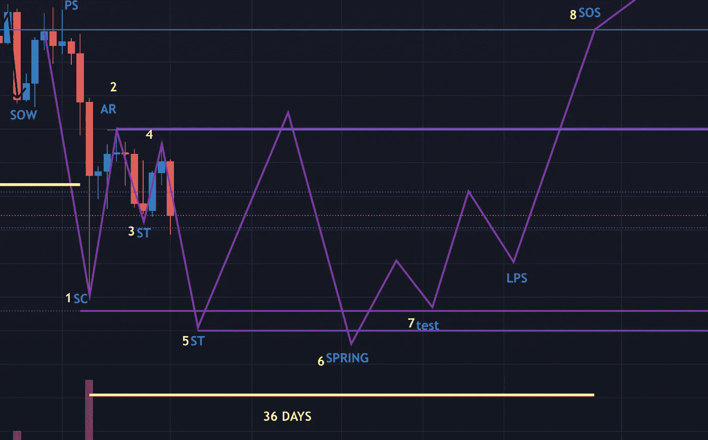
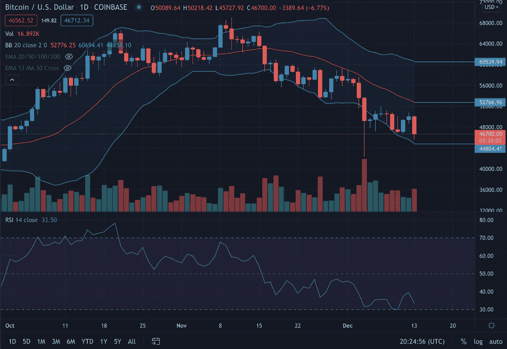
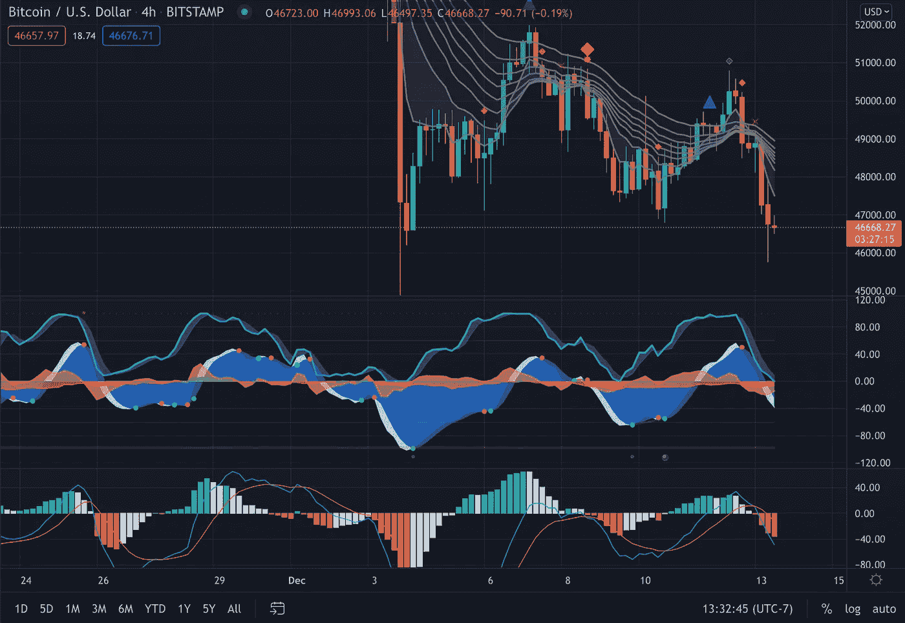
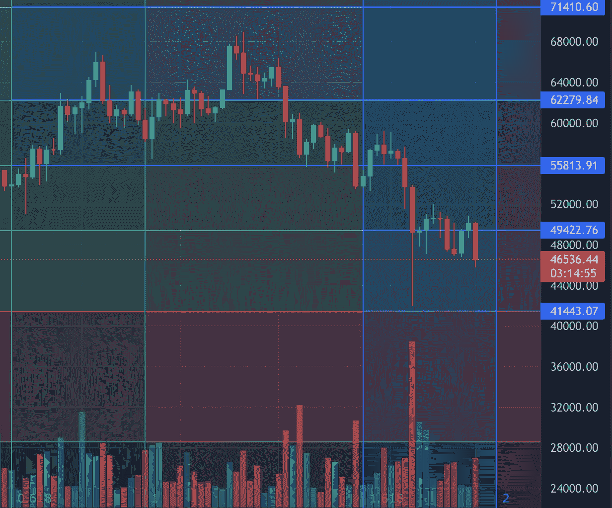

# 本周 BTC 分析:威科夫积累继续发挥出来

> 原文：<https://medium.com/coinmonks/this-week-btc-analysis-wyckoff-accumulation-continues-to-play-out-b4a5a786031b?source=collection_archive---------10----------------------->

本周我们看到 BTC 价格仍在下跌。如今，BTC 价格为 4.6 万美元，尽管市场预期到 2021 年 12 月将达到 10 万美元。

威科夫积累模式正在按设想进行。销售高潮(1。SC)、自动拉力赛(2。AR)，第一第二测试(3。ST)，第二次自动拉力赛(4。)都打完了。现在我们进入第二个测试(5。ST)，因此我们可以预计价格将继续下降，接近或低于 41k 的价格水平。

Wyckoff Accumulation Schematic. Retrieved from Trading View

布林线表明 BTC 是熊市，因为价格没有支撑在支撑位上。上面的波段表明价格上升到 60K，20 天的 SMA 和 20 均线表明阻力位在 52k 左右。目前，BTC 的价格为 46K，接近波段的下限(44k)。此外，相对强度指数为 33，低于前几天。RSI 在 30 表明 BTC 正在超卖。

Bollinger Bands. Retrieved on Trading View

市场行情也表明价格将会下跌。有一个红色的钻石，表明一个大的熊市延续和红色的十字架，表明做空。此外，资金流为负(红色波浪),市场动量波也为负。这些都是短期的看跌条件。然而，这是预料之中的，因为我们处于威科夫聚集示意图中。

Market Cipher. Retrieved on Trading View

Fib 回撤图表明，如果市场出现调整，下一个价格水平如下:

*   如果价格低于 55K，我们可以预计价格将下降到 49k
*   如果价格低于 49k，我们可以预计价格将下降到 41k
*   如果价格超过 55k，我们可以预计价格会上升到 62k

Fibonacci Retracement & Fib Time Zones. Retrieved from Trading View

基于 Fib 回撤、威科夫分析、布林线和市场密码图，我对未来几周价格走势的预测如下:

从现在(12 月 13 日)到 12 月 16 日-19 日，威科夫堆积仍将继续，这几天可能会发生泵/倾卸。然而，只能折回支架(进行第二次测试 B)。同时，根据布林线和 Fib 回撤图，价格可以回升至 52k，回撤至 44–41k。然而，根据威科夫理论，它可以低于 41k。

在短期内，我们可以预计价格将继续下跌，因为自动拉力赛 2 事件发生了。现在，我们正在经历价格下跌，并可能在 41k 的威科夫积累的较低范围附近进行第二次测试。

> 加入 Coinmonks [电报频道](https://t.me/coincodecap)和 [Youtube 频道](https://www.youtube.com/c/coinmonks/videos)了解加密交易和投资

## 另外，阅读

*   [加拿大最好的加密交易机器人](https://blog.coincodecap.com/5-best-crypto-trading-bots-in-canada) | [赌注加密](https://blog.coincodecap.com/staking-crypto)
*   [如何在印度购买比特币？](/coinmonks/buy-bitcoin-in-india-feb50ddfef94) | [WazirX 审核](/coinmonks/wazirx-review-5c811b074f5b)
*   [最佳网上赌场](https://blog.coincodecap.com/best-online-casinos) | [硬件钱包](/coinmonks/hardware-wallets-dfa1211730c6)
*   [如何在 WazirX 上购买柴犬(SHIB)币？](https://blog.coincodecap.com/buy-shiba-wazirx)
*   [比特币主根](https://blog.coincodecap.com/bitcoin-taproot) | [排名前 6 的比特币信用卡](/coinmonks/bitcoin-credit-card-bc8ab6f377c6)
*   [最佳免费加密信号](https://blog.coincodecap.com/free-crypto-signals) | [YoBit 评论](/coinmonks/yobit-review-175464162c62) | [Bitbns 评论](/coinmonks/bitbns-review-38256a07e161)
*   [huo bi 的加密交易信号](https://blog.coincodecap.com/huobi-crypto-trading-signals) | [BitMEX 评论](https://blog.coincodecap.com/bitmex-review)
*   [7 个最佳零费用加密交易平台](https://blog.coincodecap.com/zero-fee-crypto-exchanges)
*   [分散交易所](https://blog.coincodecap.com/what-are-decentralized-exchanges) | [比特 FIP](https://blog.coincodecap.com/bitbns-fip) | [Pionex 审查](https://blog.coincodecap.com/pionex-review-exchange-with-crypto-trading-bot)
*   [用信用卡购买密码的 10 个最佳地点](https://blog.coincodecap.com/buy-crypto-with-credit-card)
*   [OKEx 评论](/coinmonks/okex-review-6b369304110f) | [Kucoin 交易机器人](/coinmonks/kucoin-trading-bot-automate-your-trades-8cf0ca2138e0) | [期货交易机器人](/coinmonks/futures-trading-bots-5a282ccee3f5)
*   [AscendEx Staking](https://blog.coincodecap.com/ascendex-staking)|[Bot Ocean Review](https://blog.coincodecap.com/bot-ocean-review)|[最佳比特币钱包](https://blog.coincodecap.com/bitcoin-wallets-india)