# Hyperledger Fabric —贝壳供应链系统 I

> 原文：<https://medium.com/coinmonks/this-will-be-a-two-part-series-on-hyperledger-the-framework-to-create-deploy-and-maintain-936ac2236c2f?source=collection_archive---------0----------------------->

这是关于 hyperledger 的两部分系列，hyperledger 是为企业创建、部署和维护区块链的框架。到两个博客结束时，我们将有一个部署和运行分散海贝供应链系统。

链接到第二部分—

 [## Hyperledger Fabric —贝壳供应链系统 II

### 现在我们已经了解了区块链的基本原理和 Hyperledger 的高级结构，让我们使用它…

medium.com](/@saksham.aurora/hyperledger-fabric-seashell-supplychain-system-ii-3622ccefd11d) 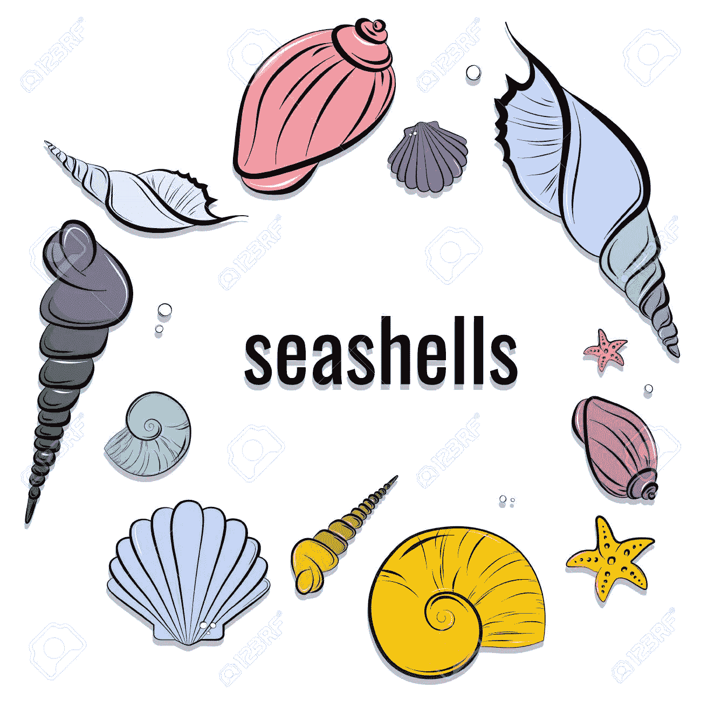

# 什么是 Hyperledger？

**Hyperledger** 是 Linux 基金会从 2015 年开始创建并托管的伞形开源项目。它旨在推进和促进跨行业的区块链技术，以确保商业伙伴之间的问责制、透明度和信任。因此，Hyperledger 提高了业务网络和交易的效率。

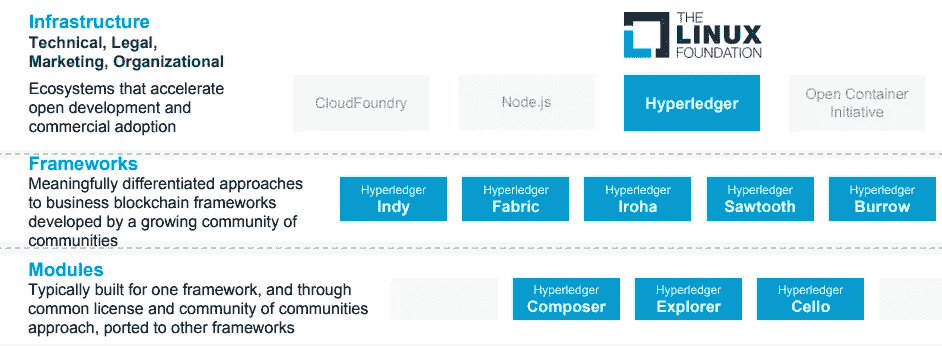

我们可以假设 Hyperledger 是一个用于市场、数据共享网络、微货币和去中心化数字社区的操作系统。

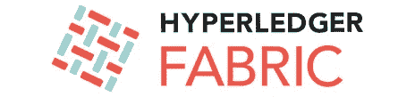

# 超分类帐结构

当谈到私人区块链时，Hyperledger Fabric 可能是最受欢迎和采用的区块链框架之一。当我第一次开始学习 Hyperledger Fabric 时，我发现很难理解 Hyperledger Fabric 是如何工作的，因为它有巨大的技术堆栈。要了解它的工作原理，需要了解几个方面，如区块链技术、网络和系统架构、DevOps 运营、全栈软件开发、测试驱动和行为驱动开发、中间层加密、授权和访问控制、it 安全方面、业务用例等。

> “如果你有一个很大的区块链网络，而你只想与某些人共享数据，你可以创建一个只与这些人共享的私人通道。这是目前最有特色的布料*。*”—布莱恩·贝伦多夫，Linux 基金会 Hyperledger 的执行董事

因此，在本系列的第一部分中，我们将在实际进行供应链项目之前，仔细研究人们需要知道和需要的一切。

**Hyperledger Fabric 架构**

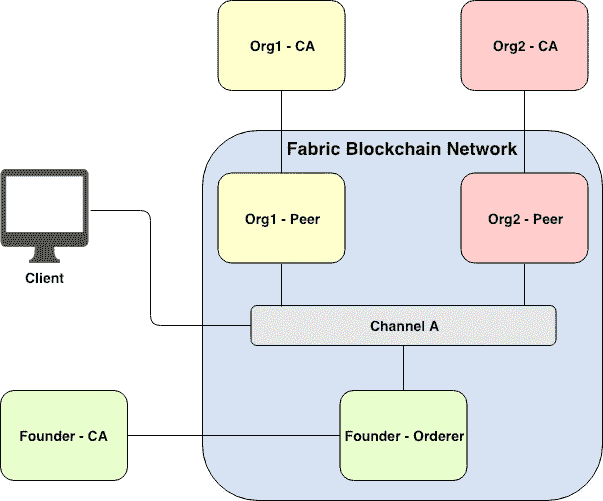

Figure 1\. Simplest Fabric network with two organizations joining the same channel

在 Hyperledger Fabric 中，有一个允许参与组织加入并相互通信的渠道概念。信道可以被认为是一个组织与加入相同信道的其他参与组织秘密通信的隧道。任何不参与所述渠道的其他人都不能访问与该渠道相关的任何交易或信息。一个组织可以同时参与多个渠道。上面的图 1 描述了最简单的 Hyperledger Fabric 网络，其中有两个组织(即 *Org1* 和 *Org2* )加入同一渠道。我来逐一简单介绍一下面料组件，包括*同行*、*订货方*、 *CA* 、*、*客户*。*

首先， ***对等体*** 是一个区块链节点，它存储一个加入通道上的所有事务。每个对等体可以根据需要加入一个或多个通道。然而，同一对等体上不同通道的存储将是分开的。因此，组织可以确保机密信息仅在特定渠道上被允许的参与者共享。

其次， ***排序器*** 是 Fabric consensus 机制中使用的最重要的组件之一。***order***是一种服务，负责对事务进行排序，创建新的有序事务块，并将新创建的块分发给相关通道上的所有对等体。关于 ***订购者*** 的更多信息将在后面解释。

第三， ***认证机构*** 或 ***CA*** 负责管理用户注册、用户注册、用户撤销等用户证书。更具体地说，Hyperledger Fabric 是一个许可的区块链网络。这意味着只有被允许的用户才能在被授权的通道上*查询*(访问信息)或*调用*(创建新事务)事务。用户可以根据自己拥有的*权限*、*角色*、*、*和*属性*查询或调用任何渠道的任何交易。

第四， ***客户端*** 被认为是与光纤区块链网络交互的应用。即 ***客户端*** 可以根据其关联组织的 ***CA 服务器*** 的证书上指定的*权限*、*角色*、和*属性*与 Fabric 网络进行交互。

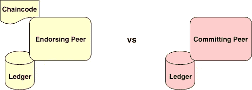

Figure 2\. Endorsing Peer vs Committing Peer

面料中有个*智能合约*的概念叫做 ***链码*** 。目前有三种语言可以编写 Fabric chaincode，包括 *Golang* 、 *Node.js* 、和 *Java* 。 ***为了部署链码，网络管理员必须将链码安装到目标对等体上，然后调用订购者将链码实例化到特定通道上。*** 实例化链码时，管理员可以为链码定义一个*背书策略*。*背书政策*定义了在交易可以被添加到通道上所有对等体的分类帐之前，哪些对等体需要就交易的结果达成一致。

在*背书策略*中指定的对等体被称为 ***背书对等体*** ，它由已安装的链码和其上的本地分类帐组成，而 ***提交对等体*** 将只有其上的本地分类帐。图 2 区分了*认可对等体*和*提交对等体*。当我们到达 *Fabric consensus* 部分时，将讨论更多相关内容。

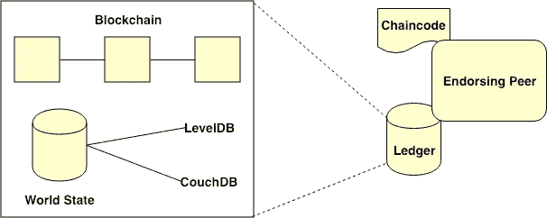

Figure 3\. Interior components inside the Peer’s ledger

如图 3 所示，对等体账本内部的内部组件包括*区块链*和*世界状态*。 ***区块链*** 保存着特定渠道上每个链码的所有交易历史。 ***世界状态*** 维护每个特定链码变量的当前状态。

Fabric 目前支持的两种*世界状态数据库*包括 *LevelDB* 和 *CouchDB* 。***level db****是构建在 *Fabric Peer* 、上的默认键值数据库，而 ***CouchDB*** 是基于 JSON 的数据库，支持基于 JSON 对象的丰富查询操作。例如， *CouchDB* 允许我们用特定的键设置资产，并使用 JSON 查询语法查询过滤后的资产。链代码开发人员在开发链代码时必须选择使用 ***LevelDB*** 或 ***CouchDB*** 。*

***Hyperledger 结构中的共识***

*Fabric consensus 有大量的多阶段和多层次的认可、有效性和版本控制检查。在将一批交易写入分类账之前，需要多个阶段来确保许可、背书、所有参与者之间的数据同步、交易顺序以及更改的正确性。*

*Hyperledger Fabric 使用基于许可投票的共识，该共识假定网络中的所有参与者都是部分可信的。共识可以分为以下三个阶段。*

1.  **背书*(下图 4 中的步骤 1-3)*
2.  **订购*(下图 4 中的步骤 4-5)*
3.  **确认和承诺*(下图 4 中的步骤 6)*

*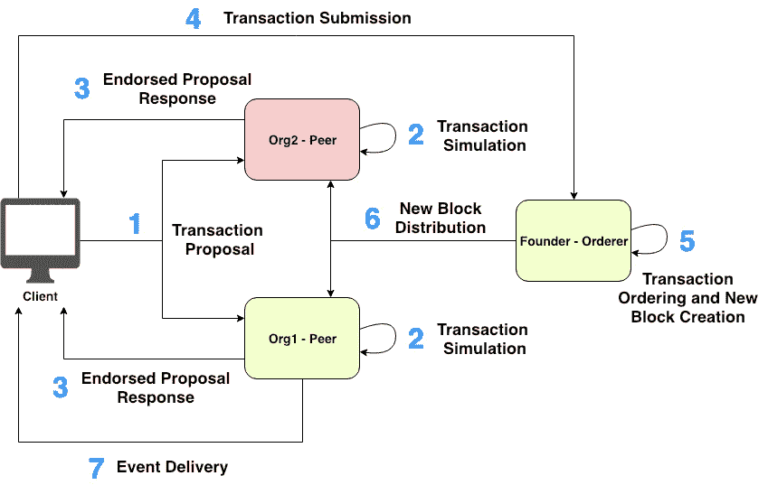*

*Figure 4\. Fabric transaction invocation workflow*

*图 4 描述了 Fabric 事务调用的逐步工作流程:*

2.  ***每个 ***签署对等*** 从提案有效载荷中验证 ***用户*** 的身份和授权。如果验证检查通过， ***认可对等体*** 模拟交易，生成响应和读写集，并使用其证书认可生成的响应。***
3.  ******客户端*** 累积并检查来自 ***认可对等方*** 的已认可提案响应。***
4.  ******客户*** 向 ***订单方*** 发送附有已背书的提案回复的交易。***
5.  ******排序器*** 对接收到的事务进行排序，生成新的有序事务块，并用其证书对生成的块进行签名。***
6.  ******订购方*** 在相关信道上向所有 ***对等方*** (向*认可对等方*和*提交对等方*)广播生成的块。然后，每个 ***对等方*** 确保接收到的块中的每个交易都由适当的 ***背书*** ***对等方*** (即，从*调用的链码*的 e *背书策略*中确定)签名，并且存在足够的背书。之后，将进行版本控制检查(称为*多版本并发控制(MVCC)* 检查)来验证接收块中每个事务的正确性。也就是说，每个 ***对等体*** 会将每个事务的 readset 与其*分类帐*的*世界状态*进行比较。如果验证检查通过，事务被标记为有效，并且每个 ***对等体*** 的*世界状态*被更新。否则，交易被标记为无效，而不更新*世界状态*。最后，接收到的块被附加到每个 ***对等体*** 的*本地区块链*中，而不管该块是否包含任何无效事务。***
7.  ******客户端*** 从 ***EventHub 服务*** 接收任何订阅的事件。***

# ***超分类帐结构元素***

1.  *****通道**是数据划分机制，只允许利益相关者看到事务。每个通道都是一个独立的事务块链，只包含该特定通道的事务。***
2.  *****Chaincode /** (智能契约)|它封装了资产定义和用于修改这些资产的业务逻辑(或事务)。交易调用会导致分类帐发生变化。***
3.  *****分类帐**包含网络的当前世界状态和一系列事务调用。一个共享的、许可的分类帐是一个只附加记录的系统，并且作为真实的单一来源。***
4.  *****网络**是形成区块链网络的数据处理**对等体**的集合。网络负责维护一致复制的分类账。***
5.  *****订购服务**是一个节点集合，它将交易订购到一个块中。***
6.  *****世界状态**反映了网络中所有资产的当前数据。这些数据存储在数据库中，以便高效访问。当前支持的数据库是 LevelDB 和 CouchDB。***
7.  *****会员服务提供商** (MSP)管理客户端和对等端的身份和许可访问。***

# ***技术依赖性***

***现在，我们将从需要满足的不同先决条件开始，以确保我们的系统为这个博客的技术需求做好准备。***

***我会推荐使用 **AWS EC2** 机器作为你的基本操作系统。我们可以很容易地免费设置它，跟随这个伟大的博客来设置您的 AWS 帐户和 EC2 实例很容易。***

***[https://medium . com/@ jameshamann/setting-up-an-Ubuntu-ec2-instance-from-scratch-78a 166167 a22](/@jameshamann/setting-up-an-ubuntu-ec2-instance-from-scratch-78a166167a22)***

***下面是两张 GIF 图，分别展示了创建实例和启动实例的过程。***

***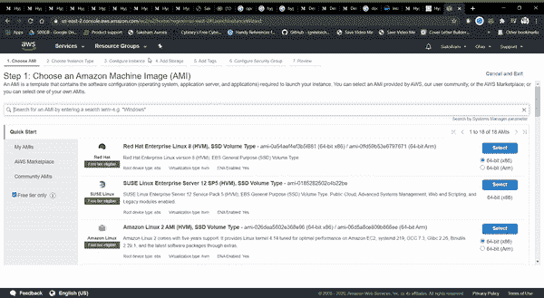***

***GIF 1 : Launching an AWS EC2 Instance***

***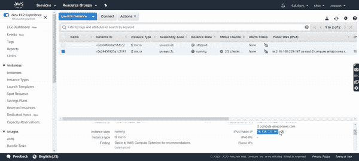***

***GIF 2 : Launching an AWS EC2 Instance***

***注意—您也可以使用任何 Linux 虚拟机并继续。***

***现在你已经设置好了，让我们解决所有的技术依赖！***

*   ***卷曲***
*   ***Node.js 和 npm 包管理器***
*   ***Go 语言***
*   ***码头工人和码头工人组成***

# ***安装卷曲***

***cURL 是一个使用支持的协议从服务器传输数据或向服务器传输数据的工具。***

***在您的终端中键入以下命令，并输入您的密码:***

> ***$ sudo 安装 curl***

***以下是相同的 GIF:***

***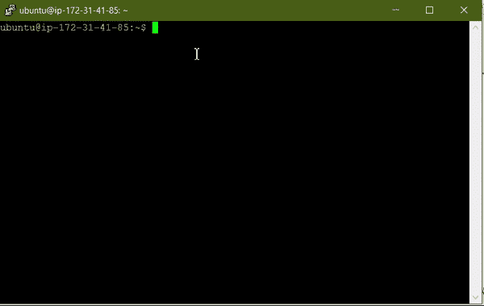***

***Install Curl***

# ***码头工人***

***Docker 是一个工具，旨在通过使用容器来简化应用程序的创建、部署和运行。容器允许开发人员将应用程序与它需要的所有部分打包在一起，比如库和其他依赖项，然后作为一个包发送出去。***

*****Docker Cloud** 是开发人员和 IT 运营人员在任何地方构建、发布和运行任何应用的地方。***

***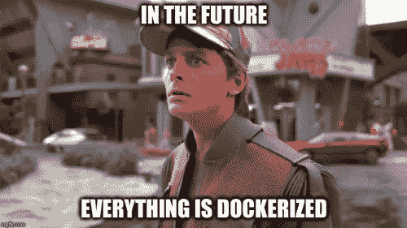***

*****Docker 安装指南*****

***按照下面提到的指南在你的 Linux 机器上安装 docker。***

***[https://docs.docker.com/engine/install/ubuntu/](https://docs.docker.com/engine/install/ubuntu/)***

***确保 docker 和 docker-compose 都已成功安装。以下是相同的 GIF:***

***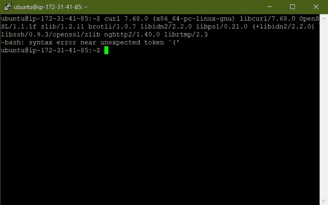***

***使用以下命令安装 Docker-compose:***

> ***$ apt-get 安装 docker-compose***

# ***Node.js & npm***

*   ***Node.js 是一个开源服务器环境***
*   ***Node.js 是免费的***
*   ***Node.js 运行在各种平台上(Windows、Linux、Unix、Mac OS X 等。)***
*   ***Node.js 在服务器上使用 JavaScript***

*****为什么是 Node.js？*****

***Node.js 使用异步编程，它消除了等待，只需继续处理下一个请求。Node.js 运行单线程、非阻塞、异步编程，非常节省内存。***

***NPM 是 Node.js 包或模块的包管理器。***

***有关安装或更新 **Node.js** 和 **npm 的详细信息，请访问[https://nodejs.org/en/download/](https://nodejs.org/en/download/)。*****

***以下是相同的 GIF:***

***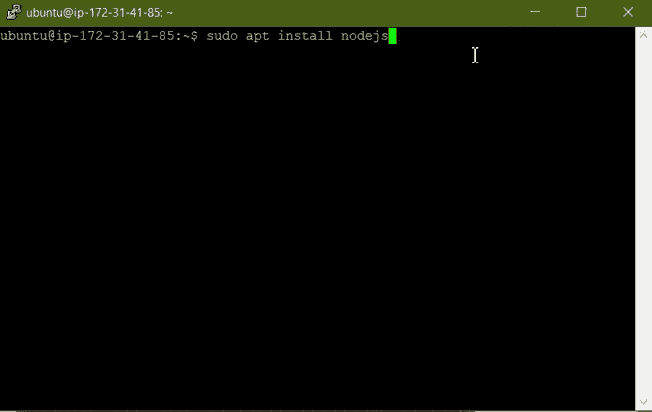***

# ***去***

***Go 是一种开源编程语言，可以轻松构建简单、可靠、高效的软件。2009 年，罗伯特·格里斯默、罗布·派克和肯·汤普森在谷歌创立了围棋。***

***键入以下命令以轻松安装 Go。***

> ***$ cd ~***
> 
> ***$ sudo curl-O[https://storage . Google APIs . com/golang/go 1 . 14 . 4 . Linux-amd64 . tar . gz](https://storage.googleapis.com/golang/go1.14.4.linux-amd64.tar.gz)***

*****注意**:用正确的文件名切换出 URL 的黑色部分。***

***打开下载的文件以运行安装包:***

> ***$开放 go1.14.4.linux-amd64.tar.gz***

***完成安装后， **go** 将被安装在 **/usr/local/bin/go** 处。***

***如果卡住了，参考这个博客:[https://www.tecmint.com/install-go-in-linux/](https://www.tecmint.com/install-go-in-linux/)***

# *****总结*****

***在本文中，我们了解了什么是 hyperledger、hyperledger fabric——它的体系结构、hyperledger fabric 中的共识、hyperledger fabric 的元素，最后，我们部署了我们自己的基于云的 AWS EC2 机器，并准备好安装所有技术依赖项。***

***在下一篇文章中，我们将了解海贝供应链上下文，我们将安装 hyperledger fabric，了解海贝上下文中的链码，最后构建并运行海贝区块链应用程序。***

*****第二部分在:*****

*** [## Hyperledger Fabric —贝壳供应链系统 II

### 现在我们已经了解了区块链的基本原理和 Hyperledger 的高级结构，让我们使用它…

medium.com](/@saksham.aurora/hyperledger-fabric-seashell-supplychain-system-ii-3622ccefd11d) 

**参考文献:**

许多插图和内容取自以下博客，所有的荣誉都属于它们:

 [## Hyperledger —第 1 章|区块链基金会

### 这是我学习 Hyperledger 的日志，Hyperledger 是为企业创建、部署和维护区块链的框架…

medium.com](/swlh/hyperledger-chapter-1-foundation-7ad5bd94d452)  [## 揭开 Hyperledger 结构的神秘面纱(1/3):结构架构

### 最初在 www.serial-coder.com 出版。

medium.com](/coinmonks/demystifying-hyperledger-fabric-1-3-fabric-architecture-a2fdb587f6cb)  [## 用于企业的区块链平台- hyperledger-fabricdocs 主文档

### 请确保您正在查看的文档与您正在使用的软件版本相匹配。请参见…

hyperledger-fabric . readthedocs . io](https://hyperledger-fabric.readthedocs.io/en/release-2.0/) 

> [直接在您的收件箱中获得最佳软件交易](https://coincodecap.com/?utm_source=coinmonks)

***