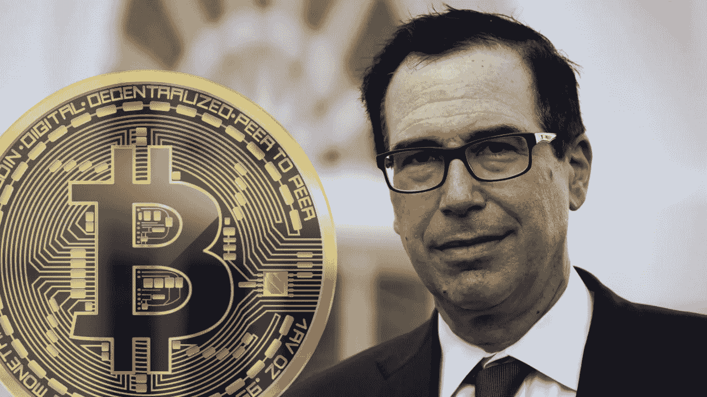
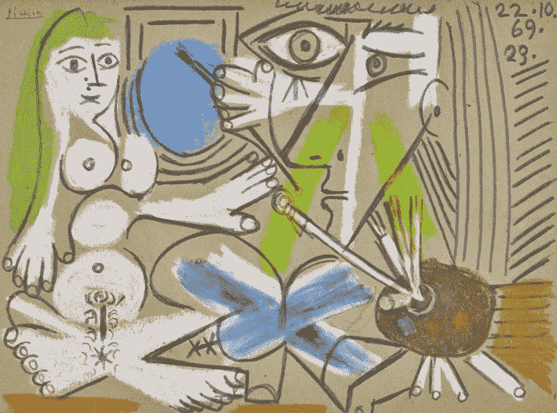
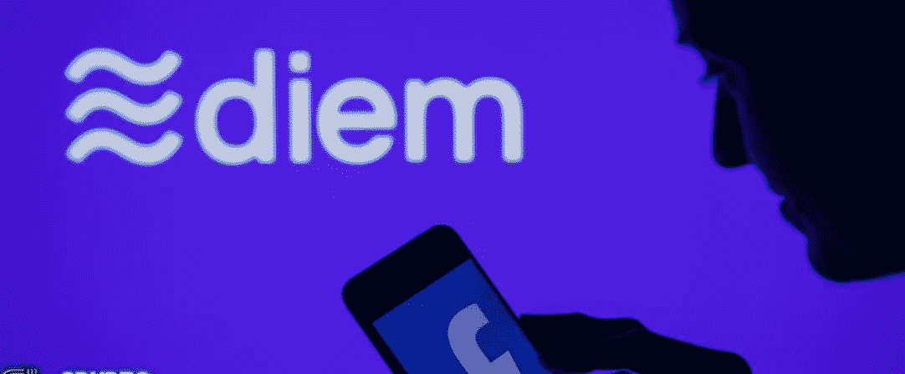

# Thorchain Hack / Paypal 将每台 NFT 可穿戴设备的购买限额提高至 10 万美元

> 原文：<https://medium.com/coinmonks/thorchain-hack-paypal-increases-purchase-limit-to-100k-nft-wearables-6d132565ff4d?source=collection_archive---------0----------------------->


After Bitcoin pump, I am like

## 数字袁的采用，毕加索的 NFTs，阿谢的热潮

上周凯西·伍德、杰克·多西和埃隆·马斯克在 B-word 大会上进行了一次谈话，以下是马斯克的一些重要言论。

```
“Spacex owns bitcoin”“As long as there is a conscious effort to move bitcoin miners toward renewables then Tesla can support that.”"If the price of bitcoin goes down, I lose money. I might pump, but I don't dump.""To me it seems self evident that we should take the set of action most likely to make the future good. Bitcoin will make the future better most likely.""Tesla's European bank balance receives negative interest.  That's insane,"
```

如果你愿意，你可以在这里观看这场比赛的重播。

比特币昨天拼命抽，现在不赌了，买什么都行，没有任何技术分析， [**加入我们电报信号群**](https://t.me/coincodecap) ，获得基于分析的交易机会。

现在让我们看看上周在 crypto 中发生了什么。

## 1.Twitter 首席执行官宣布推出一家基于比特币的新公司，名为 Square 的 TBD


Source: [Click here](https://image.cnbcfm.com/api/v1/image/106859593-1616695102208-jack6.jpg?v=1616695156&w=1600&h=900)

Twitter 首席执行官杰克·多西宣布成立一家新公司，旨在为他的金融支付公司 Square 开发一个开放的比特币开发者平台。

多尔西表示，就像其新的比特币硬件钱包一样，该公司将完全公开地这样做。换句话说，一个完全开放的源代码。

Source: [Click here](https://twitter.com/jack/status/1415765943385563139)

Square 上个月宣布，将向区块链科技公司 Bloc stream Mining 投资 500 万美元，建立一个开源的太阳能比特币采矿业务。

该设施将作为一个大规模 100%可再生能源比特币矿的概念验证，其建设的经济性是公开的，其中也包括运营成本和投资回报率。

## 2.美国前财长姆努钦说，他对比特币的立场已经“发生了变化”。



Source: [Click here](https://news.bitcoin.com/former-us-treasury-secretary-mnuchin-says-his-view-on-bitcoin-has-evolved/)

美国前财政部长史蒂文·姆努钦认为他对比特币的立场“发生了一点变化”。虽然他不希望自己的投资组合中包含比特币，但他认为任何人购买这种加密货币都“绝对没问题”。

高盛、摩根士丹利和花旗集团是已经开始或正在向其客户提供加密产品或服务的主要投资银行。

> 我认为我的观点有一点点发展，但它相当一致……如果人们想购买比特币作为替代品，与购买黄金或其他资产没有什么不同，这很好。我个人并不想把它放在我的投资组合中，但如果人们想这样做，那完全没问题。

他指出，OCC 货币监理署去年在特朗普政府期间允许银行提供比特币托管服务，他解释道:

> 我们这样做的原因是，我们希望确保这在受监管的世界中变得可行，并且应该完全符合 BSA。

## 3.NFT 游戏 Axie Infinity 剧情电竞推送


Source: [Click here](https://decrypt.co/76091/surging-ethereum-nft-game-axie-infinity-plots-esports-push)

Axie Infinity 正在为比赛寻找赞助。

加密货币游戏 Axie Infinity 已经[透露了提供怪物战斗电子竞技比赛的雄心](https://axie.substack.com/p/axieesports)。

这款游戏最近几周人气暴涨，代币价格和交易量增长 500%。

Sky Mavis 将为电子竞技比赛设置一个特殊的服务器，以确保赛事顺利进行。本周，Axie Infinity 的服务器有时会延迟或不可用，原因是[用户需求](https://twitter.com/AxieInfinity/status/1415293371011125248)增加，以及开发者声称的分布式拒绝服务(DDOS)攻击和服务器托管问题。

Source: [Click here](https://twitter.com/AxieInfinity/status/1415293371011125248?ref_src=twsrc%5Etfw%7Ctwcamp%5Etweetembed%7Ctwterm%5E1415293371011125248%7Ctwgr%5E%7Ctwcon%5Es1_&ref_url=https%3A%2F%2Fdecrypt.co%2F76091%2Fsurging-ethereum-nft-game-axie-infinity-plots-esports-push)

## 4.数字人民币现在有超过 2000 万个钱包:中国人民银行


Source: [Click here](https://decrypt.co/76135/digital-yuan-will-support-smart-contracts-chinese-central-bank)

中国央行的数字货币正在获得牵引力。根据该国央行的说法，智能合约可以纳入该国不断增长的数字人民币。只要法律允许，它还会保护匿名。

根据今天发布的[进展报告，](http://www.pbc.gov.cn/en/3688110/3688172/4157443/4293696/2021071614584691871.pdf)中国人民银行的中央银行数字货币(CBDC)——一种法定货币的数字等价物——现在拥有超过 2000 万个钱包，并完成了 355 亿元人民币(54 亿美元)的交易。

新货币是世界上最大的 CBDC 倡议。它将补充但不会取代传统货币，因为在这个拥有 14 亿人口的多元化国家，纸币对许多人来说仍然很有价值。

在[许多年](https://www.inaa.org/dcep-how-china-is-stepping-up-its-digital-currency/)，智能合约可编程性已经成为这种货币设计的一部分。这是该银行的研究中引用的七个设计品质之一，另外还有低成本和匿名性。世行强调，执法部门将“控制”匿名。

## 5.PayPal 将其每周加密货币购买限额提高至 10 万美元


Source: [Click here](http://Forbes.com)

金融科技公司通过采用加密货币交易与传统银行区分开来。对于业内一些最伟大的品牌来说，这种扩张是成功的。

PayPal 表示，它还在扩大其加密货币应用内说明和教育工具，以帮助消除关于虚拟货币的神话。今年 1 月，PayPal 投资了 Taxbit，这是一家总部位于美国的互联网初创公司，帮助消费者和企业计算持有加密货币应缴纳的税款。

## 6.美国银行批准部分客户进行比特币期货交易:纳斯达克


据消息来源之一称，与大多数机构一样，该银行在加密领域的做法一直很谨慎，但由于交易期货需要巨额保证金，它现在允许一些客户进入加密市场。据[另一个消息来源](https://www.nasdaq.com/articles/bank-of-america-approves-bitcoin-futures-trading-for-some-clients%3A-sources-2021-07-16)称，一些客户正准备交易比特币期货，这是现金结算的，有一两个可能已经上线。

据报道，多家投资银行正在允许客户投资加密货币产品。阔别三年之后，高盛在 3 月份披露了恢复其加密货币交易部门的计划，5 月份，这家投资银行开始通过芝加哥商业交易所(CME)集团以大宗交易的方式[买卖](https://www.coindesk.com/goldman-sachs-offering-bitcoin-derivatives-to-investors-report)比特币期货，坎伯兰·DRW 是其交易伙伴。

## 7.由于 THORChain 漏洞，以太坊损失了 500 万美元


Source: [Click here](https://defirate.com/wp-content/uploads/2021/07/thorchain-exploited-twice.png)

THORChain 是混沌网漏洞的受害者，导致 ETH 流动性提供商损失约 500 万美元。根据 THORChain 团队的说法，攻击者使用网络的 Bifrö st 协议将 ETH 转移到他们自己的地址。该项目的财政部将偿还流动性提供者。

据初步估计，攻击者窃取了价值 2470 万美元的 13，000 ETH，然而，THORChain 此后在 Twitter 上表示，损失接近 500 万美元。

Source [Click here](https://twitter.com/THORChain/status/1415899792648019970)

## 8.瑞士银行 Sygnum 将发行 4000 枚代表毕加索原画的代币


Source: [Click here](https://nftevening.com/swiss-bank-sygnum-to-issue-4000-nft-shares-of-original-picasso-painting/)

毕加索代币通过 Sygnum 提供给“专业和机构投资者”。当投资者购买代币时，所有权转移到公共区块链。据 Sygnum 报道，这是受监管银行首次将任何艺术品的所有权转让给公开的区块链。

根据公告，瑞士法律也完全承认这种所有权。与此同时，投资者可以在 Sygnum 的数字资产交易平台 SygnEx 上交易股票。

Fillette au béret 描绘了一个戴着贝雷帽的孩子，并用鲜艳的颜色画在画布上。乌普萨拉 Auktionskammare 上一次以 248 万美元的价格出售这幅画是在 2016 年。

毕加索与区块链的交往并不是他的第一次。今年 6 月，苏富比以 312 万美元的价格出售了与 NFT 有关的艺术品《Le peintre and son modèle》。同月，NFT 艺术市场 Unique 举办了一场毕加索画作 NFT 的拍卖会。



*Le peintre et son modèle by Pablo Picasso. Credits: Sotheby’s*

令牌化消除了对第三方中间商的需求，降低了交易成本，增加了行业透明度。此外，颁发的令牌提供了法律清晰度并保护所有权。

在未来的许多年里，秘密艺术将继续主宰传统艺术世界。

## 9.采用比特币——你来得太早了

Source : [Click here](https://twitter.com/danheld/status/1416385236926074880)


## 10.币安已经宣布将不再提供股票代币交易


币安将停止其股票代币交易业务。包括德国和香港在内的一些监管机构已经对此次发行发出了警告。

加密货币交易所币安[周五宣布](https://www.binance.com/en/support/announcement/3a0304f3ee1c43668959c1b01f610d59)将不再交易其股票代币。据该公司称，Binance.com 用户将不再能够购买股票代币，立即生效。

令牌化股票，通常被称为股票令牌，是区块链上市公司的股票。与普通股票不同，股票代币可以分批购买，这对于高价股票来说非常方便。

币安[于今年 4 月开始其股票代币交易服务](https://www.theblockcrypto.com/post/101335/binance-launches-tokenized-stock-trading-tesla)，提供五种股票代币:苹果、比特币基地、微软、MicroStrategy 和特斯拉。根据币安的网站，在撰写本文时，他们的 24 小时交易量还不到 100 万美元。根据安全令牌市场数据，自服务开始以来，这些令牌的总交易量约为 7300 万美元。

据称，英国金融行为监管局也在调查币安在推出股票代币交易设施之前是否遵循了安全标准。

美国、英国、意大利、日本、泰国、波兰和开曼群岛的监管机构最近都对该交易所发出警告或采取行动。

## 11.杜嘉班纳将推出 NFT 可穿戴设备


Source: [Click here](https://unxd.com/)

这家奢华的米兰设计公司周三在一条推文中将新系列命名为“alta moda”(高级时装)，并发布了一部宣传电影的链接，该电影展示了第一个想法，“梦想中的服装”。

潜在客户可以通过填写邮件列表的形式在发布队列中预订一个位置。那些注册的人被承诺如果他们推荐其他人，就可以“提前使用”NFTs。

Source: [Click here](https://twitter.com/dolcegabbana/status/1415297527885139973?ref_src=twsrc%5Etfw%7Ctwcamp%5Etweetembed%7Ctwterm%5E1415297527885139973%7Ctwgr%5E%7Ctwcon%5Es1_&ref_url=https%3A%2F%2Fdecrypt.co%2F76217%2Fdolce-gabbana-to-launch-nft-wearables)

[据 Vogue](https://en.vogue.me/fashion/dolce-gabbana-exclusive-nft-collection-unxd/) 报道，Genesis 系列将于 8 月 28 日至 30 日在 D & G 即将在威尼斯举办的 Alta Moda、Alta Sartoria 和 Alta Gioielleria 展览期间上市。这座城市激发了该系列的灵感。

D&G 并不是第一家通过增强现实设备进入 NFT 空间的高端时尚企业。古驰最近通过[佳士得以 25，000 美元](https://gothammag.com/gucci-nft-aria-christies-auction)的价格卖出了他们的第一件 NFT，这是这家时装公司卖出的最贵的商品之一。

## 12.庞迪姆将利用波尔卡多特连接迪姆和迪菲



Pontem 与节点提供商 Polkadot 合作，为脸书的 Diem 区块链完成实验测试网络。

由于与 PinkNode 的合作，Pontem 团队将能够在波尔卡多特的金丝雀网络 Kusama 上部署节点。

庞迪姆打算通过在波尔卡多特生态系统中进行测试，来帮助迪姆引入新功能。作为合作的结果，庞德姆将能够为脸书的迪姆区块链，以前被称为天秤座，构建一个实验测试网络。

Diem 是由大型科技公司脸书提出的一项雄心勃勃的区块链计划，但由于其许可的结构，它不对公众开放。因此，从事 Diem 工作的开发人员和企业家可能会发现，在创新方面创建可以与以太坊或 Polkadot 等公共区块链竞争的开源解决方案是一项挑战。

该项目的目标是通过首先在 Polkadot 生态系统中测试来帮助 Diem 集成新功能和解决方案。为此，该项目刚刚从多家风险投资公司获得了 450 万美元的资金，包括 Mechanism Capital、Kenetic Capital 和 Animoca Brands。

Pontem 还打算开发一个连接 Diem 区块链和以太坊的桥梁，该网络使用 Polkadot 的互操作网络为不断增长的分散化金融领域提供动力，该领域包括总价值超过 550 亿美元的锁定。

根据 Pontem 的说法，连接这两个网络将使脸书的 27 亿用户面临 DeFi。定于 2021 年开始的 Diem 将生产菲亚特支持的 stablecoins，可以与脸书的银行和电子商务服务整合，这一战略举措遭到了 T2 监管机构的强烈反对。

## 13.为了打击洗钱和恐怖主义融资，欧盟希望取缔匿名加密货币钱包


Source: [Click here](https://markets.businessinsider.com/news/currencies/european-union-ban-anonymous-cryptocurrency-counter-money-laundering-terrorism-financing-2021-7)

为了保护其公民和欧盟的金融系统，欧盟正在考虑禁止匿名加密货币交易，并加强对洗钱和恐怖主义融资的打击。

周二公布的[一揽子方案](https://ec.europa.eu/commission/presscorner/detail/en/IP_21_3690)，包括欧盟执行机构欧盟委员会的四项立法提案。同时还有一份[的情况说明书](https://ec.europa.eu/info/sites/default/files/business_economy_euro/banking_and_finance/documents/210720-anti-money-laundering-countering-financing-terrorism-factsheet_en.pdf)。

提案包括建立一个新的欧盟实体，以转变反洗钱和反恐资金监控，以及对大额现金交易实施 1 万€(合 1.18 万美元)的 EU-范围限制。

“欧盟委员会还将向执法当局提供该系统的访问权限，加快跨境案件中的金融调查和犯罪资产的追回，”该计划称，指的是将收集的信息。

该计划现在正等待欧洲议会和欧洲理事会的批准，新的欧盟机构将于 2024 年开始运作。

在美国，据称拜登政府正在加紧追踪黑客攻击中使用的加密货币，并将支付高达 1000 万美元的奖励，以获取有助于抓获罪犯的信息。

## 14.在筹集了 9 亿美元的资金后，FTX 加密货币交易所的估值达到了 180 亿美元


成立两年的加密货币交易所 FTX 宣布了一轮 9 亿美元的融资。这使得这轮融资成为 crypto 历史上最短时间内最大的私募股权融资，对该公司的估值为 180 亿美元。

一年前，FTX 仅值 12 亿美元。FTX 现在是世界上最有价值的加密货币初创公司之一。更高的估值为广泛接受扫清了道路，尤其是在美国市场。

加密货币交易所现在的总部设在香港，而其母公司 FTX 贸易有限公司的总部设在安提瓜和巴布达。

投资回合[吸引了 60 多名投资者](https://www.nasdaq.com/articles/crypto-exchange-ftx-reaches-%2418-billion-valuation-after-raising-%24900-million-2021-07-21)。日本跨国集团控股公司软银集团(SoftBank Group Corp .)和其他风险投资公司，如美国私募股权巨头托马斯·布拉沃(Thoma Bravo)、丹尼尔·勒布(Daniel Loeb)的第三点(Third Point)、英国对冲基金经理阿伦·霍华德和保罗·都铎·琼斯家族都是投资者。对冲基金亿万富翁伊斯雷尔·英格兰德和比特币基地风险投资公司也参加了这轮融资。

## 15.灰度引入了 DeFi 基金，该基金与新的 CoinDesk 指数挂钩

全球最大的加密货币投资管理公司 Grayscale 周一宣布推出一只专注于分散金融(DeFi)令牌的基金，该基金基于由 [CoinDesk 的 TradeBlock 子公司](https://www.coindesk.com/grayscale-defi-fund-coindesk-index)创建的一个新的 DeFi 专用指数。

在一份联合新闻稿中，这两家公司都是 CoinDesk 母公司数字货币集团(DCG)的子公司，它们表示，灰度 DeFi 基金“通过市值加权投资组合投资于各种行业领先的 DeFi 协议。”其概念是投资者可以将资金转移到 DeFi，而无需直接购买代币。

根据新闻稿，CoinDesk DeFi 指数旨在提供一个“基础广泛的、基准的 DeFi 协议代表”，[，资产按市值加权](https://tradeblock.com/markets/dfx/)。

截至 2021 年 7 月 1 日，CoinDesk DeFi 指数由以下资产组成，具有基于市值的权重:


Source: [Click here](https://www.coindesk.com/grayscale-defi-fund-coindesk-index)

## 16.MakerDAO 将解散其基金会，恢复到一个完全分散的状态


MakerDAO 打算在未来几个月解散其基金会，以完成其去中心化治理的路线图。

首创去中心化金融体系的 MakerDAO 宣布，其基金会将在未来几个月正式解散，这标志着该协议在去中心化治理的道路上迈出了最后一步。

根据 7 月 20 日的一篇博文，创客的去中心化自治组织(DAO)现在“完全自给自足”，其遍布全球的会员/社区“负责创客协议的每一个部分。”

> *“Maker 的完全去中心化意味着协议和 DAO 的未来开发和运营将由成千上万或数百万热心的社区成员决定，他们都决心将数字货币的好处扩展到全球各地的人们。”*

当月，该协议还将增加对 Circle 在 USDC 的集中式稳定货币的支持，引发了关于该制造商使用集中式加密资产作为其表面上分散的稳定货币抵押品的辩论。

根据 DeFi Llama 的数据，MakerDAO 目前是排名第六的分散金融系统，总价值为 56.2 亿美元。

## 17.Neon Labs 的以太坊虚拟机现在与 Solana 兼容


Neon Labs 宣布其以太坊虚拟机(EVM)解决方案将部署在 Solana testnet 上。由于 Neon 的部署，用户将能够把基于以太坊的应用程序转移到 Solana。

在花了一些时间优化交易后，Neon 打算在 2021 年第三季度在 mainnet 上推出其解决方案。

运行以太坊应用程序的开发人员可能会在 Neon 上部署他们的智能合同，以利用 Solana 的快速吞吐量和低费用。

Neon 使用激励节点操作符来接收和验证应用程序创建的事务，然后将它们发送到基础链执行。

这是 Solana 第一次能够在桥接网络上运行以太坊智能合约。迄今为止，区块链没有向 EVM 提供完全的支持。以前，一个被称为[虫洞的以太坊桥](https://cryptobriefing.com/solana-has-introduced-ethereum-bridge-called-wormhole/)在网络上实现，但它只能在两个区块链之间移动令牌化的资产。

## 18.硬币流向更强的牌


Source : [Click here](https://twitter.com/wclementeiii/status/1417689327446986754)

## 19.2021 年，Chainlink 平均每天将新增 1.4 个合作伙伴


根据 Chainlink 的生态系统门户网站的[档案，到目前为止，2021 年有 281 个不同的加密项目宣布集成，日历目前是今年的 201 天。](https://www.chainlinkecosystem.com/ecosystem-category/2021/)

共有 650 个第三方 Chainlink 集成，今年有 43%的项目合作伙伴加入。相比之下，2020 年约有 250 家合作伙伴与 Chainlink 合并。

密码开发人员已经为 Chainlink 的 VRF 技术创造了大量独特的应用程序，上周 PancakeSwap i 将 VRF 纳入其分散的 T1 彩票计划中。其他举措利用 VRF 确保奖金和奖励以可核查的公平方式分配。

**T3【作者】T4:Eth！c@l Aka Kumar**

***PS*** *:此非有偿稿件，亦非理财建议。记录在案的是我出于对这个领域的热情而进行的研究的发现，这个领域就是密码*

## 此外，请阅读

*   [2021 年 17 款最佳密码交易机器人(免费&付费)](/coinmonks/crypto-trading-bot-c2ffce8acb2a)
*   [存储比特币的最佳加密硬件钱包](https://blog.coincodecap.com/best-hardware-wallet-bitcoin)
*   [最佳 6 种密码交易信号电报通道](/coinmonks/best-crypto-signals-telegram-5785cdbc4b2b)
*   [BlockFi Review 2021:利弊及利率](https://blog.coincodecap.com/blockfi-review)
*   [加密税务软件——最佳比特币税务计算器前 5 名](/coinmonks/best-crypto-tax-tool-for-my-money-72d4b430816b)
*   [Pionex Review |免费加密交易机器人和交易所](/coinmonks/pionex-review-exchange-with-crypto-trading-bot-1e459d0191ea)