# 理解区块链的三个要素及其最大的机会

> 原文：<https://medium.com/coinmonks/three-elements-to-understanding-blockchain-its-greatest-opportunity-e9d89086692a?source=collection_archive---------0----------------------->

在过去的两年里，我们已经看到了区块链技术的无限潜力，从[确保我们的食品安全](https://www.ispot.tv/ad/w9Bi/ibm-cloud-blockchain-the-blockchain-built-for-smarter-business)，[使用自主的全球数字身份](https://sovrin.org/)，到[去中心化的虚拟政府](https://en.wikipedia.org/wiki/The_DAO_(organization))。但是，随着大量的[初始硬币发行(ICO)骗局](https://techcrunch.com/2018/04/13/exit-scammers-run-off-with-660-million-in-ico-earnings/)、[数百万美元从加密货币交易所被盗](https://cointelegraph.com/news/coincheck-nem-foundation-stops-tracing-stolen-coins-hackers-account-at-zero)，以及除了比特币本身之外，几乎任何基于区块链的东西都没有得到广泛采用，我们应用这项新技术的希望似乎已经被侵蚀。

虽然我不认为区块链将解决未来的每一个个人、社会和商业挑战，但我相信区块链技术提供了一个巨大的机会，为下一代互联网和整个社会做出贡献。如果我们认为区块链技术更像是一个经历成长烦恼的青少年，给它多一点时间来成熟，了解它的能力，并跳出框框思考，我们将有一个更好的基础来确定它可能在哪里得到最好的利用，认识到它可能在哪里产生重大的积极影响，并想象我们甚至还没有想到的用途。

区块链可能是一项难以处理的技术，但通过从概念上理解三种核心区块链能力，**共识、游戏化、&开放**，我们可以更容易地掌握这项技术的成功之处，以及它可能最适合现有和未来的应用。为了更好地理解这三个要素，让我们简单回顾一下当初是什么推动了区块链的发展。

差不多十年前，2008 年 9 月 18 日，《华尔街日报》的[标题](https://www.wsj.com/articles/SB122169431617549947)如下:***“30 年代以来最严重的危机，还看不到结束的迹象”***

由于次贷危机，美国刚刚经历了一场金融崩溃，导致了几家美国和欧洲的大型投资公司和银行的倒闭。

**US Stock Market Crash September 29, 2008 —** source: Onestopbrokers.com

三个月后，下面的[电子邮件被一个中本聪发给了一群密码学开发者](https://satoshi.nakamotoinstitute.org/emails//16/)。

**主题:比特币 v0.1 发布**

宣布首次发布比特币，这是一种新的电子现金系统，使用点对点网络来防止重复消费。它是完全分散的，没有服务器或中央机构。

从 Satoshi 的电子邮件的完整列表可以在这里找到。

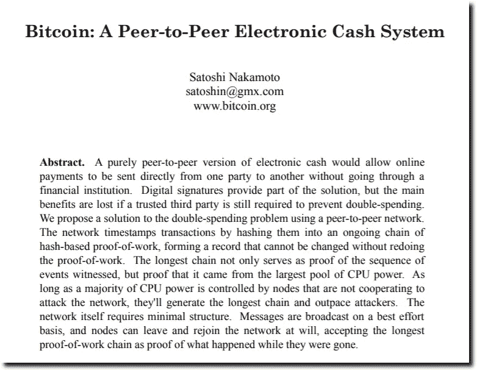

**The Bitcoin white paper** — source [https://bitcoin.org/bitcoin.pdf](https://bitcoin.org/bitcoin.pdf)

本质上，比特币网络是基于我们现在所说的区块链技术。区块链是一种分布式应用程序，由分类账或交易数据库组成，能够在其网络上的两方或多方之间直接进行价值交换。区块链技术具有验证账户所有权、确认余额和存储交易结果的独特能力，而不需要银行或金融机构等中介或中央来源。比特币[的创造者，或者可能是创造者](https://curiosity.com/topics/no-one-knows-the-identity-of-bitcoins-creator-curiosity/)试图消除我们今天对中央组织的依赖，以执行这些类型的活动。中央集权组织的例子有国家储备、中央交易交易所和投资银行。通常，我们对这类机构的控制有限，对其整体治理的了解也有限。这些系统的稳定性主要基于三点:内部控制、监管和外部信任。为了制定法规，我们通常建立监督小组来监督这类机构和组织的活动。监管实体的例子有[美联储委员会(FRB)](https://www.investopedia.com/terms/f/frb.asp) 、[联邦存款保险公司(FDIC)](https://www.fdic.gov/) 和[证券交易委员会(SEC)](https://www.sec.gov/) 。

比特币试图创建一个交易系统，将透明的监督纳入其自身的流程中。正是共识、游戏化和开放的实现使这一切成为可能。虽然您可能不理解每一项技术背后的每一个底层技术细节，但以下解释应该有助于您更好地理解其实施变化的影响。

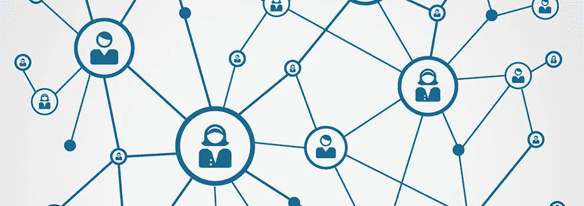

**Bitcoin is Decentralized, with Distributed Authority, and Peer to Peer.** — image source crypto-news.net

1) **共识**

在日常生活中，我们处理交易。我们用 [GooglePay](https://pay.google.com/about/) 购买一杯咖啡，一张公交卡坐火车去上班。还清贷款后，我们获得了汽车的所有权。在所有这些情况下，我们依靠一个或多个中央机构来核实账户或资产的所有权和余额，以及参与方遵守代表产品或服务的企业所规定的条款。例如，在用信用卡或网上支票付款后，服务提供商知道我们是否有钱支付，因为根据我银行的中央分类账，我们有钱支付。

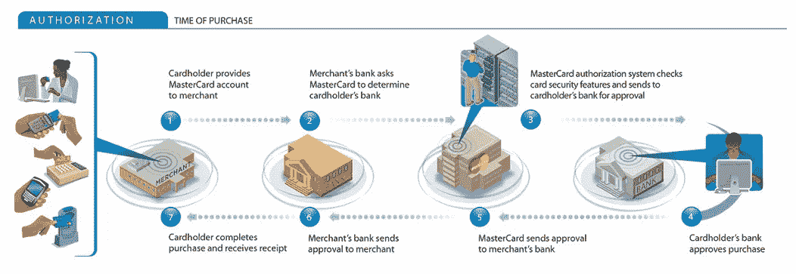

**Credit Card Authorization Using Multiple Central Authorities —** source: mastercard.com

但在区块链这个分散化的世界里，当支付账单时，服务提供商知道我们有钱支付，因为区块链有足够多的参与者同意我们有钱支付。让大多数人就资产的所有权和平衡达成一致的想法被称为共识，共识是每个区块链的主要组成部分。区块链科技**将这种权力**分配给个人，而不是让任何一个组织来管理我的账户余额。它通过将整个事务数据库(或分类帐)的副本复制到网络上运行区块链节点(服务器)的每个人来实现这一点。使用区块链软件内置的算法，每个节点使用相同的过程来验证帐户所有权和帐户余额。类似于建立电子邮件帐户和密码，个人可以创建区块链帐户或钱包。交易与基于其发送者和接收者的账户相关，类似于发送或接收电子邮件。通过查看特定地址发送和接收的所有消息或交易，我们可以确定任何资产的余额。像密码一样，个人的钱包也有私人钥匙，只有钥匙的主人才能控制他们的资产如何使用。资产可以是比特币、音乐会门票、黄金、石油，甚至是数字小猫。

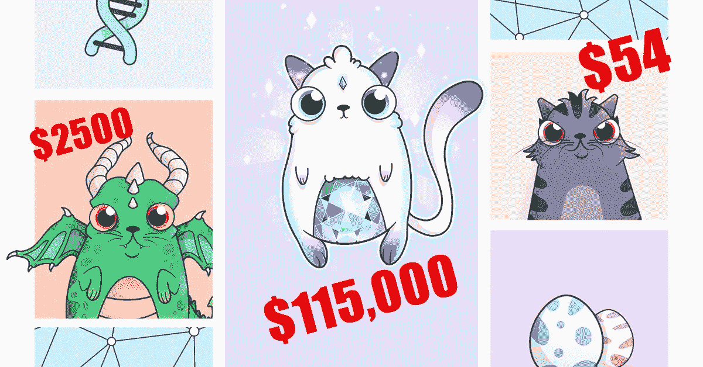

**CryptoKitties —** source: Medium.com

区块链还使用加密技术来创建防篡改交易。每个事务和每个块都通过一个称为[哈希](https://en.wikipedia.org/wiki/Hash_function)的单向计算运行，该计算采用一组预定义的输入(例如，当前日期和时间、前一个事务块的哈希以及事务本身的内容)，然后输出一个指定长度和格式的唯一字符串。

下面是一个 32 位 64 字符哈希的例子:

0000000000000000001 e8d 6829 A8 a 21 ad C5 d 38d 0 a 473 b 144 b 6765798 e 61 f 98 BD 1d。

如果有人试图修改交易，例如，将交易从*我收到了 5 个 BTC* 更改为*我收到了 500 个 BTC* ，哈希结果将会改变，不再与该交易的所有其他人的哈希匹配，从而使其无效。

共识还用于防止某人两次花费相同的硬币，即用于两次不同的交易。这样做被称为[双消费](https://en.wikipedia.org/wiki/Double-spending)，解决电子货币的双消费问题是比特币最伟大的成就之一。

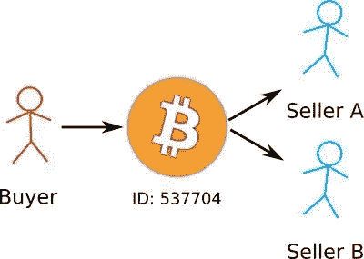

**Double-Spend Problem —** source pl.bitcoinwiki.org

因为区块链使个人能够在不知道或不需要信任对方的情况下验证交易，所以在区块链上的交易通常被称为 [*无信任*](https://www.quora.com/What-does-it-mean-that-Bitcoin-is-trustless) 。一些区块链共识议定书甚至允许在不了解实际余额的情况下核实余额。这就是所谓的[*零知识证明*](https://en.wikipedia.org/wiki/Zero-knowledge_proof) 。最终，当组成至少 51%区块链计算能力的足够多的节点验证一个交易块时，这个交易块被正式认为是区块链和真实的记录。

如果有人想改变区块链本身的规则，也需要节点间的一致同意。如果有人控制了区块链 51%的计算能力，他们基本上可以制定规则并给自己所有的硬币。这就是为什么**公共区块链网络中的节点越多，**网络就越强大。

以比特币区块链为例，要占据比特币区块链 51%的份额，谷歌目前的 CPU 能力需要超过 [250 倍。比特币区块链网络正以每月大约 35 个谷歌的速度增长。这确保了任何一个团体都难以控制。](http://www.zerohedge.com/news/2015-11-19/bitcoins-computing-network-more-powerful-525-googles-and-more-10000-banks)

在撰写本文时，以太坊区块链在全球拥有超过 [16，000 个节点](https://www.ethernodes.org/network/1)，并以每月约 10%的速度增长。网络规模不仅能抵御大规模收购，还能让系统具有极强的容错能力。不管是什么原因，如果几个区块链节点被破坏了，我们还有几千个节点来维持系统运行。

但是仅有共识是不够的。还需要有足够的动机让人们花费时间和资源来建立和支持一个节点。这就是为什么游戏化是仅次于区块链技术的最重要的概念。

**2)游戏化**

虽然 2008 年美国金融市场崩溃的一个主要原因是积累财富的欲望，但这实际上是区块链稳定的一个核心组成部分。

任何人都可以在自己的个人设备上为任何公共区块链设置一个节点，并开始验证交易。**区块链共识处理之所以成功，是因为通过游戏化，个人通过竞争来获得回报，以帮助保持网络运行并增加社区的整体价值。**

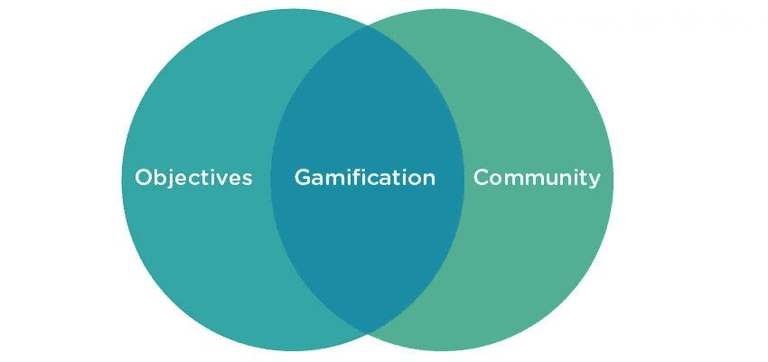

**Gamification —** image source: eventmobi.com.

节点执行工作、验证事务并向区块链添加事务的过程称为挖掘。矿工们竞相收取小额交易验证费，如果第一个将一组独特的交易打包成一个区块(一个比特币区块为 1MB)并放到网络上，他们甚至会获得更高的奖励。这就是所谓的 [*块奖励*](https://www.bitcoinmining.com/what-is-the-bitcoin-block-reward/) 。

为了支付这些奖励，每个区块链都有自己的货币或加密货币，通常大多数区块链都是以他们的货币命名的。例如比特币、以太坊和 [Neo](https://neo.org/) 区块链。

发起交易的个人或事物通常支付交易费，而集体奖励由区块链自己通过铸造新的硬币或代币来支付。这种方法可以根据特定区块链的规则而有所不同。

为了获得块奖励，一些区块链，如比特币区块链，要求每个节点产生一个大的随机数，就像彩票一样，必须在一个非常小的范围内。这个范围越来越小，直到所有的硬币都被铸造出来。这需要大量的计算或工作才能首先成功(又名[*工作证明*](https://en.wikipedia.org/wiki/Proof-of-work_system) )，从而迫使网络不断变强，跟上交易量的步伐，并确保您的节点使用最新的技术。其他区块链要求节点在一定时间内在系统中拥有大量股份来处理一个块(也称为[股份证明](https://en.wikipedia.org/wiki/Proof-of-stake))。拥有更多的股份和资历使你能够执行更多的验证过程，赚取更多的费用。利害关系证明确保节点以网络的最佳利益运行，但使用更少的 CPU 和能源。

在撰写本文时，一个比特币块奖励(12.5 BTC)价值约 10 万美元，一个以太坊奖励(5 ETH)约 3000 美元。比特币将会有一个有限的铸造数量，随着时间的推移[奖励数量逐渐减少](http://www.bitcoinblockhalf.com/)。最终回报将为零，届时矿商将完全依赖交易费。事实上，所有 BTC 的百分之八十已经被生产了，但是以太坊在另一方面没有生产限制。此时有[约 97M ETH](https://etherscan.io/stat/supply) 。

当这些规则中的任何一个被更新时，链**分叉成由新逻辑控制的新的事务链**。新规则被认为是新货币。这就是为什么会有比特币黄金( [BTG](https://coinmarketcap.com/currencies/bitcoin-gold/) )和比特币现金( [BCH](https://coinmarketcap.com/currencies/bitcoin-cash/) )，都是最初比特币的变种( [BTC](https://coinmarketcap.com/currencies/bitcoin/) )。**每种货币代表一套不同的治理，用于不同的目的**。一个可能是为了更快的处理。另一个可能是为了更有效地存储事务。另一个可能是为了降低费用。每种货币的供应都受到非常具体和透明的规则的监管，如前所述，对这些规则的任何更改都需要节点共识。

到现在为止，你可能已经被所有这些规则搞得晕头转向，但是想象一下，有一个网络最终到位，以特定的费用、奖励和利益模式执行一系列业务或社会流程，然后在没有警告的情况下，规则被改变，利益被取消。决定谁可以参与和谁有权改变治理规则是区块链的第三个要素。正是这种程度的开放有可能对我们在未来数字世界的互动方式产生最大的影响。

**3)开放性**

公众参与和审查一直是美国文化的主要内容，也是我们民主的基础。它在互联网的概念中也根深蒂固。

T2 的 Linux 操作系统 T3 运行着 T4 67%的网络服务器和超过 80%的手机，它是基于数百个软件开发者的开放合作。管理 Linux 的组织，成立于 1985 年的[自由软件基金会](https://en.wikipedia.org/wiki/Free_Software_Foundation)，使用了[自由和开源](https://linux.org.au/introduction-linux-free-software-and-open-source#WhatIsLinux)许可模式。创建于 2001 年的 [Wikipedia](https://en.wikipedia.org/wiki/History_of_Wikipedia) 是另一个基于[开放协作和合作的理念来创建一组可信的通用知识](https://en.wikipedia.org/wiki/History_of_Wikipedia)的例子。维基百科拥有超过 250 种不同语言的 3800 万篇文章，被认为是世界上最大的单一人类知识库。

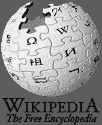

**Wikipedia multilingual, web-based, free encyclopedia** — image source: Wikipedia.org

带着实现由开源软件管理的去中心化组织的概念，[道](https://en.wikipedia.org/wiki/The_DAO_(organization)) [在 2016 年 6 月](https://gomedici.com/what-is-the-dao-and-why-is-it-the-biggest-crowdfunding-project-in-the-history/)众筹了 1.5 亿美元。“道”建立在与比特币区块链类似的区块链技术基础上，从技术上讲，它是一种政府，其规则和执行严格基于透明度、逻辑、密码学和数学的概念。这将是一个对公众完全可审计的系统，而不是一套受有限的个人群体潜在影响的隐蔽的过程。

逻辑可以在公开审查的空间中执行，以便政府、社交网络、产权交易所和金融交易可以建立在任何人都可以创建的协议基础上，并且可以在双方商定的具体条件下自动执行。例如，销售 50 件或以上的产品，可获得 15%的佣金，否则可获得 10%的销售佣金。

尽管 DAO 最初由于一个[利用的漏洞](https://www.coindesk.com/understanding-dao-hack-journalists/)而失败，但最终还是进行了修复以防止问题再次发生，DAO 的新版本成为了我们今天知道的以太坊(ETH)区块链网络。

虽然比特币主要是为了支付而设计的，但以太坊是为了运行去中心化程序或智能合约而设计的。任何人都有能力检查以太坊区块链智能合约背后的代码/逻辑。智能合同可以用来[追踪你的财产所有权](https://gcn.com/articles/2017/07/19/illinois-blockchain.aspx)，[监督赌博](https://augur.net/)，或者创建[能源共享社区智能电网](https://gridplus.io/)。

**就像互联网本身一样，公共区块链通常有帮助监督或协调重大变革的基金会，但本质上是独立于任何个人、政府或组织运行的。**任何人都可以访问和使用公共区块链，如以太坊、比特币、 [NEO](https://neo.org/) 或 [NEM](https://nem.io/) 。

同样的方式，一个私人公司可能有一个私人局域网或私人客户门户网站，事实上有办法创造私人或会员制区块链。这些也被称为[许可分类账](https://www.coindesk.com/information/what-is-the-difference-between-open-and-permissioned-blockchains/)。因为私有区块链中的参与者已经被信任，所以他们通常不需要与公共区块链相同的处理量来认证和验证交易，因此操作更快。此外，与公共区块链不同，私人和半私人的区块链不需要 51%的共识来改变他们的逻辑。

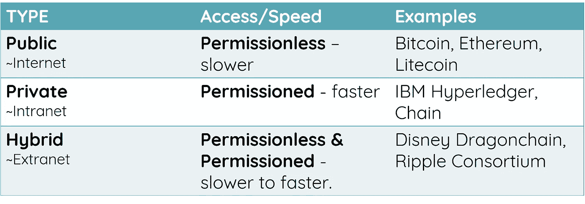

**Blockchain Types** — source: oneme.io

私营区块链有潜力在许多普通商业领域做出重大改进，如[供应链](https://www.ibm.com/blockchain/supply-chain/)、[会计](https://www.accountingtoday.com/opinion/blockchain-is-already-changing-accounting)和[国际货币兑换](https://ripple.com/)。然而，**虽然私营和半私营区块链可能比公共区块链具有绩效优势，但也有人认为，由于有限的个人群体可以就其治理做出决策，这些优势被削弱了。**

认识到对公共和私人区块链服务的需求，[迪士尼](http://disney.com/)一直在悄悄地开发我们可能期待在未来十年看到的区块链平台。 [DragonChain](https://dragonchain.com/) (DRGN)是一个区块链开发平台，提供从完全公开到完全私有的五种不同的区块链实现，每一种都结合了共识、游戏化和开放的变化。

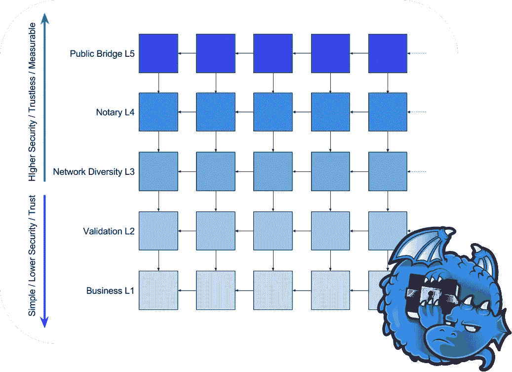

**Disney DragonChain Blockchain Development Platform —** source: DragonChain.com

由于对中央机构的需求预计不会在可预见的未来消失，我们可以期待看到公共和私人分散服务的激增，这些服务可以与集中服务和谐地执行和协调。例如，我们今天使用的在线服务可以编写为利用或卸载特定任务到区块链来执行服务，如所有权证明、支付、资产交换、交易历史维护和自动执行合同。随着对我们的个人数据处理的日益关注，区块链也将开始在确保我们的数据用于承诺的核心部分。一旦这种分散服务的基础变得更加普遍，我相信区块链真正的机会在于它强调公共使用和可及性。

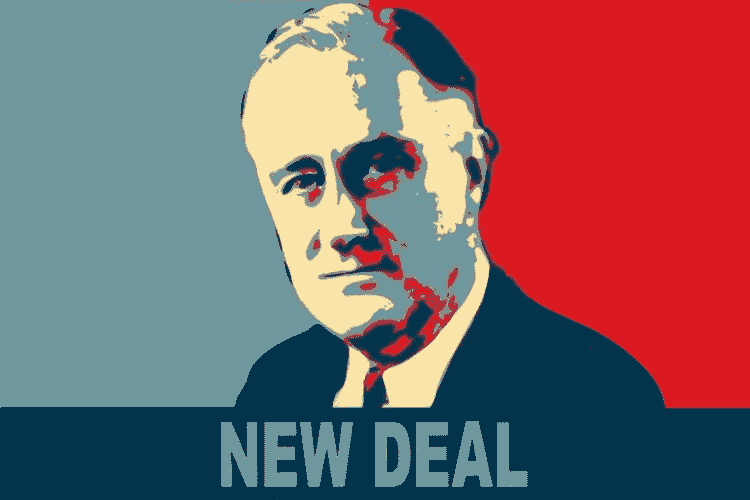

**FDR’s New Deal** — image source: kr.usembassy.gov

回顾 1929 年美国第一次大规模市场崩溃以及随后的 20 世纪 30 年代大萧条，富兰克林·德拉诺·罗斯福总统领导下的两项举措有助于美国稳定并重新站立起来，值得称道。第一项举措是建立了像 1934 年 T4 证券交易委员会(SEC)这样的[新监管组织](https://en.wikipedia.org/wiki/Alphabet_agencies)，这有助于确保更大的**商业透明度**和**限制中央交易交易所、投资银行、经纪人和顾问等组织可能承担的风险**。第二项举措是实施一项名为“新政”的就业计划。新政导致了[平民保护公司](https://en.wikipedia.org/wiki/Civilian_Conservation_Corps)、[田纳西流域管理局](https://en.wikipedia.org/wiki/Tennessee_Valley_Authority)和[工程项目管理局](https://en.wikipedia.org/wiki/Works_Progress_Administration)的成立。

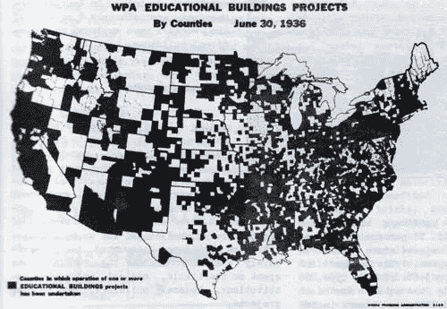

**WPA Educational Buildings Projects — Dark areas represent WPA construction.** — image source gjenvick.com

仅 WPA 就创造了 800 多万个工作岗位。这些项目不仅建造了国家的高速公路、机场、桥梁，扩展了我们的铁路系统，它们还负责一些科学项目，如[建造天文观测台](https://en.wikipedia.org/wiki/Griffith_Observatory)，为[工匠劳工](https://en.wikipedia.org/wiki/Timberline_Lodge)提供工作，甚至[为管弦乐队、音乐教育和节日雇佣数千名音乐家](https://en.wikipedia.org/wiki/Federal_Music_Project)。在种族不平等严重的时代，WPA 成功的一个主要因素是它的包容性。

**共识+游戏化+开放=机遇**

透明度、纳入治理水平和公众参与的概念听起来熟悉吗？新政由政府资助，但现在想象一下全球资助的公共工程，任何人都可以作为投资者、工人，甚至作为质量控制的观察员参与其中。根据世界银行的数据，48%的世界人口没有银行，其中 55%是女性，超过 40%的人表示原因是缺乏资金。借助区块链的监管能力和公开公众参与的机会，有充分的理由相信下一代在线服务可以利用同样的成功原则在全球范围内创造经济机会。

除了表示数字或物理资产，**区块链共识方法、游戏化方法和开放程度的组合可以表示使用服务的权利、为该服务执行工作的权利、执行该服务的某人或某物的声誉，或者所有这些的组合。**

**The Three Elements of Blockchain** — source: oneme.io

这种将货币表现为资产、工作、用途或报酬的方式被称为[记号化](https://en.wikipedia.org/wiki/Tokenization_(data_security))。虽然令牌类型之间的界限可能会变得模糊，并且一个令牌可以执行多种功能(也称为**混合令牌**)，但是您通常可以将令牌分为五大类。

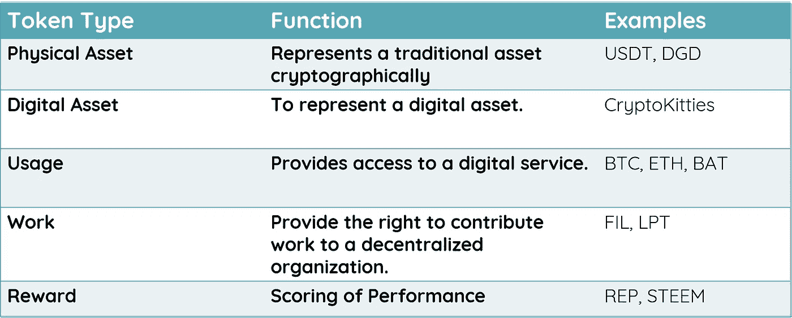

**Token Types** — source: oneme.io

一些像比特币这样的区块链只创建和验证交易。除了是一个**数字资产令牌**，比特币也可以被认为是**一个使用令牌**，因为它赋予了你参与网络的权利。一些代币只是代表一种实物资产，如代表一根独特金条的一部分的 [Digix](https://digix.global/) ( [DGD](https://coinmarketcap.com/currencies/digixdao/) )。当一个代币和另一个代币之间没有区别时，代币被认为是可替代的，但也可以是不可替代的，代表独特的东西，如可收集的棒球卡或 [Cryptokitty](https://www.cryptokitties.co/) 。

像 [Livepeer 的 LPT](https://livepeer.org/) 这样的**工作令牌**由节点在执行分布式视频流时获得。 [Filecoin](https://filecoin.io/) 节点在执行分布式存储管理时获得工作令牌，而 [Gems](https://gems.org/) 节点可以监督人类执行微任务(如分类或标记图像)的完成和支付。这种方法也可以扩展到执行物理模拟任务，如建造桥梁或教授艺术课程。

最后一种代币是**声誉或奖励代币。**奖励令牌代表对一个人或一件事的表现的分数、尺度或奖励。 [Steemit](https://steemit.com/) 举例来说，根据内容贡献者的观点和对其作品的喜欢程度，用 [STEEM](https://steem.io/) 奖励内容贡献者。[占卜](https://www.augur.net/)奖励对体育、政治或金融事件做出准确预测并验证事件结果的参与者[声誉(REP)](https://coinmarketcap.com/currencies/augur/) 。 [Livepeer 利用并奖励人群来监控提供流媒体功能的节点的质量和性能](https://github.com/livepeer/wiki/wiki/Delegating)。

将所有这些概念放在一起，我们可以创建一个纯粹的公共点对点拼车服务。利用资产代币，我们可以让参与者出售他们投资工具中的股权。使用工作代币，我们可以让他们把车租给司机。乘客可以用公用代币支付乘车费用。使用智能合约，我们可以计算车手和车手费用，用奖励令牌奖励优秀车手和忠诚车手，并最终按季度计算和分配利润和/或股息给所有股东。

请注意，从监管的角度来看，SEC 认为令牌只分为两类，**公用令牌**和[安全令牌](/@argongroup/8-important-things-to-know-about-security-tokens-token-regulation-3d548a1a6367)。如果购买令牌来执行某种类型的工作或服务，则认为它是一种实用工具。证券交易委员会不监管公用事业代币。如果代币是有意购买的，并期望获得某种回报，如股息、利润分享或预期的价值增加，则代币被视为一种证券。因此，即使是看似实用的代币，也可能被 SEC 归类为证券。

**总结**

尽管目前存在技术和可用性挑战，但区块链技术可能会在未来十年内成熟，成为我们技术领域不可或缺的一部分，不仅有助于提高所有权证明、支付、资产交换、交易历史维护和自动执行合同等任务的效率，还可能确保更大的透明度，并改善对金融机构、交易所和在线服务等大型集中化组织的治理。

尽管区块链技术不能包治所有的数字疾病，但它确实为我们提供了在一个更安全、更包容的数字世界中互动的新的和有趣的能力的可能性。我们从历史中知道，包容性的理念可以对社区和国家产生深远的积极影响。随着对共识、游戏化和开放如何在区块链技术中发挥作用的更好理解，我们可以开始想象、实施和参与在本地和全球范围内开辟全新经济机会的服务。你的大创意是什么？

如果您有兴趣了解更多关于去中心化和个人数据隐私技术的信息，请随时通过 [OneMe.io](http://oneme.io/) 与我联系。