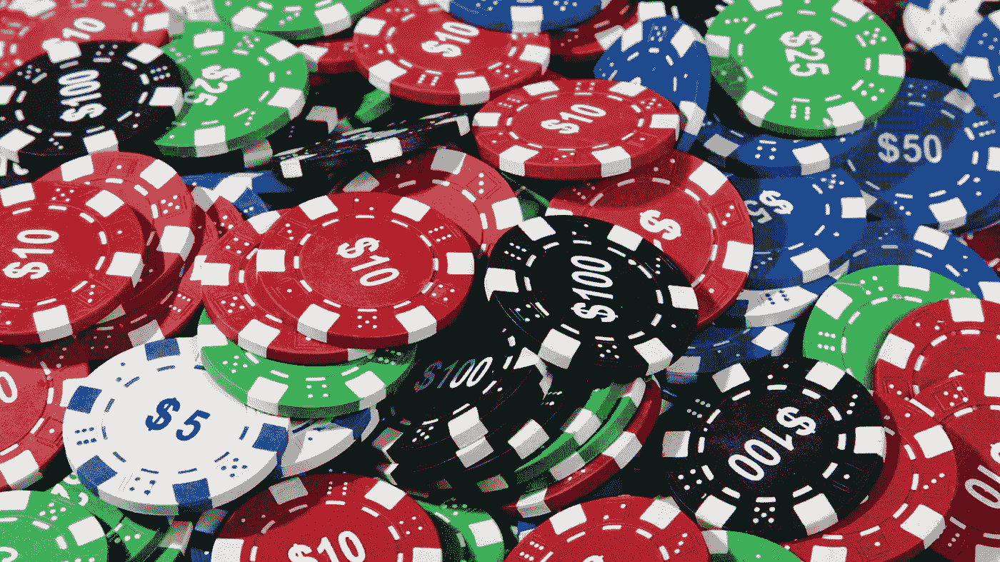
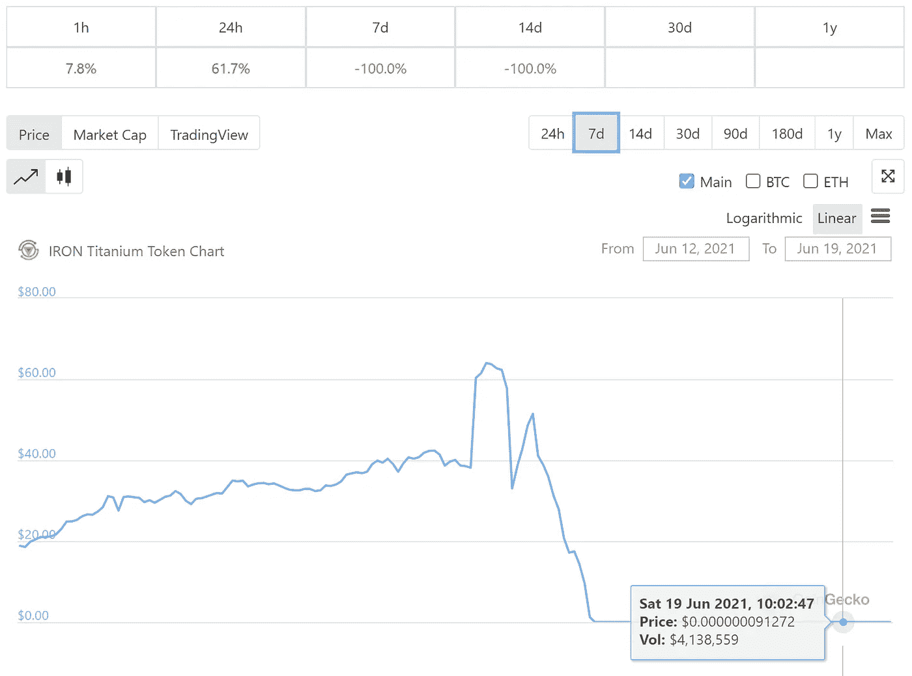
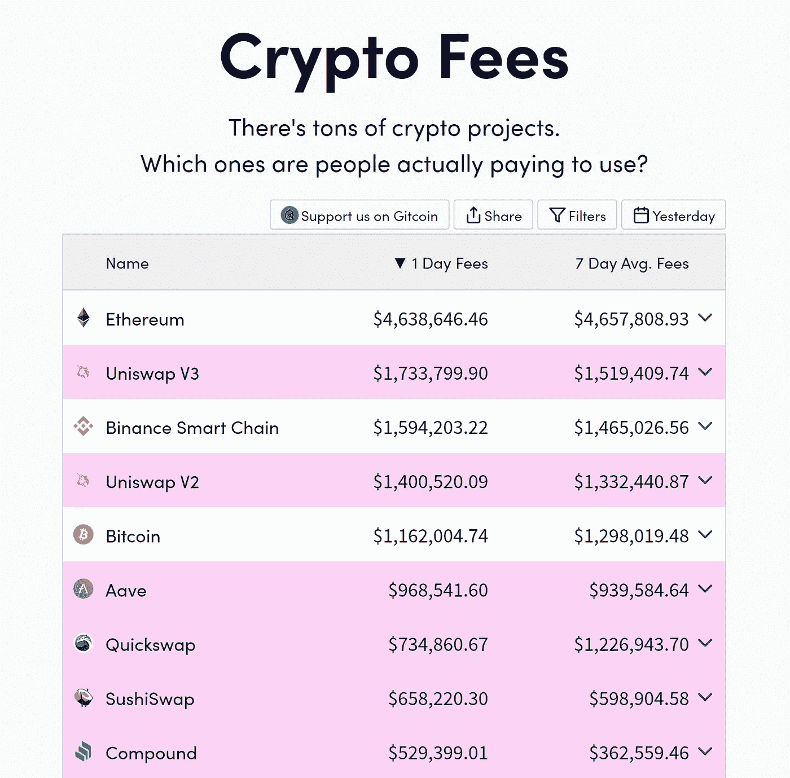
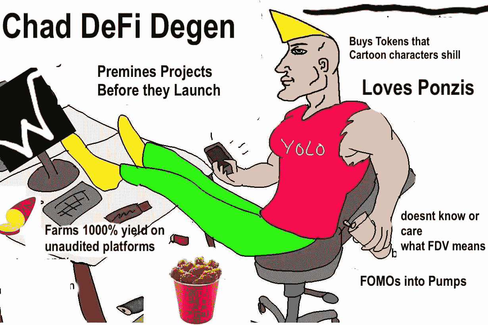
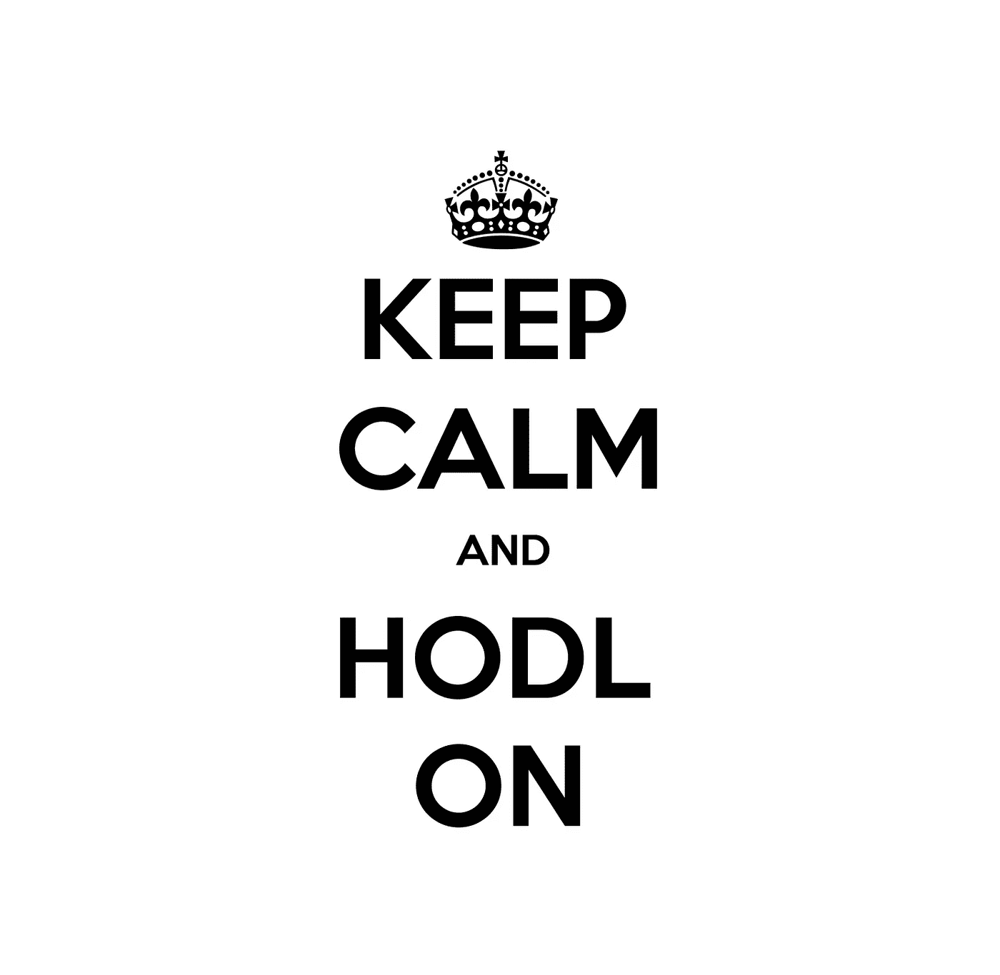

# 三个月的 BSC 产量农业💰——每月 24，000 美元的利润，大约 60%的总损失，等等

> 原文：<https://medium.com/coinmonks/three-months-of-yield-farming-on-bsc-24k-month-profit-some-60-total-losses-and-more-cdc0900d27f7?source=collection_archive---------0----------------------->

这篇文章是我之前的故事的续篇，概述了我如何通过两个周期持有比特币 7 年赚了 100 万美元。我提到过，除了 HODLing 之外，我今年 3 月开始玩 DeFi，在这三个月中，我每月有大约 20，000 美元的稳定收入。

以我目前的投资组合规模(从 5 月份略高于 100 万美元的高点跌至一个月后撰写本文时的约 60 万美元)，这相当于我所有本金总年化收益率(也称为 APR)的 40%左右。当然，在 DeFi 的西部地区，中间两位数的年利率并不奇怪，但是，我说的是三个月内的平均持续收益率，没有受到任何其他计划的影响。

我是这样做的-

-

## **1。选择合适的代币进行养殖**

我甚至不能开始强调这是多么重要。从投资你相信的代币开始(比如那些具有长期潜力的代币，你愿意在涨跌中持有)，然后找到在这些代币上获得收益的最佳地点。不要反过来做。为什么不呢？

如果你买的是没有什么价值的蹩脚代币，可能的结果是，即使你在一段时间内产生了三位数或四位数的收益率，本金的价值(代币的美元价值)将比你的收益率积累的速度更快。两个例子-

[棉花糖 DeFi](https://www.coingecko.com/en/coins/marshmellowdefi) 首次在 Beefy 上市时，出价 10 亿+ %的年利率。我投入了 200 美元进行测试——结果我几乎一无所获，因为代币的价值从 10 美元逐渐下降到 0.07 美元。目前的年利率仍然是 100%左右，没有多大用处。

Titan rugpull 更具史诗性，它是 Polygon(其持有者包括马克·库班)短暂流行的三位数收益率标志，从 60 美元涨到 0.0000008887 美元。声明:在价格暴跌之前，我并没有持有这些代币，当时我购买并转手了 240 亿代币，获得了约 40%的即时利润:)

相比之下，这两个——虽然我对 BTC 联邦理工学院的流动性组合的年利率只有“微薄的”10 %- 15 %,但我对长期持有它们的价值有充分的信心，我不怕增加我的投资组合，也不怕(几乎)忘记它们。目前，我在这两种代币中各持有约 30%的投资组合，另外 40%是我实际获得的有趣收益。请继续阅读-

The recent Titan rug pull — some $260 million of value wiped out overnight

-

## **2。持有正确的风险调整分布**

如上所述，我的投资组合中约 60%由 BTC 和瑞士联邦理工学院组成，我认为这是非常低风险的资产(至少从加密的角度来看)。接下来的 15%在 BNB——风险更高，但仍然是一个基础层令牌，代表着 200 亿美元(并且还在增长)的 DeFi 生态系统份额，直到最近，它还是以太坊的 DeFi 的唯一负担得起的竞争对手。

在最后的 25%中，大约 16%是 DeX 代币——代表了 BSC 上的一些领先交易所，现在也包括以太坊。这些指数的好处是它们有实际收入，[每天达到数百万](https://cryptofees.info/)——这通常还没有适当地反映在代币的估值中。稍后会有更多关于这种估值方法的信息(可能会在单独的帖子中)，但我想说的是，DeXes 是 DeFi 中最大的收入来源，也具有良好的网络效应，这就是为什么我认为持有这些代币的风险相对较低。

种植这些代币(在蛋糕和 MDEX 的情况下)仍然能够给我 100%以上的年利率，而在蛋糕的情况下，自我 3 月份买入以来，代币价值也上涨了约 50%，尽管加密市场自那以来暴跌了 40%。总的来说，与持有比特币相比，过去三个月我在蛋糕上获得了约 150%的回报，在 MDX 上获得了 25%的回报。

以美元计算，MDX 的回报将是负的，但我将我的投资组合命名为 BTC——因为这是我否则会持有的，这是我试图超越的象征。负的美元回报并不困扰我，因为我可以很容易地将它们转换回 BTC，我相信它会上涨，只有在我过早卖出的情况下才会导致亏损。

The top fee-earning protocols. Base layer blockchains, DeXes, and lending platforms.

-

## **3。如有疑问，请耐心等待**

我从扑克中学到了这一点——试图每局都赢是没有用的，更好的策略是始终关注整个游戏。当我不确定是否能赢一手牌时，最好弃牌，而不是跟注，因为结果非常不确定，所以要冒损失大量金钱的风险。虽然这种策略偶尔会奏效(就像去赌场赌轮盘赌中的数字 26 一样)，但它是不可复制的。回到轮盘赌的类比，你的号码 37 次才会赢一次，因此从长远来看，统计数据总是对你不利。

同样，我的大部分“万福玛利亚”赌注都以对我不利告终。除了前面提到的 MarshmallowDefi 实验，我投资过的风险最高的代币是 BSC 上的借贷平台和收益率聚合器——包括 Venus、Autofarm、Belt 和 Acryptos。所有这些代币，尽管有 80-240%的收益率，当与 BNB 配对时，到目前为止，我是红色的。这是因为它们的价格急剧下降——这是因为金星的开发利用；由于激进的排放计划和更广泛的加密市场暴跌，导致这些代币的价格比 BTC 或瑞士联邦交易所的价格更低。

在过去的两个月里(我买这些代币的时间比买蛋糕还晚)，我在 XVS 的股票下跌了 40%，在汽车上下跌了 29%，在 ACS 上下跌了 28%——这些都是相对于 BTC 的。这意味着，以美元价值计算，在计入这段时间的收益率后，我下跌了 60%。也就是说，我并不绝望或抛售，因为我仍然认为这些项目具有良好的长期潜力，与以太坊上的双胞胎相比，它们被严重低估，因此当整个加密市场回调时，它们可能会上涨。

这里的教训是——我不应该这么快地向他们投入这么多资金，尽管当时这笔交易看起来不错。一个更好的策略是试探一下，监控结果，如果结果不错，就开始增加更多的钱。因为在我投资的时候，一切都在上涨，FOMO 肯定是一个因素，它不应该是。

Don’t be like Chad. Don’t FOMO in!

## **总之**

总的来说，尽管我犯了一些错误，但我还是获得了约 3%的月回报率，这足以让我有足够的收入生活下去，同时将大部分利润重新投资到我的投资组合中。也就是说，随着生态系统的成熟，产量每周都在下降。我一直在寻找新的机会，并将发布更多关于我的旅程的文章。

参与 DeFi 的最佳方法是做大量的研究，密切跟踪你的总体表现，从少量的钱开始，随着你信心的增长，这些钱可以增加。这些都不是理财建议，有问题请在评论里留下！

如果你喜欢这篇文章，➡️ [在推特上找到我](https://twitter.com/m_goes_distance)🐦。请随意跟我来或者鼓掌，像这样-

## **A️️lso 读了**

 [## 加密交易机器人——最佳免费加密交易机器人

### 2021 年币安、比特币基地、库币和其他密码交易所的最佳密码交易机器人。四进制，位间隙…

medium.com](/coinmonks/crypto-trading-bot-c2ffce8acb2a)  [## 最佳 6 个加密交易信号电报通道

### 这是乏味的找到正确的加密交易信号提供商。因此，在本文中，我们将讨论最好的…

medium.com](/coinmonks/best-crypto-signals-telegram-5785cdbc4b2b)  [## BlockFi 评论 2021:利弊和利率

### 今天，我们提出了一个全面的 BlockFi 评论，这是一个成立于 2017 年的加密贷款平台，拥有其…

blog.coincodecap.com](https://blog.coincodecap.com/blockfi-review)  [## 加密税务软件——五大最佳比特币税务计算器[2021]

### 不管你是刚接触加密还是已经在这个领域呆了一段时间，你都需要交税。

medium.com](/coinmonks/best-crypto-tax-tool-for-my-money-72d4b430816b)  [## Pionex 评论 2021 |免费加密交易机器人和交易所

### Pionex 是为交易自动化提供工具的后起之秀。Pionex 上提供了 9 个加密交易机器人…

medium.com](/coinmonks/pionex-review-exchange-with-crypto-trading-bot-1e459d0191ea)