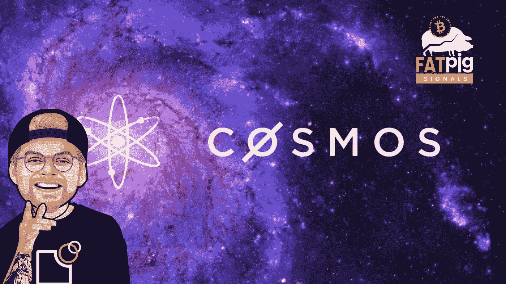

# Cosmos (ATOM)依然被低估的三个原因！

> 原文：<https://medium.com/coinmonks/three-reasons-why-cosmos-atom-is-still-undervalued-bab6cf46ace7?source=collection_archive---------3----------------------->

# 一言以蔽之:什么是宇宙(原子)？

独立分散区块链通信领域的一个大话题是互操作性。术语互操作性描述了网络中区块链和数据结构的无缝和直接通信，同时遵守预期的标准。远期目标是实现分散的…