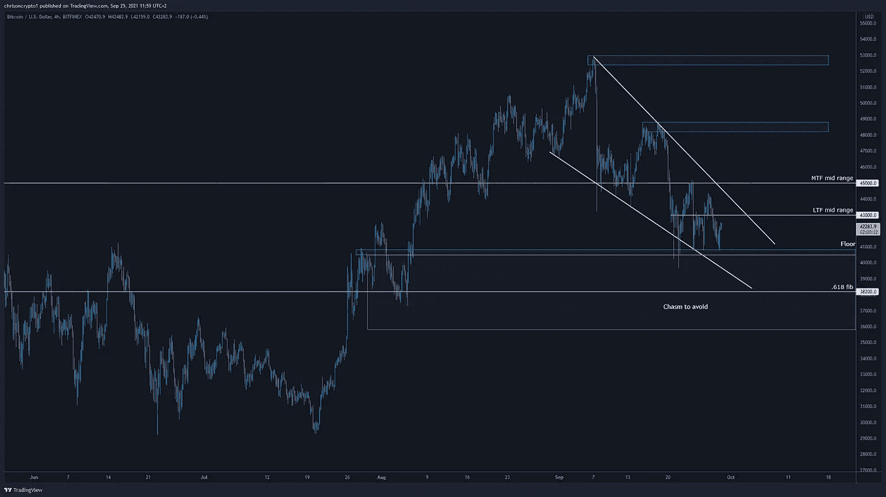
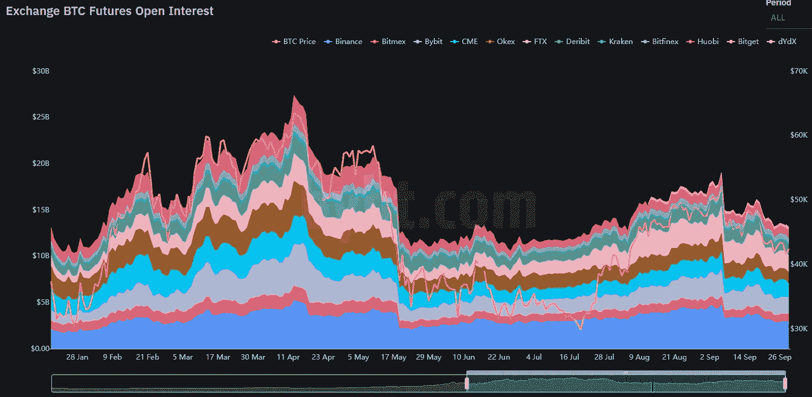
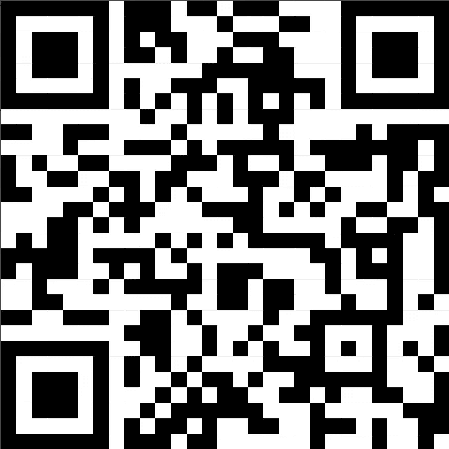

# 当长期持有者囤积 BTC 供应时，有三种情况值得关注

> 原文：<https://medium.com/coinmonks/three-scenarios-to-look-out-for-as-long-term-holders-hoard-the-btc-supply-584cbdc859d8?source=collection_archive---------10----------------------->

随着世界努力应对非政府资金现已成为现实的事实，比特币再次处于十字路口。在这一版中，我概述了三种情况，你应该在未来几天做好准备，因为头号密码正在为一个巨大的变动做准备。

我们来挖一下。

# 长期持有者拥有 80%的 BTC 供应量

根据加密研究公司 Glassnode 的数据，长期持有者持有的比特币数量达到了总发行量的 80.5%，创下历史新高。

历史新高与比特币市场的连锁趋势相吻合，交易所中准备出售的硬币数量继续急剧下降。

**查看完整** [文章点击这里](https://chrisoncrypto.com/blog/f/long-term-bitcoin-holders-own-80%25-of-the-circulating-supply) **！**

# 需要注意的三种情况

BTC/美元有诱捕投资者和与市场玩心理游戏的趋势。比特币流动性下降和传统市场的不确定性使得价格行为更加令人困惑，许多人认为这种情况对加密领域具有传染效应。

不管怎样，接下来的几天，你需要注意以下三种情况。

# 失败的逆转情景

毫无疑问，这是最不受欢迎的情景，这需要反转迹象失效，比特币屈服于看跌压力，确认周期性顶部和卖方市场。

简单地说，如果 BTC/美元日收盘价低于 38，200 美元，那么可以肯定地说牛市可能已经结束，中期反弹应该卖出。该水平代表 0.618 Fib 回撤区域，通常决定强支撑位和阻力位，如果突破，标志着任何趋势的变化，无论是看涨还是看跌。

一些分析师表示，可能需要一次大规模的流动性下行，这可能随后引发更大的市场波动。然而，流动性已经被彻底抹去，未平仓合约也在减少。由于自 4 月份以来，价格在技术上一直在历史高点以下盘整，可以肯定地说，流动性处于上行而非下行状态。事实上，持续下跌也需要比特币持有者抛售——鉴于目前的数据与此完全矛盾，这是一个不太可能的前景。几个月来持续的负融资利率也值得注意，这使得周期性下降趋势最不可能发生。

# 短暂的挤压

这就把我们带到了下一个场景——短期挤压。根据上面的技术图表，你可以看到一个明显的下降楔形，高点越来越低，低点越来越低。根据 4 小时图上的[相对强弱指数](https://www.tradingview.com/x/gz1XBodp/)，40，000 美元的底部迄今一直保持住，每次向下的尝试都遇到了稳定的买家流以及逐渐减弱的看跌势头。激进的多头已经建仓了，他们已经在当前的心理价位进场了。43，000 美元和 45，000 美元将为 MTF 趋势反转提供最终确认，这可能会将 BTC/美元送至前一次[邮件中提到的水平。](https://mailchi.mp/212720b6f577/100000-what-does-a-bullish-q4-look-like-for-bitcoin)

# 垃圾场和水泵

最后，BTC/美元可能会选择在楔形内停留更长时间，导致投资者失去希望，并在突破上行之前将许多人困在 39，000 美元的低点。这发生在 7 月份比特币徘徊在 30，000 美元附近的时候。加速的价格波动导致了一系列的低点，这些低点标志着当时的确切底部。近期偏差可能表明，投资者已经习惯了造假，因此要么做出反应——前期价格(如目前正在发生的那样)，要么等待进入“最终下跌”情景。

然而，价格行为很少连续重复准确的底部模式，特别是当市场参与者预期这个底部形成时。在撰写本文时，BTC/美元汇率在 42，370 美元以上，第四次反弹至 40，000 美元。通常情况下，底价测试越频繁，它就越有可能被打破，所以第五次测试将使第一种和最后一种情况都更有可能发生。

也就是说，尽管一切皆有可能，但在我看来，在游戏的现阶段，关于周期性下跌趋势的论点经不起推敲。表明战争还没有结束的[数据点](https://twitter.com/ChrisOnCrypto1/status/1442937256210141184)的汇集令人震惊。

时间会证明一切。

回头见。

*附:这是我的看法。你可以有自己的看法。*

**加入** [电报](https://t.me/chrisoncryptochannel) **频道，实时更新&设置！
关注我** [推特](https://twitter.com/ChrisOnCrypto1) **&** [多嘴多舌](https://gab.com/chrisoncrypto) **下面还有我的社交门户。**

[https://www.paypal.com/donate?hosted_button_id=C9VRLGTBHQX2N](https://www.paypal.com/donate?hosted_button_id=C9VRLGTBHQX2N)

# 阅读更多:[长期持有者拥有 80%的 BTC 供应量](https://chrisoncrypto.com/blog/f/long-term-bitcoin-holders-own-80%25-of-the-circulating-supply)

[www.chrisoncrpto.com](http://www.chrisoncrpto.com)

你也可以用比特币支持我！
BTC 地址:**3 eydseypjhn 68 axkncuqbb 7 ebqcxrejamr**

最诚挚的问候，
**克里斯托弗·阿塔尔德**
克里斯对加密的创始人
贡献者[www.cityam.com](https://www.cityam.com)
直接接通:[电报](https://t.me/chrisoncrypto)

*最初发布于*[*https://mailchi . MP*](https://mailchi.mp/1452f9e6647d/three-scenarios-to-look-out-for-as-long-term-holders-hoard-the-btc-supply?e=[UNIQID])*。*

> 加入 Coinmonks [电报频道](https://t.me/coincodecap)和 [Youtube 频道](https://www.youtube.com/c/coinmonks/videos)了解加密交易和投资

## 另外，阅读

*   [网格交易机器人](https://blog.coincodecap.com/grid-trading) | [Cryptohopper 审查](/coinmonks/cryptohopper-review-a388ff5bae88) | [Bexplus 审查](https://blog.coincodecap.com/bexplus-review)
*   [7 个最佳零费用加密交易平台](https://blog.coincodecap.com/zero-fee-crypto-exchanges)
*   [分散交易所](https://blog.coincodecap.com/what-are-decentralized-exchanges) | [比特 FIP](https://blog.coincodecap.com/bitbns-fip) | [Pionex 评论](https://blog.coincodecap.com/pionex-review-exchange-with-crypto-trading-bot)
*   [用信用卡购买密码的 10 个最佳地点](https://blog.coincodecap.com/buy-crypto-with-credit-card)
*   [加密复制交易平台](/coinmonks/top-10-crypto-copy-trading-platforms-for-beginners-d0c37c7d698c) | [如何在 WazirX 上购买比特币](/coinmonks/buy-bitcoin-on-wazirx-2d12b7989af1)
*   [CoinLoan 点评](https://blog.coincodecap.com/coinloan-review)|【Crypto.com】点评 | [火币保证金交易](/coinmonks/huobi-margin-trading-b3b06cdc1519)
*   [Bookmap 评论](https://blog.coincodecap.com/bookmap-review-2021-best-trading-software) | [美国 5 大最佳加密交易所](https://blog.coincodecap.com/crypto-exchange-usa)
*   最佳加密[硬件钱包](/coinmonks/hardware-wallets-dfa1211730c6) | [Bitbns 评论](/coinmonks/bitbns-review-38256a07e161)
*   [新加坡十大最佳加密交易所](https://blog.coincodecap.com/crypto-exchange-in-singapore) | [购买 AXS](https://blog.coincodecap.com/buy-axs-token)
*   [币安收费](/coinmonks/binance-fees-8588ec17965) | [僵尸加密审查](/coinmonks/botcrypto-review-2021-build-your-own-trading-bot-coincodecap-6b8332d736c7) | [热点审查](/coinmonks/hotbit-review-cd5bec41dafb)
*   [我的加密副本交易经历](/coinmonks/my-experience-with-crypto-copy-trading-d6feb2ce3ac5) | [AAX 交易所评论](/coinmonks/aax-exchange-review-2021-67c5ea09330c)
*   [逐位融资融券交易](/coinmonks/bybit-margin-trading-e5071676244e) | [币安融资融券交易](/coinmonks/binance-margin-trading-c9eb5e9d2116) | [超位审核](/coinmonks/overbit-review-9446ed4f2188)
*   [有哪些交易信号？](https://blog.coincodecap.com/trading-signal) | [比特斯坦普 vs 比特币基地](https://blog.coincodecap.com/bitstamp-coinbase)
*   [ProfitFarmers 回顾](https://blog.coincodecap.com/profitfarmers-review) | [如何使用 Cornix Trading Bot](https://blog.coincodecap.com/cornix-trading-bot)
*   [加密货币储蓄账户](/coinmonks/cryptocurrency-savings-accounts-be3bc0feffbf) | [YoBit 评论](/coinmonks/yobit-review-175464162c62)
*   [Botsfolio vs nap bots vs Mudrex](/coinmonks/botsfolio-vs-napbots-vs-mudrex-c81344970c02)|[gate . io 交流回顾](/coinmonks/gate-io-exchange-review-61bf87b7078f)
*   [CoinFLEX 评论](https://blog.coincodecap.com/coinflex-review) | [AEX 交易所评论](https://blog.coincodecap.com/aex-exchange-review) | [UPbit 评论](https://blog.coincodecap.com/upbit-review)
*   [AscendEx 保证金交易](https://blog.coincodecap.com/ascendex-margin-trading) | [Bitfinex 赌注](https://blog.coincodecap.com/bitfinex-staking) | [bitFlyer 审核](https://blog.coincodecap.com/bitflyer-review)
*   [WazirX vs CoinDCX vs bit bns](/coinmonks/wazirx-vs-coindcx-vs-bitbns-149f4f19a2f1)|[block fi vs coin loan vs Nexo](/coinmonks/blockfi-vs-coinloan-vs-nexo-cb624635230d)
*   [杠杆代币](/coinmonks/leveraged-token-3f5257808b22) | [最佳密码交易所](/coinmonks/crypto-exchange-dd2f9d6f3769) | [Paxful 点评](/coinmonks/paxful-review-4daf2354ab70)
*   [加密套利](/coinmonks/crypto-arbitrage-guide-how-to-make-money-as-a-beginner-62bfe5c868f6)指南| [如何做空比特币](/coinmonks/how-to-short-bitcoin-568a2d0b4ae5) | [1xBit 回顾](https://blog.coincodecap.com/1xbit-review)