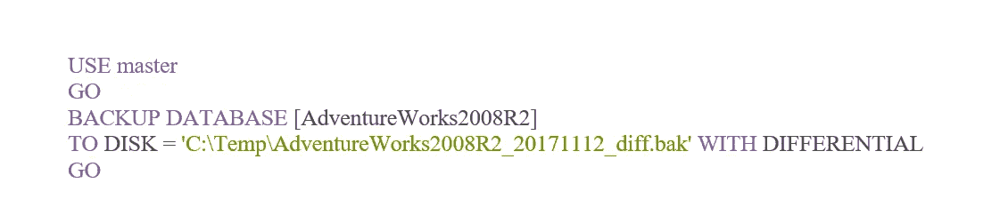

# 三种最常见的 SQL Server 备份类型

> 原文：<https://medium.com/coinmonks/three-top-sql-server-backup-types-fbd253fc09f3?source=collection_archive---------2----------------------->

## *在数据技术时代，保护数据安全比以往任何时候都更加重要*

对于公司以及从事数据存储和管理的个人来说，没有什么比数据安全更重要的了。

许多公司将其核心数据存储在数据库中，这些数据很容易受到威胁，包括硬件故障、恶意攻击、错误的用户操作、数据库损坏以及自然灾害导致的数据丢失。

在新的数据技术(DT)时代，采取措施应对这些数据安全威胁至关重要。对于 SQL servers 等关系数据库，数据库备份为灾难恢复(DR)能力提供了强有力的保证。本文中概述的数据备份类型是保持数据安全的有效工具。

本文介绍了以下备份类型的工作原理和应用流程:

1.**完整备份** —数据库在给定时间点的完整副本

2.**事务日志备份** —记录从上次日志备份或事务日志备份开始的完整备份到当前时间点提交的所有事务日志更改

3.**差异备份** —从上次完全备份到当前时间点的所有数据更改的副本

# **完整备份**

完整备份是所有 SQL Server 备份中最简单和最基本的数据库备份。完整备份存储特定数据库在备份完成时的完整副本。

完整备份的缺点是，它只能将数据库恢复到备份成功完成的时间点。这意味着系统只能恢复到完整备份完成时的时间点，而不能恢复到数据库历史记录中的任何时间点。

## **完整备份的工作原理**

以下时间线简要说明了完整备份的工作原理:

*Figure source:* [*SQL Server Backup Academy*](https://sqlbak.com/academy/full-backup/)

时间线中显示的事件如下:

**下午 7 点**:生成数据#1。

**晚上 10 点**:数据库完全备份，备份文件包含数据#1。

**凌晨 2 点**:生成数据#2，数据库包含数据#1 和#2。

**上午 6 点**:生成数据#3，数据库包含数据#1、#2 和#3。

**上午 10 点**:数据库完全备份，备份文件包含数据#1、#2 和#3。

**下午 1 点**:生成数据#4，数据库包含数据#1、#2、#3 和#4。

**下午 5 点**:生成数据#5，数据库包含数据#1、#2、#3、#4 和#5。

**晚上 8 点**:生成数据#6，数据库包含数据#1、#2、#3、#4、#5 和#6。

**晚上 10 点**:数据库完全备份，备份文件包含数据#1、#2、#3、#4、#5 和#6。

在真实的生产环境中，实际操作可能比时间表显示的要复杂得多。完整备份过程的两个重要问题是:

**备份操作会降低 I/O(输入/输出)速度**

数据库备份需要大量的 I/O 资源。由于对 I/O 资源的需求增加，数据库备份操作可能会降低数据库查询的速度。

**在完整备份过程中，数据库事务日志不能被截断**

这可能会导致事务日志不断增长，直到耗尽磁盘中的所有可用空间。对于面向 SQL Server 产品用户的阿里云 RDS 来说，这是一个常见的场景。事务日志备份是一种潜在的解决方案，本文对此也有详细介绍。

## 使用 T-SQL 创建完整备份

通过使用 BACKUP DATABASE 语句，可以使用 T-SQL 语句完成完整数据库备份。以下示例显示了如何创建 AdventureWorks2008R2 数据库的完整备份:

## **使用 SSMS IDE 创建完整备份**

SSMS 集成开发环境(IDE)界面操作也可用于创建完整的数据库备份。

该过程如下:

1.右键单击要备份的数据库。

2.选择**任务** > **备份**。

3.选择**全**为**备份类型**。

4.选择**磁盘**作为备份文件存储。

5.点击**添加**添加备份文件。

6.选择存储备份文件的目录。

7.输入备份文件名。

以下截图供参考:

*Select Back Up from the drop-down menu*

*Back Up Database window*

# **事务日志备份**

在完整备份过程中，事务日志可能会显著增长。事务日志备份为这个问题提供了一个解决方案:事务日志备份创建一个记录，记录从上次日志备份或事务日志启动的完整备份到当前时间点提交的所有事务日志更改。

事务日志备份可以与完全备份和差异备份一起使用，将数据库还原到特定的时间点。

## **事务日志备份的工作原理**

以下时间线显示了事务日志备份的工作原理:

*Figure source:* [*SQL Server Backup Academy*](https://sqlbak.com/academy/transaction-log-backup/)

时间线中显示的事件如下:

**00:01** :包含 LSN #1、#2 和#3 的交易#1 开始并提交。

包含 LSN #4、#5 和#6 的交易#2 已经开始，但尚未提交。事务日志备份文件仅包含 LSN #1、#2 和#3。

包含 LSN #4、#5 和#6 的事务#2 仍在运行，尚未提交。

**00:05** :交易#2 启动 LSN #7。现在包含 LSN #4、#5、# 6 和#7 的事务#2 被成功提交。包含 LSN #8、#9 和#10 的交易#3 开始，但尚未提交。事务日志备份文件包含 LSN #4、#5、#6 和#7。

**00:07** :包含 LSN #8、#9 和#10 的事务#3 仍在运行，尚未提交。

## **事务日志备份如何节省空间**

事务日志备份完成后，可以截断事务日志文件，并且可以重用事务日志空间。这解决了事务日志在完整备份期间不断增长的问题。

常规数据库事务日志备份有助于控制事务日志文件的大小。建议定期执行数据库事务日志备份。在执行事务日志备份之前，数据库必须处于完整恢复模式。

下面显示了如何将数据库设置为完整恢复模式。AdventureWorks2008R2 数据库用于此示例:

## **使用 T-SQL 创建事务日志备份**

使用 T-SQL 语句创建事务日志备份的过程如下:

## **使用 SSMS IDE 创建事务日志备份**

使用 SSMS IDE 创建事务日志备份的过程如下:

1.右键单击将在其中创建事务日志备份的数据库。

2.选择**任务** > **备份**。

3.为**备份类型**选择**事务日志**。

4.选择**磁盘**作为备份文件存储。

5.点击**添加**添加备份文件。

6.选择存储备份文件的目录。

7.输入备份文件名。

以下截图供参考:

*Back Up Database window*

## **事务日志备份链**

事务日志备份通过事务日志链连接。事务日志链总是从完整数据库备份开始。

每个事务日志备份文件都有自己的 FirstLSN 和 LastLSN。

FirstLSN 等于前一个事务日志备份文件的 LastLSN。

LastLSN 等于下一个事务日志备份文件的第一个 LSN。

这就是事务日志备份文件之间建立连接的方式。

这种结构意味着，如果任何事务日志备份文件丢失或损坏，整个事务日志可能无法恢复。下图显示了事务日志备份链中不同文件之间的交互关系:

*Figure source:* [*SQL Server Backup Academy*](https://sqlbak.com/academy/transaction-log-backup/)

以下示例显示了事务日志链文件之间的关系，如 RESTORE HEADERONLY 方法的搜索结果所示:

如图所示:

adventureworks 2008 R2 _ log _ 201711122201 的 LastLSN 等于 adventureworks 2008 R2 _ log _ 201711122202 的 FirstLSN。

adventureworks 2008 R2 _ log _ 201711122202 的 LastLSN 等于 adventureworks 2008 R2 _ log _ 201711122203 的 FirstLSN。

通过这种方式，可以沿着事务日志备份链建立链接。

如果 adventureworks 2008 R2 _ log _ 201711122202 发生任何丢失或损坏，数据库只能还原 adventureworks 2008 R2 _ log _ 201711122201 中包含的事务行为。

另一个问题是事务日志备份必须至少每五分钟执行一次。这可以防范丢失数据的风险，防止数据库事务日志不断增长，并消除不断执行完整备份的需要。

如果每五分钟执行一次事务日志备份，这意味着每小时 12 次备份，或每天 288 次备份。这可能会导致事务日志恢复链变得太长，进而延长恢复时间，使恢复时间目标(r to)更难实现。差异备份技术有助于解决这一问题。

# **差异备份**

差异备份会备份从上次完全备份到当前时间点的所有数据更改。它通常比完整备份占用更少的数据空间。它确保了更高的备份效率、更快的恢复速度和更好的灾难恢复能力。

## **差异备份的工作原理**

以下时间线显示了差异备份的工作原理:

*Figure source:* [*SQL Server Backup Academy*](https://sqlbak.com/academy/differential-backup/)

**上午 7 点**:数据库包含数据#1。

**上午 10 点**:数据库完全备份，完全备份文件包含数据#1。

**下午 1 点**:数据库包含数据#1、#2、#3 和#4。

**下午 2 点**:对数据库进行差异备份，差异备份文件包含数据#2、#3 和#4。这表示在下午 2 点的最后一次完全备份和差异备份之间所有更改的数据

**下午 4 点**:数据库包含数据#1、#2、#3、#4、#5、#6。

**下午 6 点**:对数据库进行差异备份，差异备份文件包含数据#2、#3、#4、#5 和#6。

**晚上 8 点**:数据库包含数据#1、#2、#3、#4、#5、#6、#7 和#8。

**晚上 10 点**:数据库完全备份，完全备份文件包含数据#1、#2、#3、#4、#5、#6、#7 和#8。

**晚上 11 点**:生成新数据#9 和#10，数据库包含数据#1、#2、#3、#4、#5、#6、#7、#8、#9 和#10。

**凌晨 2 点**:数据库进行差异备份，差异备份文件包含数据#9 和#10。

## **使用 T-SQL 创建差异备份**

以下示例显示了使用 T-SQL 语句创建差异备份的过程:

## **使用 SSMS 创建差异备份**

使用 SSMS IDE 创建差异备份的过程如下:

1.右键单击将在其中创建事务日志备份的数据库。

2.选择**任务** > **备份**。

3.选择**差速器**为**后备类型**。

4.选择**磁盘**作为备份文件存储。

5.点击**添加**添加备份文件。

6.选择存储备份文件的目录。

7.输入备份文件名。

以下截图供参考:

*Back Up Database window*

# **展望更安全的未来**

本文中介绍的每种备份类型都使用不同的方法，并且各有优缺点。下表总结了这些问题:

考虑到选择一种备份方法与另一种备份方法之间的权衡，有时很难知道使用哪种备份类型以及何时使用。加深对不同备份类型的理解有助于确定哪种备份解决方案最适合哪种数据存储情况。

(Original article by Wang Jianming 汪建明)

# 阿里巴巴科技

关于阿里巴巴最新技术的第一手深度资讯→在**脸书**上搜索 [**【阿里巴巴科技】**](http://www.facebook.com/AlibabaTechnology)