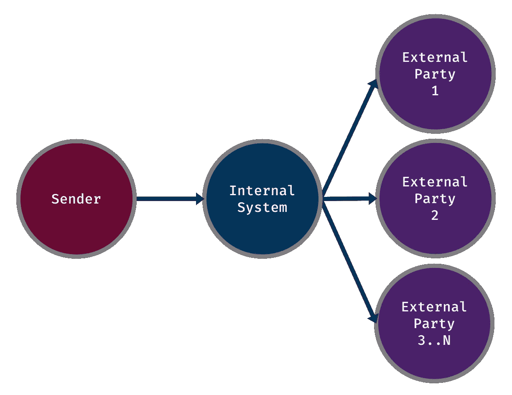
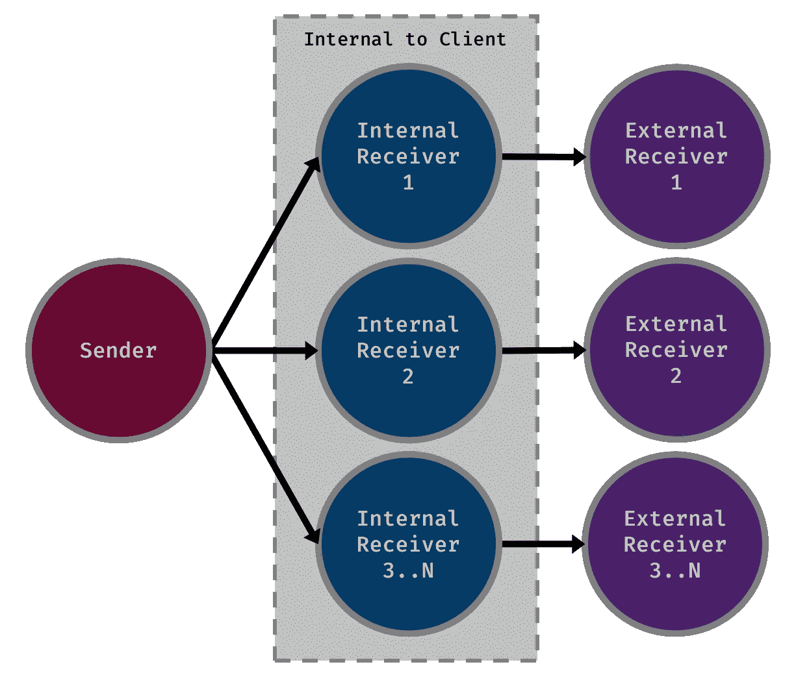

# 吞吐量——Corda 的故事

> 原文：<https://medium.com/coinmonks/throughput-a-corda-story-75e0c3d0054?source=collection_archive---------4----------------------->

[Night Sky](https://pixabay.com/en/purple-sky-dusk-shooting-star-690724/) by [Pixabay — Free photos](https://pixabay.com/en/users/Free-Photos-242387/)

我最近完成了一个项目，专注于 Corda 在特定用例中的性能。这个项目的结果使我们在一天之内通过超过 170 个节点的网络处理了 1 . 15 亿个请求。此外，Corda 每秒钟能够处理 6300 个请求，这证明网络的最高要求得到了满足。这是迄今为止部署的最大的 Corda 网络，也是迄今为止实现的最高吞吐量。证明 Corda 可以在非常苛刻的环境中交付产品。

这项研究是由埃森哲为 DTCC 进行的，它也调查了另一个 DLT 平台，数字资产。更多信息可在[新闻稿](http://www.dtcc.com/news/2018/october/16/dtcc-unveils-groundbreaking-study-on-dlt)中找到。

 [## DTCC 宣布研究结果，证明 DLT 可以支持美国股票的交易量…

### 突破性研究证明 DLT 每天可以处理超过 1 亿笔交易纽约/伦敦/香港…

www.dtcc.com](http://www.dtcc.com/news/2018/october/16/dtcc-unveils-groundbreaking-study-on-dlt) 

在这篇文章中，我将利用我在这个项目中获得的经验来描述如何从 Corda 中获得最大收益。我希望在不久的将来会有类似于我们为 DTCC 做的项目出现，我希望这里的信息将有助于为其他开发商指出正确的方向。

怎么样了？啊，它不是没有它的困难。但是，我认为我们做得很好。更准确地说，我们证明了如果网络设计合理，并且您的 CorDapps 设计良好，Corda 可以达到高吞吐量。是的，我知道我基本上是说，如果你做对了每件事，那么一切都会好的。这真的很重要。当我们在整个项目中调整我们的 CorDapps 时，我们发现了大大提高应用程序性能的方法。做出这些改变让我们离我们的目标越来越近。但是，如果我们没有以一种特殊的方式构建我们的网络，这些都无关紧要。

# 需要 Corda Enterprise 来实现最高的性能

这是将您的性能提高 10 倍或增加您的计算机拥有的内核数的最简单方法。除此之外，Corda Enterprise 允许在节点内运行的流工作器的数量从 1 个增加到多个。这会影响可以在节点内异步运行的流的数量。但是，这不会改变在每个版本上以相同速度运行的单个流的性能。实际上，如果没有进取心，你将永远无法实现极高的绩效目标。

如果您的用例不需要达到这种性能，那么开源版本将满足您的需求。例如，我们 100%需要为我们的项目使用 Enterprise，因为 DTCC 处理的请求量和它们需要被处理的速率是巨大的。另一方面，如果我们处理贷款的处理和加工。与 DTCC 的需求相比，请求流过节点的速率会显著下降。在这种情况下，使用开源就足够了。

方便的是，企业代码和开源代码是兼容的，这样你就可以轻松地进行切换。部署存在差异，在进行更改时，您极有可能需要摆弄这一侧。

企业版和开源版之间的兼容性将允许您尝试两者，从而让您能够确定哪一个最适合您的需求。这允许您开始在开源上编写应用程序，直到认为有必要切换到企业级。

# 想想你的网络

我非常非常想强调网络架构的重要性。我甚至不愿意去想，如果我们坚持原来的设计，我们会达到什么样的性能。我们实际上放弃了我们最初的设计，因为它从根本上来说是有缺陷的，会阻碍我们实现目标的任何希望。就个人而言，我认为这部分一半是关于 Corda，一半是关于设计一个好的解决方案。

## 分片以提高大规模性能

在写这篇文章的时候，Corda 还不支持负载平衡。目前，单个节点处理它所代表的身份的所有工作。这是他们充分意识到的一个领域，也是他们在不久的将来要努力的方向。如果存在这种情况，那么就有可能简单地依靠构建大量支持单个 Corda 节点的实例。这将导致更多的计算能力，从而增加吞吐量。

由于负载平衡还没有准备好，而且我们有一个单独的参与者在网络中间，是处理请求的一个巨大瓶颈，我们不得不采用不同的方法来设计整个网络。为了弥补这一点，我们必须想办法在系统中提供我们自己的水平扩展，因为必须删除位于中间的单个节点。如果不解决这些问题，我们就无法实现每秒 6300 笔交易的网络吞吐量。

我们的解决方案？碎片。我们确定了一种方法，这种方法可以将一个演员逻辑地分成许多更小的部分。每一个都彼此并行地处理请求。这需要一点额外的逻辑来将请求路由到正确的分片节点。但是，这个解决方案可能挽救了这个项目。我们从未测试过单个瓶颈节点的性能，但是，我 100%确定我们不会达到目标。

下面我附上了两张图表。一个是使用单节点设计的示例流程，另一个是分片方法。

单一节点:

Non-sharded network only has a single node in the middle

分片:

Sharded network splits the load among multiple nodes

我会让图表自己说话。由于该信息仍然是保密的，所以我不会进一步探究实现。那里应该有足够的信息来理解我们为什么和做了什么，但不是我们如何实现的。

可以想象，第二种设计将产生更高的吞吐量。随着网络中节点的增加，它还具有线性扩展的优势。

在原始设计中，少量节点的吞吐量可能是可以接受的。但是，一旦你达到更大的数字，比如 100，甚至可能小到 10，你就会注意到性能的平稳。这完全是因为整个网络依赖于单个瓶颈节点处理请求的速度。

## 通过多个公证人消除额外的瓶颈

将提高网络整体性能的另一个领域是使用多个公证人。当网络的吞吐量已经很高时，单个公证人将开始成为工作流的瓶颈。按照与上一节相同的思路。公证人可以被分割。允许每个服务器处理较少的交易量。

每次我说“多个公证人”，我只是觉得我需要澄清一下，我不是在说一个公证人集群。

我已经写了一篇文章，[用多个公证人增加网络吞吐量](https://lankydanblog.com/2018/11/18/increasing-network-throughput-with-multiple-notaries/)，涵盖了这个主题，我不会重复我自己，而是将你引向那里。

 [## 通过多个公证人增加网络吞吐量

### 你需要一个非常高吞吐量的 Corda 网络吗？网络的吞吐量达到平衡了吗？你已经挤了吗…

lankydanblog.com](https://lankydanblog.com/2018/11/18/increasing-network-throughput-with-multiple-notaries/) 

# 调整那些 Cordapps

去科达普斯。您可以做很多事情来提高性能。大部分来自于尽量少做。

*   我需要发送所有这些交易吗？
*   这个对方真的需要签这个交易吗？
*   我的事务有太多的状态吗？
*   发起方和交易方之间的流量跳跃了多少次？

这些都是对你的流量表现很重要的问题。我确信还有其他地方可以提高性能(我稍后会谈到)，但这是我现在唯一能想到的地方。不过，我相信你已经明白了。

让我们快速看一下最后一个问题。

> 发起方和交易方之间的流量跳跃了多少次？

这实际上包含了我提出的其他一些观点。总之。每次在网络上进行跳转时，流的性能都会下降。它需要从一个 Corda 节点传输到另一个节点，并且可能需要在某个时间返回。在此期间，由于网络延迟和流向磁盘的检查点过程，您正在累积性能成本。

网络延迟不言自明，无需进一步解释。另一方面，检查点需要一点充实。检查点是将流的当前执行序列化的过程，以便在失败时可以从特定点重新启动。这样做需要对整个流程堆栈进行序列化，这可能非常庞大，因此执行起来成本很高。

考虑到这些信息，确保你考虑是否你真的需要做这些跳跃。尽量把它们保持在最低限度。如果你这样做，我相信你会看到你的应用程序的性能提高。

# 多线程？这对性能有好处，对吗？

好的好的好的。虽然，我们没有测量包括多线程在内的影响，但我确信它带来了很大的改进。但是，要小心。如果你做得不对，你可能会被咬屁股。在撰写本文时，Corda 不支持流中的多线程。如果你这样做，你会得到一些奇怪的错误。也就是说，这是可能的。您可以在 Corda 服务中这样做，这个服务稍微超出了流的范围。通过将一些处理委托给服务，我们能够利用线程来启动新的流，每个流异步运行，处理相似但独立的任务。

我在之前的文章[中写了关于 Corda 服务的异步流调用](https://lankydanblog.com/2018/09/22/asynchronous-flow-invocations-with-corda-services/)的内容，这篇文章深入探讨了这个主题，并解释了为什么当你尝试这样做时可能会失败。

 [## Corda 服务的异步流调用

### 我怎样才能让我的流动更快？如果您曾经与…合作过，那么您很有可能已经考虑过这个问题

lankydanblog.com](https://lankydanblog.com/2018/09/22/asynchronous-flow-invocations-with-corda-services/) 

# 用 Corda 是什么感觉？

我发现使用 Corda 相对简单。当你试图实现更复杂的用例时，它会变得更加困难。但是，在大多数情况下，许多流可以遵循相同的简单结构。向事务添加一些状态，验证它，让所有需要的各方签名并提交事务。

随着事情变得越来越复杂，你需要记住哪一方需要做什么。比如消费现金。作为发起人，你不能把别人的现金状态放到一个交易里。您需要向他们发送一些信息，并请求他们将其添加到交易中。像这样的场景花了我一段时间去理解。随着越来越多的开发人员花时间使用 Corda，我确信这些概念会变得更容易理解。更多的例子将会被出版，如何写好流程的知识将会被分发。

此外，我袖手旁观 Corda 生产的[关键概念](https://docs.corda.net/key-concepts.html)。浏览这些和提供的文档让我对 Corda 有了更深的了解。

 [## 关键概念—R3 Corda 3.3 版文档

### 本节描述了 Corda 平台的主要概念和特性。它是为不熟悉…的读者准备的

docs.corda.net](https://docs.corda.net/key-concepts.html) 

# 走向

现在，我不代表 Corda 或 R3，但由于我们在整个项目中与他们密切合作，我可以谈谈对平台的可能改进。

*   使得部署多个 Corda 节点变得更加容易。R3 与我们合作开发了一个更容易部署节点的框架，该框架可能会被修改和推广，以适用于更广泛的受众。
*   性能。Corda 代码中有几个地方可以调整，以便获得更好的性能。
*   更好的多线程。正如我前面提到的，这可以在 Corda 服务中完成，但也有可能将其中的一部分转化为流。主要关注异步启动多个`subFlow`并等待它们完成。

# 包扎

在项目接近尾声的时候，确实非常忙碌，但是我们能够在 1 个月内实现如此大规模的性能提升实在是太疯狂了。一旦我们改进了我们的 CorDapps，以充分发挥它们的性能，我们的数字就从“meh”变成了“wow”。谢天谢地，我们正确地设计了我们的网络，使这些数字成为可能。如果网络没有按照现在的方式整合，世界上所有的调整都无法挽救它。

那么，使用 Corda 可以获得良好的吞吐量吗？是的。是的，你可以。使用 Corda Enterprise 将使更高的性能目标更容易实现，并使您能够以更少的工作量实现这一目标。但是，这并不是真正正确的心态。使用我在本文中介绍的信息，您应该对如何设计高性能 Corda 应用或网络有了更好的理解。

展望未来，Corda 的表现只会越来越好。结合如何设计您的应用程序的好主意，应该会让您的数字一飞冲天。

最后，在我结束这篇文章之前，我只想感谢 R3，尤其是 Stefano，感谢他们在这个项目中与我们密切合作。

如果你觉得这篇文章很有帮助，你可以在 Twitter 上关注我，地址是 [@LankyDanDev](http://www.twitter.com/LankyDanDev) 来了解我的新文章。

我帖子中的观点和看法是我自己的，不代表埃森哲在任何问题上的观点。

*原载于 2018 年 12 月 14 日*[*【lankydanblog.com*](https://lankydanblog.com/2018/12/14/throughput-a-corda-story/)*。*

[**Click to read today’s top story**](http://bit.ly/2G71Sp7)

> [直接在您的收件箱中获得最佳软件交易](https://coincodecap.com/?utm_source=coinmonks)

