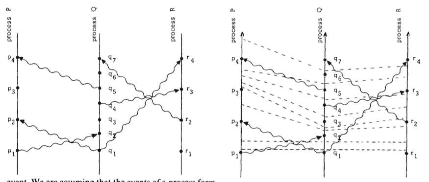

# 分布式系统中的时间、时钟和事件排序

> 原文：<https://medium.com/coinmonks/time-and-clocks-and-ordering-of-events-in-a-distributed-system-cdd3f6075e73?source=collection_archive---------0----------------------->

## 介绍

在这篇文章中，我们将讨论分布式系统中时间的概念。我们在日常生活中很大程度上依赖时间来点菜。一件事“发生在”另一件事之前，是一种由时间编码的关系，使用物理时钟作为传递时间的机制。所以事件的排序是通过现实世界中的物理时钟来完成的。在分布式系统中，需要更仔细地理解时间的概念。在不依赖可能不准确的物理时钟的情况下，核心问题变成了我们如何定义节点集合系统中事件的顺序。每个节点可以建立自己的本地事件顺序。但是如何在多个节点上建立事件的一致顺序呢？这种顺序对于解决分布式锁定这样的问题非常重要，分布式锁定是一种共享资源，一次只能由一个节点使用，只要另一个节点没有请求锁定，请求锁定资源的节点就需要被授予锁定。在这种情况下，局部顺序是不够的，需要跨多个节点建立一些全局顺序。

## 分布式系统中事件的部分排序

在分布式系统中定义事件顺序的一种方法是使用物理时钟。所以“之前发生的”事件可以用系统中的 t1 < t2\. But clocks are not accurate, can drift and are not necessarily synchronized in lock-step. So this paper takes another approach to define “happened before” relation. (The meaning of “partial order” will become clear later. )

A distributed system can be defined as a collection of processes. A process essentially consists of a queue of events(which can be anything — like an instruction, or a subprogram, or anything meaningful) and has apriori order. In this system, when processes communicate with each other, sending of a message is defined as an event. Let’s establish a more precise definition of “happens before” (⇢) in such a system.

1.  In the same process, if event a comes before event b, then a ⇢ b
2.  When process i sends some message at a to process j and process j acknowledges this message at b, then a ⇢ b
3.  Happens before is transitive. a ⇢ b and b ⇢ c, then a ⇢ c.
4.  Two events a and b are described as concurrent when a hasn’t happened before b and b hasn’t happened before a. This condition generally reflects the fact that process i may not have knowledge about all events that could have happened in process j. So we cannot establish authoritative order in the system — this also makes it clear that we have only a ***偏序*** 来描述。如果不依靠物理时间，系统中可能会有许多事件无法建立有意义的顺序。

举一些例子可能是有用的。

Partial ordering of events in the system. Vertical bars are processes. Wavy arrows are messages. A dot is an event. Time elapses bottom up.

正如你在左上图中看到的，p1 和⇢ p2 是同一个过程中的事件。由于从过程 q 向过程 p 发送消息，q1 ⇢ p2。如果我们考虑时间自下而上流逝，并且如果我们考虑物理时间，q3 似乎发生在 p3 之前。但是在这个系统中，我们将这些事件称为并发事件。两个进程都不知道这些事件—此时没有因果关系。但是我们可以说的是，q3 ⇢ p4，因为 q3⇢q5 和 q5 ⇢ p4。类似地，我们可以说 p1 ⇢ r3。现在已经看了一些例子，很明显，设想⇢ b 的另一种方式是事件 a 可以因果地影响事件 b。类似地，上面提到的 q3 和 p3 没有因果关系。

## 逻辑时钟

Lamport 的论文引入了一个新的函数，本质上是一个计数器，在每一个可以给事件分配一个数字的进程中。让我们称这个函数为 Ci(a ),作为事件 a 的进程 I 中的计数器。系统中没有物理时钟。函数 C(a)建立了不变量，即事件 a 必定发生在 b 之前，那么 C(a) < C(b)。使用此功能，可以利用以下两个条件建立系统中事件的部分排序:

C1: Ci(a) < Ci(b)如果在同一个进程 I 中 a 发生在 b 之前，这可以在给定的进程中使用一个简单的计数器来实现。

C2:当进程 I 在事件 a 发送消息，而进程 j 在事件 b 确认消息时，那么 Ci(a) < Cj(b)

这些时钟功能可以被认为是在一个进程中定期发生的滴答。在任何两个事件之间，至少需要有一个这样的分笔成交点。每个分笔成交点实际上增加了分配给前一个分笔成交点的数字。这在上图的右侧进行了说明。相似编号的刻度跨越流程边界连接。在相同的过程中，触摸或穿过分笔成交点边界以停留在下一个事件上。跨流程发送消息时，该消息需要跨越或接触一个刻度线边界，以定义“发生在之前”事件。

这可以通过以下方式实现:

IR1:这个服从 C1。这可以通过在系统中任意两个连续事件之间增加 Ci(a)来实现。

IR2:这是一个实现 C2。这可以通过将 Ci(a)作为时间戳发送给进程 j 来完成。当进程 j 在事件 b 确认收到该消息时，它需要设置 Cj(b)。Cj(b)将被设置为≥当前 Cj 且大于 Ci(a)/时间戳的值。

## 系统中事件的总排序

到目前为止，逻辑时钟系统已经建立了系统中事件的部分顺序。仍然有并发的事件，打破束缚是有用的，特别是对于引言中描述的锁定问题——有人需要获得锁。这可以通过引入任意的进程优先级来实现。如果出现平局，优先级较低的进程将获得之前发生的事件。更正式地说，一个⇥ b 的总序 a(注意新型箭头)可以定义为:

1.  Ci(a) < Cj(b).
2.  If Ci(a) = Cj(b), then use Pi < Pj.

These two conditions imply that ⇥ completes the partial relationship ⇢. If two events are partially ordered then they are totally ordered already. While partial ordering is unique in the given system of events, total ordering may not be.

## Distributed locks using total ordering

Consider the following problem which can be quite common in distributed systems. The central idea of the problem is to access a shared resource, but only one process can access it at any time. More formal conditions can be specified as:

1.  A process which has been granted a resource, must release it before any other process can acquire it.
2.  Resource access requests should obey the order in which requests are made
3.  If every process releases the resource it asked for, then eventually access is granted for that resource.

One possible solution could be to introduce a centralized scheduler. While one issue is that it is a completely centralized, another is that ordering condition 2 may not work. Consider the scenario: Process i asking for a resource to the scheduler. Then it informs process j about the request. Process j now asks for the same resource, but its message reaches the scheduler before process i’s. This means that event order was not obeyed. To address this issue, we can use total ordering based off of IR1 and IR2\. With this, every event is totally ordered in the system. As long as all the processes know about requests made by other processes, the correct ordering can be enforced. A decentralized solution can be designed such that each process keeps a queue of lock and unlock operations.

1.  Process i asking for a resource lock, uses the current timestamp and puts lock(T,Pi) in the queue. It also sends this message to all other processes.
2.  All other processes put this message in their queue and send the response back with a new timestamp Tn.
3.  To unlock a resource, process i, sends unlock(T, Pi) message to all processes and removes the lock(T, Pi) message from its own queue.
4.  Process Pj, upon getting unlock message, removes lock(T, Pi) message from its queue.
5.  Process Pi is free to use the resource i.e. gets its lock request granted when: it has the lock(T, Pi) messages in its queue with T enforcing the ***总顺序*** 使得 T 在队列中的任何其他消息之前。此外，进程 Pi 需要等待，直到它从系统中时间戳晚于 t 的所有进程接收到消息。

## 结论

在分布式系统中，时间/事件顺序的概念相当复杂。在分布式系统中，确保因果排序的逻辑时钟的想法是非常有用的，而不必依赖于物理时钟。Lamport 的逻辑时钟确保如果 a ⇢ b 那么，C(a) < C(b). It is also good to understand that if C(a) < C(b) then it doesn’t necessarily mean that a ⇢ b. If we just looked at C(j) and C(k) and C(j) happened to be less than C(k), then those could be concurrent events and processes may not have communicated with each other yet. This later property, of just looking at some timestamps and realizing the causality, is achieved by [向量时钟](https://en.wikipedia.org/wiki/Vector_clock)。

> 加入 Coinmonks [电报频道](https://t.me/coincodecap)和 [Youtube 频道](https://www.youtube.com/c/coinmonks/videos)获取每日[加密新闻](http://coincodecap.com/)

## 另外，阅读

*   [复制交易](/coinmonks/top-10-crypto-copy-trading-platforms-for-beginners-d0c37c7d698c) | [加密税务软件](/coinmonks/crypto-tax-software-ed4b4810e338)
*   [网格交易](https://coincodecap.com/grid-trading) | [加密硬件钱包](/coinmonks/the-best-cryptocurrency-hardware-wallets-of-2020-e28b1c124069)
*   [密码电报信号](/coinmonks/top-3-telegram-channels-for-crypto-traders-in-2021-8385f4411ff4) | [密码交易机器人](/coinmonks/crypto-trading-bot-c2ffce8acb2a)
*   [购买比特币印度](/coinmonks/buy-bitcoin-in-india-feb50ddfef94) | [Pionex 评论](/coinmonks/pionex-review-exchange-with-crypto-trading-bot-1e459d0191ea) | [加密交易机器人](/coinmonks/crypto-trading-bot-c2ffce8acb2a)
*   [印度的加密交易所](/coinmonks/bitcoin-exchange-in-india-7f1fe79715c9) | [比特币储蓄账户](/coinmonks/bitcoin-savings-account-e65b13f92451)
*   [Cloudbet 赌场评论](https://coincodecap.com/cloudbet-casino-review) | [点火赌场评论](https://coincodecap.com/ignition-casino-review)
*   [币安费用](/coinmonks/binance-fees-8588ec17965) | [Botcrypto 审查](/coinmonks/botcrypto-review-2021-build-your-own-trading-bot-coincodecap-6b8332d736c7) | [Hotbit 审查](/coinmonks/hotbit-review-cd5bec41dafb)
*   [MyConstant Review](https://coincodecap.com/myconstant-review) | [8 款最佳摇摆交易机器人](https://coincodecap.com/best-swing-trading-bots)
*   [最佳加密交易所](/coinmonks/crypto-exchange-dd2f9d6f3769) | [印度最佳加密交易所](/coinmonks/bitcoin-exchange-in-india-7f1fe79715c9)
*   [开发人员的最佳加密 API](/coinmonks/best-crypto-apis-for-developers-5efe3a597a9f)
*   最佳[密码借贷平台](/coinmonks/top-5-crypto-lending-platforms-in-2020-that-you-need-to-know-a1b675cec3fa)
*   杠杆代币的终极指南