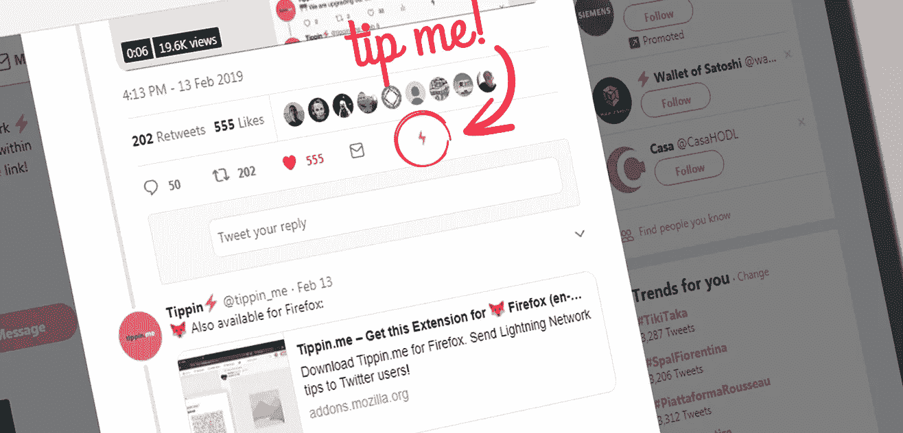

# Tippin，一个改变游戏规则的应用

> 原文：<https://medium.com/coinmonks/tippin-a-game-changer-application-7b73eb346648?source=collection_archive---------0----------------------->

## 多亏了 Tippin，你现在可以使用闪电网络向 Twitter 用户发送比特币提示了:极其简单和快速。

[**Tippin**](https://tippin.me) 是一个 [Chrome](https://chrome.google.com/webstore/detail/tippinme/knhkeligkfmclgkeedceenpopaleokfh/related) 和 [Firefox](https://t.co/03AEOVRdLH) **浏览器扩展**，通过在每条推文中添加一个 **tip** **按钮****来启用 Twitter 上的 tipping** 。所有的提示都是通过闪电网络使用**比特币**完成的:**即时交易**，甚至是几分钱的交易，费用几乎为零。

此外，这是闪电网络的第一个真正有趣的用例，这是去年实施的第二层解决方案，用于扩展比特币。

## 简单有效

不仅 Twitter 的体验完全改变了，而且它还开启了无限的未来场景:一个互联网，在这里，由于这个扩展，你可以在所有社交场合给人们小费(可以是一条推文、一篇文章、一段视频、一条评论等等)。)，从而为内容创作者创造了一种新的融资方式**而不需要一个** **中央机构**和**而不需要** **从零开始创建一个新的社交平台和经济体系**！

Tippin 是 Sergio Abril 的个人项目，仍在开发阶段，但已经可以使用了。多亏了这个扩展，用户现在可以在每条推文中看到一个新的提示按钮。

# 如何收到小费

每个想要启用接收提示的可能性的用户只需用他的 twitter 账户**登录** [**tippin.me 网络应用**](https://tippin.me) 。

一旦完成，一个通过闪电网络接收和管理比特币的**保管钱包**就会产生，人们将能够给你小费。

此外，你还可以使用 Tippin 为你生成的 **web 按钮**并将它粘贴到你的博客或网站上。这样你可以在任何地方收到小费。

> 交易新手尝试[加密交易机器人](/coinmonks/crypto-trading-bot-c2ffce8acb2a)或[复制交易](/coinmonks/top-10-crypto-copy-trading-platforms-for-beginners-d0c37c7d698c)

# 如何给小费

为了给某人小费，你需要使用闪电网络，而使用闪电网络**你需要一个闪电钱包**。我用的 [**艾克蕾尔**](https://play.google.com/store/apps/details?id=fr.acinq.eclair.wallet.mainnet2&hl=it) ，是一款非常好的开源钱包。

A demo of tiping with Eclair wallet.

一旦你下载了钱包，并存入了一些比特币(5 美元就可以了)，你就需要创建一个通道来进行闪电交易。

**用**[**tippin . me**](https://tippin.me/)打开直达通道！按下闪电符号(⚡)，然后按下“与我们创建一个频道”。扫描艾克蕾尔 app 里的二维码就搞定了:**现在你想给谁小费就给谁**。

# 绝妙的主意

而不是用自己的经济体系创造新的社交网络，token，区块链等。(例如:steemit) **你可以直接使用已经存在的社交网络**只需要安装一个简单的浏览器扩展，增加一个按钮。

## 我们只需要…一个按钮！

这个按钮为用户打开了与社交网络互动的新方式，也为内容创作者打开了新的赚钱方式，不涉及其他外部或内部服务，这些服务总是从他们的收入中获取一些利润。

一个按钮。同样的界面，同样的习惯:你让人们习惯这个东西。而 **Twitter 只是开始**。Tippin 可以很容易地集成到 Medium 或 YouTube 等平台中。

而这一切都与**比特币**有关。

> 加入 Coinmonks [电报频道](https://t.me/coincodecap)和 [Youtube 频道](https://www.youtube.com/c/coinmonks/videos)获取每日[加密新闻](http://coincodecap.com/)

## 另外，阅读

*   [复制交易](/coinmonks/top-10-crypto-copy-trading-platforms-for-beginners-d0c37c7d698c) | [加密税务软件](/coinmonks/crypto-tax-software-ed4b4810e338)
*   [网格交易](https://coincodecap.com/grid-trading) | [加密硬件钱包](/coinmonks/the-best-cryptocurrency-hardware-wallets-of-2020-e28b1c124069)
*   [密码电报信号](http://Top 4 Telegram Channels for Crypto Traders) | [密码交易机器人](/coinmonks/crypto-trading-bot-c2ffce8acb2a)
*   [最佳加密交易所](/coinmonks/crypto-exchange-dd2f9d6f3769) | [印度最佳加密交易所](/coinmonks/bitcoin-exchange-in-india-7f1fe79715c9)
*   [面向开发人员的最佳加密 API](/coinmonks/best-crypto-apis-for-developers-5efe3a597a9f)
*   最佳[密码借贷平台](/coinmonks/top-5-crypto-lending-platforms-in-2020-that-you-need-to-know-a1b675cec3fa)
*   杠杆代币的终极指南