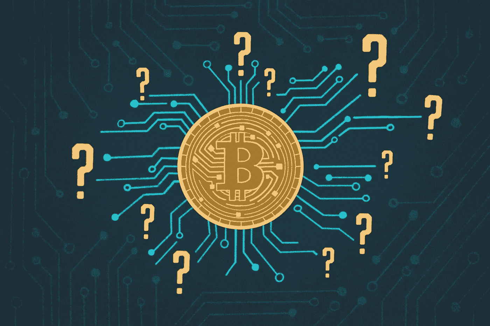

# 在进入印度密码行业之前给初学者的提示！

> 原文：<https://medium.com/coinmonks/tips-for-beginners-before-entering-crypto-industry-in-india-576e835abb4d?source=collection_archive---------3----------------------->

今年密码产业突然繁荣起来。许多新来者成为骗子的牺牲品，并以失败告终。下面是我在这个拍马屁的行业里的一个心得！

*   不管你做多少 TAs(技术分析)，如果你不能控制情绪，你只会后悔。
*   付费订阅是绝对不行的。你会在 Twitter/ YouTube 上找到很多真正乐于助人的人。研究他们的材料。
*   问疑惑，人家会帮忙的。(谨防骗子)不要陷入快速致富的骗局。
*   制定一个计划并努力实现它。不要依赖小费。
*   你不可能成为每一枚获胜硬币的一部分，所以不要绝望。
*   如果有“nk 关注者”的人告诉你买一个特定的硬币。研究硬币。寻找他们建议硬币而不是盲目购买的原因。
*   只有当它符合你的策略时，你才应该进场。当每个人的先令。(我知道这很难抗拒，但你必须有耐心。)
*   只投资那些基本面强劲的硬币，因为即使它们在崩盘中下跌 40%，它们也会强劲反弹。
*   不要指望任何人用勺子喂你。你不能把你的损失归咎于别人。这是你的钱，只有你有责任保护它。
*   退出计划看起来很简单，但老实说，这是最困难的部分。
*   即使是最好的密码交易者也不可能 100 %正确，所以不要担心你是否犯了错误或者事情没有按照你的方式发展。
*   杠杆交易风险很大，因为这个市场波动很大。如果你是这个行业的新手，尽量避开它。
*   定期价格回调是非常健康的。
*   如果你读到“这是你最后一次看到这些价格水平，现在买吧，否则会后悔的。”这只是希望而不是事实。(作为参考，只需查看任何硬币:D 的当前图表)

> 如果你是这个行业的新手，你会问这样的问题:“如何在印度购买加密货币？”、‘我如何在印度投资比特币？’等等出现在你的脑海里，我确定我的这篇帖子- [在印度买加密货币最好的平台是什么？](/@saurabh.saurabharora/what-is-the-best-platform-to-buy-cryptocurrency-in-india-391f641a852e)，将助你一臂之力！

附:这个帖子最初发布在[我的推特账户](https://twitter.com/saurabh_arora10?lang=en)上。