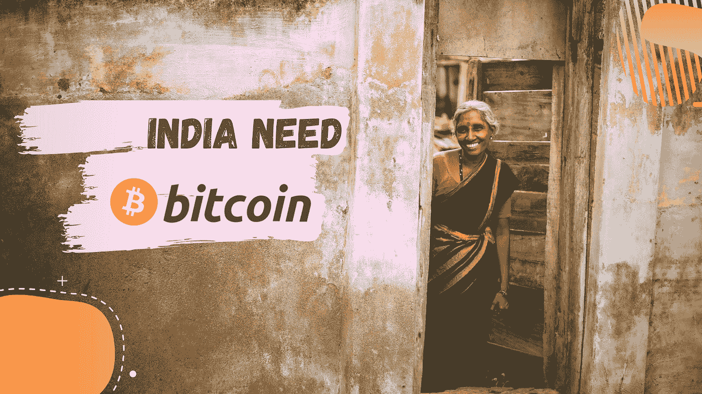

# 比特币在印度的未来

> 原文：<https://medium.com/coinmonks/title-future-of-bitcoin-in-india-e056f7a6807b?source=collection_archive---------3----------------------->

## 没有人能预测比特币在印度的未来，但在这篇文章中，我们将通过一些事实来研究比特币在印度的过去和现在，这样我们就能对比特币在印度的未来做出合理的预测，并尝试想象比特币和加密货币能给印度带来什么好处。

可能我们都知道，2009 年，[比特币](https://blog.coincodecap.com/a-candid-explanation-of-bitcoin)开始了，但比特币花了将近 4 年时间才进入印度市场，在本文中，我们将按年来体验比特币在印度的旅程，所以女士们和先生们，请系好安全带，准备乘坐过山车。

## **年份:2011–2012**

比特币大约在 2011 年和 2012 年进入印度，人们开始进行比特币交易。例如，Pritam P Hans 的一篇旧文章描述了艾哈迈达巴德 30 岁的软件开发人员 Mahin Gupta 如何与一家澳大利亚公司合作创建了一个名为 buysellbitco .的平台，该平台基于一种称为比特币的数字货币，在 2011 年至 2012 年期间，印度只有 2000 名活跃的比特币用户。

## **年份:2013 年**

那一年，许多投资者开始关注比特币，比特币钱包的下载数量在印度飙升至 35，648 个，孟买沃利地区的一家复古主题披萨店成为该国第一家接受比特币的餐厅，今年比特币引起了印度储备银行(RBI)的注意，因此 RBI 发布了一份新闻稿，警告虚拟货币用户不要使用比特币

## **年份:2014 年**

在印度央行发布新闻稿后，包括 buysellbitco.in 在内的许多印度密码交易所被迫关闭业务，但几天后，当印度央行副行长承认“监管数字货币是银行的工作”后，一家名为 Unocoin 的交易所重新运营{ [**Reference**](https://www.coindesk.com/banks-corruption-crypto-can-bitcoin-change-india) ， [**Reference-2**](https://www.paymentscardsandmobile.com/indian-bitcoin-exchange-shuts/) }，因为 Mt. Gox 在 2014 年遭到黑客攻击，一些印度知识分子猜测， 也许印度的投资者已经失去了他们的比特币，我肯定一些印度投资者因为 Mt.Gox 下跌而遭受损失，但印度人对比特币的热爱从未减少{ [**参考**](https://www.gadgetsnow.com/tech-news/indians-lose-bitcoins-worth-crores-as-mt-gox-falls/articleshow/31344038.cms) }因为在看到越来越多的印度比特币投资者后，印度储备银行行长说:“印度将在某个时候采用数字货币”{ [**参考**](https://cointelegraph.com/news/reserve-bank-governor-india-will-adopt-digital-currencies-at-some-point) }，总部位于孟买的 headrush 成为第一家接受比特币的印度冒险运动公司{

## **年份:2015 年**

直到 2015 年，lacs 增加了加密货币投资者的数量，一些新的创业公司如 Zebpay 开始提供服务，南印度银行接受了比特币等加密货币是未来的观点，2015 年发生的最好的事情是商业大亨拉坦·塔塔投资了一家数字货币创业公司凯西。

## **年份:2016 年**

2016 年是比特币在印度最幸运的一年，因为今年一些加密货币初创公司不仅获得了认可，还筹集了数百万美元的资金，例如- Unocoin 筹集了 150 万美元，Coinsecure 筹集了 120 万美元，Zebpay 筹集了 100 万美元{ **参考** - [1](https://qz.com/india/797044/unocoin-indias-newest-bitcoin-superstars-raises-1-5-million-from-investors/) ， [2](https://yourstory.com/2016/04/coinsecure-funding) ， [3](https://www.coindesk.com/indian-bitcoin-wallet-1-million-zebpay) }。

去货币化对比特币在国内的普及起到了重要作用{ [**参考**](https://www.forbes.com/sites/krnkashyap/2016/12/22/indias-demonetization-is-causing-bitcoin-to-surge-inside-the-country/#42114f227dfc) }，八家以区块链为基地的创业公司在我国起步{ [**参考**](https://analyticsindiamag.com/7-startups-india-working-blockchain-technology/) }。

## **年份:2017 年**

我们都知道今年是比特币触及 20000 美元的历史性一年，即使例如印度曾有如此多关于比特币的负面消息——财政部长说“比特币在印度不是法定货币”{ [**参考**](https://www.coindesk.com/bitcoin-not-legal-tender-in-india-finance-minister-says) }，印度所得税部门对印度的九个比特币交易所进行了突击检查，但这些负面消息并没有影响印度人对比特币的喜爱{ [**参考**](https://www.indiatoday.in/india/story/income-tax-department-conducts-raids-at-nine-bitcoin-exchanges-across-india-1106881-2017-12-14) }。

2017 年有如此多的当地企业开始接受比特币支付，例如-班加罗尔一家餐厅开始接受比特币支付{ [**参考**](https://www.thehindu.com/sci-tech/this-bengaluru-restaurant-lets-you-pay-for-your-meal-with-bitcoin/article19364478.ece) }，2017 年 12 月 9 日在一场印度婚礼上，辫子和新郎都要求他们的客人送比特币作为结婚礼物，这发生在印度中央银行第三次警告不要购买比特币之后{ [**参考**](https://www.bbc.com/news/world-asia-india-42390013) }。

## **年份:2018 年**

对于印度的比特币投资者来说，这是非常艰难的一年，因为今年 RBI 禁止了印度的每一家银行处理比特币{ [**参考**](https://www.bbc.com/news/world-asia-india-43669730) }，今年熊市打击非常严重，这影响了像 Zebpay 这样的交易所关闭他们的服务{ [**参考**](https://factordaily.com/indian-cryptocurrency-exchange-zebpay-shutsdown/) }，我们面临着印度最大的比特币盗窃案，价值 19 亿卢比的比特币从 Coinsecure 被盗。

但一些好的事件让我们继续前进，比如印度第一台加密货币 ATM 机推出{ [**参考**](https://www.thenewsminute.com/article/india-s-first-cryptocurrency-atm-launched-bengaluru-90117) }但不幸被班加罗尔警方关闭{ [**参考**](https://officechai.com/startups/unocoin-bitcoin-atm-shut-cofounder-arrested/) }，有消息称 Reliance Jio 和印度计划推出自己的加密货币{ **参考-**[**1**](https://qz.com/india/1418897/after-strangling-bitcoin-india-may-launch-its-own-cryptocurrency/)**，** [**2**](https://www.investopedia.com/news/indias-biggest-industrial-house-launch-its-own-cryptocurrency/)

## **年份:2019**

今年，印度加密货币投资者不仅仍在与熊市作斗争，还在与印度央行的银行禁令作斗争。印度仍然不清楚加密货币是合法还是非法，印度政府提出了一项加密货币法案草案，禁止在印度使用加密货币，随后印度的加密爱好者和反对者之间爆发了一场法律战争。

在这种不合适的情况下，印度政府也发布了一些严厉的法律，如对印度加密投资者处以 10 年监禁和罚款，但这对印度投资者的心态没有影响。

## **年份:2020 年**

2020 年是比特币在印度的现状，2018 年开始的加密爱好者和加热器之间的战争以加密爱好者{ [**参考**](https://techcrunch.com/2020/03/03/india-lifts-ban-on-cryptocurrency-trading/) }获胜。现在 RBI 不会阻止你与银行进行加密货币交易，我们进入了比特币价格现已超过 10000 美元的牛市。但是在印度，谣言再次开始，印度政府试图通过另一项法案来禁止印度的加密，但是据我所知，这不会影响比特币的支持者，因为自 2013 年以来，印度政府希望在印度禁止比特币，但是他们没有能够禁止比特币，我相信比特币社区每天都在变强，所以即使印度政府将禁止它，我们也会再次为取消禁令而斗争，就像我们过去两年以来一直在斗争的那样。

## **一些理论认为印度将使比特币合法化**

**理论-1:** 印度是一个民主国家，“民有、民治、民享的政府”，这意味着如果人们愿意，他们可以为实施或废除任何法律而斗争。法律在实施之前以法案的形式出现，我们可以提交反对法案的请愿书，就像我们对上次 RBI 禁令所做的那样，我们肯定会赢，因为我们已经这样做了。

**理论 2:** 美国是[世界上最有影响力的国家](https://www.usnews.com/news/best-countries/best-international-influence)，这意味着其他国家效仿美国，根据美国改变他们的法律、法规和商业策略，而印度是一个紧跟美国的国家，如果你不知道，那么让我告诉你，印度从美国宪法中借鉴了一些印度宪法的规则。现在，美国银行被允许提供加密托管服务，这对加密界来说是一件大事，印度可能会借鉴美国的经验，在印度提供加密托管服务。

## **如果比特币成为合法，印度能得到什么好处？**

当比特币合法化时，这意味着所有的加密货币都将在印度合法，这将首先对我们的金融体系产生良好影响， 例如，在印度[仍有 1 . 9 亿人没有银行账户](https://globalfindex.worldbank.org/sites/globalfindex/files/chapters/2017%20Findex%20full%20report_chapter2.pdf)，印度拥有[数量最多的不活跃银行账户](https://qz.com/india/1260139/india-has-the-highest-number-of-inactive-bank-accounts-in-the-world/)，因为当前的金融系统需要 KYC 开设账户和基于位置的服务，而这仍是数百万人无法实现的，因此他们可以参与比特币，在几分钟内从任何地点开办自己的银行，并可以受益于 [Defi](https://academy.binance.com/glossary/defi) (分散金融)， 印度以交易费/滞纳金/零余额费/各种费用的形式损失了巨额资金{ [**Reference**](https://economictimes.indiatimes.com/wealth/spend/do-you-know-the-real-cost-of-digital-transactions/articleshow/61543269.cms?from=mdr) }，这些钱可以因为比特币和密码而节省下来{ **Reference**-[1](https://www.investopedia.com/ask/answers/100314/what-are-advantages-paying-bitcoin.asp)， [2](https://www.mobisun.com/blog/10-benefits-of-paying-with-cryptocurrencies/) }，印度花费巨大的精力、费用和时间用于海外汇款和支票，这些钱可以因为比特币和密码而节省下来，印度可以更有效地打击腐败和复制行为{

## ****结论****

**如果你深入研究了这篇文章，那么有一件事你可能会意识到，从一开始政府就想在印度禁止比特币，并创造了如此多的负面情况来分离比特币爱好者和比特币，但来自印度的比特币投资者从未失去他们对比特币的热爱、希望和信心，这决定了比特币在印度的未来。我的意思是，比特币是人民的钱，印度人民非常支持它，所以谁在乎仇恨者和这些比特币爱好者将决定比特币和印度其他加密技术的未来。**

**关于作者:**

**姓名-吉坦德拉·奈克**

**电子邮件-[jitencrackit2@gmail.com](mailto:jitencrackit2@gmail.com)**

## **另外，阅读**

*   **最好的[密码交易机器人](/coinmonks/crypto-trading-bot-c2ffce8acb2a)**
*   **[密码本交易平台](/coinmonks/top-10-crypto-copy-trading-platforms-for-beginners-d0c37c7d698c)**
*   **最好的[加密税务软件](/coinmonks/best-crypto-tax-tool-for-my-money-72d4b430816b)**
*   **[最佳加密交易平台](/coinmonks/the-best-crypto-trading-platforms-in-2020-the-definitive-guide-updated-c72f8b874555)**
*   **最佳[加密借贷平台](/coinmonks/top-5-crypto-lending-platforms-in-2020-that-you-need-to-know-a1b675cec3fa)**
*   **[最佳区块链分析工具](https://bitquery.io/blog/best-blockchain-analysis-tools-and-software)**
*   **[加密套利](/coinmonks/crypto-arbitrage-guide-how-to-make-money-as-a-beginner-62bfe5c868f6)指南:新手如何赚钱**
*   **最佳[加密制图工具](/coinmonks/what-are-the-best-charting-platforms-for-cryptocurrency-trading-85aade584d80)**
*   **[莱杰 vs 特雷佐](/coinmonks/ledger-vs-trezor-best-hardware-wallet-to-secure-cryptocurrency-22c7a3fd391e)**
*   **了解比特币的[最佳书籍有哪些？](/coinmonks/what-are-the-best-books-to-learn-bitcoin-409aeb9aff4b)**
*   **[3 商业评论](/coinmonks/3commas-review-an-excellent-crypto-trading-bot-2020-1313a58bec92)**
*   **[AAX 交易所评论](/coinmonks/aax-exchange-review-2021-67c5ea09330c) |推荐代码、交易费用、利弊**
*   **[Deribit 审查](/coinmonks/deribit-review-options-fees-apis-and-testnet-2ca16c4bbdb2) |选项、费用、API 和 Testnet**
*   **[FTX 密码交易所评论](/coinmonks/ftx-crypto-exchange-review-53664ac1198f)**
*   **[n 零审核](/coinmonks/ngrave-zero-review-c465cf8307fc)**
*   **[逐位交换审查](/coinmonks/bybit-exchange-review-dbd570019b71)**
*   **[3Commas vs Cryptohopper](/coinmonks/cryptohopper-vs-3commas-vs-shrimpy-a2c16095b8fe)**
*   **最好的比特币[硬件钱包](/coinmonks/the-best-cryptocurrency-hardware-wallets-of-2020-e28b1c124069?source=friends_link&sk=324dd9ff8556ab578d71e7ad7658ad7c)**
*   **最佳 [monero 钱包](https://blog.coincodecap.com/best-monero-wallets)**
*   **[莱杰 nano s vs x](https://blog.coincodecap.com/ledger-nano-s-vs-x)**
*   **[bits gap vs 3 commas vs quad ency](https://blog.coincodecap.com/bitsgap-3commas-quadency)**
*   **[莱杰纳米 S vs 特雷佐 one vs 特雷佐 T vs 莱杰纳米 X](https://blog.coincodecap.com/ledger-nano-s-vs-trezor-one-ledger-nano-x-trezor-t)**
*   **[block fi vs Celsius](/coinmonks/blockfi-vs-celsius-vs-hodlnaut-8a1cc8c26630)vs Hodlnaut**
*   **[bits gap review](/coinmonks/bitsgap-review-a-crypto-trading-bot-that-makes-easy-money-a5d88a336df2)——一个轻松赚钱的加密交易机器人**
*   **为专业人士设计的加密交易机器人**
*   **[PrimeXBT 审查](/coinmonks/primexbt-review-88e0815be858) |杠杆交易、费用和交易**
*   **[埃利帕尔泰坦评论](/coinmonks/ellipal-titan-review-85e9071dd029)**
*   **[赛克斯石评论](https://blog.coincodecap.com/secux-stone-hardware-wallet-review)**
*   **[BlockFi 评论](/coinmonks/blockfi-review-53096053c097) |赚取高达 8.6%的加密利息**