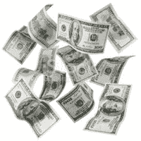

# MakerDAO 和 DAI 令牌简明指南

> 原文：<https://medium.com/coinmonks/tl-dr-guide-to-makerdao-and-dai-tokens-228a11fab6a2?source=collection_archive---------0----------------------->

这是一个快速和肮脏的介绍，有足够的诱惑/混乱的细节，它会激起你的兴趣，谷歌它进一步。请用更正/建议进行评论——但要温和:)

*免责声明:*我与该项目无关，他们喜欢哈斯克尔和可爱的 3 个字母的变量名确实让我恼火，我目前确实持有少量 MKR，我可能不知道我在说什么。

让我们向房间里的大象讲话；有许多拥有大量秘密收益的人要么想完全避免纳税，要么想尽可能长时间推迟纳税。如果他们想在不使用需要验证身份的信誉良好的交易所的情况下，在菲亚特“私下获利”,没有太多安全的选择。

系绳(USDT)是一个可行的解决方案，截至本文撰写之时，已发行了 1，219，734，258 美元，人们似乎对该代币很感兴趣。然而，即使你可以忽略围绕流动性和治理的 FUD 问题，如果出现监管打击，系绳(持有储备资金的公司)似乎可能面临重大风险。

DAI 令牌于 12 月 18 日生效，提供了另一种选择。像 USDT 一样，它跟踪美元，但在区块链的以太网上使用智能合同。使用他们提供的仪表板，任何人都可以通过创建抵押债务头寸(CDP)来创建新的 DAI，用户可以将他们的 ETH(ETH)作为抵押品进行锁定。所有者然后可以从 CDP 中提取小于或等于抵押比率的 DAI 令牌金额。

目前只有一种 CDP 类型，当前的治理规则将其配置为要求至少 166%的抵押比率，这意味着如果您锁定了价值 166 美元的 ETH，您最多可以提取 100 个 DAI(价值 100 美元)。这并不是说你必须总是在极限下操作你的 CDP——事实上，截至本文写作之时，大多数目前开放的 CDP 杠杆比率都更保守——尽管这可能会随着羊群的涌入而改变。

此时您应如何处理 DAI 取决于您自己。如果您想推测 ethereum 正在上涨，您可以用该 DAI 再购买 100 美元的 ETH，本质上是投资于保证金，将最初的 166 美元投资转化为 266 美元的 ETH。

如果 ETH 的价值翻了一番，您的 CDP 的抵押比率将升至 332%，这意味着您实际上可以提取额外的 100 DAI，这将再次将比率降至最低 166%。另一个选择是，从购买剩余的 ETH 中获得收益，以较低的价格回购 100 DAI，并将其用于完成 CDP 并释放您最初的 ETH 投资。

如果以太坊的价值下跌，那么你的 CDP 将面临自动清算的风险，管理该系统的智能合约将代表你关闭 CDP，并返还你的原始 ETH 抵押品减去获得关闭它所需的 100 DAI 所需的 ETH 金额(价格远高于你出售它的价格，从而导致你的净损失)。在清算事件发生之前，您可以选择通过返还一些 DAI 来降低抵押比率。

交易的另一方是戴的买家。希望锁定他们在动荡的代币市场中获得的利润的投资者，希望晚上睡觉的投机者，或者只是需要一种稳定的加密货币的普通用户，这种货币今天的价值相当于昨天的交易价值。

最后，这个谜题还有最后一个重要部分。除了戴这个系统还有第二个令牌。这些令牌负责对治理问题进行投票，其中包括可用的 CDP 类型及其配置。MKR 所有者获得了对所有公开 CDP 收取的 1%治理费(该费用实际上是因减少 MKR 供应而烧掉的)。如果 CDP 进入“水下”, MKR 所有者会受到稀释威胁的激励，设定明智的系统限制。如果 CDP 清算被触发，并且没有足够的抵押品来支付关闭 CDP 所需的 DAI 成本(即，CDP 中锁定的 ETH 的价值下降如此之快，以至于比从合同中提取的 DAI 还要少)，就会发生这种情况。为了弥补差额，新的 MKR 在公开市场上发行和出售，以筹集必要的 ETH。

除了 USDT，我所知道的唯一一种“正在崛起的”稳定硬币是基础硬币，它似乎仍处于早期阶段，缺乏实质内容。鉴于 MakerDao 已经开发了几年，并且已经有了一个前体测试市场并运行了几个月(？)在真正的 ETH 岌岌可危的情况下，我不禁认为他们将拥有强大的先发优势。如果他们能够对自己的平台建立信心，那么他们窃取健康的市场份额似乎是不可避免的，甚至可能引发挤兑——那不是很有趣吗！

链接:

*   工程地点:[https://makerdao.com/](https://makerdao.com/)
*   在 oasisdex 交易所可以买到戴、:【https://oasisdex.com】
*   戴资源管理器仪表板，您可以在其中创建/浏览 CDP 和 mint 戴:【https://dai.makerdao.com】
*   subreddit 上贴着解释如何开始使用 Maker 的帖子:[https://www.reddit.com/r/MakerDAO/](https://www.reddit.com/r/MakerDAO/)

***编辑:最低抵押率为 150%非 166%，MKR 治理费目前为 0.5%(2018 年 1 月)***

> [在您的收件箱中直接获得最佳软件交易](https://coincodecap.com/?utm_source=coinmonks)

